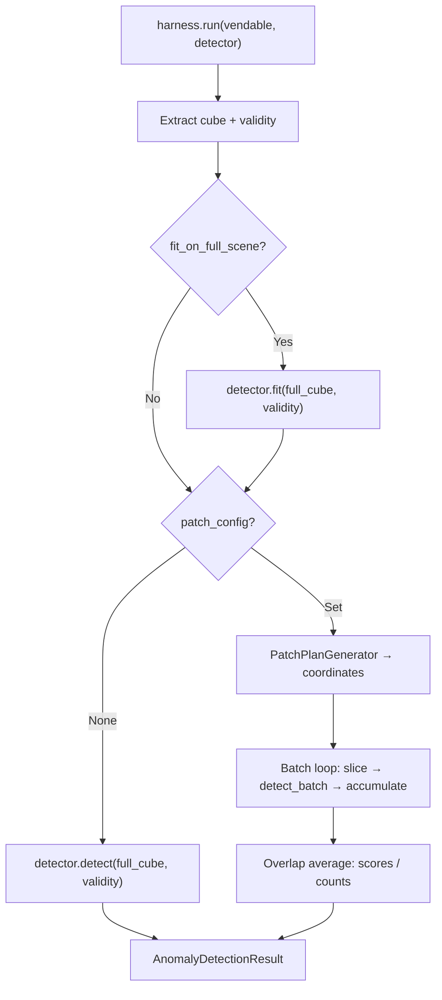

# Anomaly Detection System

This document describes the anomaly detection inference layer — the set of abstractions that sit between the data pipeline (vendable datasets) and the actual detection algorithms.

## Components at a Glance

| Component | Location | Role |
|---|---|---|
| `AnomalyDetector` | `app/abstract_classes/anomaly_detector.py` | ABC that every detector must implement |
| `InferenceHarness` | `app/utils/anomaly_detection/inference_harness.py` | Orchestrates inference on a vendable dataset |
| `InferenceHarnessConfig` | `app/models/anomaly_detection/harness_config.py` | Controls patching, batching, and fit behaviour |
| `PatchConfig` | `app/models/anomaly_detection/harness_config.py` | Patch dimensions and stride |
| `AnomalyDetectionResult` | `app/models/anomaly_detection/detection_result.py` | Output: score map + metadata |
| `ADModel` | `app/models/ad_models/ad_model.py` | Enum of all anomaly detection model identifiers |
| `detector_factory` | `app/utils/anomaly_detection/detector_factory.py` | Maps `ADModel` → `AnomalyDetector` class |

## Where This Fits in the Pipeline

```
Raw Files → FileHelper → DatasetBuilder → VendableDataset
                                              │
                                              ▼
                                      ┌───────────────┐
                                      │   THIS LAYER  │
                                      └───────────────┘
                                              │
                                              ▼
                                    AnomalyDetectionResult
                                       (H, W) score map
```

The data pipeline produces a `VendableDataset` — a fully normalised cube with validity masks. This layer takes that vendable and produces a per-pixel anomaly score map.

---

## AnomalyDetector (ABC)

Every anomaly detection algorithm must subclass `AnomalyDetector` and implement a single method:

```python
class AnomalyDetector(ABC):
    @abstractmethod
    def detect(self, cube, validity_mask=None) -> np.ndarray:
        """(C, H, W) → (H, W) anomaly scores."""
        ...
```

There are two optional methods a detector may override:

- **`fit(cube, validity_mask)`** — Learn background statistics from the full scene before detection. Default is a no-op. Override this for detectors that compute global statistics, such as the background mean and inverse covariance in RX.

- **`detect_batch(cubes, validity_masks)`** — Score a batch of cubes `(B, C, H, W) → (B, H, W)`. The default implementation loops over the batch dimension and calls `detect` per element. Override this for detectors that benefit from vectorised or GPU-batched computation.

### Interface Boundary

The ABC uses `np.ndarray` and `np.ma.MaskedArray` — **not** `torch.Tensor`. This keeps the interface consistent with the vendable dataset layer and avoids coupling the detection contract to any specific ML framework. Detectors that use torch, sklearn, or anything else handle their own conversion internally.

### Implementing a New Detector

```python
from app.abstract_classes.anomaly_detector import AnomalyDetector

class RXDetector(AnomalyDetector):
    def __init__(self):
        self._mu = None
        self._cov_inv = None

    def fit(self, cube, validity_mask=None):
        # Reshape (C, H, W) → (N, C) and compute background stats
        C, H, W = cube.shape
        pixels = cube.reshape(C, -1).T  # (N, C)
        self._mu = pixels.mean(axis=0)
        cov = np.cov(pixels, rowvar=False)
        self._cov_inv = np.linalg.inv(cov)

    def detect(self, cube, validity_mask=None):
        C, H, W = cube.shape
        pixels = cube.reshape(C, -1).T  # (N, C)
        diff = pixels - self._mu
        scores = np.sum(diff @ self._cov_inv * diff, axis=1)
        return scores.reshape(H, W)
```

---

## InferenceHarness

The harness is the bridge between a vendable dataset and an `AnomalyDetector`. It handles:

1. **Cube extraction** — Pulls the data cube and validity mask from any vendable type (`VendableHyperspectralDataset` or `VendableThermalDataset`).
2. **Fit delegation** — Optionally calls `detector.fit()` on the full scene before detection.
3. **Full-scene or patched inference** — Either passes the entire cube to the detector, or tiles it into patches and reassembles the results.

### Full-Scene Mode

When `patch_config` is `None`, the harness passes the entire cube to `detector.detect()` and wraps the result.

```python
config = InferenceHarnessConfig()  # defaults: no patching, fit enabled
harness = InferenceHarness(config)
result = harness.run(vendable, detector)
# result.score_map → (H, W) np.ndarray
```

### Patched Mode

When `patch_config` is set, the harness:

1. Generates patch coordinates using the existing `PatchPlanGenerator` (reused from the data pipeline).
2. Slices the cube and validity mask into `(B, C, pH, pW)` batches.
3. Calls `detector.detect_batch()` on each batch.
4. Accumulates patch scores into a full-scene `(H, W)` buffer.
5. Averages overlapping regions by dividing the accumulated scores by a per-pixel count.

```python
config = InferenceHarnessConfig(
    patch_config=PatchConfig(patch_height=64, patch_width=64, stride=32),
    batch_size=8,
)
harness = InferenceHarness(config)
result = harness.run(vendable, detector)
```

With `stride < patch_size`, patches overlap. The overlap regions are handled by averaging — each pixel's final score is the mean of all patch scores that covered it.

### Harness Flow



---

## InferenceHarnessConfig

| Field | Type | Default | Description |
|---|---|---|---|
| `patch_config` | `PatchConfig \| None` | `None` | `None` = full-scene. Set to enable patching. |
| `batch_size` | `int` | `1` | Patches per `detect_batch` call. Only valid when patching. |
| `fit_on_full_scene` | `bool` | `True` | Whether to call `detector.fit()` on the full scene first. |

**Validation:** `batch_size > 1` requires `patch_config` to be set — otherwise pydantic raises a `ValidationError`.

### PatchConfig

| Field | Type | Description |
|---|---|---|
| `patch_height` | `int > 0` | Patch height in pixels |
| `patch_width` | `int > 0` | Patch width in pixels |
| `stride` | `int > 0` | Step between patch origins. `stride < patch_size` → overlap. |

---

## ADModel Enum and Detector Factory

`ADModel` is a string enum that enumerates every anomaly detection algorithm in the system. Each entry has a stable string value used for logging, serialisation, and result provenance.

```python
class ADModel(str, Enum):
    RX = "rx"
    LRX = "lrx"
    CRD = "crd"
```

The **detector factory** (`detector_factory.py`) maps `ADModel` values to their concrete `AnomalyDetector` classes:

```python
from app.utils.anomaly_detection.detector_factory import get_detector, register_detector
from app.models.ad_models.ad_model import ADModel

# Look up the class
DetectorClass = get_detector(ADModel.RX)

# Instantiate and use
detector = DetectorClass()
```

`get_detector` returns the **class**, not an instance. The caller controls instantiation and any constructor arguments.

### Registering a New Detector

When you implement a new detector, register it with the factory:

```python
from app.utils.anomaly_detection.detector_factory import register_detector
from app.models.ad_models.ad_model import ADModel

class CRDDetector(AnomalyDetector):
    ...

register_detector(ADModel.CRD, CRDDetector)
```

Or add it directly to the `_REGISTRY` dict in `detector_factory.py`.

---

## End-to-End Example

```python
from app.models.ad_models.ad_model import ADModel
from app.utils.anomaly_detection.detector_factory import get_detector
from app.utils.anomaly_detection.inference_harness import InferenceHarness
from app.models.anomaly_detection.harness_config import (
    InferenceHarnessConfig,
    PatchConfig,
)

# 1. Get the detector class from the factory
DetectorClass = get_detector(ADModel.RX)
detector = DetectorClass()

# 2. Configure the harness
config = InferenceHarnessConfig(
    patch_config=PatchConfig(patch_height=64, patch_width=64, stride=32),
    batch_size=16,
    fit_on_full_scene=True,
)
harness = InferenceHarness(config)

# 3. Run inference on a vendable dataset
result = harness.run(vendable, detector)

# 4. Use the result
print(result.score_map.shape)       # (H, W)
print(result.patches_processed)     # number of patches scored
print(result.source_cube_shape)     # original (C, H, W)
```

---

## Diagrams

Draw.io diagrams are available in this folder:

- `inference_harness_flow.drawio` — Flowchart of the harness execution path
- `anomaly_detection_uml.drawio` — UML class diagram of all components
