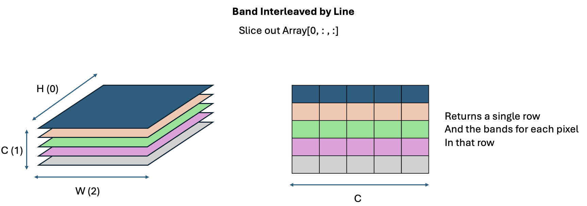
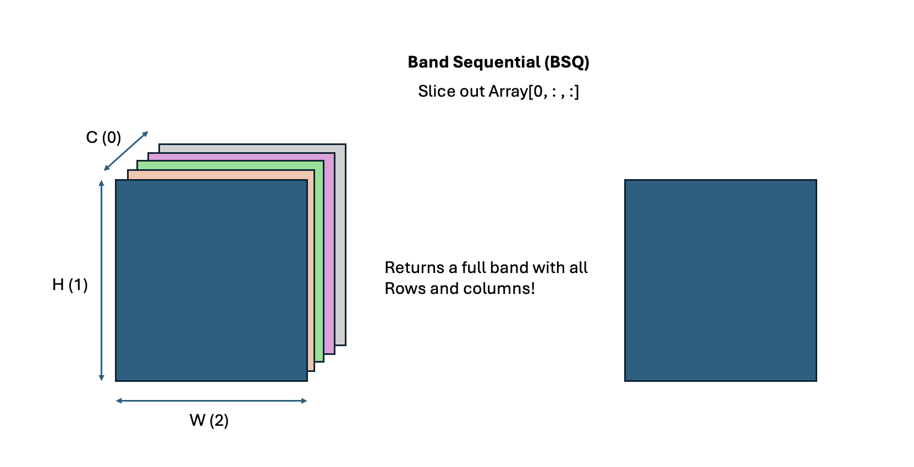
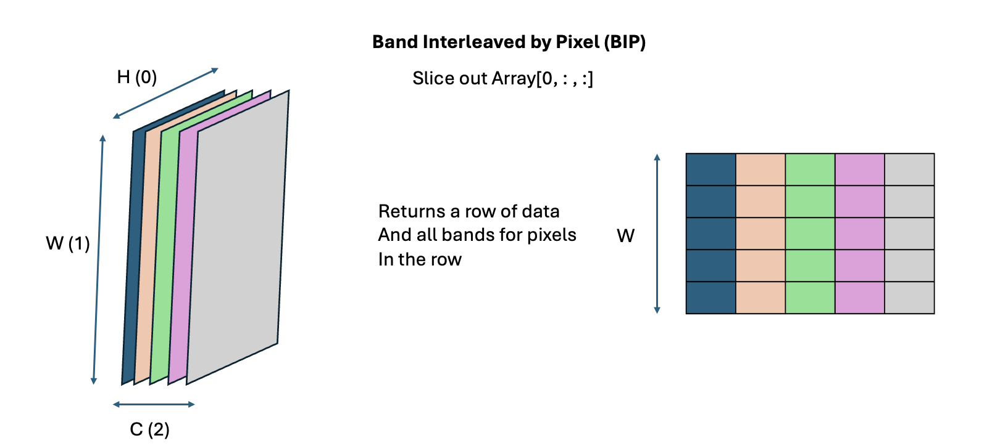

### Band Structure

This document summarizes learnings about band structure and nuances. Hyper spectral datasets are presented as a collection of bands. In essence, if we consider a single location or point as pixel, then each such pixel or location has information on the reflectance of multiple wavelengths.

But to truly become comfortable in manupulatng these data cubes it is important to visualize them correctly, because different applications (and frameworks) prefer to work with image cubes represented differently. There are three ways in image cubes can be represented. By cube we mean that each pixel is not represented by a single number but by an array of numbers one for each band / wavelength. This effectively means that we are dealing in Voxels - a volumetric pixel as the most granular unit.

The first method of representation is the Band Interleaved Line (BIL) format. (This is how PRISMA stores hyperspectral data)


<p align="center">
  
</p>

Here, each band is represented by  slice of different color. Dimensions are represented as follows:
1. The first dimension (0) is depth inwards.
2. The second dimension (1) is top-down along the length of the page.
3. The third dimension (2) is sideways.


In the case of BIL, if the image is stored as ```Array``` which is a numpy array then slicing out the array as ```Array[0,:,:]``` Will give is the first slice of the cube which is a 2-d array where each row is a different band and each column represents a width elelemnt. So, it gives us effectively the first row (along H) and all the bands of the width elements in the first row.

----

In the case of BSQ (Band Sequential), the arrangement is slightly different. 
```Array[0,:,:]``` will give us the entire image (all height and width pixels) but for only one band. This is the general form in which PyTorch expects image data.
<p align="center">
  
</p>

----

In case of the BIP (Band Interleaved by Pixel) format, it is simply the BIL format with dimensions 1 and 2 swapped. This means, if we take slice then we will get all the width elements of the first row but instead of getting a $C \times W$ tensor, we will instead get a $ W \times C $ tensor (which is a transpose of what we get in the case of BIL)

<p align="center">
  
  ----
  
</p>
