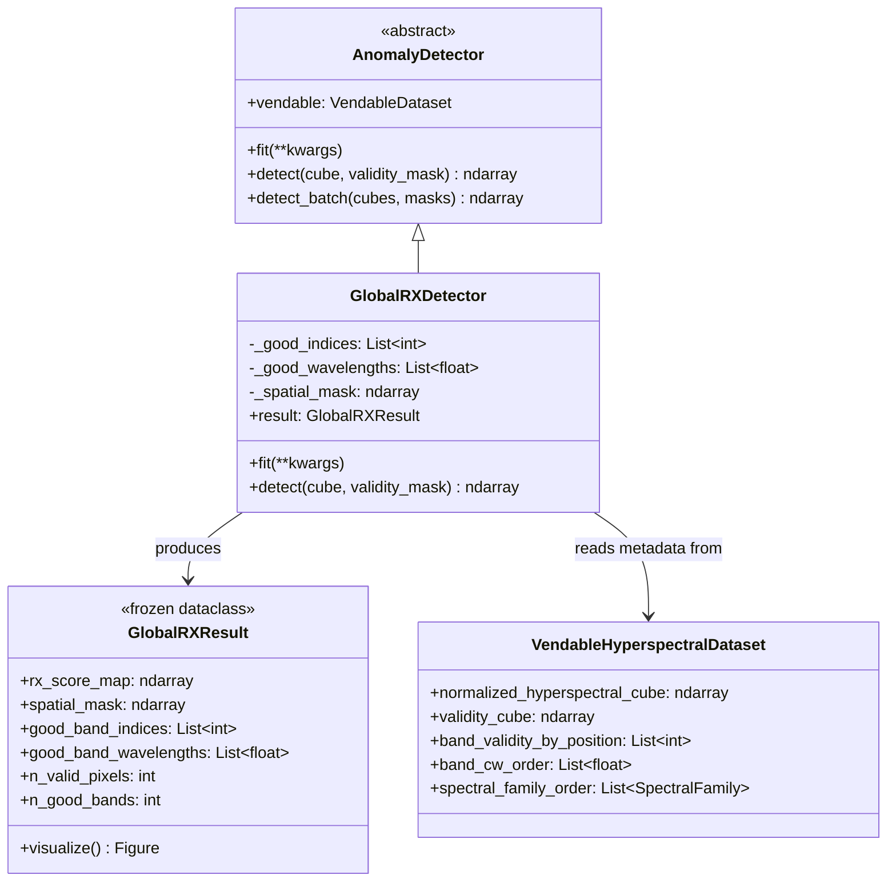
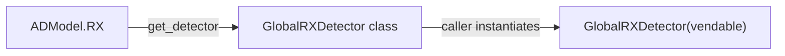
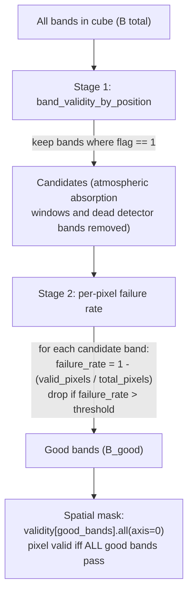
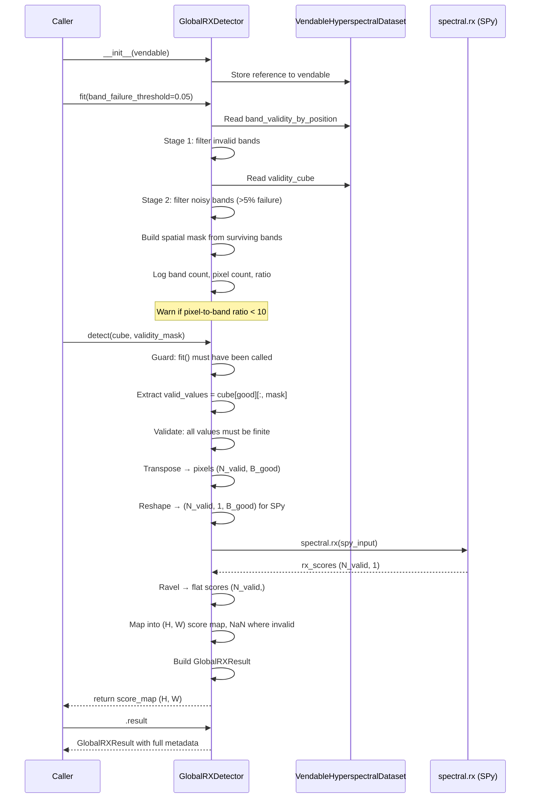

# Global RX Anomaly Detector (rx-had-v1)

## What is RX?

The Reed-Xiaoli (RX) detector is the standard benchmark for hyperspectral anomaly detection. It computes the Mahalanobis distance of each pixel's spectral vector from the scene's background distribution:

$$RX(x) = (x - \mu)^T \Sigma^{-1} (x - \mu)$$

Where $\mu$ is the background mean spectrum and $\Sigma$ is the background covariance matrix. Pixels that are spectrally unusual relative to the background receive high scores.

"Global" means $\mu$ and $\Sigma$ are computed from the entire scene (as opposed to Local RX which uses a sliding window).

## Architecture



## Factory Wiring

`GlobalRXDetector` is registered under `ADModel.RX` in the detector factory.



```python
from app.utils.anomaly_detection.detector_factory import get_detector
from app.models.ad_models.ad_model import ADModel

DetectorClass = get_detector(ADModel.RX)
detector = DetectorClass(vendable)
```

## Two-Stage Band Filtering

Band filtering happens in `fit()`. The goal is to remove unreliable spectral bands before RX computes its covariance matrix — noisy bands poison the covariance estimate.



### Stage 1 — Band Validity Flags

The vendable's `band_validity_by_position` is a per-band flag (`1` = valid, `0` = invalid). This drops bands in known atmospheric absorption windows and dead detector elements. These flags come from the PRISMA L2D metadata.

### Stage 2 — Per-Pixel Failure Rate

Among the Stage 1 survivors, some bands may have scattered pixel-level failures (cosmic ray hits, saturation events). Even where these bands "pass" the validity cube, the surviving pixels tend to carry elevated noise.

For each candidate band:
- Compute `failure_rate = 1 - (validity_cube[band].sum() / total_spatial_pixels)`
- If `failure_rate > threshold` (default 5%), drop the band

The threshold is configurable via `fit(band_failure_threshold=0.10)`.

### Spatial Mask

After both stages, the spatial mask is:

```python
spatial_mask = validity_cube[good_band_indices].all(axis=0)  # (H, W) boolean
```

A pixel is valid only if **every** surviving band is valid at that location. This is required because RX needs complete spectral vectors — you cannot have a missing band for some pixels but not others when computing a single covariance matrix.

For PRISMA data, the main source of spatial invalidity is the parallelogram-shaped valid region from the pushbroom sensor geometry. The wedge-shaped no-data regions at the edges are already encoded in the validity cube.

## Detection Flow



## Data Shapes Through the Pipeline

| Step | Variable | Shape | Description |
|---|---|---|---|
| Input | `cube` | `(C, H, W)` | Full BSQ hyperspectral cube |
| Input | `validity_cube` | `(C, H, W)` | Per-pixel, per-band validity (float 1.0/0.0) |
| After fit | `good_indices` | `(B_good,)` | Indices of surviving bands |
| After fit | `spatial_mask` | `(H, W)` | Boolean, True = valid pixel |
| detect | `valid_values` | `(B_good, N_valid)` | Good bands × valid pixels |
| detect | `pixels` | `(N_valid, B_good)` | Transposed — rows are pixel spectra |
| detect | `spy_input` | `(N_valid, 1, B_good)` | Reshaped for SPy's 3D requirement |
| detect | `rx_scores_flat` | `(N_valid,)` | One score per valid pixel |
| Output | `score_map` | `(H, W)` | Scores mapped back, NaN where invalid |

## End-to-End Example

```python
from app.utils.anomaly_detection.detector_factory import get_detector
from app.models.ad_models.ad_model import ADModel

# Assume vendable is a VendableHyperspectralDataset from PrismaDatasetBuilder
DetectorClass = get_detector(ADModel.RX)
detector = DetectorClass(vendable)

# Configure and run
detector.fit(band_failure_threshold=0.05)
score_map = detector.detect(
    vendable.normalized_hyperspectral_cube,
    vendable.validity_cube,
)

# Access rich result
result = detector.result
print(f"Bands used: {result.n_good_bands}")
print(f"Valid pixels: {result.n_valid_pixels}")

# Visualize
fig = result.visualize()
fig.savefig("rx_output.png")
```

## File Locations

| Component | Path |
|---|---|
| Detector | `app/detectors/global_rx_detector.py` |
| Result dataclass | `app/models/anomaly_detection/rx_result.py` |
| ABC | `app/abstract_classes/anomaly_detector.py` |
| ADModel enum | `app/models/ad_models/ad_model.py` |
| Factory | `app/utils/anomaly_detection/detector_factory.py` |
| Tests | `tests/test_utils/test_anomaly_detection/test_global_rx_detector.py` |
