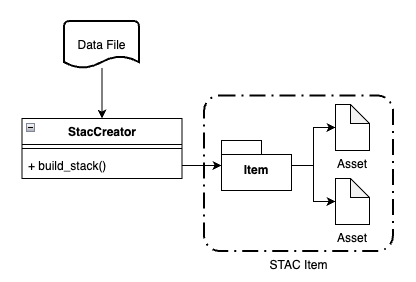
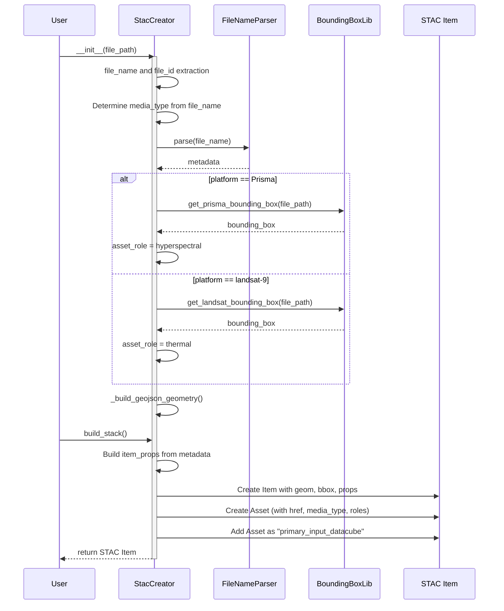

## Separating responsibilities in File Handling

In this applicaiton, a conscious decision has been made to seperate lowl level operations that involve direct interaction with the files from actually understanding what the file represents and structuring that information. The files that we deal with come from specific satellites (platforms) and are packaged as products that are processed in a specific manner. It is not necessary to create seperate classes and data structures to understand these files. STAC is a rather convenient framework and all the nuances of parsing file names and understanding what the file represents. So, effectively we will use custom classes and methods to deal with the nuances of extracting data from the files, but will use the STAC framework to represent the dataset with some structure.

  

## The STAC creation process

To create a stac item we need to be able to extract specific properties from the file. Most of these properties are available from the name of the file itself, some things such as the bounding box and geometry are extractable from a thin reading of the file itself. The process is shown below

This diagram shows how the `StacCreator` class takes a `file_path`, processes the file to extract metadata and geometry, and produces a STAC Item and associated Asset using helper functions, neatly capturing the steps from construction to item creation.

