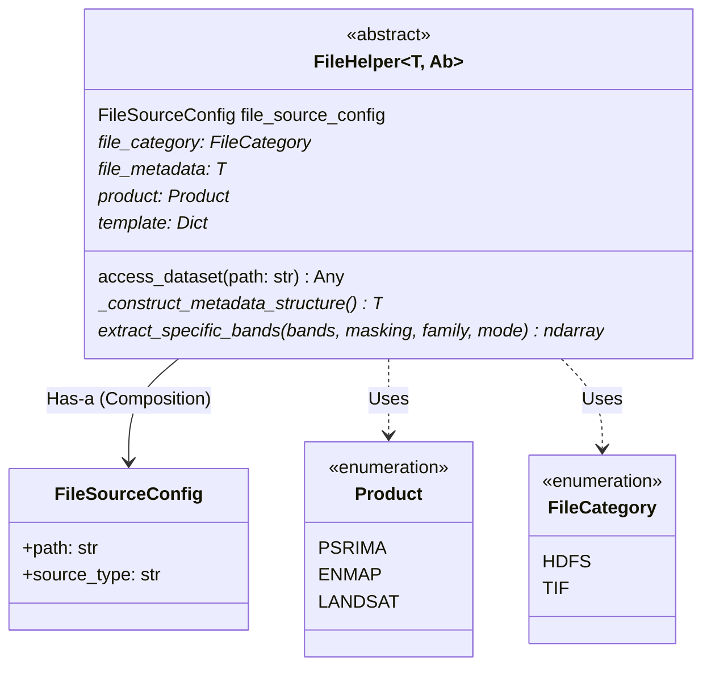
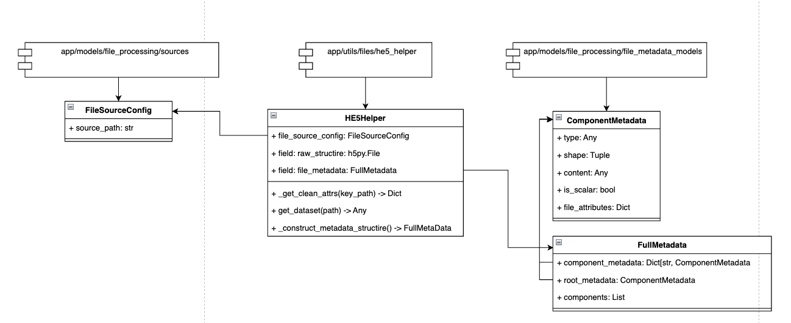
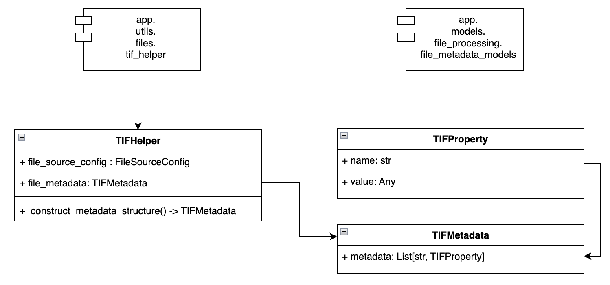
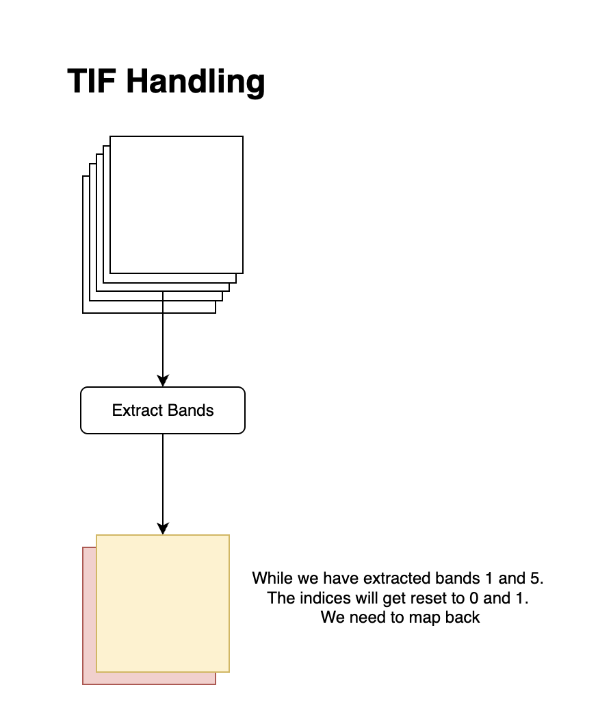

### File helper abstraction

We use the `file_helper` abstract class to create a model for all file handling operations.

In this specific case the `extract_specific_bands` method goes into the dataset and pulls out bands by their specific index.

### File Handling Design

This project will involve a lot of he5 file handling and it is important to have a consistent system of managing these files.
What we are dealing with is a specific flavor of the hierarchical data format 5 file - HDF-EOS5. This is a standard format used in satellite data. The file is self describing and usually contains metadata tags.

Think of the 'file' as a tree structure. The root node is the file itself. The leaves are the datasets. The branches are the groups. We need a simple interface to help access the data in the file.

In this discussion we will seperate **downloading** the file from *processing* it. This implies that for file processing to take place the file object is already downloaded and available in a local path.

The local path is stored in the `FileSourceConfig` model where the `source_path` field is a string.

The `he5_helper` class is used to help process the file. It is initialized with a `FileSourceConfig` object and provides a simple interface to help access the data in the file.

The general flow of the file handling is as follows:

  

We pass a path of the he5 file to the he5 helper class. This class will then pull out the metadata at the file and group level and contain methods to access the data at the dataset level.

The `TIFHelper` class is also defined similarly as follows:

  

### A note on band extraction from files.

There is a subtle but important difference in the way bands are extracted from HE5 and TIF files. In the case of HE5, we pull the entire data cube from the file and then downstream processes can extract whatever band they want. In the case of TIF files, we pull out specific bands directly. Pulling in bands directly will mean a few things. The output of a band extraction is a 3d numpy array. However, since we pull bands out directly in the case of TIF files, the band indexes will get reset and we will have to map them back. This is why we use a band_mapping dictionary in the `BasicBandLevelVisualizationTIF` class. Similar corrections will have to be made whereever TIF files are handled. This is ugly, but necessary till a more comprehensive refactoring is done.

Also note that BIL is the default in the case of HE5 files. However, in the case of TIF files, BSQ is the default. This is why we will have to convert the cube to BIP format for visualization in the `BasicBandLevelVisualizationTIF` class.

*Also note that in the case of TIF files, the bands are indexed starting from 1. This means there is no band 0*

  

