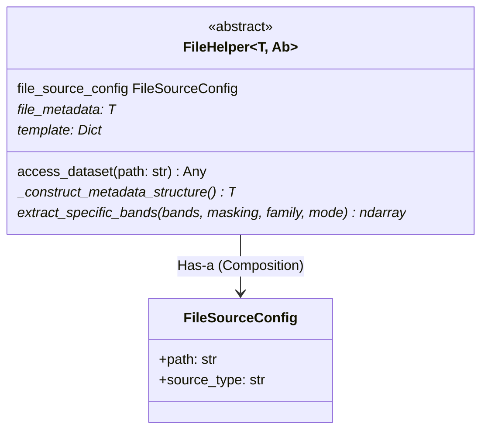
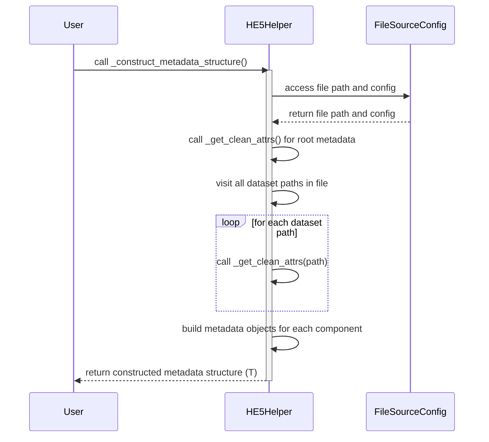
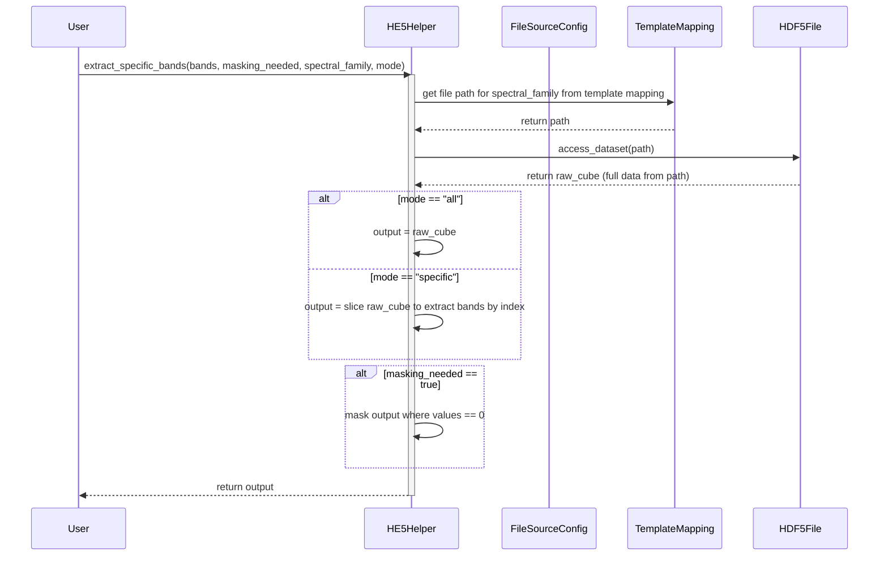
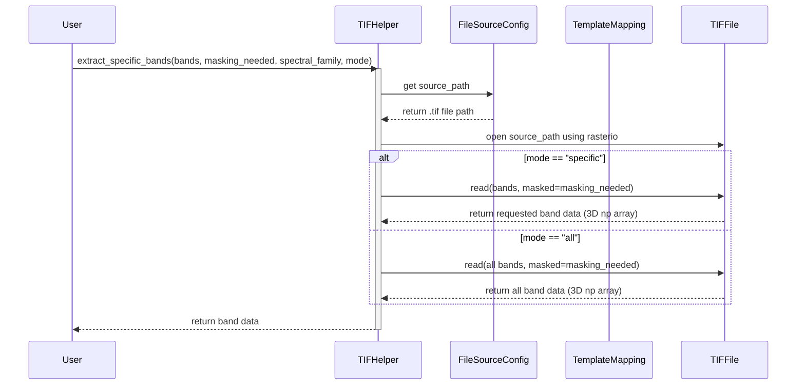

### File helper abstraction

We use the `file_helper` abstract class to create a model for all file handling operations.

In this specific case the `extract_specific_bands` method goes into the dataset and pulls out bands by their specific index.

### File Handling Design

The `HE5Helper` class implements the file_helper abstraction and is used to handle large HE5 files. Sequence diagrams of individual methods are shown below

Extraction of specific bands from the lazily loaded dataset proceeds as follows, not that there is a slight inefficiency that needs correction here. Instead of pulling out specific bands directly, we are forced to pull the entire cube first and then slice out the required bands.

### A note on band extraction from files.

There is a subtle but important difference in the way bands are extracted from HE5 and TIF files. In the case of HE5, we pull the entire data cube from the file and then downstream processes can extract whatever band they want. In the case of TIF files, we pull out specific bands directly. Pulling in bands directly will mean a few things. The output of a band extraction is a 3d numpy array. However, since we pull bands out directly in the case of TIF files, the band indexes will get reset and we will have to map them back. This is why we use a band_mapping dictionary in the `BasicBandLevelVisualizationTIF` class. Similar corrections will have to be made whereever TIF files are handled. This is ugly, but necessary till a more comprehensive refactoring is done.

Also note that BIL is the default in the case of HE5 files. However, in the case of TIF files, BSQ is the default. This is why we will have to convert the cube to BIP format for visualization in the `BasicBandLevelVisualizationTIF` class.

*Also note that in the case of TIF files, the bands are indexed starting from 1. This means there is no band 0*

### TIF Helper sequence diagram

This sequence diagram illustrates the workflow for band extraction using the `TIFHelper` class. Unlike HE5 files, TIF files allow for direct access to specific bands, resulting in more efficient extraction and memory usage. The user calls `extract_specific_bands`, which retrieves the file path, opens the TIF file via rasterio, and reads either specific bands or all bands depending on the mode. The output is returned as a 3D numpy array suitable for downstream processing or visualization.

