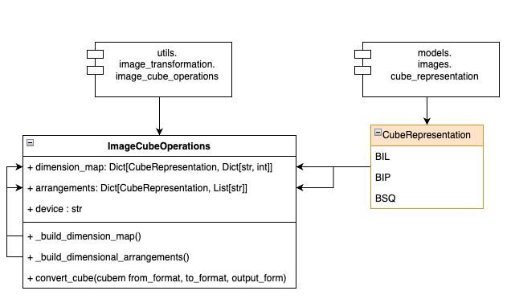

### Image Transformations

The general idea is to have a set of transformations that can be applied to an image in a specific dimensional arrangement to any other dimensional arrangement. A specific utility class `ImageCubeOperations` is provided to handle this.

The class structure and relationships are as follows:

<p align="center">
  
</p>

The class can take in *both numpy arrays and tensors* and will return *both numpy arrays and tensors*. Internally it will use the `torch` library to perform the transformations.

Sample usage:
```python
image_cube_operations = ImageCubeOperations()
cube = np.random.rand(30, 2000, 1000)
print(cube.shape)
transformed = image_cube_operations.convert_cube(
    cube, CubeRepresentation.BSQ, CubeRepresentation.BIL
)
print(transformed.shape)
```
