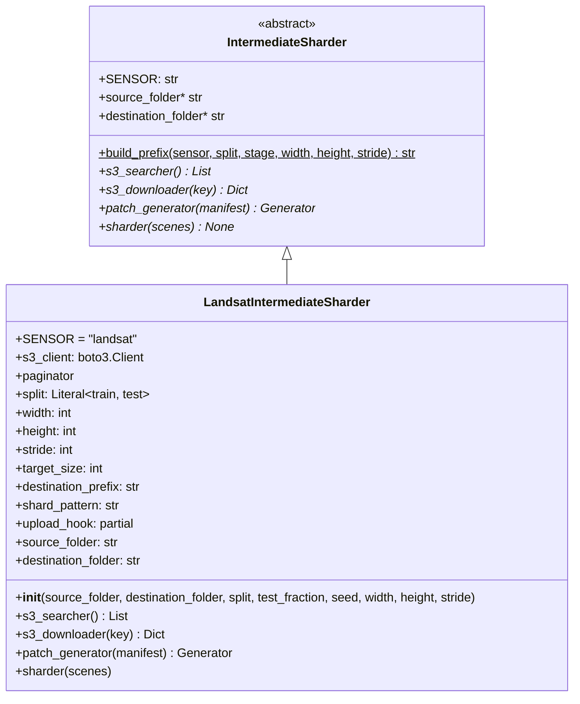
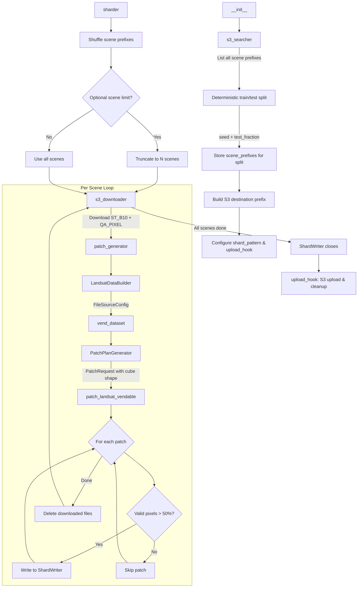
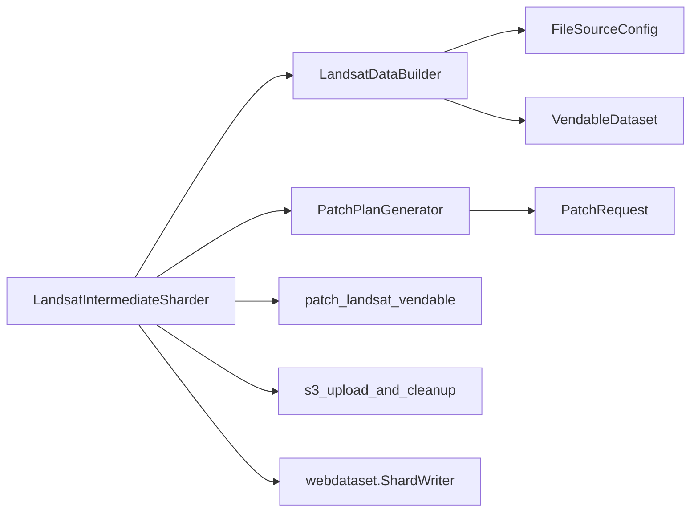

# LandsatIntermediateSharder

## Class Diagram

```mermaid
classDiagram
    class IntermediateSharder {
        <<abstract>>
        +SENSOR: str
        +build_prefix(sensor, split, stage, width, height, stride) str$
        +source_folder* str
        +destination_folder* str
        +s3_searcher()* List
        +s3_downloader(key)* Dict
        +patch_generator(manifest)* Generator
        +sharder(scenes)* None
    }

    class LandsatIntermediateSharder {
        +SENSOR = "landsat"
        +s3_client: boto3.Client
        +paginator
        +split: Literal~train, test~
        +width: int
        +height: int
        +stride: int
        +target_size: int
        +destination_prefix: str
        +shard_pattern: str
        +upload_hook: partial
        +source_folder: str
        +destination_folder: str
        +__init__(source_folder, destination_folder, split, test_fraction, seed, width, height, stride)
        +s3_searcher() List
        +s3_downloader(key) Dict
        +patch_generator(manifest) Generator
        +sharder(scenes)
    }

    IntermediateSharder <|-- LandsatIntermediateSharder
```

## Pipeline Flow

```mermaid
flowchart TD
    A[__init__] --> B[s3_searcher]
    B -->|List all scene prefixes| C[Deterministic train/test split]
    C -->|seed + test_fraction| D[Store scene_prefixes for split]
    D --> E[Build S3 destination prefix]
    E --> F[Configure shard_pattern & upload_hook]

    G[sharder] --> H[Shuffle scene prefixes]
    H --> I{Optional scene limit?}
    I -->|Yes| J[Truncate to N scenes]
    I -->|No| K[Use all scenes]
    J --> L
    K --> L

    subgraph Per Scene Loop
        L[s3_downloader] -->|Download ST_B10 + QA_PIXEL| M[patch_generator]
        M --> N[LandsatDataBuilder]
        N -->|FileSourceConfig| O[vend_dataset]
        O --> P[PatchPlanGenerator]
        P -->|PatchRequest with cube shape| Q[patch_landsat_vendable]
        Q --> R{For each patch}
        R --> S{Valid pixels > 50%?}
        S -->|Yes| T[Write to ShardWriter]
        S -->|No| U[Skip patch]
        T --> R
        U --> R
        R -->|Done| V[Delete downloaded files]
    end

    V --> L
    L -->|All scenes done| W[ShardWriter closes]
    W --> X[upload_hook: S3 upload & cleanup]
```

## Key Dependencies

```mermaid
flowchart LR
    LSI[LandsatIntermediateSharder]

    LSI --> LDB[LandsatDataBuilder]
    LSI --> PPG[PatchPlanGenerator]
    LSI --> PLV[patch_landsat_vendable]
    LSI --> S3U[s3_upload_and_cleanup]
    LSI --> WDS[webdataset.ShardWriter]

    LDB --> FSC[FileSourceConfig]
    LDB --> VDS[VendableDataset]
    PPG --> PR[PatchRequest]
```
