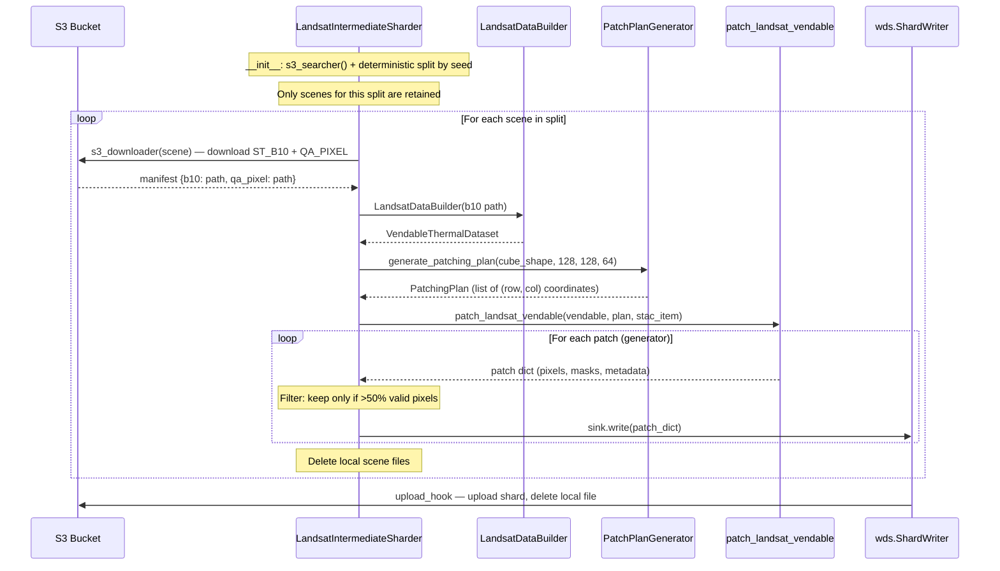
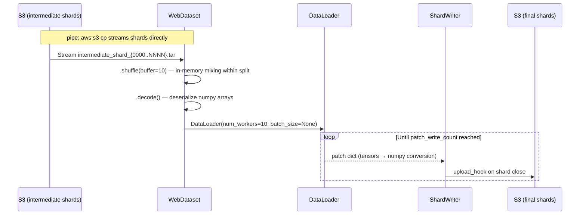

# Landsat Patch Generation Pipeline

The Landsat patch generation pipeline converts full Landsat 9 thermal scenes into shuffled, ML-ready webdataset shards stored on S3. The process is split into two stages: **intermediate sharding** (per-scene patching with validity filtering) and **final sharding** (cross-scene shuffling).

Scenes are split deterministically into **train/test** at init time so that no scene leaks across splits.

---

## S3 Storage Structure

All shard paths are computed automatically from `(sensor, split, stage, width, height, stride)`:

```
s3://allotrope-raw-data-india/
└── patches/
    └── {sensor}/
        └── {split}/
            ├── intermediate/
            │   └── w{W}_h{H}_s{S}/
            │       ├── intermediate_shard_0000.tar
            │       └── ...
            └── final/
                └── w{W}_h{H}_s{S}/
                    ├── final_shard_00000.tar
                    └── ...
```

Concrete example for Landsat 128x128 patches with stride 64:

```
patches/
└── landsat/
    ├── train/
    │   ├── intermediate/
    │   │   └── w128_h128_s64/
    │   │       └── intermediate_shard_XXXX.tar
    │   └── final/
    │       └── w128_h128_s64/
    │           └── final_shard_XXXXX.tar
    └── test/
        ├── intermediate/
        │   └── w128_h128_s64/
        └── final/
            └── w128_h128_s64/
```

The prefix is built by `IntermediateSharder.build_prefix()`:
```python
IntermediateSharder.build_prefix(
    sensor="landsat", split="train", stage="intermediate",
    width=128, height=128, stride=64
)
# → "patches/landsat/train/intermediate/w128_h128_s64/"
```

---

## Train/Test Scene Splitting

Splitting happens at init time inside `LandsatIntermediateSharder`:

1. `s3_searcher()` discovers all scene prefixes from S3
2. A seeded RNG shuffles the full list deterministically
3. The list is split by `test_fraction` (default 0.2)
4. The instance keeps only its split's scenes

```python
# Both use the same seed → same split
train_sharder = LandsatIntermediateSharder(
    source_folder="/home/ubuntu/", destination_folder="/home/ubuntu/",
    split="train", seed=42,
)
test_sharder = LandsatIntermediateSharder(
    source_folder="/home/ubuntu/", destination_folder="/home/ubuntu/",
    split="test", seed=42,
)
```

**Same seed = same split.** As long as the scene list on S3 hasn't changed between the two calls, the train and test sets are guaranteed disjoint.

---

## Architecture Overview

```
S3 (raw scenes)
    │
    ▼
┌──────────────────────────────────────┐
│  LandsatIntermediateSharder          │  Stage 1
│  ├─ s3_searcher() + split by seed   │
│  ├─ s3_downloader()                  │
│  ├─ patch_generator()                │
│  │   ├─ LandsatDataBuilder           │
│  │   ├─ PatchPlanGenerator           │
│  │   └─ patch_landsat_vendable       │
│  └─ sharder()  ──► ShardWriter       │
└──────────────┬───────────────────────┘
               │  → patches/{sensor}/{split}/intermediate/w{W}_h{H}_s{S}/
               ▼
┌──────────────────────────────────────┐
│  FinalPatchShuffler                  │  Stage 2
│  ├─ WebDataset (pipe: s3 cp)         │
│  ├─ .shuffle(buffer)                 │
│  └─ ShardWriter ──► S3               │
└──────────────────────────────────────┘
               │
               ▼
         → patches/{sensor}/{split}/final/w{W}_h{H}_s{S}/
           (ML-ready, cross-scene shuffled within split)
```

---

## Stage 1: Intermediate Sharding

### Class: `LandsatIntermediateSharder`

**Location:** `app/utils/patch_generation/intermediate/landsat_intermediate_patcher.py`

Extends the abstract `IntermediateSharder` and orchestrates the full per-scene patching pipeline.

#### Constructor

```python
LandsatIntermediateSharder(
    source_folder="/home/ubuntu/",        # local temp dir for downloads
    destination_folder="/home/ubuntu/",    # local temp dir for shard files
    split="train",                         # "train" or "test"
    test_fraction=0.2,                     # fraction of scenes for test
    seed=42,                               # deterministic split seed
    width=128,                             # patch width in pixels
    height=128,                            # patch height in pixels
    stride=64,                             # sliding window stride
)
```

Key defaults:
- **Shard size:** 1 GB per `.tar` file
- **Shard naming:** `intermediate_shard_%04d.tar`
- **Upload hook:** each shard is uploaded to S3 and deleted locally the moment it reaches `maxsize`
- **S3 prefix:** auto-computed as `patches/landsat/{split}/intermediate/w{W}_h{H}_s{S}/`

#### Pipeline Steps (inside `sharder()`)



#### 1. `s3_searcher()` — Discover Scenes

Lists all top-level prefixes under `s3://allotrope-raw-data-india/landsat/`. Each prefix represents one Landsat scene. Called once at init to build the full scene list before splitting.

#### 2. `s3_downloader(scene_prefix)` — Download Scene Files

Downloads two files per scene to the local `source_folder`:
- **`ST_B10`** — Surface temperature band (thermal)
- **`QA_PIXEL`** — Quality assessment pixel mask

Returns a manifest dict:
```python
{"b10": "/home/ubuntu/LC09_..._ST_B10.TIF", "qa_pixel": "/home/ubuntu/LC09_..._QA_PIXEL.TIF"}
```

#### 3. `patch_generator(manifest)` — Build Patches

This method chains three components together:

**a) `LandsatDataBuilder`** builds a `VendableThermalDataset` from the raw files:

```python
builder = LandsatDataBuilder(
    file_source_configuration=FileSourceConfig(source_path=manifest["b10"])
)
vendable = builder.vend_dataset(provider_qa_pixel_source=manifest["qa_pixel"])
```

The vendable contains:
| Field | Description |
|---|---|
| `normalized_thermal_cube` | Surface temp in Celsius, BSQ `(C, H, W)` |
| `validity_cube` | Cloud-based validity mask |
| `cloud_mask` | Binary cloud mask (0=cloud, 1=clear) |
| `pure_validity_mask` | Combined validity |
| `provider_cloud_presence` | Provider cloud flag (optional) |
| `provider_water_presence` | Provider water flag (optional) |
| `provider_snow_presence` | Provider snow flag (optional) |

**b) `PatchPlanGenerator`** computes a sliding-window grid of `(row, col)` coordinates:

```python
generator = PatchPlanGenerator()
plan = generator.generate_patching_plan(
    request=PatchRequest(
        input_cube=vendable.normalized_thermal_cube.shape,  # (C, H, W)
        height=128, width=128, stride=64
    )
)
# plan.patch_coordinates → [(0,0), (0,64), (0,128), ..., (row_n, col_n)]
```

The algorithm walks rows and columns with the given stride. When a patch would overshoot the edge, it snaps back so the last patch fits exactly at the boundary (may overlap with the previous patch).

**c) `patch_landsat_vendable()`** is a generator function that yields one patch dict per coordinate:

**Location:** `app/utils/patch_generation/landsat_patcher.py`

```python
for patch_coords in patching_plan.patch_coordinates:
    row, col = patch_coords
    yield {
        "__key__":                     "scene_id#row_coord:(r,r+h)#col_coord:(c,c+w)",
        "meta.json":                   {scene_id, row_coords, col_coords, h, w, stride, bands},
        "pixels.npy":                  vendable.normalized_thermal_cube[:, r:r+h, c:c+w],
        "validity_cube.npy":           vendable.validity_cube[:, r:r+h, c:c+w],
        "predicted_cloud_mask.npy":    vendable.cloud_mask[:, r:r+h, c:c+w],
        "pure_validity_mask.npy":      vendable.pure_validity_mask[:, r:r+h, c:c+w],
        # Optional (if present on vendable):
        "provider_cloud_presence.npy": ...,
        "provider_water_presence.npy": ...,
        "provider_snow_presence.npy":  ...,
    }
```

> **Note:** `landsat_patcher.py` is not a standalone script — it is the core patching function imported by `LandsatIntermediateSharder`. It is also used in tests and notebooks.

#### 4. Validity Filtering & Writing

Each patch is checked before writing to the shard:

```python
valid_pixels = patch["pure_validity_mask.npy"].sum()
b, h, w = patch["pure_validity_mask.npy"].shape
if valid_pixels / (b * h * w) > 0.5:   # >50% valid
    sink.write(patch)
```

Patches with too many invalid/cloudy pixels are discarded. After all patches for a scene are processed, the downloaded scene files are deleted locally.

When a shard file reaches 1 GB, `ShardWriter` triggers the `upload_hook` which uploads it to S3 and deletes the local copy.

---

## Stage 2: Final Sharding (Cross-Scene Shuffle)

### Class: `FinalPatchShuffler`

**Location:** `app/utils/patch_generation/final/final_patcher.py`

Reads intermediate shards from S3 for a specific sensor/split, shuffles patches across scenes within that split, and writes final ML-ready shards. Prefixes are computed automatically from the same parameters.

#### Constructor

```python
FinalPatchShuffler(
    sensor="landsat",
    split="train",                         # reads from train intermediates only
    width=128,
    height=128,
    stride=64,
    shard_temp_location="/tmp/",
    worker_count=10,                       # DataLoader workers
    shuffle_size=10,                       # shuffle buffer size
    patch_write_count=10_000,              # total patches to write
)
# Source: patches/landsat/train/intermediate/w128_h128_s64/
# Dest:   patches/landsat/train/final/w128_h128_s64/
```

#### Pipeline Steps



#### Key Details

1. **Streaming from S3:** Uses `pipe: aws s3 cp` to stream intermediate `.tar` shards directly — no full download needed.

2. **Shard range computation:** `_compute_shard_ranges()` lists all intermediate shard keys on S3 and builds a brace-expansion pattern like `intermediate_shard_{0000..0047}.tar`.

3. **Shuffle buffer:** `wds.WebDataset(..., resampled=True).shuffle(10)` provides cross-scene mixing. The `resampled=True` flag means the dataset loops infinitely, so `patch_write_count` controls when to stop.

4. **Tensor → NumPy conversion:** The `DataLoader` auto-converts numpy arrays to tensors. Before writing back to webdataset, all tensors are converted back:
   ```python
   for key, value in patch_dict.items():
       if isinstance(value, torch.Tensor):
           patch_dict[key] = value.cpu().numpy()
   ```

5. **Output:** Final shards are written as `final_shard_%05d.tar` (1 GB each), uploaded to S3 via the same `s3_upload_and_cleanup` hook.

---

## Running the Script

**Location:** `scripts/generate_landsat_patches.py`

A single script that runs both stages for all patch sizes (64, 128, 256, 512) across train/test splits.

### Patch Write Counts

Final patch counts are scaled proportionally — ~6.5M for the smallest patches, reducing by `(size/64)^2` for larger ones since fewer patches are produced per scene:

| Size | Stride | Final Patch Count |
|---|---|---|
| 64x64 | 32 | 6,500,000 |
| 128x128 | 64 | 1,625,000 |
| 256x256 | 128 | 406,250 |
| 512x512 | 256 | 101,562 |

### Basic Usage

```bash
# Full run — all 4 sizes, train + test, both stages
python -m scripts.generate_landsat_patches

# Only specific sizes
python -m scripts.generate_landsat_patches --sizes 64 128

# Custom split parameters
python -m scripts.generate_landsat_patches --seed 99 --test-fraction 0.15

# Dry run — limit to 2 scenes per split for testing
python -m scripts.generate_landsat_patches --max-scenes 2
```

### Resuming / Running Stages Independently

```bash
# Run only intermediate sharding (Stage 1)
python -m scripts.generate_landsat_patches --skip-final

# Run only final sharding (Stage 2) — assumes intermediates already exist on S3
python -m scripts.generate_landsat_patches --skip-intermediate
```

### Tuning for Your Machine

```bash
# On a 48-core instance — increase DataLoader workers for more S3 stream parallelism
python -m scripts.generate_landsat_patches --final-workers 20

# Increase shuffle buffer for better cross-scene mixing (uses more RAM)
python -m scripts.generate_landsat_patches --final-shuffle 50

# Custom temp directories (must have enough disk for 1 GB shard buffers)
python -m scripts.generate_landsat_patches \
    --source-folder /mnt/nvme/ \
    --destination-folder /mnt/nvme/ \
    --shard-temp-location /mnt/nvme/
```

### All CLI Flags

| Flag | Default | Description |
|---|---|---|
| `--sizes` | `64 128 256 512` | Patch sizes to generate |
| `--seed` | `42` | Deterministic scene split seed |
| `--test-fraction` | `0.2` | Fraction of scenes for test |
| `--source-folder` | `/home/ubuntu/` | Temp dir for scene downloads |
| `--destination-folder` | `/home/ubuntu/` | Temp dir for intermediate shards |
| `--shard-temp-location` | `/home/ubuntu/` | Temp dir for final shards |
| `--max-scenes` | all | Limit scenes per split (for testing) |
| `--final-workers` | `10` | DataLoader worker processes |
| `--final-shuffle` | `10` | Shuffle buffer size |
| `--skip-intermediate` | — | Skip Stage 1 |
| `--skip-final` | — | Skip Stage 2 |

### Threading / Process Usage

| Stage | Processes | Notes |
|---|---|---|
| Intermediate | **1** (single-threaded) | Sequential: download → patch → write. Bottleneck is S3 I/O. |
| Final | **1 main + N workers** | `N` = `--final-workers` (default 10). Workers are `multiprocessing` processes spawned by PyTorch DataLoader, each streaming from S3 via `aws s3 cp` pipes. |

On a 48-core machine with `--final-workers 10`, peak usage is **11 processes** during final sharding. You can safely increase to 20-24 workers since the workers are mostly I/O-bound (waiting on S3 pipes).

### Python API Usage

You can also call the classes directly:

```python
# Stage 1: Intermediate sharding
train_sharder = LandsatIntermediateSharder(
    source_folder="/home/ubuntu/", destination_folder="/home/ubuntu/",
    split="train", seed=42,
)
train_sharder.sharder()

test_sharder = LandsatIntermediateSharder(
    source_folder="/home/ubuntu/", destination_folder="/home/ubuntu/",
    split="test", seed=42,
)
test_sharder.sharder()

# Stage 2: Final sharding (shuffle within each split)
train_final = FinalPatchShuffler(sensor="landsat", split="train")
train_final.write_shards()

test_final = FinalPatchShuffler(sensor="landsat", split="test")
test_final.write_shards()
```

---

## Supporting Components

### `PatchPlanGenerator`

**Location:** `app/utils/patch_generation/generate_patch_plan.py`

Computes a deterministic grid of patch coordinates using a sliding window approach.

**Input:** `PatchRequest(input_cube=(C, H, W), height=128, width=128, stride=64)`

**Output:** `PatchingPlan(patch_coordinates=[(0,0), (0,64), ...], originating_request=...)`

**Algorithm:**
1. Walk rows from 0 with `stride` increments
2. If `row + patch_height > cube_height`, snap to `cube_height - patch_height` (last patch) and stop
3. Same logic for columns
4. Return the Cartesian product of row and column coordinates

### `IntermediateSharder` (Abstract Base Class)

**Location:** `app/abstract_classes/intermediate_sharder.py`

Defines the contract that all sensor-specific intermediate sharders must implement:

| Method | Purpose |
|---|---|
| `SENSOR` (class var) | Sensor name (e.g. `"landsat"`, `"enmap"`) |
| `build_prefix()` (static) | Build structured S3 prefix from params |
| `source_folder` (property) | Local folder for downloaded files |
| `destination_folder` (property) | Local folder for shard output |
| `s3_searcher()` | List scene prefixes on S3 |
| `s3_downloader(key)` | Download scene files locally |
| `patch_generator(manifest)` | Yield patch dicts from a scene |
| `sharder(scenes)` | Orchestrate the full pipeline |

### `s3_upload_and_cleanup`

**Location:** `app/utils/general_utils/s3_upload_and_delete.py`

Post-hook for `ShardWriter` — uploads the completed shard to S3 (with progress bar), then deletes the local file to free disk space. If upload fails, the local file is preserved.

---

## File Map

```
app/utils/patch_generation/
├── generate_patch_plan.py              # PatchPlanGenerator — sliding window grid
├── landsat_patcher.py                  # patch_landsat_vendable() — core patch yielder
├── intermediate/
│   └── landsat_intermediate_patcher.py # LandsatIntermediateSharder — Stage 1
└── final/
    └── final_patcher.py                # FinalPatchShuffler — Stage 2

app/models/patches/
├── patching_request.py                 # PatchRequest (Pydantic)
└── patching_response.py                # PatchingPlan (Pydantic)

app/abstract_classes/
└── intermediate_sharder.py             # IntermediateSharder ABC

app/utils/general_utils/
└── s3_upload_and_delete.py             # S3 upload hook

scripts/
└── generate_landsat_patches.py         # CLI script — all sizes, both stages
```
