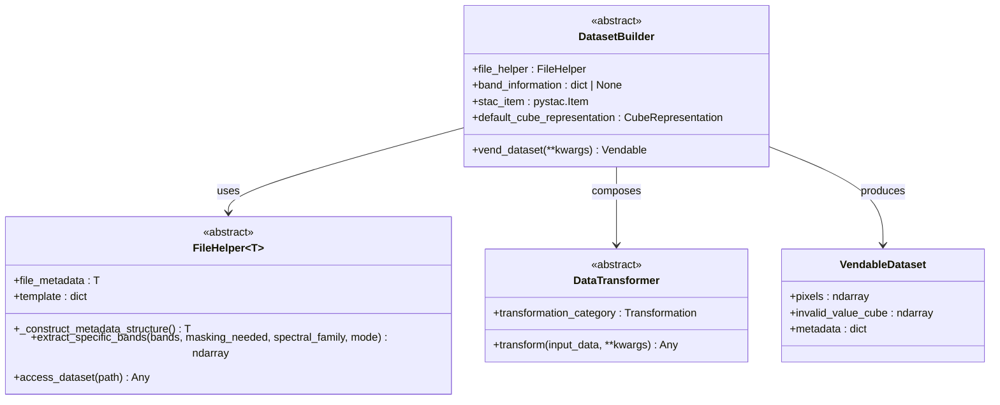
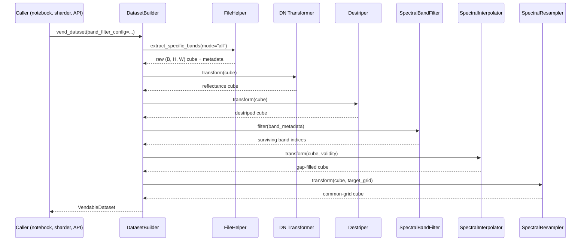
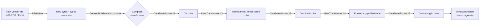

# 1. Abstract Contracts

This section explains the three small abstract base classes that the entire data pipeline rests on. Every concrete sensor (PRISMA, EnMAP, Landsat 9, AVIRIS-NG, HotSat) implements these contracts in its own way, and every downstream consumer (patch generator, foundation model inferencer, classical detector, API spectrum endpoint) talks to the result without knowing which sensor produced it.

If you only remember one thing from this section: the three contracts together let us write one foundation-model trainer and one anomaly detector that work across sensors with wildly different file formats. The price of that uniformity is that adding a new sensor means implementing three small classes; the reward is that nothing else in the codebase has to change.

The files live in [`app/abstract_classes/`](../../app/abstract_classes/).

---

## 1.1 The big picture



A `DatasetBuilder` owns one `FileHelper` and composes one or more `DataTransformer` instances. It produces a `VendableDataset` — the sensor-agnostic object every downstream component consumes.

---

## 1.2 `FileHelper` — lazy access to vendor containers

### What the code does

[`file_helper.py`](../../app/abstract_classes/file_helper.py) defines

```python
class FileHelper(ABC, Generic[T]):
    ...
```

The generic parameter `T` is a sensor-specific Pydantic metadata model. PRISMA uses `He5Metadata`, EnMAP uses `EnmapMetadata`, HotSat uses `HotSatMetadata`, and so on. Tying `T` to the subclass means a static type checker (and your IDE) knows the exact metadata fields available at every call site, while the orchestration code stays polymorphic.

A subclass must implement four members:

1. **`_construct_metadata_structure() -> T`** ([file_helper.py:52](../../app/abstract_classes/file_helper.py))
   Parse the container header into a typed metadata object. This is called once during construction and the result is cached.

2. **`file_metadata` property** ([file_helper.py:60](../../app/abstract_classes/file_helper.py))
   Return the cached metadata. Always returns the same object, never re-parses the file.

3. **`extract_specific_bands(bands, masking_needed, spectral_family, mode) -> ndarray | MaskedArray`** ([file_helper.py:67](../../app/abstract_classes/file_helper.py))
   The workhorse. It returns a `(C, H, W)` (or BIL `(H, C, W)`) ndarray, optionally as a `MaskedArray` if `masking_needed=True`. The `mode` parameter selects between `"specific"` (caller supplies indices), `"family"` (caller supplies SWIR or VNIR), and `"all"` (return everything).

4. **`template` property**
   The template is a dictionary keyed by the `HyperspectralFileComponents` enum, mapping each enum value to a `ReferenceDefinition`. This is the **template indirection layer**. PRISMA's HE5 file stores the SWIR scale max under the attribute key `"L2ScaleSwirMax"`, but downstream code never types that string. Instead it asks for `HyperspectralFileComponents.L2_SCALE_MAX_SWIR`, and the template translates the enum to the file's actual attribute name.

There is also one non-abstract hook:

- **`access_dataset(path)`** is a lazy I/O hook. The base class returns `None`; subclasses such as `HE5Helper` override it to pull bytes from disk on demand. This separation lets the rest of the helper code be I/O-agnostic.

### Why the template indirection matters

Vendors rename file keys between processing versions. When PRISMA's processing baseline changes from `L2D_v2.6` to `L2D_v2.7`, an attribute like `L2ScaleVnirMax` might be renamed to `Level_2_Scale_VNIR_Max`. With direct string lookups, you'd hunt down dozens of strings across the codebase. With the template, you update one mapping in [`app/templates/`](../../app/templates/) and every transformer keeps working.

This is the classic **adapter pattern** plus a **named-constants layer**, but the named constants are typed enums rather than free strings.

### Theory in plain language

Vendor files are wildly heterogeneous:

| Sensor      | Container                                  |
|-------------|--------------------------------------------|
| PRISMA L2D  | HE5 hierarchical (one file, nested groups) |
| Landsat 9   | Multi-page TIFF                            |
| EnMAP L2A   | Folder of GeoTIFFs + an XML metadata sidecar |
| AVIRIS-NG   | Raw ENVI BSQ binary (one big `.bin`)       |
| HotSat L2   | GeoTIFF + UDM raster                       |

A `FileHelper` is a thin **adapter**. It hides the container's quirks behind a small uniform interface so that the orchestrator (`DatasetBuilder`) never has to know whether a band came from an HDF5 group or a separate TIFF on disk.

The `Generic[T]` parameter is what keeps this clean. Without it, callers would receive untyped `Dict[str, Any]` metadata and have to remember which keys exist for which sensor. With it, `prisma_helper.file_metadata.scene_acquisition_time` is type-checked at edit time.

### Where it is called from

- `PrismaDatasetBuilder.__init__` constructs an `HE5Helper` ([prisma_dataset_builder.py:86](../../app/utils/dataset_builder/prisma_dataset_builder.py)).
- `EnmapDatasetBuilder.__init__` constructs an `EnmapHelper`.
- All transformers consume the helper's `template` via the orchestrator.

---

## 1.3 `DatasetBuilder` — the per-sensor orchestrator

### What the code does

[`dataset_builder.py`](../../app/abstract_classes/dataset_builder.py) defines five abstract members:

1. **`file_helper`** ([dataset_builder.py:52](../../app/abstract_classes/dataset_builder.py)) — the concrete `FileHelper` instance.
2. **`band_information`** ([dataset_builder.py:60](../../app/abstract_classes/dataset_builder.py)) — a `Dict[SpectralFamily, HyperpectralBandInformation]` (each family carries wavelengths, FWHMs, flags) or `None` for thermal sensors that have no spectral families.
3. **`stac_item`** ([dataset_builder.py:79](../../app/abstract_classes/dataset_builder.py)) — a `pystac.Item` summarizing the scene's spatial and temporal footprint. Used for cataloging and search.
4. **`default_cube_representation`** ([dataset_builder.py:87](../../app/abstract_classes/dataset_builder.py)) — the cube layout the builder works in natively. BIL for PRISMA (matches HE5), BSQ for everything else.
5. **`vend_dataset(**kwargs) -> VendableDataset`** ([dataset_builder.py:103](../../app/abstract_classes/dataset_builder.py)) — the public entry point that runs the whole pipeline and returns the canonical vendable.

### Theory in plain language

Every sensor takes the same **journey**:

1. Open the file.
2. Read raw bands.
3. Calibrate (Digital Number → reflectance or temperature).
4. Filter bands and pixels (drop bad ones).
5. Fill spectral gaps.
6. Resample to a shared wavelength grid.
7. Package the result.

But the **details differ**: PRISMA's reflectance calibration uses per-family scale and offset; EnMAP's uses a single uniform gain; Landsat is thermal and skips spectral resampling entirely. The `DatasetBuilder` is a **template method** pattern — it fixes the public contract (`vend_dataset()`) and the abstract members, while letting subclasses inject sensor-specific logic.

The `VendableDataset` it returns is the **contract boundary** between data engineering and machine learning. Nothing downstream looks at HE5, TIF, or ENVI again.

### The vending sequence



Not every sensor runs every stage. Landsat skips spectral filtering, interpolation, and resampling (it has one band). HotSat skips DN calibration. The order and presence of stages is what `vend_dataset()` decides per sensor.

---

## 1.4 `DataTransformer` — single-method calibration interface

### What the code does

[`data_transformer.py`](../../app/abstract_classes/data_transformer.py) is minimal:

- **`transform(input_data, **kwargs) -> Any`** — the only abstract method.
- **`transformation_category`** — a `Transformation` enum tag that identifies what kind of transformer this is (DN→SR, destripe, gap-fill, etc.).

Every concrete transformer inherits from it: `PrsL2dDnToSurfaceReflectanceTransformer`, `EnmapL2aDnToSurfaceReflectanceTransformer`, `Lc09L2spStTransformer`, `MomentMatchingDestriper`, `FrequencyDomainDestriper`, `CompositeDestriper`, `SpectralInterpolator`, `SpectralResampler`.

### Theory in plain language

This is the **Strategy pattern**. Transformers are interchangeable, stackable, and registered through the `Transformation` enum so that a `vend_dataset()` implementation can declare its pipeline as data (a list of enum tags) rather than as branching code (`if sensor == "PRISMA": ...`).

The orchestrator never imports concrete transformers by class name. It composes them through a registry indexed by `transformation_category`. This means:

- Adding a new transformer does not require modifying the orchestrator.
- Swapping a transformer (e.g., trying a new destripe algorithm) is one registry change.
- Unit tests can substitute a mock transformer with the same `transformation_category`.

The single-method abstract surface is intentional. A transformer either does its thing or it doesn't. Anything more elaborate (chaining, conditional logic, parallel composition) is the orchestrator's job, not the transformer's.

### Why the enum tag matters

```python
class Transformation(str, Enum):
    PRISMA_L2D_DN_TO_SR = "prisma_l2d_dn_to_sr"
    ENMAP_L2A_DN_TO_SR = "enmap_l2a_dn_to_sr"
    LANDSAT_L2SP_DN_TO_TEMP = "landsat_l2sp_dn_to_temp"
    MOMENT_MATCHING_DESTRIPE = "moment_matching_destripe"
    FREQUENCY_DOMAIN_DESTRIPE = "frequency_domain_destripe"
    COMPOSITE_DESTRIPE = "composite_destripe"
    SPECTRAL_INTERPOLATION = "spectral_interpolation"
    SPECTRAL_RESAMPLING = "spectral_resampling"
```

By turning transformer identity into a value (rather than a class), the pipeline can be:

- Serialized as JSON config and replayed exactly.
- Logged in audit trails (e.g., STAC item provenance).
- Substituted in test fixtures without monkeypatching.

---

## 1.5 How the three contracts fit together



The `FileHelper` deals with bytes-on-disk. The `DataTransformer` deals with arrays-in-memory. The `DatasetBuilder` is the only object that talks to both. Everything downstream of the builder talks only to the `VendableDataset`.

This three-layer separation is what lets the project ship one foundation model, one anomaly detector library, and one API surface that work across five sensors with no sensor-specific branches above the builder layer.

---

## 1.6 An analogy

Think of a `FileHelper` as a **librarian** who knows exactly where every book is shelved in a particular library. Different libraries (PRISMA, EnMAP, Landsat) have different shelving systems, but every librarian answers the same question: "Fetch me the SWIR bands." You never need to learn the Dewey Decimal system of every library.

A `DataTransformer` is a **single-purpose tool**: a translator who converts from one language to another, or a copy editor who removes typos. Each tool does one thing well.

A `DatasetBuilder` is a **project manager** who hires the right librarian, lines up the right tools in the right order, and hands you a polished deliverable. You ask the project manager for "a PRISMA scene ready for training"; you do not micromanage which librarian or which translator they used.

The `VendableDataset` is the polished deliverable. By the time you receive it, you cannot tell whether the original raw material was a 6 GB ENVI memmap or a folder of GeoTIFFs — and you should not need to.
