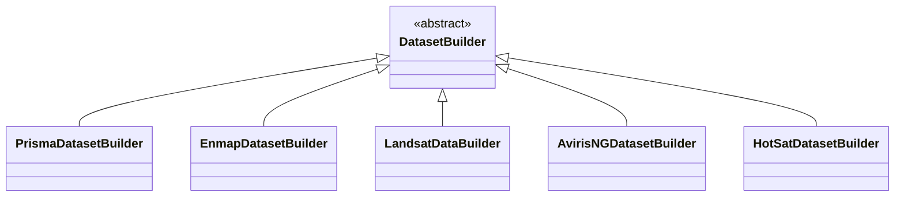
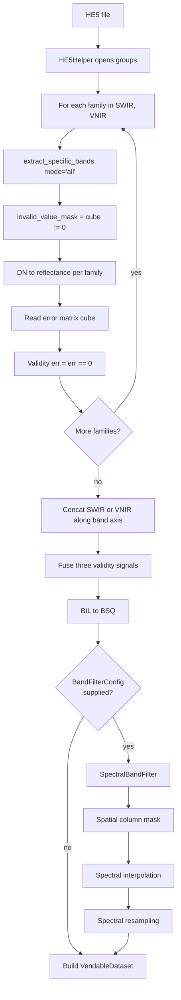
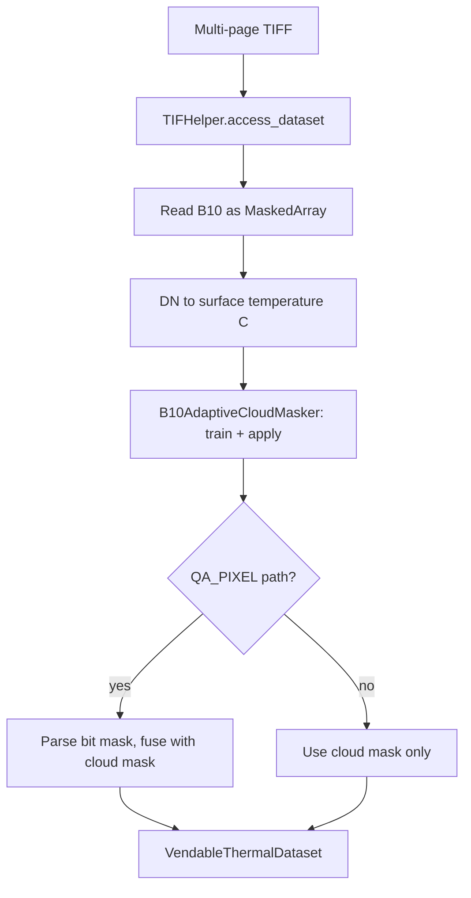
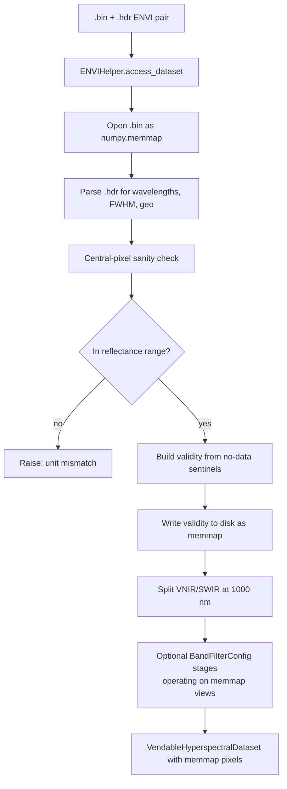
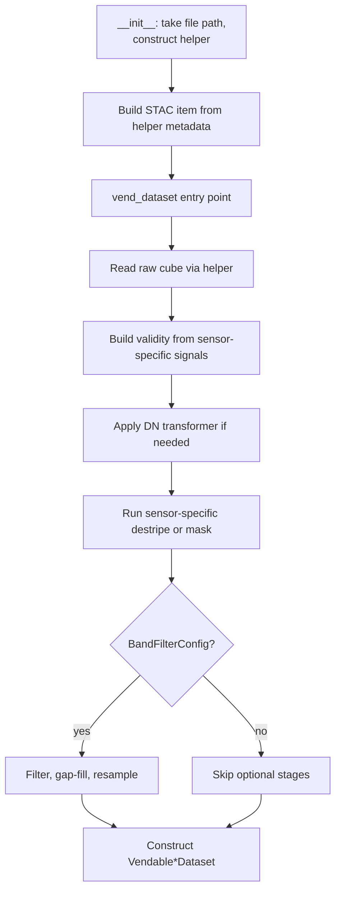

```mermaid
flowchart LR
    A[Folder] --> B[Find primary GeoTIFF + XML]
    B --> C[EnmapHelper opens stack]
    C --> D[Parse XML: centers, FWHMs, detector idx]
    D --> E[Read full cube]
    E --> F[DN to reflectance: x * 1e-4]
    F --> G[nodata sentinel -32768 zeroed]
    G --> H[Split into SWIR/VNIR by detector idx]
    H --> I[Optional BandFilterConfig stages]
    I --> J[VendableHyperspectralDataset]
```

# 2. Dataset Builders, Sensor by Sensor

This section walks through every concrete `DatasetBuilder` in the codebase. Each subsection follows the same outline: what the code does, where it diverges from the PRISMA reference, and which knobs the caller can turn. The PRISMA builder is the prototype — read it first, then the others mostly read as deltas.

The builders live in [`app/utils/dataset_builder/`](../../app/utils/dataset_builder/).

---

## 2.1 Comparison table

| Sensor             | File container        | Helper           | Native repr   | DN transformer                                    | Has spectral families? |
|--------------------|-----------------------|------------------|---------------|---------------------------------------------------|------------------------|
| PRISMA L2D         | HE5 hierarchical      | `HE5Helper`      | BIL           | `PrsL2dDnToSurfaceReflectanceTransformer`         | Yes (SWIR, VNIR)       |
| EnMAP L2A          | folder of GeoTIFF+XML | `EnmapHelper`    | BSQ           | `EnmapL2aDnToSurfaceReflectanceTransformer`       | Yes (split by detector)|
| Landsat 9 L2SP     | multi-page TIFF       | `TIFHelper`      | BSQ           | `Lc09L2spStTransformer` (DN → Celsius)            | No (thermal)           |
| AVIRIS-NG          | ENVI BSQ binary       | `ENVIHelper`     | BSQ (memmap)  | identity (already reflectance)                    | Yes (split at 1000 nm) |
| HotSat L2 Visual   | GeoTIFF + UDM         | `HotSatHelper`   | BSQ           | identity (uncalibrated 14-bit DN)                 | No (thermal)           |

---

## 2.2 `PrismaDatasetBuilder`

`vend_dataset()` ([prisma_dataset_builder.py:197](../../app/utils/dataset_builder/prisma_dataset_builder.py)) is the most complete reference implementation. A separate, deeper walk through it lives in Section 13; this is the summary.

### Flow

### The three validity signals

PRISMA gives you three independent ways to know whether a voxel is trustworthy. The builder fuses all three:

1. **Band-level validity flag** ($V_\text{band}$) — vendor's per-band good/bad flag, one bit per band, broadcast to the full cube.
2. **Error-pixel mask** ($V_\text{err}$) — PRISMA ships a parallel error matrix the same shape as the cube. Where the error matrix is zero, the corresponding voxel is good.
3. **Non-zero mask** ($V_\text{val}$) — PRISMA encodes "no data" as exact zeros, so any zero DN is suspect.

The three are combined by element-wise product at [prisma_dataset_builder.py:283](../../app/utils/dataset_builder/prisma_dataset_builder.py):

$$V = V_\text{band} \odot V_\text{err} \odot V_\text{val}$$

A voxel survives only if all three say so.

### Why build `V_\text{val}` *before* DN→reflectance?

DN 0 is a sentinel for "no data," but $\rho = 0 \cdot \text{scale} + \text{offset}$ is a real reflectance value (often a small positive number, sometimes exactly 0). Once the multiply happens, you can no longer distinguish a sentinel from a genuine zero reading. So the builder snapshots `(cube != 0)` immediately after read at [prisma_dataset_builder.py:248](../../app/utils/dataset_builder/prisma_dataset_builder.py) and carries that snapshot through the rest of the pipeline.

### Native BIL representation

PRISMA's HE5 stores data band-interleaved-by-line: shape `(H, C, W)`. The builder concatenates along `axis=1` to preserve this layout, then flips to BSQ `(C, H, W)` at [prisma_dataset_builder.py:286](../../app/utils/dataset_builder/prisma_dataset_builder.py) before handing off to the vendable. Downstream code is BSQ-everywhere.

### Optional pipeline stages

If the caller passes a `BandFilterConfig`, the builder runs four additional stages between [prisma_dataset_builder.py:305](../../app/utils/dataset_builder/prisma_dataset_builder.py) and [prisma_dataset_builder.py:387](../../app/utils/dataset_builder/prisma_dataset_builder.py):

1. `SpectralBandFilter` drops vendor-flagged, atmospheric-window, edge, and low-coverage bands (Section 9).
2. **Spatial column masking** — invalidate any pixel column where >`max_invalid_voxel_fraction` of bands are invalid ([prisma_dataset_builder.py:339](../../app/utils/dataset_builder/prisma_dataset_builder.py)). This kills the residual stripes of fully-invalid pixels along the detector boundary.
3. `SpectralInterpolator` fills partial spectral gaps (Section 10).
4. `SpectralResampler` projects everything onto the common 10 nm grid (Section 11).

Each of these stages is independently bypass-able by omitting fields from `BandFilterConfig`.

---

## 2.3 `EnmapDatasetBuilder`

[`enmap_dataset_builder.py`](../../app/utils/dataset_builder/enmap_dataset_builder.py).

### What is different from PRISMA

- **One integrated cube.** EnMAP's vendor container delivers all 224 bands in a single GeoTIFF stack, not split by detector. The PRISMA per-family loop collapses to a single read.
- **XML metadata sidecar.** Band centers, FWHMs, and detector assignments come from an XML file parsed at [enmap_dataset_builder.py:86](../../app/utils/dataset_builder/enmap_dataset_builder.py).
- **Detector boundary, not wavelength cutoff.** PRISMA splits SWIR/VNIR by family in the file. EnMAP requires you to *learn* the split from `detector_boundary.vnir_expected_channels`. Bands below that channel index are VNIR; above are SWIR. The boundary is not at a fixed wavelength because the overlap region (around 900–1000 nm) is detector-defined.
- **Uniform DN transform.** $\rho = \text{DN} \cdot 10^{-4}$ across all bands. No per-family scale.

### Flow

### Caller knobs

The XML-derived metadata is treated as ground truth; no flag is exposed to override it. The only optional input is the `BandFilterConfig`, identical in shape to PRISMA's.

---

## 2.4 `LandsatDataBuilder`

[`landsat_dataset_builder.py`](../../app/utils/dataset_builder/landsat_dataset_builder.py). Thermal sensor — fundamentally different from hyperspectral.

### What is different

- **No `band_information`.** The property returns `None` ([dataset_builder.py:60](../../app/abstract_classes/dataset_builder.py)). There is one band (B10) and no concept of spectral family.
- **Single-band cube.** Shape is `(1, H, W)`.
- **DN → Celsius**, not reflectance. See Section 5.
- **Cloud masking is integrated.** Unlike hyperspectral builders that delegate masking to validity flags, the Landsat builder trains and applies a `B10AdaptiveCloudMasker` ([landsat_dataset_builder.py:130](../../app/utils/dataset_builder/landsat_dataset_builder.py)). The masker is data-driven — it inspects the brightness-temperature histogram to find the cloud threshold for *this* scene.
- **Optional QA_PIXEL parsing.** If the caller supplies a provider QA file path, the builder parses the bit-packed mask at [landsat_dataset_builder.py:181](../../app/utils/dataset_builder/landsat_dataset_builder.py) — flags include cloud, cloud shadow, snow, water.

### Flow

### Caller knobs

- `apply_cloud_mask` — whether to run the adaptive masker (default true).
- `qa_pixel_path` — optional path to the provider QA file.
- `temperature_unit` — one of `"K"`, `"C"`, `"F"`; passed through to the DN transformer.

---

## 2.5 `AvirisNGDatasetBuilder`

[`aviris_ng_dataset_builder.py`](../../app/utils/dataset_builder/aviris_ng_dataset_builder.py). Hyperspectral airborne, RAM-constrained.

### What is different

- **Memory-mapped cube.** A typical AVIRIS-NG flightline is ~6.4 GB of float32. Loading it into RAM is not viable on a 16 GB laptop. The builder opens the `.bin` via `numpy.memmap` and never materializes the full cube. See [aviris_ng_dataset_builder.py:11](../../app/utils/dataset_builder/aviris_ng_dataset_builder.py).
- **Memmap-backed validity cube.** The validity mask, also large, is written to disk as another `.npy` memmap and re-read as a view. The returned `VendableHyperspectralDataset` carries memmap *views*, not arrays — downstream consumers see ndarray-shaped objects but page bytes from disk.
- **Identity DN transformer.** The vendor delivers data already in reflectance. There is no DN→SR step.
- **Hard 1000 nm split for VNIR/SWIR.** AVIRIS-NG is a single detector, but the codebase still distinguishes families for downstream consistency. The cutoff is at [aviris_ng_dataset_builder.py:72](../../app/utils/dataset_builder/aviris_ng_dataset_builder.py).
- **Unit sanity check.** A central-pixel probe inspects the reflectance value range. If values lie in $[-0.5, 1.5]$ the cube is reflectance; if in $[1, 200]$ it is probably radiance and the loader should refuse. This early check catches accidentally-loaded radiance files.

### Flow

### Caller knobs

- `output_dir` — directory for the memmap-backed validity file. If not given, the builder picks a temp location.
- `enforce_reflectance_range` — disable the sanity check for unusual scenes (default true).

---

## 2.6 `HotSatDatasetBuilder`

[`hotsat_dataset_builder.py`](../../app/utils/dataset_builder/hotsat_dataset_builder.py). SatVu HotSat-1 L2 Visual — uncalibrated thermal.

### What is different

- **No DN→Kelvin transform is published.** SatVu's L2 Visual is intended for visual inspection, not radiometric analysis. The builder carries the data verbatim and stamps units as `"DN_14bit_relative"` ([hotsat_dataset_builder.py:60](../../app/utils/dataset_builder/hotsat_dataset_builder.py)).
- **Downstream refuses to treat values as physical temperatures.** The unit string is checked at consumption time. If a detector or trainer expects Celsius and receives `"DN_14bit_relative"`, it raises rather than silently produces nonsense.
- **UDM-based validity.** The UDM (Usable Data Mask) is a uint8 bitmask. Valid pixels are where `UDM == 0`. Other bits encode bad pixel, cloud, saturated, no-data — all treated as invalid.

### Flow

### Caller knobs

The HotSat builder has very few options because there is little to calibrate. The main thing a caller might supply is an `apply_udm_mask=True/False` to bypass UDM-based masking for diagnostic purposes.

---

## 2.7 Common design pattern across builders

All five builders share a skeleton:

The differences across sensors are entirely in steps D–G. Steps H–K are identical. Adding a new sensor means writing the differences and inheriting the rest — see [Appendix B](appendix_b_adding_sensors.md).
