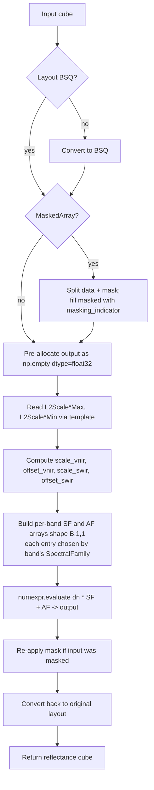

# 3. DN → Surface Reflectance: PRISMA L2D

This section explains how PRISMA's raw Digital Numbers become physical surface reflectance values. The transformer is small but careful — most of the complexity is in pre-allocation and in keeping the two PRISMA detectors (VNIR and SWIR) separately calibrated.

The implementation lives in [`prs_l2d_dn_to_surface_reflectance_transformer.py`](../../app/utils/data_transformations/prs_l2d_dn_to_surface_reflectance_transformer.py).

---

## 3.1 What the code does



### Step-by-step

1. **Normalize layout to BSQ.** The input cube can arrive as BSQ, BIL, or BIP depending on caller. The transformer converts to BSQ for arithmetic, then converts back at the end. See [prs_l2d_…py:84](../../app/utils/data_transformations/prs_l2d_dn_to_surface_reflectance_transformer.py).

2. **Handle masked arrays.** If the input is a `numpy.ma.MaskedArray`, the transformer splits it into a plain `ndarray` (the data) and the boolean mask, then fills masked voxels with a `masking_indicator` (default 0) before doing arithmetic. See [prs_l2d_…py:102](../../app/utils/data_transformations/prs_l2d_dn_to_surface_reflectance_transformer.py).

   Why fill before arithmetic? Because masked arithmetic in NumPy is significantly slower than plain arithmetic, and we will reattach the mask after the multiply. The masked voxels' temporary values do not matter — they will be masked again.

3. **Pre-allocate the output.** `np.empty(shape, dtype=float32)` reserves the output buffer without writing it. `numexpr` will write the result in-place. See [prs_l2d_…py:107](../../app/utils/data_transformations/prs_l2d_dn_to_surface_reflectance_transformer.py).

4. **Read scale/offset from HE5 root attributes via the template.** See [prs_l2d_…py:127](../../app/utils/data_transformations/prs_l2d_dn_to_surface_reflectance_transformer.py)–[prs_l2d_…py:146](../../app/utils/data_transformations/prs_l2d_dn_to_surface_reflectance_transformer.py). The relevant enums are `HyperspectralFileComponents.L2_SCALE_MAX_VNIR`, `L2_SCALE_MIN_VNIR`, `L2_SCALE_MAX_SWIR`, `L2_SCALE_MIN_SWIR`.

5. **Compute slopes and intercepts.**

   $$\text{scale}_\text{vnir} = \frac{\rho_\text{max}^\text{vnir} - \rho_\text{min}^\text{vnir}}{65535}$$

   $$\text{offset}_\text{vnir} = \rho_\text{min}^\text{vnir}$$

   The same formulas for SWIR. The denominator 65535 is the maximum value of a uint16. PRISMA quantizes reflectance into a uint16, with DN=0 mapping to $\rho_\text{min}$ and DN=65535 mapping to $\rho_\text{max}$.

6. **Build per-band scale and offset arrays.** Shape `(B, 1, 1)` — one scalar per band, broadcast over rows and columns. Each band's entry depends on its `SpectralFamily`: VNIR bands get $\text{scale}_\text{vnir}$, SWIR bands get $\text{scale}_\text{swir}$. See [prs_l2d_…py:154](../../app/utils/data_transformations/prs_l2d_dn_to_surface_reflectance_transformer.py).

7. **Vectorized in-place computation.** `numexpr.evaluate("input_array * SF + AF", out=output)` walks the cube in tiles and writes results directly into the pre-allocated output. See [prs_l2d_…py:168](../../app/utils/data_transformations/prs_l2d_dn_to_surface_reflectance_transformer.py).

8. **Re-apply the mask** if the input was a `MaskedArray`, and convert the output cube back to whatever layout the input used.

### Call sites

The transformer is invoked once per spectral family inside `PrismaDatasetBuilder.vend_dataset` at [prisma_dataset_builder.py:250](../../app/utils/dataset_builder/prisma_dataset_builder.py). The two calls (one for SWIR, one for VNIR) use different scale/offset values but the same transformer instance.

---

## 3.2 Theory in plain language

A satellite radiometer does not store reflectance directly. The detector measures photons, the on-board electronics convert that to a voltage, an analog-to-digital converter (ADC) digitizes the voltage to an integer, and *that integer* is what travels to the ground. Vendors call this integer the **Digital Number** (DN).

To turn DN back into a physical quantity, the vendor calibrates the chain (detector + electronics + ADC) and publishes a linear map:

$$\rho = \text{DN} \cdot \text{scale} + \text{offset}$$

For PRISMA L2D specifically, reflectance is stored as an unsigned 16-bit integer with:

- $\text{DN} = 0 \;\;\mapsto\;\; \rho = \rho_\text{min}$
- $\text{DN} = 65535 \;\;\mapsto\;\; \rho = \rho_\text{max}$

So the slope is

$$\text{scale} = \frac{\rho_\text{max} - \rho_\text{min}}{65535}$$

and the intercept is $\rho_\text{min}$.

### Why VNIR and SWIR have different scales

PRISMA has two physically separate detectors: VNIR (visible / near-infrared, roughly 400–1000 nm) and SWIR (short-wave infrared, roughly 1000–2500 nm). Earth surfaces look very different at those two wavelength bands:

- VNIR sees brightly-lit scenes — sunlit vegetation, snow, clouds. Reflectance commonly reaches 0.6–0.9.
- SWIR sees much darker scenes — even bright surfaces typically max out around 0.3 because water absorption dominates and atmospheric transmission is lower.

If the same uint16 range were assigned to both detectors, SWIR would waste the top two-thirds of its dynamic range. The vendor sets $\rho_\text{max}^\text{swir} \approx 0.3$ and $\rho_\text{max}^\text{vnir} \approx 0.5$ to put quantization steps where the data actually lives.

### Why `numexpr` instead of plain NumPy

The expression `dn * SF + AF` evaluated in pure NumPy would:

1. Allocate a temporary buffer the size of the cube to hold `dn * SF`.
2. Add `AF` into that buffer and write the result somewhere.

For a 234-band, 1024×1024 cube in float32, that temporary is 1 GB. The peak memory footprint doubles.

`numexpr.evaluate` parses the expression, tiles the cube into cache-sized chunks, and fuses the multiply and add into one pass through memory — no full-size temporary, in-place into the pre-allocated output buffer. The peak memory drops to one cube. It is also typically faster than NumPy because of better cache behavior and SIMD usage.

### Why the validity mask is built *before* this step

The PRISMA builder builds `invalid_value_mask = (cube != 0).astype(int8)` immediately after reading the DN cube and *before* calling this transformer (see [prisma_dataset_builder.py:248](../../app/utils/dataset_builder/prisma_dataset_builder.py)). The reason: $0 \cdot \text{scale} + \text{offset} = \text{offset}$, which is the real reflectance value `L2ScaleMin*` — typically 0 or close to it. If we waited until after the transform, a sentinel zero would look identical to a genuine zero-reflectance reading and we could no longer distinguish them.

---

## 3.3 Worked numerical example

Suppose PRISMA's HE5 root attributes report:

```text
L2ScaleMinVnir = 0.0     L2ScaleMaxVnir = 0.5
L2ScaleMinSwir = 0.0     L2ScaleMaxSwir = 0.3
```

Then:

```text
scale_vnir = (0.5 - 0.0) / 65535 = 7.629e-6
offset_vnir = 0.0
scale_swir = (0.3 - 0.0) / 65535 = 4.578e-6
offset_swir = 0.0
```

A 4-band, 1-row, 3-column patch where bands 0 and 1 are VNIR, bands 2 and 3 are SWIR:

```text
DN cube (shape (4, 1, 3)):
band 0 (VNIR 500 nm):  [12000, 28000,    0]
band 1 (VNIR 700 nm):  [25000, 41000,    0]
band 2 (SWIR 1600 nm): [ 8000, 14000,    0]
band 3 (SWIR 2200 nm): [ 5500, 11000,    0]
```

After `output = dn * SF + AF` with the per-band scale chosen by family:

```text
band 0: [12000 * 7.629e-6, 28000 * 7.629e-6, 0] = [0.0916, 0.2136, 0.0000]
band 1: [25000 * 7.629e-6, 41000 * 7.629e-6, 0] = [0.1907, 0.3127, 0.0000]
band 2: [ 8000 * 4.578e-6, 14000 * 4.578e-6, 0] = [0.0366, 0.0641, 0.0000]
band 3: [ 5500 * 4.578e-6, 11000 * 4.578e-6, 0] = [0.0252, 0.0504, 0.0000]
```

Pixel column 2 is zero in every band. After the transform it is also zero in every band. The validity mask snapshot taken before the transform recorded those zeros as invalid — that information is now the only way to tell sentinel from data.

### A second variation: non-zero offsets

Some vendor processing baselines publish a non-zero minimum reflectance so that the bottom of the uint16 range is reserved for sub-zero atmospheric correction overshoot. Suppose instead:

```text
L2ScaleMinVnir = -0.01    L2ScaleMaxVnir = 0.49
```

Then:

```text
scale_vnir = (0.49 - (-0.01)) / 65535 = 7.629e-6   # unchanged
offset_vnir = -0.01
```

A VNIR DN of 12000 now produces $12000 \cdot 7.629\times10^{-6} + (-0.01) = 0.0816$. Same slope, shifted intercept. Reflectance values can be slightly negative — physically meaningless but useful for downstream noise modeling.

---

## 3.4 Edge cases

| Situation                                 | What the transformer does                                                |
|-------------------------------------------|--------------------------------------------------------------------------|
| Input is `MaskedArray`                    | Split data + mask, fill masked with `masking_indicator`, restore after  |
| Input is BIL (PRISMA native)              | Convert to BSQ, transform, convert back                                 |
| All four `L2Scale*` attributes are zero   | The transformer silently produces an all-zero output — caller should check |
| Cube is wider than 65535 along some axis  | Irrelevant; transformer treats each voxel independently                  |
| `numexpr` not available                   | Falls back to NumPy (slower, higher peak memory)                         |

---

## 3.5 Why this transformer is per-family

A subtle architectural point: this is one transformer that **knows about two families**, rather than two transformers each handling one family. Two reasons:

1. The vendor publishes the calibration as a single 4-tuple `(min_vnir, max_vnir, min_swir, max_swir)`. Splitting that across two transformer instances would require coordination at construction.
2. Future PRISMA processing baselines might introduce a third spectral family (e.g., a panchromatic band) using the same encoding scheme. A single transformer can grow a third branch; two transformers would need a third class.

The trade-off is that the transformer's `transform` method takes a `band_metadata` argument so it can look up each band's family — slightly more coupling than a fully family-agnostic transformer, but it matches the way the vendor actually publishes the calibration.
