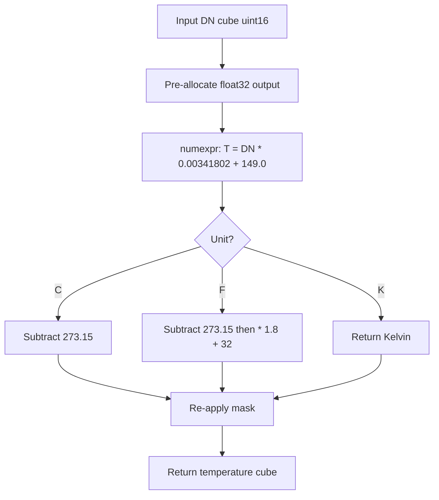

# 5. DN → Surface Temperature: Landsat 9 L2SP

This is the only thermal calibrator in the pipeline. Where the hyperspectral transformers produce dimensionless reflectance, this transformer produces a temperature in Kelvin, Celsius, or Fahrenheit. The constants are hard-coded — they come from the USGS Landsat Collection 2 Level-2 Surface Temperature Algorithm Theoretical Basis Document (ATBD) and do not change between scenes of the same processing baseline.

The implementation lives in [`l2sp_dn_to_temperature_transformer.py`](../../app/utils/data_transformations/l2sp_dn_to_temperature_transformer.py).

---

## 5.1 What the code does



### Step-by-step

1. **Hard-coded calibration constants** at [l2sp_…py:16](../../app/utils/data_transformations/l2sp_dn_to_temperature_transformer.py):

   ```python
   SCALING_FACTOR = 0.00341802
   ADDITIVE_FACTOR = 149.0
   ```

2. **Kelvin formula** at [l2sp_…py:63](../../app/utils/data_transformations/l2sp_dn_to_temperature_transformer.py):

   $$T(\text{K}) = \text{DN} \cdot 0.00341802 + 149.0$$

3. **Celsius conversion** at [l2sp_…py:65](../../app/utils/data_transformations/l2sp_dn_to_temperature_transformer.py):

   $$T(^\circ \text{C}) = T(\text{K}) - 273.15$$

4. **Fahrenheit conversion** at [l2sp_…py:71](../../app/utils/data_transformations/l2sp_dn_to_temperature_transformer.py):

   $$T(^\circ \text{F}) = (T(\text{K}) - 273.15) \cdot 1.8 + 32.0$$

All three are evaluated by `numexpr` writing into a pre-allocated float32 buffer. The mask is preserved across the transform — if the input was a `MaskedArray`, the same mask is reattached to the output.

### Call sites

Invoked once per scene inside `LandsatDataBuilder.vend_dataset` at [landsat_dataset_builder.py:124](../../app/utils/dataset_builder/landsat_dataset_builder.py). The unit (`"K"`, `"C"`, or `"F"`) is passed as a kwarg from the caller.

---

## 5.2 Theory in plain language

A thermal infrared sensor measures the radiance emitted by the Earth's surface in a particular wavelength band — for Landsat 9 B10, the band is centered around 10.9 μm. The Planck function relates radiance to brightness temperature:

$$L(\lambda, T) = \frac{2 h c^2}{\lambda^5} \cdot \frac{1}{e^{hc/\lambda k T} - 1}$$

Where $h$ is Planck's constant, $c$ is the speed of light, $k$ is Boltzmann's constant, $\lambda$ is wavelength, and $T$ is the temperature. The USGS Level-2 Surface Temperature processing inverts this physics — accounting for atmospheric transmission, surface emissivity, downwelling sky radiance, and upwelling path radiance — to produce a *surface temperature* in Kelvin.

That result is then quantized into a uint16 with a fixed linear map:

$$T(\text{K}) = \text{DN} \cdot 0.00341802 + 149.0$$

### Why these specific constants

The constants are chosen to span the full usable range of natural land surfaces:

- **Offset 149 K** ≈ −124 °C. This is comfortably below the coldest plausible Earth surface (Antarctic winter night, ~183 K = −90 °C) plus margin for radiometric noise. The choice puts the bottom of the uint16 range below any real reading.
- **Slope 0.00341802 K/DN** sets the quantization step. Every increment of 1 in DN corresponds to 0.0034 K — about 3 mK. That is well below the radiometric resolution of the sensor (which is ~0.1 K for B10), so quantization is not a meaningful source of error.
- **Maximum** at DN = 65535:

  $$T_\text{max} = 65535 \cdot 0.00341802 + 149.0 = 373.1\ \text{K} \approx 100\,^\circ\text{C}$$

The maximum covers the full natural land range plus active-fire pixels. Wildfires can exceed 100 °C at the sensor's footprint; those pixels saturate at DN = 65535 and the user has to handle them separately.

### Why the sentinel is DN = 0

Where the L2 processing could not produce a valid surface temperature (e.g., over heavy cloud cover, or where atmospheric correction failed), the cell stores `DN = 0`. After the transform that becomes $0 \cdot 0.00341802 + 149.0 = 149.0$ K = −124 °C. Anything ≤ 150 K is the sentinel — physically absurd, used to be filtered out by the validity mask.

---

## 5.3 Worked numerical example

A small thermal patch:

```text
DN = [38000, 42000, 45000, 50000, 0]
```

Apply the Kelvin formula:

```text
T(K) = [38000 * 0.00341802 + 149,
        42000 * 0.00341802 + 149,
        45000 * 0.00341802 + 149,
        50000 * 0.00341802 + 149,
            0 * 0.00341802 + 149]
     = [278.88, 292.55, 302.81, 319.90, 149.00]
```

Convert to Celsius:

```text
T(°C) = [5.73, 19.40, 29.66, 46.75, -124.15]
```

Convert to Fahrenheit:

```text
T(°F) = [42.31, 66.92, 85.39, 116.15, -191.47]
```

The first four readings are plausible Earth-surface temperatures (cool morning, warm afternoon, hot pavement, very hot pavement or fire-adjacent). The fifth (DN=0 → −124 °C) is the nodata sentinel — used only to be filtered out by the validity mask.

### A second variation: wildfire pixel

A pixel sitting on a small active fire might saturate B10:

```text
DN = 65535
T(K) = 65535 * 0.00341802 + 149 = 373.07 K = 99.92 °C
```

The actual fire temperature could be 400 °C or more, but B10 is saturated and we only know the temperature is *at least* 100 °C. This is why the Allotrope thermal anomaly detectors include a "hot saturation" check — a saturated pixel is not a normal hot pixel, it is a censored measurement.

---

## 5.4 Why pre-allocation matters here too

The same `numexpr` pre-allocation pattern from the reflectance transformers applies. For a typical 7000×7000 Landsat scene:

- Pure NumPy `dn * 0.00341802 + 149.0` would build an intermediate buffer of size 7000×7000×4 bytes = 196 MB.
- `numexpr.evaluate` with a pre-allocated output reuses one 196 MB buffer for the result and avoids the intermediate.

For one scene that is not a lot of memory, but Landsat batch processing often runs many scenes through a pool of workers — saving 196 MB per worker keeps the worker count up.

---

## 5.5 Edge cases

| Situation                          | Behavior                                                              |
|------------------------------------|-----------------------------------------------------------------------|
| DN = 0 (sentinel)                  | Output is 149 K (−124 °C); validity mask should flag                  |
| DN = 65535 (saturation)            | Output is 373 K (100 °C); caller must distinguish real hot from saturated |
| Input is `MaskedArray`             | Mask is split, transform runs on data, mask reattached                |
| Input dtype is int instead of uint | Same math; negative DNs would produce sub-149 K temperatures          |
| Unit kwarg is something unexpected | The transformer falls through to Kelvin (default) — silent failure mode |

The last row is worth noting: the unit selector has no enum guard. A typo in the caller (`"celcius"` instead of `"C"`) would silently produce Kelvin output. In a production setting it would be worth tightening this.

---

## 5.6 Why temperature is exposed in three units

Different downstream consumers prefer different units:

- **Foundation models and detectors** want Celsius, because the typical operating range (−40 °C to 60 °C) sits comfortably within float32 without needing rescaling. Kelvin numbers (~273 to ~313) waste precision on the offset.
- **API responses** for human users may want Fahrenheit, especially in US-centric deployments.
- **Provenance and intercomparison with other datasets** want Kelvin, the SI unit.

Rather than exposing one unit and forcing every consumer to convert, the transformer accepts a unit kwarg and does the conversion in a single fused pass. The cost is one extra subtraction and one extra multiply, both done in-place by `numexpr`.
