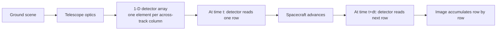
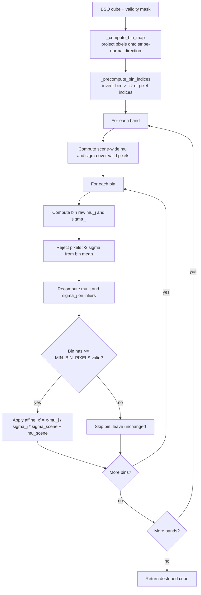

# 6. Moment-Matching Destripe

Pushbroom hyperspectral sensors (PRISMA, EnMAP, AVIRIS-NG) build an image one row at a time by sweeping a one-dimensional detector array across the ground track. Each detector element has slightly different gain and offset, so the resulting image carries vertical (or rotated, after orthorectification) stripes — one stripe per detector column. This section explains the **moment-matching** correction: a classical, fast, broad-spectrum stripe remover.

The implementation lives in [`moment_matching_destriper.py`](../../app/utils/data_transformations/moment_matching_destriper.py).

---

## 6.1 What is a pushbroom stripe?



Every column of the resulting image is read by the *same physical detector element* across the whole scene. If detector element #237 has a 5% higher gain than its neighbors, column 237 will be 5% brighter than its neighbors *everywhere in the image* — a vertical bright stripe.

After the scene is orthorectified to a map projection, the stripe may rotate to an arbitrary angle. The destriper handles both vertical and tilted stripes by working in a rotated bin coordinate.

---

## 6.2 What the code does

The destriper operates on a BSQ cube one band at a time.



### Stage 1: bin map

`_compute_bin_map(H, W, stripe_angle)` ([moment_matching_…py:80](../../app/utils/data_transformations/moment_matching_destriper.py)) projects every pixel onto a vector perpendicular to the stripe direction and rounds to an integer bin.

For a stripe running at angle $\theta$ measured from vertical:

- The stripe direction is the unit vector $\vec t = (\sin\theta, \cos\theta)$.
- The perpendicular (the direction in which stripes vary) is $\vec n = (\cos\theta, -\sin\theta)$ — equivalently $(-\sin\theta, \cos\theta)$ depending on convention.
- The perpendicular distance of pixel $(r, c)$ from the image center $(c_y, c_x)$ is
  $$d = (c - c_x)\, n_x + (r - c_y)\, n_y$$

For pure vertical stripes ($\theta = 0$), this collapses to $d = c - c_x$ — every column gets its own bin, which is what you want.

For a 45° stripe, both row and column influence the bin assignment, and a single bin covers a diagonal swath of pixels.

### Stage 2: invert the mapping

`_precompute_bin_indices(bin_map)` ([moment_matching_…py:100](../../app/utils/data_transformations/moment_matching_destriper.py)) inverts the bin map: for each bin index, store the flat pixel indices that fall into it. This avoids rescanning the bin_map array once per band — instead the per-band loop indexes directly into pre-computed lists.

### Stage 3: per-band correction

`_destripe_band` ([moment_matching_…py:110](../../app/utils/data_transformations/moment_matching_destriper.py)) does the actual work for one band:

1. Compute scene-wide statistics $\mu_\text{scene}, \sigma_\text{scene}$ over **valid** pixels only.
2. For each bin $j$:
   - Compute bin raw $\mu_j, \sigma_j$ over the bin's valid pixels.
   - Reject pixels more than 2σ from $\mu_j$ — these are outliers (bright features that happen to lie in this bin, e.g., a road).
   - Recompute $\mu_j, \sigma_j$ on the inliers only.
   - Apply the affine correction at [moment_matching_…py:158](../../app/utils/data_transformations/moment_matching_destriper.py):
     $$x' = \frac{x - \mu_j}{\sigma_j} \cdot \sigma_\text{scene} + \mu_\text{scene}$$
3. Bins with fewer than `MIN_BIN_PIXELS = 20` valid pixels are skipped — the statistics are not reliable enough to be useful.

---

## 6.3 Theory in plain language

Imagine each detector element has its own (slightly wrong) gain $g_j$ and offset $o_j$ relative to an ideal detector. If the true scene value at a pixel is $\rho_t$, the observed value through detector $j$ is

$$\rho_\text{obs} = g_j \rho_t + o_j$$

This is the fundamental detector model: a per-detector linear distortion.

### The stationarity assumption

Now collect a large sample of pixels seen by detector $j$ across the whole scene. Call the sample mean $\mu_j$ and standard deviation $\sigma_j$.

Assume that the *true scene* statistics restricted to the pixels in detector $j$'s view are the same as the scene-wide statistics. Call those $\mu_\text{scene}$ and $\sigma_\text{scene}$. This is the **stationarity assumption** — the scene is "stationary" in the statistical sense across the across-track dimension.

If that assumption holds, the linear distortion implies:

$$\mu_j = g_j \mu_\text{scene} + o_j$$
$$\sigma_j = g_j \sigma_\text{scene}$$

Solve for the true $\rho_t$:

$$\rho_t = \frac{\rho_\text{obs} - o_j}{g_j}$$

Substitute the relations above:

$$\rho_t = \frac{\rho_\text{obs} - \mu_j}{\sigma_j} \cdot \sigma_\text{scene} + \mu_\text{scene}$$

That is exactly the formula the code computes. The method "matches" the first two moments — mean and standard deviation — of each detector's distribution to the scene-wide distribution. Hence the name **moment matching**.

### Why outlier rejection

The stationarity assumption fails for *bright outliers*. A single road, river, or roof in detector $j$'s column will pull $\mu_j$ and $\sigma_j$ away from a representative sample of the scene. Rejecting pixels more than 2σ from $\mu_j$ before recomputing puts the heavy lifting on the bulk of the distribution — typically grass, soil, and bare earth — which are reasonable proxies for the scene-wide statistics.

The 2σ threshold is a heuristic. Too tight (say 1σ) and the statistics get fragile because the inlier set shrinks; too loose (say 4σ) and bright outliers dominate. 2σ is a balance widely used in stripe-correction literature.

### Why this can backfire

The stationarity assumption *fails completely* when the scene is genuinely non-stationary across the across-track direction. Two famous failure cases:

1. **Coastline parallel to detector direction.** Half the columns see water (low reflectance, low variance) and half see land (high reflectance, higher variance). Moment-matching will pull the water columns toward the land statistics and vice versa, fading the coastline.
2. **Snow line across the scene.** Same idea — one strip of detectors sees snow, others see bare ground.

The composite destriper (Section 8) has a σ safety guard that detects these regressions and rolls back the correction when it makes things worse.

---

## 6.4 Worked numerical example

A toy 1-band image of shape (5, 6) with vertical stripes (angle = 0°). The true scene is uniformly $\rho_t = 0.30$ everywhere with Gaussian noise $\mathcal{N}(0, 0.01)$. Detector column 3 has a 10% gain inflation: $g_3 = 1.10, o_3 = 0$.

The true (unobservable) scene values, by row:

```text
[0.301, 0.298, 0.302, 0.300, 0.299, 0.301]
[0.299, 0.301, 0.300, 0.302, 0.301, 0.298]
[0.300, 0.300, 0.299, 0.301, 0.298, 0.300]
[0.302, 0.299, 0.301, 0.300, 0.302, 0.299]
[0.298, 0.300, 0.302, 0.299, 0.300, 0.301]
```

What the sensor reports, after multiplying column 3 by 1.10:

```text
[0.301, 0.298, 0.302, 0.330, 0.299, 0.301]
[0.299, 0.301, 0.300, 0.332, 0.301, 0.298]
[0.300, 0.300, 0.299, 0.331, 0.298, 0.300]
[0.302, 0.299, 0.301, 0.330, 0.302, 0.299]
[0.298, 0.300, 0.302, 0.329, 0.300, 0.301]
```

Scene-wide statistics (over all 30 pixels):

```text
mu_scene ≈ 0.305   (slightly inflated because of column 3)
sigma_scene ≈ 0.010
```

Bin 3 statistics (5 pixels, all around 0.330):

```text
mu_3 ≈ 0.331
sigma_3 ≈ 0.011
```

Apply the correction to the observed value 0.330 in row 0, column 3:

```text
ρ' = (0.330 − 0.331) · (0.010 / 0.011) + 0.305
   ≈ −0.001 · 0.909 + 0.305
   ≈ 0.304
```

That is within noise of the true 0.300. The 10% gain artifact is removed.

### A second variation: column with a real bright feature

Suppose the same image now has a *real* bright feature: a small bright roof at row 2, column 3 with true reflectance 0.55. After the column-3 gain inflation:

```text
Observed column 3: [0.330, 0.332, 0.605, 0.330, 0.329]
                                  ↑ roof pixel
```

Bin 3 raw statistics with the roof included:

```text
mu_3_raw = 0.385
sigma_3_raw = 0.123   # heavily inflated by the roof
```

After 2σ outlier rejection (the 0.605 is 1.79σ from $\mu_3^\text{raw} = 0.385$ — borderline). Suppose it gets rejected. Then:

```text
mu_3 = 0.330
sigma_3 = 0.001
```

Now the correction shrinks the in-bin variance to scene-wide variance:

```text
For the roof pixel 0.605:
ρ' = (0.605 − 0.330) · (0.010 / 0.001) + 0.305 = 0.275 · 10 + 0.305 = 3.055
```

A reflectance of 3.0 — clearly nonsense. The roof, which was the actual signal of interest, gets blown up to an unphysical value. This is the failure mode that motivates the composite destriper's σ guard (Section 8) and the FFT pre-stage (Section 7).

---

## 6.5 Knobs and defaults

| Parameter         | Default | Meaning                                                       |
|-------------------|---------|---------------------------------------------------------------|
| `stripe_angle`    | 0.0°    | Angle of the stripe direction in image space                  |
| `MIN_BIN_PIXELS`  | 20      | Bins with fewer valid pixels are skipped                      |
| Outlier σ-threshold| 2.0    | Pixels more than this many σ from bin mean are rejected       |

The `stripe_angle` is the only parameter typically supplied at runtime — it comes from the FFT destriper's angle-detection stage when the composite destriper runs.

---

## 6.6 Where it fits in the pipeline


Moment-matching is run *after* the FFT destriper in the composite pipeline. Reasons:

- FFT removes narrow-band periodic stripes that moment-matching would interpret as legitimate scene content.
- Moment-matching then mops up aperiodic per-column bias the FFT cannot touch (because that bias lives at DC).
- The FFT destriper also reports the detected stripe angles, which moment-matching then uses to orient its bins.

The composite destriper (Section 8) wires this sequence together with a safety check.
