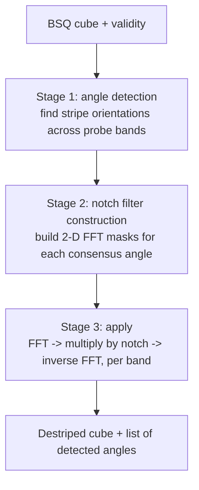
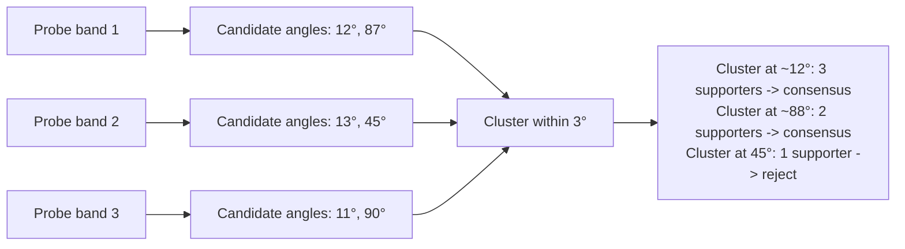
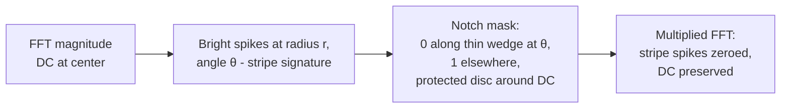

# 7. Frequency-Domain Destripe

Moment-matching (Section 6) addresses *low-frequency* per-detector bias — slow gain and offset drifts. **Periodic** stripe noise is a different beast. The 6-pixel-period artifact that some PRISMA SWIR bands carry, for example, comes from detector multiplexing electronics and lives at a precise spatial frequency. A frequency-domain notch filter is the right tool for that.

The implementation lives in [`frequency_domain_destriper.py`](../../app/utils/data_transformations/frequency_domain_destriper.py).

---

## 7.1 The three stages

The destriper returns both the corrected cube and the detected stripe angles. The composite destriper uses those angles to orient its subsequent moment-matching pass.

---

## 7.2 Stage 1: angle detection

Implemented at [frequency_domain_…py:176](../../app/utils/data_transformations/frequency_domain_destriper.py).

For each of up to 10 probe bands per spectral family:

1. **Fill invalid pixels with the band's valid-pixel mean** ([frequency_domain_…py:491](../../app/utils/data_transformations/frequency_domain_destriper.py)). The FFT does not handle missing data well — zeros in the input produce broad spurious spectra. Mean-fill keeps the spectrum clean.

2. **Compute the log power spectrum, shifted so DC is centered**:

   $$P(k_y, k_x) = \log\left( |\mathcal{F}\{I\}(k_y, k_x)|^2 + 10^{-10} \right)$$

   See [frequency_domain_…py:500](../../app/utils/data_transformations/frequency_domain_destriper.py). The $10^{-10}$ floor prevents $\log 0$ at empty bins.

3. **Probe every candidate angle in 0.5° steps**, from 0° to 180°. For each angle $\theta$, sum the log power along two radial rays from the FFT center, skipping the inner `RADIAL_SKIP = 10` pixels. The skip protects against false detections from the always-bright DC region. See [frequency_domain_…py:507](../../app/utils/data_transformations/frequency_domain_destriper.py). The implementation is fully vectorized — all (angle, radius) sample coordinates are gathered in one shot.

4. **Flag candidate angles**: angles whose summed power exceeds the local angular background by `PEAK_SIGMA = 3` standard deviations are recorded ([frequency_domain_…py:219](../../app/utils/data_transformations/frequency_domain_destriper.py)).

5. **Cluster candidates across probe bands**. With `ANGLE_TOLERANCE = 3°` ([frequency_domain_…py:401](../../app/utils/data_transformations/frequency_domain_destriper.py)). Each cluster that gathers ≥ `max(2, n_probes/4)` supporters becomes a **consensus stripe angle**. Multiple angles are supported — some sensors have two superimposed stripe directions.

### Why probe bands and consensus

A single band's spectrum can have an angular peak for many reasons — roads, agricultural rows, urban grids. A real instrumental stripe shows up *at the same angle in many bands* because it is a detector artifact, not a scene feature. Requiring multi-band consensus eliminates most scene-induced false positives.

---

## 7.3 Stage 2: notch filter construction

Implemented at [frequency_domain_…py:559](../../app/utils/data_transformations/frequency_domain_destriper.py).

For each consensus angle, build a 2-D mask on the padded `(H+256, W+256)` grid:

1. At each pixel of the FFT, compute its polar angle from the FFT center: $\phi = \arg(x + iy) \bmod 180°$.
2. **Zero out pixels within `angular_width = 3°` of the stripe angle.** This is the notch itself — a thin angular wedge from the FFT origin outward.
3. **Gaussian-blur the wedge edges** with `taper_sigma = 2.0`. Hard edges in the frequency domain produce Gibbs ringing in the spatial domain; tapering the wedge prevents that.
4. **Force the inner `radial_preserve` pixels back to 1.** Never notch DC or near-DC, that would kill the mean and broad spatial structure of the image.
5. Combine multiple notches (one per consensus angle) by element-wise minimum.

### Adaptive radial preserve

The radial preserve radius depends on stripe strength ([frequency_domain_…py:290](../../app/utils/data_transformations/frequency_domain_destriper.py)):

| Stripe σ | `radial_preserve` |
|----------|-------------------|
| > 10     | 2 pixels          |
| > 5      | 3 pixels          |
| else     | 5 pixels          |

Stronger stripes have spectral energy reaching closer to DC, so the protected disc must shrink to let the notch reach them. Weaker stripes are safely far from DC, so the protected disc can be wider to preserve more legitimate scene structure.

### Visual intuition

---

## 7.4 Stage 3: apply

Implemented at [frequency_domain_…py:591](../../app/utils/data_transformations/frequency_domain_destriper.py). For every band, batched on the best available torch device (CUDA > MPS > CPU):

1. **Fill invalid pixels with the per-band mean *on-device*** — keeps the entire pipeline on GPU when possible, no CPU intermediates.
2. **Reflect-pad by 128 pixels** with the band mean. The FFT is implicitly periodic; without padding, the right edge of the image wraps to the left edge and produces a boundary discontinuity. Reflect-padding with the band mean is a soft transition that keeps the spectrum clean.
3. **Forward FFT and shift**: `fft2 → fftshift`.
4. **Multiply by the notch mask** built in stage 2.
5. **Inverse shift and inverse FFT**: `ifftshift → ifft2`.
6. **Take the real part** (the imaginary part should be near zero — any non-zero value is numerical noise).
7. **Crop back to original size.**
8. **Write only valid pixels back into the output** — invalid pixels are left in their original (zero) state. The fill of step 1 was for the FFT only.

### Memory budget

A per-band-byte budget (~24 B per padded pixel for float32 + complex64 intermediates) picks the batch size from a memory budget of:

- 2 GB on CUDA
- 500 MB on MPS or CPU

The result is that a 234-band PRISMA scene processes in batches of ~20 bands on a typical GPU, ~5 bands on Apple silicon.

---

## 7.5 Theory in plain language

### Why a stripe shows up as a spike in the FFT

A directional stripe pattern of spatial period $T$ aligned at angle $\theta$ contributes a pair of bright spikes in the 2-D Fourier transform at frequency $\pm(1/T)$ on a radial line **perpendicular** to the stripe direction.

Why perpendicular? A stripe pattern is constant *along* its length but oscillates *across* its width. The 2-D Fourier transform decomposes the image into plane waves; the plane wave that best matches the stripe oscillates in the direction perpendicular to the stripe. So if stripes run at $\theta$, the spectral energy concentrates along the radial line at $\theta + 90°$.

In this codebase the convention is to pass the *visual* stripe angle, but the code searches for power peaks along radial rays in the spectrum directly — without explicitly adding 90°. This works because the codebase defines $\theta$ as the angle of the spectral ridge, not the angle of the stripe in image space. Read this convention carefully if you are debugging the angle search.

### Why the notch is angular, not point-like

A perfectly periodic stripe of one frequency would show up as a single Dirac spike at a single point in the FFT. Real stripes are:

- **Not quite periodic** — period drifts slightly across the image.
- **Not quite constant amplitude** — gain varies with brightness.
- **Slightly non-straight** — orthorectification skews them.

Each imperfection spreads the spike along the radial line. So the energy lives on an **arc** in the FFT at angle θ, not a single point. A notch that follows the arc removes more of the stripe than a notch that targets one point.

### Why Gaussian taper, not a hard wedge

A hard step in the frequency domain produces a sinc-shaped impulse response in the spatial domain — ringing along the wedge boundary that propagates into the image. Tapering the wedge edges to a Gaussian replaces the sinc with a Gaussian impulse response, which is non-oscillatory.

This is exactly the same trade-off as window functions in signal processing: rectangular windows have sharp frequency cutoffs but ringing; Gaussian and Hann windows have softer cutoffs but no ringing.

### Why a protected disc

The very center of the FFT (DC) encodes the mean of the image. Pixels near DC encode the slow spatial structure — the broad regions of bright versus dark. Zeroing those would destroy the image: the mean would drop to zero, and broad bright features (cumulus clouds, fields) would dim.

The radial preserve guarantees that the notch never touches the disc of radius 2–5 pixels around DC. The stripe spikes are typically at radius ≥ 8 pixels for any plausible stripe period, so the protected disc does not interfere with the correction.

### Why this fails over straight man-made features

If a real scene feature (a long straight road, an aqueduct, a runway) happens to run at the same angle as the stripe, its spectral energy will lie along the same radial line and the notch will fade it. The defenses against this:

- **Multi-band consensus** in stage 1: a real road appears bright in some bands and dim in others (VNIR vs SWIR), so its spectral ridge would not appear consistently in 10 disparate probe bands. An instrumental stripe does.
- **3σ background test** in stage 1: a faint feature at the stripe angle would not exceed local background by 3σ.

These are not infallible, but they protect against the most common false positives.

---

## 7.6 Worked numerical example

Consider a 16×16 image consisting of a constant 0.30 background plus a vertical sine stripe of amplitude 0.05 and period 4 pixels:

$$I(y, x) = 0.30 + 0.05 \sin(2\pi x / 4)$$

The 2-D DFT of this image has:

- A spike of magnitude $0.30 \cdot 256 = 76.8$ at $(k_y, k_x) = (0, 0)$ — the DC component.
- Two spikes of magnitude $0.05 \cdot 256 / 2 = 6.4$ at $(0, \pm 4)$.

After `fftshift`, the DC is at pixel $(8, 8)$; the stripe spikes are at $(8, 12)$ and $(8, 4)$. Their polar angle (measured from the FFT center) is exactly $0°$ — they lie on the horizontal axis.

The detector scans $\theta = 0°$ and finds enormous power there (the two spikes). $0°$ becomes the consensus angle. The notch filter:

- Zeros every pixel within 3° of angle 0 from center.
- Blurs the wedge edges with σ = 2.
- Re-protects a 5-pixel-radius disc around DC.

After inverse FFT:

- The constant 0.30 background is preserved (it lives at DC, inside the protected radius).
- The stripe component at radius 4 has been zeroed.
- The output is approximately a uniform 0.30 image — the stripe is gone, the background remains.

### A second variation: realistic mixed scene

Now suppose the 16×16 image is a more realistic mix of scene content plus stripe:

$$I(y, x) = S(y, x) + 0.05 \sin(2\pi x / 4)$$

where $S$ is, say, a noisy gradient from 0.20 (top) to 0.40 (bottom).

The FFT of $S$ has:

- A bright DC spike (mean ≈ 0.30 over the 256 pixels → spike magnitude ~76.8).
- A vertical low-frequency ridge from the top-to-bottom gradient.
- Diffuse low-amplitude noise spread over the spectrum.

The FFT of the stripe (as before) has spikes at $(8, 4)$ and $(8, 12)$.

The combined spectrum has all the above superimposed. The angle scan along $\theta = 0°$ still finds the stripe spikes because they are far brighter than the diffuse noise at the same radius. The notch wedge zeros them. The inverse FFT recovers $S(y, x)$ alone, plus tiny ringing from the wedge taper that lives below the noise floor.

The gradient is preserved because the gradient's spectral energy lives along the *vertical* axis of the FFT, not the horizontal — orthogonal to the notch. This is the whole point of the angular notch: it surgically removes one direction without touching others.

---

## 7.7 Knobs and defaults

| Parameter            | Default  | Meaning                                                  |
|----------------------|----------|----------------------------------------------------------|
| `PEAK_SIGMA`         | 3.0      | Angular peak must exceed background by this many σ       |
| `ANGLE_TOLERANCE`    | 3.0°     | Candidate angles within this are clustered               |
| `RADIAL_SKIP`        | 10       | Pixels around DC excluded from angle scan                |
| Angle scan step      | 0.5°     | Resolution of the angle search                           |
| Probe bands          | 10       | Per spectral family, evenly spaced                       |
| `angular_width`      | 3.0°     | Width of the notch wedge                                 |
| `taper_sigma`        | 2.0      | Gaussian taper on wedge edges                            |
| `radial_preserve`    | adaptive | 2–5 pixels around DC, never notched                      |
| Reflect pad          | 128 px   | Reduces FFT boundary wrap-around                         |

---

## 7.8 Why this and moment-matching together

The two destripers target different parts of the stripe spectrum:

- **FFT notch is narrow-band.** It removes a precise periodic component at one (or a few) frequencies but leaves slow per-detector gain/offset variation alone (that energy lives at DC and would be killed only by destroying the image).
- **Moment-matching is broad-band.** It normalizes each detector column's first two moments, capturing arbitrary gain/offset patterns including aperiodic ones, but suffers from the stationarity-assumption failure mode.

Section 8 (composite destripe) wires them in sequence.
