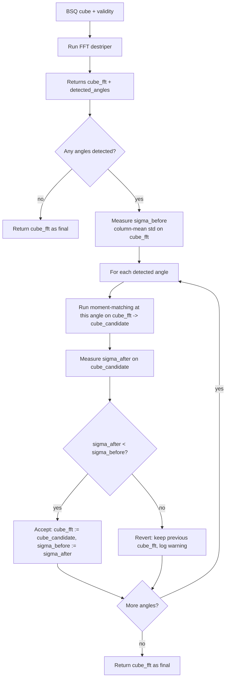
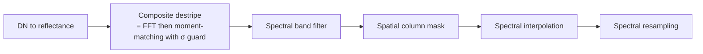

# 8. Composite Destripe

The composite destriper orchestrates the FFT and moment-matching destripers (Sections 7 and 6) sequentially, with a safety check that prevents the second stage from making things worse than the first stage left them.

The implementation lives in [`composite_destriper.py`](../../app/utils/data_transformations/composite_destriper.py).

---

## 8.1 What the code does



### Step-by-step

1. **Run the FFT destriper** ([composite_destriper.py:103](../../app/utils/data_transformations/composite_destriper.py)). It both removes periodic stripe noise *and* returns the detected stripe angles. Two outputs for one stage.

2. **If no angles were detected** ([composite_destriper.py:121](../../app/utils/data_transformations/composite_destriper.py)), return the FFT result and skip moment-matching. No need to run an angle-oriented correction if there is no angle.

3. **For each detected angle, apply tilted moment-matching at that angle** ([composite_destriper.py:147](../../app/utils/data_transformations/composite_destriper.py)). One pass per detected angle, in order.

4. **σ safety guard**: after each moment-matching pass, compute the **column-mean σ** — the standard deviation of per-column means in a representative band ([composite_destriper.py:184](../../app/utils/data_transformations/composite_destriper.py)). If this number went *up*, moment-matching at this angle made stripes worse (the stationarity assumption failed). Skip the result and revert ([composite_destriper.py:161](../../app/utils/data_transformations/composite_destriper.py)).

### Why measure column-mean σ as the quality metric

A clean, destriped image has near-identical column means across columns (because every column samples roughly the same underlying scene). A striped image has variable column means (because column gain/offset variation pulls each column's mean away from the scene mean). So the standard deviation of column means is a *direct measure of stripe residual* — lower is better.

This metric is computed in a single representative band, not all bands, for speed. The representative band is chosen for high signal-to-noise (typically a SWIR or VNIR band well away from atmospheric absorptions).

---

## 8.2 Theory in plain language

The two methods target different parts of the stripe spectrum, and they have complementary failure modes:

| Method            | Strengths                                                         | Failure mode                                  |
|-------------------|-------------------------------------------------------------------|-----------------------------------------------|
| FFT notch         | Surgical at narrow frequencies; preserves DC; angular precision   | Cannot remove aperiodic per-column bias       |
| Moment-matching   | Broad-band; handles arbitrary gain/offset patterns                | Stationarity assumption fails over coastlines, snow lines, etc. |

Composing them in sequence — first FFT, then moment-matching along the detected angle — recovers the strengths of each:

- **FFT removes precise periodic stripes** that moment-matching would either miss (if periodic) or amplify (if a real feature falls along the stripe angle).
- **Moment-matching then sweeps up residual aperiodic per-column bias** that the FFT cannot touch.

The σ guard is the failsafe. It protects against the case where the scene genuinely violates the stationarity assumption — moment-matching would have made things worse, but the metric detects this and rolls back.

### Why FFT first, not moment-matching first

The order matters. If moment-matching ran first:

- It would normalize each column to scene-wide mean and variance, which would flatten the per-column gain.
- It would also flatten the periodic stripe within each column, because the stripe is part of the column's distribution.
- But the periodic stripe lives at a non-zero spatial frequency. Once moment-matching has flattened the column, the periodic component is *spread* across all columns, harder for the FFT to localize.

By running FFT first:

- The periodic component is removed surgically without disturbing the broader column statistics.
- Moment-matching then sees a cleaner cube where its per-column statistics are dominated by aperiodic bias, exactly the regime it handles best.

### Why one pass per angle, in order

The FFT destriper can detect multiple consensus angles (typically 1–3). Moment-matching is applied per-angle in detected order. Each pass updates the cube before the next pass runs. This sequential application:

- Lets each pass benefit from the previous pass's cleanup.
- Allows the σ guard to evaluate each pass independently.
- Costs one moment-matching pass per angle, which is cheap compared to the FFT.

---

## 8.3 Worked numerical example

The σ guard's mechanics over a hypothetical PRISMA scene:

```text
Initial cube (just from DN -> reflectance):
  column-mean σ = 0.018500

After FFT destripe (removes 6-pixel periodic component):
  column-mean σ = 0.012400        # 33% reduction

Detected angles: [12°, 87°]

Pass 1: moment-matching at 12°
  cube_candidate column-mean σ = 0.009100
  0.0091 < 0.0124  -> ACCEPT, update cube

Pass 2: moment-matching at 87°
  cube_candidate column-mean σ = 0.016700
  0.0167 > 0.0091  -> REVERT (log warning), keep previous cube
```

Final log line:

```text
Column-mean σ: original=0.018500 → FFT=0.012400 → combined=0.009100
WARNING: angle 87° moment-matching pass increased σ from 0.0091 to 0.0167; reverted.
```

The FFT cut the column-mean σ by ~33%. Moment-matching at 12° cut another ~27%. Moment-matching at 87° would have made things worse (probably because the 87° direction crosses a real geographic feature) and was rejected.

### A second variation: no angles detected

For a scene with very mild stripes — say, a recently-calibrated AVIRIS-NG flightline over a uniform desert — the FFT angle detection finds no peak exceeding the 3σ threshold in any probe band.

```text
Initial cube column-mean σ = 0.0042
After FFT destripe: no angles detected, cube unchanged.
Moment-matching skipped (no angle to orient bins).
Final cube = post-FFT cube = initial cube.
```

The composite gracefully short-circuits. No wasted work, no risk of regression.

---

## 8.4 Knobs and defaults

| Parameter                       | Default | Meaning                                                            |
|---------------------------------|---------|--------------------------------------------------------------------|
| `representative_band_index`     | auto    | Band used for the σ guard measurement                             |
| `revert_threshold`              | 1.0     | If σ_after / σ_before > this, revert. Default exactly 1 means revert on any increase. |
| FFT destriper params            | inherited | See Section 7                                                    |
| Moment-matching params          | inherited | See Section 6                                                    |

The composite destriper itself adds very few knobs — it is mostly an orchestration layer.

---

## 8.5 Where it sits in the pipeline



The composite destriper is the standard destripe step in the hyperspectral pipeline. PRISMA, EnMAP, and AVIRIS-NG all use it. Landsat and HotSat (thermal, single-band) skip it entirely.

---

## 8.6 An analogy

Think of the composite as **two passes of editing on a noisy document**:

- **FFT pass** is like a spellchecker that catches and fixes specific recognized typos — surgical, conservative, very high precision, low recall on uncommon errors.
- **Moment-matching pass** is like a copy editor who rewrites for consistency — broad, can fix subtle issues, but occasionally introduces problems by over-editing.

You run the spellchecker first to clean up the obvious stuff, then the copy editor for polish. After the copy editor finishes, you read the document and judge whether their pass actually improved it. If it made things worse, you discard their pass. The σ guard is that final read-through.
