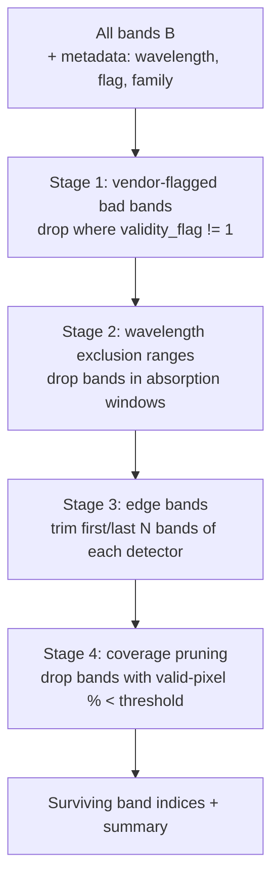
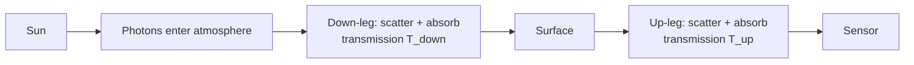

# 9. Spectral Band Filter

Hyperspectral cubes have bands that look like noise — the atmosphere is opaque at certain wavelengths because of water vapor, carbon dioxide, and oxygen absorption features. These bands carry no surface information and corrupt downstream models. The spectral band filter drops them.

The implementation lives in [`spectral_band_filter.py`](../../app/utils/data_transformations/spectral_band_filter.py).

---

## 9.1 What the code does

The filter applies four cascaded stages and returns the surviving band indices ([spectral_band_filter.py:105](../../app/utils/data_transformations/spectral_band_filter.py)):



### Stage 1: vendor-flagged bad bands

Drop bands whose `validity_flag != 1`. PRISMA explicitly publishes a per-band quality flag (good=1, bad=0). EnMAP encodes similar info in the XML. The vendor knows about manufacturing defects, dead detector elements, and known calibration failures; we trust their flag.

### Stage 2: wavelength exclusion ranges

Drop bands whose center wavelength falls within any caller-supplied range. The PRISMA defaults at [spectral_band_filter.py:22](../../app/utils/data_transformations/spectral_band_filter.py) target the strongest atmospheric absorption features:

| Range (nm)       | Absorber                                       |
|------------------|------------------------------------------------|
| (0, 450)         | Low SNR + detector noise (UV-blue cutoff)      |
| (912, 978)       | Water vapor                                    |
| (1131, 1152)     | Water vapor                                    |
| (1328, 1492)     | Deep water vapor (strong $H_2O$ absorption)    |
| (1784, 1967)     | Water vapor + $CO_2$                           |

These ranges are conservative and well-tested for PRISMA. EnMAP and AVIRIS-NG use slightly different ranges (the codebase configures them per sensor).

### Stage 3: edge bands

Drop the first and last `edge_bands_to_trim` bands of *each detector* (VNIR + SWIR) ([spectral_band_filter.py:82](../../app/utils/data_transformations/spectral_band_filter.py)). Edge bands have known noise from the spectral roll-off of the detector array — the spectral response function broadens at the array edges and the signal degrades.

A typical value is `edge_bands_to_trim=1`, which drops the lowest and highest band of each detector (4 bands total for a two-detector sensor).

### Stage 4: coverage-aware pruning

If a per-band valid-pixel-percentage list is supplied, drop bands whose coverage falls below `min_valid_pixel_pct` (default 20%) ([spectral_band_filter.py:128](../../app/utils/data_transformations/spectral_band_filter.py)). A band with 90% invalid pixels carries almost no usable information for the scene — better to drop it than gap-fill it from neighboring bands.

### Logging

A `.summary()` method reports counts per stage:

```text
SpectralBandFilter: 234 total → 6 dropped by flags,
                                42 dropped by wavelength,
                                4 dropped by edge trim,
                                3 dropped by coverage (<20%)
                                → 179 surviving
```

---

## 9.2 Theory in plain language

### Why atmospheric absorption ruins bands

Light from the sun travels through the atmosphere on the way down, hits the Earth's surface, reflects, and travels back up through the atmosphere to the sensor. Both legs of that journey are absorbed and scattered by gases in the atmosphere:

- **Water vapor** ($H_2O$) has strong absorption features at 940 nm, 1140 nm, 1380 nm, 1880 nm, and 2700 nm.
- **Carbon dioxide** ($CO_2$) absorbs around 2000–2080 nm.
- **Oxygen** ($O_2$) has narrow features at 762 nm and 688 nm.
- **Ozone** ($O_3$) absorbs broadly in the UV.

At the deepest absorption wavelengths (1380 nm and 1880 nm), the atmospheric transmission can drop to <5%. The sensor sees almost no surface light — most of what it records is stray light, scattered light from other wavelengths, and dark current. These bands carry **no surface information** and will pollute any model trained on them.

### The two-leg geometry



The total atmospheric transmission at wavelength $\lambda$ is $T_\text{down}(\lambda) \cdot T_\text{up}(\lambda)$. In strong absorption bands, both legs are near zero, and the product is essentially zero — the sensor's signal is dominated by noise sources, not surface reflectance.

### Why a conservative-to-aggressive cascade

The four stages are ordered by trust level:

1. **Vendor's flag (most trusted).** The vendor has the most information about the sensor's hardware state. If they say a band is bad, we believe them.
2. **Physics-based exclusion.** Absorption bands are well-known from atmospheric science. The ranges are conservative; they capture the strongly-absorbed wavelengths but err on the side of keeping borderline bands.
3. **Detector edges.** The roll-off at array edges is a well-documented hardware property. Trimming 1 or 2 bands at each edge is universally safe.
4. **Data-driven coverage check (most aggressive).** The data speaks for itself — if a band is overwhelmingly invalid in *this* scene, it is not usable *for this scene*, regardless of theory.

Cascading from most-trusted to most-data-driven minimizes the chance of over-pruning when the data is high-quality and the chance of under-pruning when the data is messy.

### Why drop bands instead of gap-filling them spectrally

The next stage of the pipeline (Section 10) is exactly spectral interpolation — filling missing voxels using neighboring valid voxels. So why not just mark these bands as invalid and let interpolation fill them?

Three reasons:

- **Interpolation needs valid neighbors.** A 50 nm wide absorption window can span 5–10 consecutive bands; the gap is too wide for stable interpolation.
- **The downstream model architecture has a fixed channel count.** If band 100 is interpolated and band 101 is real, the model treats them the same — but band 100 contains no real information. Better to drop it before resampling so the model never sees a fake channel.
- **Wavelength resampling needs valid endpoints.** Section 11's linear resampling computes each target wavelength as a weighted average of the two flanking source bands. If both flanking source bands are atmospheric junk, the target inherits that junk.

Dropping bands removes the problem before interpolation. The remaining valid bands give interpolation a clean playing field.

---

## 9.3 Worked numerical example

For a typical PRISMA scene with 234 native bands (66 VNIR + 168 SWIR-ish after dedup):

```text
SpectralBandFilter: 234 total
  - Stage 1: 6 dropped by vendor flags
  - Stage 2: 42 dropped by wavelength (mostly in 1328–1492 and 1784–1967 nm)
  - Stage 3: 4 dropped by edge trim (first/last 1 of VNIR + first/last 1 of SWIR)
  - Stage 4: 3 dropped by coverage (<20% valid)
  Total: 234 - 6 - 42 - 4 - 3 = 179 surviving
```

The 6 flagged are the vendor's explicit bad bands; the 42 wavelength drops are concentrated in the two deep water-vapor windows; the 4 edge bands are the first/last 1 of VNIR (around 400 nm and 1010 nm) and SWIR (around 920 nm and 2500 nm); the 3 coverage drops are bands at the very SWIR edge that suffer detector roll-off.

### A second variation: cloud-heavy scene

A scene with heavy cloud cover has many invalid pixels even at clean wavelengths. The coverage stage will drop more bands:

```text
SpectralBandFilter: 234 total
  - Stage 1: 6 dropped
  - Stage 2: 42 dropped
  - Stage 3: 4 dropped
  - Stage 4: 18 dropped (coverage <20% over heavy cloud)
  Total: 164 surviving
```

The coverage stage is the only one that varies scene-to-scene. The first three are deterministic given the sensor and config.

---

## 9.4 Knobs and defaults

| Parameter                  | Default                              | Meaning                                              |
|----------------------------|--------------------------------------|------------------------------------------------------|
| `wavelength_exclusion_ranges` | sensor-specific PRISMA defaults    | List of $(\lambda_\text{min}, \lambda_\text{max})$ tuples |
| `edge_bands_to_trim`       | 1                                    | Per-detector edge trim                              |
| `min_valid_pixel_pct`      | 20.0                                 | Stage 4 coverage threshold                          |
| `use_vendor_flag`          | True                                 | Whether to apply stage 1                            |
| `use_coverage_check`       | True if coverage list supplied       | Whether to apply stage 4                            |

A caller that wants to keep absorption bands (for atmospheric correction research, say) can pass an empty exclusion list and effectively disable stage 2.

---

## 9.5 Why this stage is configurable per sensor

Different sensors:

- Have different vendor-flag conventions.
- Have different detector splits.
- Are calibrated through different atmospheric corrections, so different absorption bands matter.

The filter takes its configuration from the `BandFilterConfig` Pydantic model. PRISMA, EnMAP, and AVIRIS-NG each ship with a defaults factory. This is the only stage of the pipeline where sensor differences leak into a "shared" component — the architectural compromise is justified by the per-sensor knowledge required to choose the exclusion ranges correctly.
