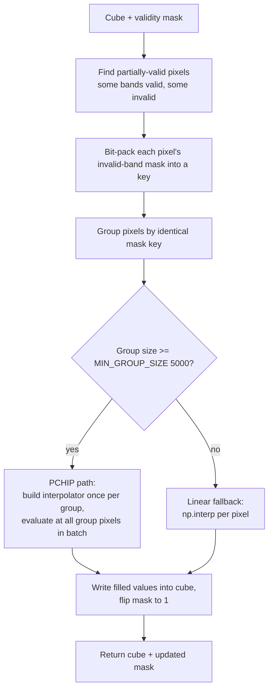
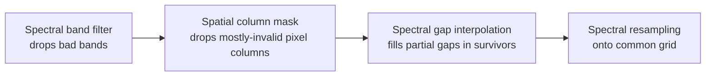

# 10. Spectral Gap Interpolation

After the band filter (Section 9) drops whole bands, individual pixels can still be invalid in *some* surviving bands and valid in others. The spectral interpolator fills those gaps along the spectral axis using the valid spectrum at the same pixel.

The implementation lives in [`spectral_interpolator.py`](../../app/utils/data_transformations/spectral_interpolator.py).

---

## 10.1 What the code does



### Path 1: PCHIP for large pattern groups

PCHIP stands for Piecewise Cubic Hermite Interpolating Polynomial — a shape-preserving spline that never overshoots. Implemented at [spectral_interpolator.py:29](../../app/utils/data_transformations/spectral_interpolator.py).

For each group whose size ≥ `MIN_GROUP_SIZE = 5000` ([spectral_interpolator.py:64](../../app/utils/data_transformations/spectral_interpolator.py)):

1. Build PCHIP on `(valid wavelengths, valid spectra)` with `extrapolate=False` so out-of-domain queries return `NaN` ([spectral_interpolator.py:81](../../app/utils/data_transformations/spectral_interpolator.py)).
2. Evaluate at the invalid wavelengths.
3. Replace `NaN` (edge bands below or above the valid range) with **constant extrapolation** — clamp to the nearest valid endpoint ([spectral_interpolator.py:85](../../app/utils/data_transformations/spectral_interpolator.py)).
4. Write filled values into the cube and flip the validity mask to 1.

### Path 2: linear fallback

For pixels whose mask pattern doesn't group with ≥ 5000 others, use `np.interp` — fast C-accelerated linear interpolation with built-in constant edge extrapolation ([spectral_interpolator.py:108](../../app/utils/data_transformations/spectral_interpolator.py)).

### Sort prerequisite

Both paths require ascending wavelength order. Sorting is done once at setup; both PCHIP and `np.interp` are then free of the sort cost.

---

## 10.2 Theory in plain language

### Why PCHIP and not natural cubic spline

A natural cubic spline minimizes total curvature globally, which means it can swing wildly past sharp features — "ringing" or overshoot. Hyperspectral reflectance has narrow absorption features (the red-edge at 700 nm, water absorption at 950 nm, chlorophyll edges) where a natural spline would ring above 1 or below 0, producing unphysical reflectance.

**PCHIP** is shape-preserving: within each interval between known data points, the interpolated value cannot exceed the bracket of the endpoints. If the two endpoints are 0.15 and 0.30, PCHIP guarantees the interpolant stays in $[0.15, 0.30]$.

### PCHIP from first principles

The acronym already names every ingredient — **P**iecewise **C**ubic **H**ermite **I**nterpolating **P**olynomial — but each of those words is doing real work. We'll unpack them in order.

**Interpolation, polynomial, piecewise.** Given a handful of known data points $(x_0, y_0), (x_1, y_1), \dots, (x_n, y_n)$, an *interpolant* is any continuous function $f$ such that $f(x_i) = y_i$ at every known point. Polynomial interpolation chooses $f$ to be a polynomial. The naïve approach is one global polynomial of degree $n$ that passes through all $n+1$ points — but high-degree polynomials are famously badly behaved (Runge's phenomenon: a single tenth-degree polynomial can oscillate wildly between data points even when the data themselves are tame). *Piecewise* interpolation sidesteps this by fitting a separate low-degree polynomial in each interval $[x_i, x_{i+1}]$, then stitching them together. PCHIP uses a cubic — degree 3 — in each interval, hence "piecewise cubic".

**What is a secant?** Between any two adjacent data points $(x_i, y_i)$ and $(x_{i+1}, y_{i+1})$ you can draw a straight line — the **secant line** — and its slope is the **secant slope**:

$$s_i \;=\; \frac{y_{i+1} - y_i}{x_{i+1} - x_i}$$

It is the average rate of change of $y$ across that interval. It is what linear interpolation would use as its derivative everywhere inside the interval. Secant slopes are the fundamental local measurements that PCHIP combines to decide how the smooth curve should behave.

**What is a Hermite cubic?** A general cubic polynomial has four coefficients ($a, b, c, d$ in $ax^3 + bx^2 + cx + d$), which means it needs four constraints to be pinned down uniquely. There are two natural ways to choose those constraints:

- **Lagrange form** — pass through four known $(x, y)$ values. This is what a global cubic spline does at each interval, with two extra constraints stitched in from neighbouring intervals.
- **Hermite form** — pass through two known endpoint values *and* match two known endpoint derivatives. This is what PCHIP does.

Within a single interval $[x_i, x_{i+1}]$, a **Hermite cubic** is the unique cubic polynomial $H(x)$ that satisfies all four of:

$$H(x_i) = y_i, \quad H(x_{i+1}) = y_{i+1}, \quad H'(x_i) = d_i, \quad H'(x_{i+1}) = d_{i+1}$$

where $d_i$ and $d_{i+1}$ are derivatives we supply by some rule. The polynomial can be written compactly in terms of four cubic *Hermite basis functions* $h_{00}, h_{10}, h_{01}, h_{11}$ (each is a fixed cubic on the unit interval $[0,1]$), but the algebraic detail is not what matters here — what matters is the geometric picture: the curve is anchored to two points with fixed values, and the curve's tangent line at each point is also fixed. The shape between the two points then follows uniquely.

This gives you a smooth $C^1$ curve overall (continuous values *and* continuous first derivatives at every knot), because if both Hermite cubics on either side of $x_i$ are told to have value $y_i$ and slope $d_i$ at $x_i$, they automatically match up smoothly there.

**Why the derivatives are the only real choice.** Endpoint values $y_i$ are given by the data. So the only freedom in constructing the Hermite cubic for an interval is the choice of the two endpoint derivatives $d_i$ and $d_{i+1}$. Different interpolation methods are, at heart, different rules for choosing those derivatives:

- A **natural cubic spline** picks derivatives by solving a global linear system that minimises total curvature. This produces the smoothest curve overall, but the global coupling means a local feature (like a sharp red-edge) can cause the spline to overshoot far away from where the feature actually lives.
- **PCHIP** picks derivatives by a purely *local* rule based only on the two secant slopes adjacent to each knot. This sacrifices some smoothness (the second derivative is generally not continuous at the knots) in exchange for a guarantee: the curve will never overshoot the data.

**The PCHIP derivative rule.** At an interior knot $x_i$, let $s_{i-1}$ be the secant slope of the interval immediately to its left and $s_i$ the secant slope of the interval immediately to its right. PCHIP sets the derivative at $x_i$ as:

$$d_i = \begin{cases} 0 & \text{if } \operatorname{sign}(s_{i-1}) \neq \operatorname{sign}(s_i) \quad \text{(or either is zero)} \\[4pt] \dfrac{s_{i-1}\,s_i}{w_1\,s_{i-1} + w_2\,s_i} & \text{otherwise} \end{cases}$$

with weights $w_1 = \tfrac{2 h_i + h_{i-1}}{3(h_{i-1} + h_i)}$ and $w_2 = \tfrac{h_i + 2 h_{i-1}}{3(h_{i-1} + h_i)}$, where $h_i = x_{i+1} - x_i$ is the width of the interval to the right of $x_i$. The non-zero branch is a *weighted harmonic mean* of the two adjacent secant slopes.

Two things make this rule the heart of PCHIP:

1. **The sign-disagreement zeroing.** If $s_{i-1}$ and $s_i$ have opposite signs, the knot $x_i$ is a local maximum or minimum of the data — the data went up on the left and is going down on the right (or vice versa). Setting $d_i = 0$ forces the curve to be horizontal at that knot, which prevents the curve from continuing past the data point in either direction. This is the algebraic mechanism that guarantees the curve "respects" local extrema and cannot overshoot them.

2. **Harmonic, not arithmetic, mean.** The arithmetic mean of two slopes is biased by whichever is larger in absolute value. The harmonic mean, in contrast, is dominated by whichever is *smaller*. If one of the adjacent secants is nearly flat ($s \approx 0$), the harmonic mean pulls the derivative toward zero too — which is again exactly what you want to avoid overshoot when the data is about to plateau. The arithmetic mean would let the curve charge through the plateau and bounce.

**Endpoint handling.** The rule above is for *interior* knots — knots with a secant on each side. At the very first knot $x_0$ and the very last knot $x_n$ there is only one adjacent secant, so PCHIP defaults to using that secant's slope directly (with a small one-sided correction in the SciPy implementation to avoid creating an artificial extremum at the boundary).

**The shape-preservation guarantee.** Putting it all together: at every knot $d_i$ is either zero (at a local extremum) or has the same sign as both neighbouring secants and a magnitude bounded by their harmonic mean. A short calculation in the Hermite-cubic algebra shows that these properties imply, within every interval $[x_i, x_{i+1}]$, the curve $H(x)$ stays inside the closed bracket $[\min(y_i, y_{i+1}), \max(y_i, y_{i+1})]$. No overshoot, no ringing, no negative reflectance. The smoothness loss (second derivative discontinuous at the knots) is invisible to the eye and irrelevant to a downstream conv-net, but the shape guarantee is what makes PCHIP safe for spectra.

The accompanying figure ([images/pchip_shape_preservation.png](../images/pchip_shape_preservation.png)) shows exactly the scenario this rule was built for: a sharp red-edge jump where a natural cubic spline rings into negative reflectance, while PCHIP stays inside the bracket.

### Why constant edge extrapolation

If a pixel's only valid bands are 700–900 nm and we need to fill bands 500–650 nm, we are *extrapolating*, not interpolating. Cubic extrapolation is wildly unreliable — it can produce arbitrary values.

The codebase clips extrapolations to the nearest valid endpoint:

$$\rho_\text{filled}(\lambda) = \begin{cases} \rho(\lambda_\text{min valid}) & \text{if } \lambda < \lambda_\text{min valid} \\ \rho(\lambda_\text{max valid}) & \text{if } \lambda > \lambda_\text{max valid} \end{cases}$$

This is the most conservative choice. The filled value is not "correct" — there is no way to know what reflectance the surface had at the extrapolated wavelength — but it is at least *plausible* and *bounded*, so downstream models do not receive nonsense.

### Why the 5000-pixel grouping threshold

Setting up a `PchipInterpolator` has fixed cost: it sorts knots, computes slopes, and builds an internal table. The setup cost is on the order of a few hundred microseconds per call.

For a group of 50 pixels, that setup cost is the same. Per-pixel, that's many microseconds — worse than just running `np.interp` 50 times (which costs a few microseconds per call with no setup).

For a group of 50,000 pixels, the PCHIP setup cost is amortized over 50,000 evaluations. Per-pixel, it becomes negligible, and PCHIP's higher quality wins.

The break-even point depends on hardware, but 5000 is a safe round number that the codebase picked based on benchmarking.

### Why pattern-grouping is the speed unlock

In a typical scene, a few invalid-band patterns dominate. For example:

- "VNIR bands 0–5 invalid because of low-SNR cutoff" is shared by every pixel in the scene (10⁶ pixels).
- "SWIR bands 80–85 invalid because of cloud edge" is shared by a few thousand pixels.
- "Bands 12, 45, 78 invalid because of random saturation" might be unique to one pixel.

Grouping by mask pattern turns:

- N independent PCHIP fits (one per pixel) — too slow.
- 3–10 group-vectorized PCHIP fits — fast.

The bit-packing of the mask into a single integer key is just a fast hashable representation. Two pixels with the same key have identical invalid-band patterns and can share an interpolator.

---

## 10.3 Worked numerical example

A single partially-valid pixel:

```text
wavelengths (nm): [500, 600, 700, 800, 900, 1000, 1100, 1200]
valid mask:       [  1,   1,   0,   1,   1,    0,    1,    1]
reflectance:      [0.10, 0.15,  ?, 0.30, 0.35,    ?, 0.45, 0.50]
```

PCHIP fits a shape-preserving cubic through the five valid knots:

```text
(500, 0.10), (600, 0.15), (800, 0.30), (900, 0.35), (1100, 0.45), (1200, 0.50)
```

and queries at 700 nm and 1000 nm:

```text
ρ(700)  ≈ 0.225      # between 0.15 and 0.30, no overshoot
ρ(1000) ≈ 0.400      # between 0.35 and 0.45, no overshoot
```

Linear interpolation at the same points would give:

```text
ρ(700)  = (0.15 + 0.30) / 2 = 0.225
ρ(1000) = (0.35 + 0.45) / 2 = 0.400
```

— in this smooth-spectrum example the two methods agree. PCHIP's value over linear shows up when the surrounding samples are not equally spaced or curve sharply.

### A second variation: invalid at band 0 (extrapolation)

```text
valid mask:    [0,    1,    1,    1, ...]
reflectance:   [ ?, 0.15, 0.18, 0.20, ...]
```

PCHIP cannot reliably extrapolate below 600 nm, so:

```text
filled[0] = 0.15      # constant extrapolation, NOT extrapolated cubic
```

The first valid value is reused as-is.

### A third variation: sharp absorption feature

Suppose a pixel has a real chlorophyll red-edge feature at 700 nm:

```text
wavelengths (nm): [500, 600, 650, 700, 750, 800, 850, 900]
valid mask:       [  1,   1,   1,   0,   1,   1,   1,   1]
reflectance:      [0.04, 0.05, 0.06,  ?, 0.40, 0.42, 0.43, 0.44]
```

The 650→750 nm jump is from 0.06 to 0.40 — a steep red-edge. PCHIP fills 700 nm at approximately 0.23 (close to the geometric midpoint, shape-preserved).

A natural cubic spline might fill 700 nm at -0.05 (undershoot) or 0.55 (overshoot), neither of which is physical. PCHIP's monotonicity-preserving construction prevents both.

---

## 10.4 Knobs and defaults

| Parameter        | Default | Meaning                                                   |
|------------------|---------|-----------------------------------------------------------|
| `MIN_GROUP_SIZE` | 5000    | Group size below which fallback to `np.interp`            |
| `extrapolate`    | False   | Outside-domain queries return NaN, then clamped to endpoint |
| Sort wavelengths | True    | One-time setup; both paths assume ascending wavelengths   |

The interpolator is fairly opinionated — it does not expose method choice (PCHIP vs natural spline) as a knob. The PCHIP choice is baked in because hyperspectral spectra reliably benefit from shape preservation.

---

## 10.5 What if a pixel is invalid in *all* bands?

The interpolator skips fully-invalid pixels entirely. They are left as-is in the cube (still flagged invalid in the mask). Downstream stages — spectral resampling, spatial column masking — are responsible for handling fully-invalid pixels.

The spatial column masking step in `PrismaDatasetBuilder` happens *before* spectral interpolation and removes pixel columns that are mostly-invalid. By the time the interpolator runs, fully-invalid pixels are rare — they would have been spatially masked already.

---

## 10.6 Where it sits in the pipeline



The interpolator assumes the cube has already been pruned (Section 9) and that fully-invalid pixels have been removed (the spatial column mask step). Its job is just to clean up the remaining partial gaps so that the resampler has fully-filled spectra to work with.
