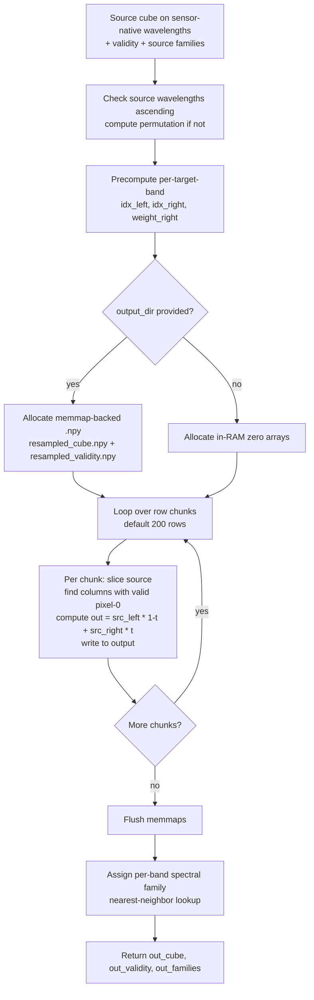
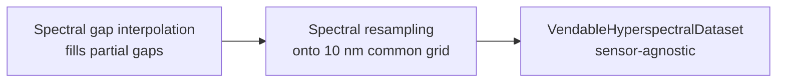

# 11. Spectral Resampling to a Common Grid

Different hyperspectral sensors sample the spectrum at different wavelengths. PRISMA's VNIR center wavelengths are not at multiples of 10 nm; AVIRIS-NG's 5 nm spacing differs from EnMAP's 6.5–10 nm spacing. To train a single foundation model across sensors, every sensor must produce **identical tensor shapes** with **identical wavelength semantics in each channel**. This stage makes that happen.

The implementation lives in [`spectral_resampler.py`](../../app/utils/data_transformations/spectral_resampler.py).

---

## 11.1 What the code does



### Step-by-step

1. **Source wavelength monotonicity check** at [spectral_resampler.py:111](../../app/utils/data_transformations/spectral_resampler.py). If the source wavelengths are already strictly ascending (PRISMA, EnMAP, AVIRIS-NG post-band-filter all are), no sort is needed. Otherwise compute a permutation and apply it per chunk — cheaper than copying the whole cube.

2. **Precompute per-target-band interpolation indices and weights** at [spectral_resampler.py:124](../../app/utils/data_transformations/spectral_resampler.py)–[spectral_resampler.py:140](../../app/utils/data_transformations/spectral_resampler.py). For each target wavelength $\lambda_t$:
   - `right = searchsorted(src, λ_t, side="right")`, clamped to $C_\text{src} - 1$.
   - `left = right - 1`, clamped to 0.
   - `weight_right = (λ_t - src[left]) / (src[right] - src[left])`.

   These three small per-target-band arrays are scene-independent and tiny — one int + one float per target band. They are computed once and reused for the entire scene.

3. **Allocate the output**. If `output_dir` is provided ([spectral_resampler.py:197](../../app/utils/data_transformations/spectral_resampler.py)), allocate as memmap-backed `.npy` files (`resampled_cube.npy` and `resampled_validity.npy`) so AVIRIS-NG-scale scenes do not blow up RAM. Otherwise allocate plain zero-initialized arrays.

4. **Process the scene in row-chunks** (default 200 rows) at [spectral_resampler.py:153](../../app/utils/data_transformations/spectral_resampler.py). For each chunk:
   - Slice 200 rows out of the (possibly memmap) source cube.
   - Find columns whose pixel-0 (any single band can stand in here, since gap-fill ran earlier and every valid pixel is now valid in every band) is valid.
   - For each target band, compute `out = src[left] * (1 - t) + src[right] * t` at [spectral_resampler.py:282](../../app/utils/data_transformations/spectral_resampler.py).
   - Write the result into the chunk's slice of the output cube.

5. **Flush memmaps** at [spectral_resampler.py:168](../../app/utils/data_transformations/spectral_resampler.py) after all chunks. Triggers OS write-through to disk.

6. **Assign per-band spectral family** by nearest-neighbor lookup from the source families at [spectral_resampler.py:300](../../app/utils/data_transformations/spectral_resampler.py). Each target wavelength inherits its family from the closest source wavelength.

---

## 11.2 Theory in plain language

### Why a common grid

The training pipeline emits batches of shape `(B, C, H, W)` where $C$ is the number of spectral channels. The foundation model has fixed-size input channels — once you train a model with $C=196$, you cannot feed it a cube with $C=234$ without retraining or wasting parameters.

A common 10 nm grid from 450 to 2400 nm gives $C_\text{tgt} = 196$ channels, regardless of which sensor produced the data. Every sensor's `vend_dataset` ends with a resampling step onto this grid. The trainer sees identical tensors regardless of provenance.

Why 10 nm? It's:

- Coarser than the densest sensors (AVIRIS-NG at 5 nm), so the interpolation never has to *upsample* — there are always enough source bands per target.
- Finer than the loosest sensors (PRISMA SWIR ranges up to 12 nm spacing), so the target grid doesn't miss spectral features the sensors can resolve.

### Why linear interpolation, not PCHIP

The gap interpolator (Section 10) used PCHIP for shape preservation. Here we use linear. Two reasons:

1. **The native bands are densely sampled** relative to the target. A given target band sits between two source bands that are at most 12 nm apart, so the interpolant barely moves. PCHIP's shape-preserving advantage is meaningful when interpolating over wide gaps; over a 12 nm gap it gives almost identical results to linear.

2. **PCHIP needs a `(C_src, n_valid)` work buffer** per pixel to fit the spline. Linear is a single broadcast multiply. The memory savings are substantial at scene scale: for AVIRIS-NG with $C_\text{src} = 425$ and 200 rows × 600 columns, PCHIP would need ~200 MB of work buffer per chunk; linear needs essentially none.

### Why precompute `(left, right, weight)` once

The interpolation indices and weights depend only on the source and target wavelength grids — not on the pixel data. Computing them once and reusing them across all $H \cdot W$ pixels avoids redoing `searchsorted` calls in the hot loop.

This is a classic instance of moving work out of the inner loop. For a 1000×1000 scene, `searchsorted` would otherwise be called $1000 \cdot 1000 \cdot C_\text{tgt} = 196 \cdot 10^6$ times. With precomputation, it's called $C_\text{tgt} = 196$ times. Six orders of magnitude saved.

### Why row chunking

Two reasons:

1. **Memory bound for large scenes**. AVIRIS-NG flightlines can be 5000 rows × 600 cols × 425 bands × 4 bytes ≈ 5 GB. Holding the whole source cube and output cube in RAM simultaneously is not viable. Processing 200 rows at a time keeps peak RAM bounded.

2. **Memmap-friendly access pattern**. When the source cube is a memmap, reading 200 consecutive rows triggers a small number of large disk reads. Random access patterns would trigger thrashing.

The 200-row default is calibrated to fit comfortably in the L3 cache for a typical 256-channel cube — enough to amortize the per-chunk setup, small enough to fit in cache and avoid expensive cache misses.

### Why nearest-neighbor for spectral family assignment

The target grid is just a list of wavelengths — it has no inherent notion of "this one is VNIR, this one is SWIR." But the downstream classical detectors (MNF, RX, etc.) sometimes operate on just one family. So we need to label each target band.

Nearest-neighbor lookup from the source families is the simplest reliable rule: each target wavelength inherits the family of the nearest source wavelength. For a sensor with a clean VNIR/SWIR split (say, 950 nm and below = VNIR), every target wavelength ≤ 945 nm will find its nearest source in VNIR; every target ≥ 955 nm will find its nearest in SWIR. The boundary may sit at one specific source band, but that's deterministic and reproducible.

---

## 11.3 Worked numerical example

Source bands at PRISMA-typical wavelengths $[497.3, 506.1, 514.9, 523.7]$ nm, target grid $[500, 510, 520]$ nm.

### Precomputed indices and weights

For target wavelength 500 nm:

```text
searchsorted(src, 500, side="right") = 1   # first src > 500 is index 1 (506.1)
right = 1, left = 0
weight_right = (500 - 497.3) / (506.1 - 497.3) = 2.7 / 8.8 = 0.307
```

For target 510 nm:

```text
right = 2 (514.9), left = 1 (506.1)
weight_right = (510 - 506.1) / (514.9 - 506.1) = 3.9 / 8.8 = 0.443
```

For target 520 nm:

```text
right = 3 (523.7), left = 2 (514.9)
weight_right = (520 - 514.9) / (523.7 - 514.9) = 5.1 / 8.8 = 0.580
```

### Per-pixel evaluation

Given a source spectrum at one pixel:

```text
src = [0.120, 0.130, 0.150, 0.165]
```

The resampled spectrum at $[500, 510, 520]$ is:

```text
ρ(500) = 0.120 · (1 - 0.307) + 0.130 · 0.307 = 0.0832 + 0.0399 = 0.123
ρ(510) = 0.130 · (1 - 0.443) + 0.150 · 0.443 = 0.0724 + 0.0664 = 0.139
ρ(520) = 0.150 · (1 - 0.580) + 0.165 · 0.580 = 0.0630 + 0.0957 = 0.159
```

After resampling, all sensors carry a `(C_tgt, H, W)` cube with $C_\text{tgt} = 196$ for the canonical 450–2400 nm @ 10 nm grid. Patch generators and foundation models consume this without sensor-specific logic.

### A second variation: edge case at the source boundary

Suppose the target grid asks for 525 nm, which is just past the last source band at 523.7 nm:

```text
searchsorted(src, 525, side="right") = 4
right = min(4, 4-1) = 3   # clamped
left = 3 - 1 = 2
weight_right = (525 - 514.9) / (523.7 - 514.9) = 10.1 / 8.8 = 1.148
```

Note that `weight_right > 1` — we're extrapolating. The codebase does not catch this case specially; the linear extrapolation just produces:

```text
ρ(525) = 0.150 · (1 - 1.148) + 0.165 · 1.148 = -0.0222 + 0.1894 = 0.167
```

That's only slightly above the boundary value, because the slope between bands 2 and 3 is small. For modest extrapolation distances (here, 1.3 nm past the last source band) the linear extrapolation is harmless. Larger extrapolations would be flagged upstream by the band filter (target wavelengths outside the source range would typically be excluded).

In practice, the band filter ensures the source range comfortably brackets the target range; this edge case rarely fires.

---

## 11.4 Knobs and defaults

| Parameter         | Default | Meaning                                                            |
|-------------------|---------|--------------------------------------------------------------------|
| `target_wavelengths` | 450..2400 nm @ 10 nm | The common grid                                            |
| `output_dir`      | None    | If set, allocate memmap-backed outputs                            |
| `chunk_rows`      | 200     | Row-chunk size for streaming                                       |
| Source sort       | auto    | Skipped if already ascending                                       |

### Memory cost in practice

For a typical PRISMA scene (1000 rows × 1000 cols × 234 source bands → 196 target bands):

- Source cube: 1000 × 1000 × 234 × 4 = 936 MB
- Target cube: 1000 × 1000 × 196 × 4 = 784 MB
- Source chunk (200 rows): 200 × 1000 × 234 × 4 = 187 MB
- Working buffer: ~50 MB

In-RAM mode peaks at ~1.7 GB (source + target). Memmap mode peaks at ~250 MB (chunk + working buffer) — three times less.

For AVIRIS-NG with 5000 rows × 600 cols × 425 source bands:

- Full source cube: ~5 GB
- Memmap mode peaks at ~200 MB working set

The memmap mode is essential for AVIRIS-NG; for PRISMA it's optional.

---

## 11.5 Where it sits



This is the final transformation in the hyperspectral pipeline. Everything downstream — patch generators, foundation models, classical detectors, the API spectrum endpoint — operates on the common-grid output.

The thermal pipeline (Landsat, HotSat) skips this stage entirely, because there is only one band to resample and "common-grid" is meaningless.

---

## 11.6 Why this is the contract boundary

After spectral resampling, every sensor's data has:

- The same number of channels.
- The same wavelength assigned to channel $c$, for every $c$.
- The same spectral family label per channel.
- The same dtype (`float32`).
- The same layout (BSQ).

The `VendableHyperspectralDataset` carries this uniformity as a hard invariant. Whether the original scene was an HE5, a folder of GeoTIFFs, or a 6 GB memmap, by this point it looks the same to a patch generator, foundation model, or anomaly detector. That uniformity is the entire point of the pipeline.
