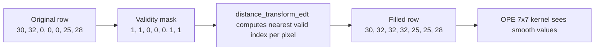
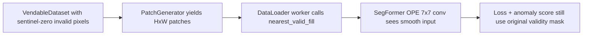

# 12. Nearest-Valid Pixel Fill

This is the only spatial (as opposed to spectral) fill operation in the pipeline. It runs at inference time inside the DataLoader for the SegFormer-based foundation models, not inside `vend_dataset`. Its purpose is narrow: replace every invalid pixel with the value of its nearest valid neighbor in image-plane distance, so that the SegFormer's convolutional input embedding does not see a "cliff" at validity boundaries.

The implementation lives in [`nearest_valid_fill.py`](../../app/utils/pixel_fill/nearest_valid_fill.py).

---

## 12.1 What the code does

```mermaid
flowchart TD
    A[Pixel array C,H,W + validity mask H,W] --> B[distance_transform_edt mask==0 return_indices=True]
    B --> C[Indices: for each pixel,<br/>row+col of nearest valid neighbor]
    C --> D[For each channel c:<br/>filled[c] = pixels[c][indices[0], indices[1]]]
    D --> E[Return filled cube<br/>+ unchanged validity mask]
```

### Step-by-step

1. **`scipy.ndimage.distance_transform_edt(mask == 0, return_indices=True)`** at [nearest_valid_fill.py:81](../../app/utils/pixel_fill/nearest_valid_fill.py).

   This returns, for each pixel, the `(row, col)` of its nearest valid neighbor in Euclidean (image-plane) distance.

2. **For each channel, do a fancy-index lookup** at [nearest_valid_fill.py:94](../../app/utils/pixel_fill/nearest_valid_fill.py):

   ```python
   filled[c] = pixels[c][indices[0], indices[1]]
   ```

   This is a vectorized gather — every output pixel pulls its value from the corresponding nearest-valid-neighbor location in the same channel.

3. **Validity mask is returned unchanged.** Filled pixels are still flagged invalid in the mask — the loss function during training and the anomaly score during inference will still exclude them. Only the *input* to the model's convolutional embedding sees the filled values.

Valid pixels are guaranteed unchanged: their nearest valid neighbor is themselves, distance = 0.

---

## 12.2 Theory in plain language

### Why this fill exists at all

The fill exists for a very specific architectural reason — the SegFormer foundation model's **Overlap Patch Embedding (OPE)** uses a 7×7 convolutional kernel at the input. The kernel computes a weighted sum over a 7×7 neighborhood for every spatial location it covers.

When the kernel straddles a valid/invalid boundary, it computes a weighted sum that mixes real thermal/reflectance values with the sentinel zeros stored at invalid pixels. After model-level normalization the zeros sit at roughly $-2.3$ (because the dataset mean is roughly 30 °C and std is roughly 13 °C, so $0$ maps to $(0 - 30) / 13 \approx -2.3$). Valid values, post-normalization, lie in $[-0.7, +1.7]$.

So the kernel sees a "thermal cliff" — values jumping from around 0 (normalized valid) to around $-2.3$ (normalized invalid) over one pixel. The convolution output at that location is dominated by the cliff. Attention layers then broadcast that contamination across the entire image. The model's reconstruction error spikes along every validity boundary.

When you score anomalies by reconstruction error, these boundary spikes **dominate the anomaly ranking** — the model's most "anomalous" pixels are just artifacts of how invalid pixels were encoded.

### What the fill does

Nearest-valid fill replaces the cliff with a smooth continuation. The kernel sees `(30, 30, 30, 32, 25, 25, 28)` instead of `(30, 30, 0, 0, 0, 25, 28)`. The OPE output is now a clean local average instead of a cliff-dominated artifact.



The validity mask is preserved so the *loss* and *anomaly score* still exclude filled pixels — only the *input* to the convolutional kernel changes.

### Why nearest-valid and not zero-fill or mean-fill

Three options compared:

| Strategy             | What the kernel sees at the boundary           | Boundary artifact risk |
|----------------------|------------------------------------------------|------------------------|
| Zero-fill (raw)      | Real values next to large negatives            | Severe                 |
| Mean-fill            | Real values next to dataset mean (~30 °C)      | Mild — only near scenes far from the dataset mean |
| Nearest-valid fill   | Real values next to nearby real values         | Negligible             |

Nearest-valid is the smoothest — it specifically chooses a value that *the surface itself* produces, just a few pixels away. The kernel can't tell the filled values from the neighbors.

### Why Euclidean distance, not Manhattan or Chebyshev

`distance_transform_edt` ("EDT" = Exact Euclidean Distance Transform) computes the true Euclidean distance. Manhattan or Chebyshev would be faster but less geometrically correct — they would produce diamond- or square-shaped boundaries where the fill source switches, instead of the smooth circular boundaries of Euclidean.

For nearest-neighbor fill, Euclidean's geometric correctness is worth the tiny extra cost. `distance_transform_edt` is implemented in C via SciPy and is sub-millisecond for a 1024×1024 image on CPU.

### Why CPU, not GPU

The fill runs inside DataLoader workers, which are CPU processes feeding batches into the GPU trainer. Each worker handles a few patches at a time. Moving the fill to GPU would require:

- Allocating GPU memory for the operation.
- Transferring data CPU → GPU → CPU (the resulting batch lives on CPU until the trainer pulls it).
- Synchronizing.

For sub-millisecond CPU operations, the GPU round-trip is pure overhead. The fill stays CPU.

---

## 12.3 Worked numerical example

A 1-D row with a single channel:

```text
pixels = [30, 32,  0,  0,  0, 25, 28]
mask   = [ 1,  1,  0,  0,  0,  1,  1]
```

Compute distances to nearest valid (= where mask==1):

```text
position 0: dist 0 (self)
position 1: dist 0 (self)
position 2: dist 1 (left → position 1)
position 3: dist 2 (tied: left=position 1 or right=position 5; scipy picks one deterministically — typically the smaller-index neighbor)
position 4: dist 1 (right → position 5)
position 5: dist 0 (self)
position 6: dist 0 (self)
```

Indices column (the nearest valid index per position):

```text
[0, 1, 1, 1, 5, 5, 6]
```

Apply the gather:

```text
filled[c] = pixels[c][[0, 1, 1, 1, 5, 5, 6]]
         = [30, 32, 32, 32, 25, 25, 28]
```

The OPE now sees a smooth `32 → 32 → 32 → 25 → 25` transition instead of `32 → 0 → 0 → 0 → 25` — no thermal cliff, no contaminated tokens, no boundary artifact in the residual map.

### A second variation: 2-D case

A 5×5 patch with an invalid quadrant:

```text
pixels (one channel):       mask:
[30 32 28 31 33]           [1 1 1 1 1]
[31 30 29 32 34]           [1 1 1 1 1]
[29 31  0  0  0]           [1 1 0 0 0]
[30 32  0  0  0]           [1 1 0 0 0]
[28 30  0  0  0]           [1 1 0 0 0]
```

The 3×3 invalid block in the bottom-right has nearest valid neighbors:

- Bottom-right cell (4,4) nearest valid: (4,1) at distance √(9+0) = 3.0? No, (2,4) is distance √(4+0)=2.0, (4,1) is distance 3.0. So nearest is (2,4) with value 33.
- Wait — `distance_transform_edt(mask==0)` works on the *inverted* mask. So we compute distance from each "invalid pixel" to the nearest "valid pixel." Let me redo more carefully.

For cell (3,3):
- Distance to (3,1) is √(0+4) = 2.0
- Distance to (1,3) is √(4+0) = 2.0
- Tie — scipy picks deterministically (typically smaller-index dimension first).

For cell (4,4):
- Distance to (4,1) is 3.0
- Distance to (2,4) is 2.0
- Nearest is (2,4) with value 33.

The filled cube replaces each invalid pixel with the value at its nearest valid index. The 3×3 invalid block ends up filled with values "leaking in" from the surrounding valid border — exactly what we want the OPE kernel to see.

---

## 12.4 Knobs and defaults

| Parameter   | Default | Meaning                                                          |
|-------------|---------|------------------------------------------------------------------|
| mask        | required | Boolean (1=valid, 0=invalid) HxW                                |
| pixels      | required | (C, H, W) source cube                                            |
| Tie-breaking | scipy default | Deterministic but unspecified preference between equidistant valid neighbors |

There is no user-tunable knob in this function. It is intentionally minimal — one parameter-free operation.

---

## 12.5 Performance

`distance_transform_edt` is an exact $O(H \cdot W)$ algorithm (Felzenszwalb–Huttenlocher 2004). For a typical 1024×1024 thermal patch:

- The call is sub-millisecond on CPU.
- It runs inside DataLoader workers with no GPU dependency.
- For batched 2048×2048 patches, still a few milliseconds.

The per-channel gather is also fast — a single fancy-index pull from the `(C, H, W)` source with shape-matched index arrays. NumPy handles this in C with no Python-level loop.

Total cost for a typical thermal patch: ~2 ms across all channels.

---

## 12.6 Why this is not part of `vend_dataset`

The fill is conceptually a **model-input preprocessing** step, not a **data engineering** step. The vendable carries the *true* pixels — including the sentinel zeros — because some downstream consumers (classical detectors operating per-pixel, the API spectrum endpoint) want to see exactly what the sensor recorded.

Baking the fill into the vendable would either:

- Force every consumer to do nearest-valid fill, even if they don't want it.
- Or store both filled and unfilled versions, doubling storage.

Instead, the fill lives in the DataLoader worker that feeds the SegFormer model. Only that one consumer pays the cost; the others see the unfilled vendable.

This is the same architectural principle as the `BandFilterConfig` being optional in `vend_dataset`: data is stored in its rawest meaningful form, and consumers apply the transformations they need.

---

## 12.7 Where it sits



The fill is downstream of `VendableDataset` and upstream of the model. It is invisible to anything else in the pipeline.
