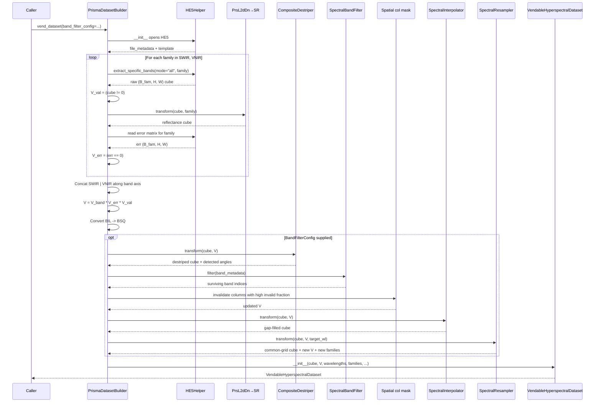

# 13. Putting the Pieces Together — the PRISMA `vend_dataset()` Walk

This section is the end-to-end choreography for one PRISMA L2D scene, calling out every section's contribution and showing the order in which the transformers fire. Reading it after Sections 1–12 should make every step feel familiar.

The implementation lives in [`prisma_dataset_builder.py`](../../app/utils/dataset_builder/prisma_dataset_builder.py).

---

## 13.1 The full sequence



---

## 13.2 Step-by-step

### Step 1: Open the HE5

`HE5Helper` is constructed at [prisma_dataset_builder.py:86](../../app/utils/dataset_builder/prisma_dataset_builder.py). The helper:

- Opens the HE5 file lazily (no data is read yet).
- Parses global attributes (`L2ScaleMaxVnir`, `L2ScaleMinVnir`, `L2ScaleMaxSwir`, `L2ScaleMinSwir`, scene acquisition timestamps, geographic bounds, ...).
- Constructs the typed `He5Metadata` Pydantic model.
- Builds the template dict mapping `HyperspectralFileComponents` enums to file attribute names.

### Step 2: Extract band info for SWIR then VNIR

[prisma_dataset_builder.py:131](../../app/utils/dataset_builder/prisma_dataset_builder.py)–[prisma_dataset_builder.py:191](../../app/utils/dataset_builder/prisma_dataset_builder.py). For each family, parse:

- Center wavelengths (per band).
- FWHMs (per band).
- Vendor validity flags (per band).
- Family-specific scale and offset for DN → reflectance.

These are stored in a `HyperpectralBandInformation` per family, accessible through `band_information`.

### Step 3: Pull the raw cube family-by-family

For each family in `[SWIR, VNIR]`:

- `file_helper.extract_specific_bands(mode="all", spectral_family=family)` at [prisma_dataset_builder.py:241](../../app/utils/dataset_builder/prisma_dataset_builder.py) returns a `(B_fam, H, W)` BIL array of raw DN.

Build three independent validity signals:

| Signal       | Source                          | Shape                  |
|--------------|---------------------------------|------------------------|
| $V_\text{band}$ | Vendor's per-band flag       | $(B,)$, broadcast      |
| $V_\text{err}$  | `error_matrix == 0`          | $(B, H, W)$            |
| $V_\text{val}$  | `DN != 0` snapshot           | $(B, H, W)$            |

$V_\text{val}$ must be snapshot **before** the DN transform, see Section 3.

### Step 4: DN → reflectance (per family)

`PrsL2dDnToSurfaceReflectanceTransformer` (Section 3) runs at [prisma_dataset_builder.py:250](../../app/utils/dataset_builder/prisma_dataset_builder.py). Per family because each family has its own scale and offset.

### Step 5: Concat and fuse

After both families have been processed:

- Concatenate `SWIR | VNIR` along the band axis. In BIL layout the band axis is `axis=1`, so the concat is along axis 1 ([prisma_dataset_builder.py:265](../../app/utils/dataset_builder/prisma_dataset_builder.py)).
- Fuse the three validity signals via element-wise multiplication ([prisma_dataset_builder.py:283](../../app/utils/dataset_builder/prisma_dataset_builder.py)):

  $$V = V_\text{band} \odot V_\text{err} \odot V_\text{val}$$

  This is the only place these three signals meet.

- Convert BIL → BSQ for the vendable ([prisma_dataset_builder.py:286](../../app/utils/dataset_builder/prisma_dataset_builder.py)). The cube and the validity cube are both swapped to `(C, H, W)`.

### Step 6: Optional `BandFilterConfig` stages

If the caller passed a `BandFilterConfig`, run the optional pipeline from [prisma_dataset_builder.py:305](../../app/utils/dataset_builder/prisma_dataset_builder.py) to [prisma_dataset_builder.py:387](../../app/utils/dataset_builder/prisma_dataset_builder.py):

#### 6a: Composite destripe (optional)

Run the FFT + moment-matching combo (Section 8). The destriper updates the cube in place and reports the detected angles.

#### 6b: Spectral band filter

`SpectralBandFilter` (Section 9) returns the surviving band indices. Slice the cube, validity, and band metadata arrays accordingly.

#### 6c: Spatial column masking

At [prisma_dataset_builder.py:339](../../app/utils/dataset_builder/prisma_dataset_builder.py): invalidate any pixel column where more than `max_invalid_voxel_fraction` of bands are invalid. This is a defensive step — after band filtering, some pixel columns may end up with so few valid bands that the remaining spectrum is too sparse to interpolate. Mark them fully invalid.

#### 6d: Spectral interpolation

`SpectralInterpolator` (Section 10) fills partial gaps in surviving pixels.

#### 6e: Spectral resampling

`SpectralResampler` (Section 11) projects everything onto the common 450–2400 nm @ 10 nm grid. Also rewrites the per-band family labels via nearest-neighbor lookup.

### Step 7: Build the vendable

Construct `VendableHyperspectralDataset` carrying:

- The common-grid cube (BSQ float32).
- The validity cube (BSQ int8).
- Per-band wavelengths.
- Per-band FWHMs (resampled).
- Per-band spectral families.
- Per-band vendor flags.
- Per-band coverage scores.
- The STAC item summarizing scene geometry and time.

This object is the **single contract** for every downstream system.

---

## 13.3 What the caller actually sees

```python
builder = PrismaDatasetBuilder(
    he5_path="path/to/PRS_L2D_STD_xxx.he5",
    band_filter_config=BandFilterConfig.prisma_defaults(),
)
vendable = builder.vend_dataset()

# vendable.pixels.shape       == (196, H, W)   # post-resample
# vendable.validity.shape     == (196, H, W)
# vendable.wavelengths.shape  == (196,)        # 450, 460, 470, ... 2400 nm
# vendable.families[0]        == SpectralFamily.VNIR
# vendable.units              == "reflectance"
```

Whether the original scene was an HE5, a folder of GeoTIFFs, or a 6.4 GB memmap, by step 7 it looks the same to a patch generator, foundation model, or anomaly detector.

---

## 13.4 The data flow as a single diagram

```mermaid
flowchart TD
    A[HE5 file on disk] --> B[HE5Helper]
    B --> C[(B_swir, H, W) BIL DN]
    B --> D[(B_vnir, H, W) BIL DN]
    C --> E[V_val_swir = cube != 0]
    D --> F[V_val_vnir = cube != 0]
    C --> G[DN→SR transformer]
    D --> H[DN→SR transformer]
    G --> I[(B_swir, H, W) BIL ρ]
    H --> J[(B_vnir, H, W) BIL ρ]
    B --> K[error matrix SWIR]
    B --> L[error matrix VNIR]
    K --> M[V_err_swir]
    L --> N[V_err_vnir]
    I --> O[Concat SWIR or VNIR]
    J --> O
    E --> P[Concat V_val]
    F --> P
    M --> Q[Concat V_err]
    N --> Q
    O --> R[(B, H, W) BIL ρ]
    P --> S[Fused V_val]
    Q --> T[Fused V_err]
    R --> U[V_band ⊙ V_err ⊙ V_val]
    S --> U
    T --> U
    U --> V[V validity cube]
    R --> W[BIL → BSQ]
    V --> X[BIL → BSQ]
    W --> Y[(B, H, W) BSQ ρ]
    X --> Z[(B, H, W) BSQ V]
    Y --> AA{BandFilterConfig?}
    AA -- no --> AB[VendableHyperspectralDataset]
    AA -- yes --> AC[Composite destripe]
    AC --> AD[Band filter + spatial mask + interp + resample]
    AD --> AB
```

---

## 13.5 What if you skip the optional stages

If the caller does not pass a `BandFilterConfig`, steps 6a–6e are skipped. The vendable carries:

- The cube in sensor-native wavelengths (~234 bands for PRISMA).
- The full fused validity mask.
- Vendor's per-band metadata as-is.

This is useful for diagnostic notebooks that want to inspect the raw post-calibration data. Downstream training/inference always passes the full config; only ad-hoc analysis tools skip it.

---

## 13.6 Comparison: PRISMA vs other sensors at the same altitude

| Step                       | PRISMA           | EnMAP             | Landsat 9        | AVIRIS-NG        |
|----------------------------|------------------|-------------------|------------------|------------------|
| 1. Open file               | HE5              | folder + XML      | TIFF             | ENVI memmap      |
| 2. Read raw cube           | per-family BIL   | full BSQ          | single band      | memmap BSQ       |
| 3. Build validity signals  | 3 signals fused  | 1 (sentinel)      | 1 (mask + cloud) | 1 (sentinel)     |
| 4. DN → physical            | per-family scale | uniform $10^{-4}$  | DN → temperature | identity         |
| 5. Concat / fuse           | yes              | no                | no               | no               |
| 6. Layout normalize         | BIL → BSQ         | already BSQ        | BSQ              | already BSQ      |
| 7. Destripe                 | composite        | composite          | n/a              | composite         |
| 8. Band filter              | optional         | optional          | n/a              | optional         |
| 9. Spectral interp          | yes (if config)  | yes (if config)   | n/a              | yes (if config)  |
| 10. Spectral resample      | yes (if config)  | yes (if config)   | n/a              | yes (if config)  |
| 11. Build vendable          | Vendable HSI      | Vendable HSI       | Vendable Thermal | Vendable HSI      |

PRISMA is the most elaborate because of the three-signal validity fusion and the per-family loop. The other hyperspectral sensors share the same skeleton with simpler validity logic. Landsat is fundamentally different — thermal, single-band, no spectral resampling.

---

## 13.7 Why this is the contract boundary

The `VendableDataset` is the **single contract** between data engineering and machine learning. Below it (this entire chapter) is heterogeneous, sensor-specific, file-format-aware code. Above it (chapters 2–6) is uniform, sensor-agnostic, foundation-model-aware code.

Adding a new sensor requires implementing this chapter for the new sensor. Adding a new model or detector touches the chapters above without touching this one. The contract is what makes both sides independently evolvable.
