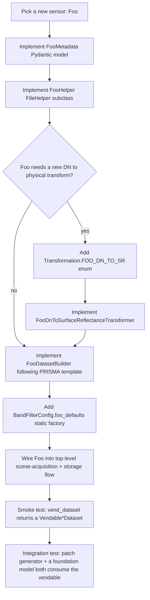

# Appendix B — Where to Add a New Sensor

This appendix is the runbook for onboarding a hypothetical new sensor — call it `Foo` — into the Allotrope pipeline. The PRISMA reference implementation in Section 13 is the canonical example; this appendix translates that example into a checklist.

---

## B.1 What "supporting Foo" actually means

The minimum bar for first-class Foo support is:

1. The pipeline can take a Foo scene file (or folder) and produce a `VendableHyperspectralDataset` or `VendableThermalDataset`.
2. The vendable carries the same fields with the same shapes and semantics as every other sensor's vendable.
3. Downstream consumers (patch generator, foundation model inferencer, classical detectors, API) consume Foo's vendable without any sensor-specific branch.

If you achieve all three, Foo is supported.

---

## B.2 The checklist



### Step 1: `FooMetadata` Pydantic model

Location: [`app/models/file_processing/`](../../app/models/file_processing/).

This is the typed parameter for the helper's generic: `FileHelper[FooMetadata]`. The model should capture at minimum:

- Scene timestamp(s).
- Geographic bounds (corner lat/lon).
- Spatial extent (rows, cols, pixel size in meters).
- Detector identification (one detector? two? what wavelengths?).
- Any sensor-specific calibration constants if they live in the file (PRISMA carries scale/offset; EnMAP does not).

Use Pydantic fields with proper types. Avoid `Dict[str, Any]` catch-alls — the whole point of the typed metadata is that static analysis can catch mismatches.

### Step 2: `FooHelper(FileHelper[FooMetadata])`

Location: [`app/utils/files/`](../../app/utils/files/).

Implement the four abstract members from Section 1.2:

- `_construct_metadata_structure() -> FooMetadata` — parse the container header.
- `file_metadata` property — return the cached metadata.
- `extract_specific_bands(bands, masking_needed, spectral_family, mode) -> ndarray | MaskedArray` — read band data.
- `template` property — the dict from `HyperspectralFileComponents` enum to `ReferenceDefinition`.

Override `access_dataset(path)` if Foo's container is split across multiple files (like EnMAP's folder structure).

### Step 3: DN → physical transformer (if needed)

If Foo's calibration is **identical** to an existing sensor's, reuse the existing transformer with new constants. If it differs:

- Add a new `Transformation.FOO_DN_TO_SR` enum value to [`app/abstract_classes/data_transformer.py`](../../app/abstract_classes/data_transformer.py).
- Implement `FooDnToSurfaceReflectanceTransformer(DataTransformer)` in [`app/utils/data_transformations/`](../../app/utils/data_transformations/).
- Follow the `numexpr` pre-allocation pattern (Section 3.1 step 2 onward).
- Handle masked arrays, layout conversion, and sentinel values.

If Foo is thermal, implement `FooDnToTemperatureTransformer` instead — same pattern, different output unit.

### Step 4: `FooDatasetBuilder(DatasetBuilder)`

Location: [`app/utils/dataset_builder/`](../../app/utils/dataset_builder/).

Implement the five abstract members from Section 1.3:

- `file_helper` — your `FooHelper`.
- `band_information` — `Dict[SpectralFamily, HyperpectralBandInformation]` for hyperspectral, `None` for thermal.
- `stac_item` — built from `file_metadata`.
- `default_cube_representation` — usually BSQ.
- `vend_dataset(**kwargs) -> VendableDataset` — the main entry point.

The `vend_dataset` implementation follows the PRISMA template (Section 13):

```python
def vend_dataset(self, band_filter_config: BandFilterConfig | None = None):
    # 1. Read raw cube via helper
    cube = self.file_helper.extract_specific_bands(mode="all")

    # 2. Build validity from sensor-specific signals
    validity = self._build_validity(cube)

    # 3. DN -> physical (skip if Foo ships already-calibrated data)
    cube = self._dn_transformer.transform(cube)

    # 4. Optional destripe, band filter, gap fill, resample
    if band_filter_config is not None:
        cube, validity = self._apply_optional_stages(cube, validity, band_filter_config)

    # 5. Build vendable
    return VendableHyperspectralDataset(
        pixels=cube,
        validity=validity,
        wavelengths=self._wavelengths,
        families=self._families,
        # ... other fields
    )
```

The exact steps depend on Foo's quirks; cross-reference Section 2 to see how each existing sensor diverges from PRISMA.

### Step 5: `BandFilterConfig.foo_defaults`

Location: alongside the existing `prisma_defaults`, `enmap_defaults`, etc., in the band-filter config module.

Hard-code the wavelength exclusion ranges, edge trim count, and coverage threshold appropriate for Foo. Test this against a real Foo scene before considering Foo onboarded — the wavelength windows depend on Foo's spectral coverage.

### Step 6: Scene acquisition + storage

Wire Foo into:

- The scene-acquisition layer (USGS M2M for Landsat, DLR for EnMAP, vendor portal for Foo).
- The S3 layout — what bucket and prefix do Foo scenes live in?
- The sharder pipeline — does Foo produce same-shape patches as other sensors? If yes, no work needed; if no (e.g., different patch size), extend the patch generator.

These are project-specific and not part of the per-sensor builder.

---

## B.3 What you do *not* have to change

After steps 1–6 are done, the rest of Allotrope works on Foo without modification:

- **Patch generator** — consumes the vendable, slices into patches.
- **Foundation models** — see the common-grid cube, no sensor-specific logic.
- **Classical detectors** (MNF, RX, etc.) — work on any `VendableHyperspectralDataset`.
- **API endpoints** — `/spectrum`, `/scene`, etc. — sensor-agnostic on the vendable side.
- **Visualization utilities** — operate on BSQ cubes.

This is the payoff for the three-contract architecture (Section 1).

---

## B.4 Common pitfalls

### Wrong cube layout

The transformer chain expects BSQ. If Foo's helper returns BIL or BIP, the builder must convert before calling transformers. Failing to convert produces wrong shapes that NumPy may silently broadcast — a silent correctness bug, hard to spot.

**Defense**: assert the layout at builder entry: `assert cube.shape == (B, H, W)`.

### Validity signal not built before DN transform

If Foo uses 0 as a no-data sentinel and DN=0 maps to a valid reflectance after the transform, the post-transform cube cannot distinguish sentinel from data. Build the validity *before* the calibration step (Section 3.1, step 3).

**Defense**: build all validity signals before any transformer modifies the cube. Make it a hard invariant in the builder.

### Wavelength order

The spectral resampler (Section 11) assumes ascending source wavelengths. PRISMA's HE5 stores SWIR bands in descending wavelength order; the PRISMA builder reverses them before resampling. If Foo's wavelengths are not ascending, either reverse them in the helper or rely on the resampler's permutation code (slower for large cubes).

**Defense**: check at builder entry: `assert np.all(np.diff(wavelengths) > 0)`.

### Missing FWHM

The vendable's `fwhms` array is required. If Foo's vendor does not publish FWHM per band, you must estimate it — typically as the wavelength spacing between adjacent bands (a reasonable approximation when the spectral response is Gaussian).

**Defense**: never default FWHM to 0 or None. If you don't know, estimate; if you can't estimate, refuse to build the vendable.

### Sensor units string

The vendable carries a `units` string (`"reflectance"`, `"K"`, `"DN_14bit_relative"`, etc.). Downstream code uses this to decide whether a value is a physical temperature or a relative DN. If Foo's data is uncalibrated, stamp the units string accordingly — do not pretend it is reflectance.

**Defense**: define a `SensorUnits` enum and only allow stamped values from it.

---

## B.5 An analogy

Adding a new sensor is like onboarding a new supplier in a supply chain. The supplier might package their product in a different box, use a different shipping label, or quote prices in a different currency. Your job is to write the **adapter** that translates the supplier's format into your warehouse's canonical inventory record. Once that's done, your warehouse, your inventory tracker, and your customer-facing storefront all operate on the canonical record — they do not care who supplied what.

The three abstract contracts (FileHelper, DataTransformer, DatasetBuilder) are the warehouse's intake-and-canonicalize protocol. The `VendableDataset` is the canonical inventory record. Section 13's PRISMA walk is the worked example of intake from one specific supplier.

---

## B.6 Quick-reference file map

| Component                              | Location                                            |
|----------------------------------------|-----------------------------------------------------|
| `FileHelper` ABC                       | [app/abstract_classes/file_helper.py](../../app/abstract_classes/file_helper.py) |
| `DataTransformer` ABC                  | [app/abstract_classes/data_transformer.py](../../app/abstract_classes/data_transformer.py) |
| `DatasetBuilder` ABC                   | [app/abstract_classes/dataset_builder.py](../../app/abstract_classes/dataset_builder.py) |
| Sensor metadata models                 | [app/models/file_processing/](../../app/models/file_processing/) |
| Sensor file helpers                    | [app/utils/files/](../../app/utils/files/)         |
| DN transformers                        | [app/utils/data_transformations/](../../app/utils/data_transformations/) |
| Dataset builders                       | [app/utils/dataset_builder/](../../app/utils/dataset_builder/) |
| Templates (enum → file attribute name) | [app/templates/](../../app/templates/)             |
| Vendable dataset classes               | [app/models/dataset/vendables.py](../../app/models/dataset/vendables.py) |

Use this map as your starting point. The PRISMA implementation in each of the relevant directories is your model.
