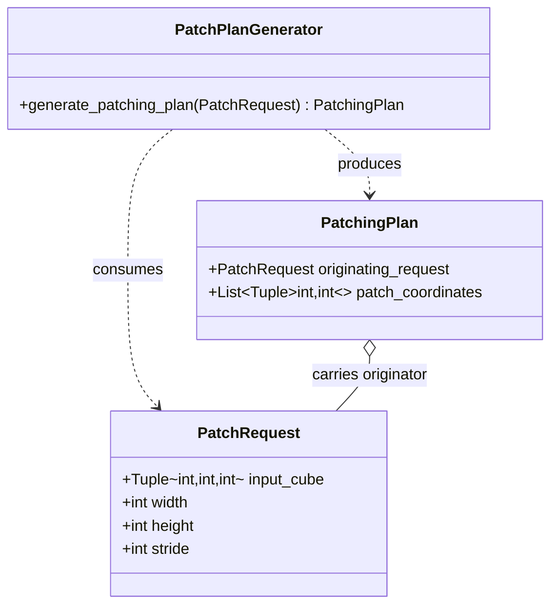

# 1. The Patch Request / Plan Data Models

This section covers the two Pydantic models that pin down the contract
between "where do patches live" (the planner) and "give me actual
pixels" (the cutter). Everything downstream — every sharder, every
trainer — depends on these two types being the only thing crossing
that boundary.

## What the code does

Two small Pydantic models define the contract:

- [`PatchRequest`](../../app/models/patches/patching_request.py) at
  [patching_request.py:11](../../app/models/patches/patching_request.py)
  carries the cube shape `input_cube: (C, H, W)` plus `width`, `height`,
  and `stride`.
- [`PatchingPlan`](../../app/models/patches/patching_response.py) at
  [patching_response.py:12](../../app/models/patches/patching_response.py)
  carries the originating request plus
  `patch_coordinates: List[Tuple[int, int]]` — the `(row, col)`
  top-left corners.

The `PatchRequest` has four fields with explicit pydantic descriptions:

- `input_cube: Tuple[int, int, int]` — the shape `(C, H, W)` of the cube
  that will be tiled. It is the *shape*, not the cube itself, because
  the planner never needs pixels.
- `width: int` — patch width in pixels (columns).
- `height: int` — patch height in pixels (rows).
- `stride: int` — the step size when moving the sliding window. The
  same stride is used along rows and columns; the planner has no
  separate `row_stride`/`col_stride` parameter.

`PatchRequest` declares `model_config = ConfigDict(arbitrary_types_allowed=True)`
at [patching_request.py:19](../../app/models/patches/patching_request.py),
which is what allows it to coexist with NumPy types passed through
loosely-typed paths (e.g. when the cube shape is read off
`np.ndarray.shape` and ends up as a tuple of `numpy.int64` rather than
plain `int`).

The `PatchingPlan` has only two fields:

- `originating_request: PatchRequest` — the request the plan was
  generated from. Carrying it forward is how every consumer
  reconstructs the patch geometry without needing to re-pass the
  width/height/stride knobs.
- `patch_coordinates: List[Tuple[int, int]]` — the `(row, col)` corners.

These are deliberately the only two types that move between the
"where do patches live" layer and the "give me actual pixels" layer.

### Call sites

`PatchRequest` is instantiated inside the per-sensor sharders, always
adjacent to the call to `PatchPlanGenerator.generate_patching_plan`:

- `LandsatIntermediateSharder.patch_generator` at
  [landsat_intermediate_patcher.py:165-173](../../app/utils/patch_generation/intermediate/landsat_intermediate_patcher.py)
- `PrismaIntermediateSharder.patch_generator` at
  [prisma_intermediate_patcher.py:155-163](../../app/utils/patch_generation/intermediate/prisma_intermediate_patcher.py)
- `EnmapIntermediateSharder.patch_generator` at
  [enmap_intermediate_patcher.py:170-178](../../app/utils/patch_generation/intermediate/enmap_intermediate_patcher.py)

`PatchingPlan` is consumed by the per-sensor cutters
(`patch_landsat_vendable`, `patch_hyperspectral_vendable`). It is never
constructed by hand outside of tests — the planner is its only legitimate
producer.

## Theory in plain language

Decoupling the *plan* from the *cut* has two benefits.

First, the plan is cheap to compute and cheap to inspect: you can
dump the coordinate list, count it, visualise the tiling as an
overlay on a thumbnail, or unit-test the geometry without ever
touching pixel arrays. A planner bug would otherwise be invisible
until pixels were sliced and a downstream model misbehaved; with the
plan as an explicit value, a unit test on a $1000 \times 1000$ shape
runs in microseconds.

Second, the same plan can be reused across multiple aligned cubes —
e.g. the reflectance cube, the validity cube, the cloud mask, and any
auxiliary masks all use one plan in `patch_landsat_vendable`. If we
baked tiling into the cutter we would either duplicate the loop or
risk drift between the masks and the pixels they protect. Drift here
would mean a mask shifted by one pixel relative to the cube, which is
the kind of bug that is invisible in spot checks and catastrophic in
loss calculations.

A third, more subtle benefit: the plan is a small Python object you
can ship through a queue or persist. If we ever wanted to parallelise
patching across machines, the plan is the natural unit of work to
distribute — each worker takes a slice of `patch_coordinates` and
operates independently.

### The BSQ convention

The cube convention is **band-sequential** (BSQ): axis 0 is the
spectral axis, axis 1 is row, axis 2 is column, i.e. the cube has
shape `(C, H, W)`. Every patcher in this chapter preserves that
convention. The alternatives are:

- **BIP** (band-interleaved by pixel), shape `(H, W, C)`, common in
  remote-sensing GUIs and matplotlib-friendly displays.
- **BIL** (band-interleaved by line), shape `(H, C, W)`, common in
  ENVI-format on-disk layouts.

BSQ is the right choice here because (a) PyTorch convolutions expect
channels-first; (b) slicing a spatial patch in BSQ is
`cube[:, r:r+h, c:c+w]`, a single contiguous-in-the-fastest-axis
operation; (c) the spectral axis is rarely sliced after the
band-filter step, so its stride cost is borne once.

### Why Pydantic and not a dataclass / namedtuple

`PatchRequest` and `PatchingPlan` could in principle be plain
dataclasses. Pydantic buys us three things:

1. **Validation at construction time.** Pass `stride=-1` and the
   model accepts it (because pydantic does not enforce arbitrary
   business rules), but pass `width="64"` and you get a clear type
   error rather than a mysterious crash deep in `numpy` slicing.
2. **JSON round-trip for free.** `request.model_dump_json()` works,
   which matters the moment we want to checkpoint a planner state or
   log a request to a structured logger.
3. **Consistency with the rest of the codebase.** Every contract
   model in Allotrope is pydantic; using a dataclass here would be a
   stylistic outlier.

## Worked example: constructing and inspecting a plan

```python
from app.models.patches.patching_request import PatchRequest
from app.utils.patch_generation.generate_patch_plan import PatchPlanGenerator

req = PatchRequest(
    input_cube=(201, 1000, 1000),  # PRISMA-sized hyperspectral cube
    height=64,
    width=64,
    stride=32,
)
plan = PatchPlanGenerator().generate_patching_plan(req)

assert len(plan.patch_coordinates) == 900
assert plan.patch_coordinates[0] == (0, 0)
assert plan.patch_coordinates[-1] == (936, 936)  # snap-to-edge corner
```

The `(936, 936)` last coordinate is the snap-to-edge tail patch
covered in detail in the next section: the planner cannot place a
corner at $30 \cdot 32 = 960$ because $960 + 64 = 1024 > 1000$, so it
snaps that corner to $1000 - 64 = 936$.

## Class diagram


