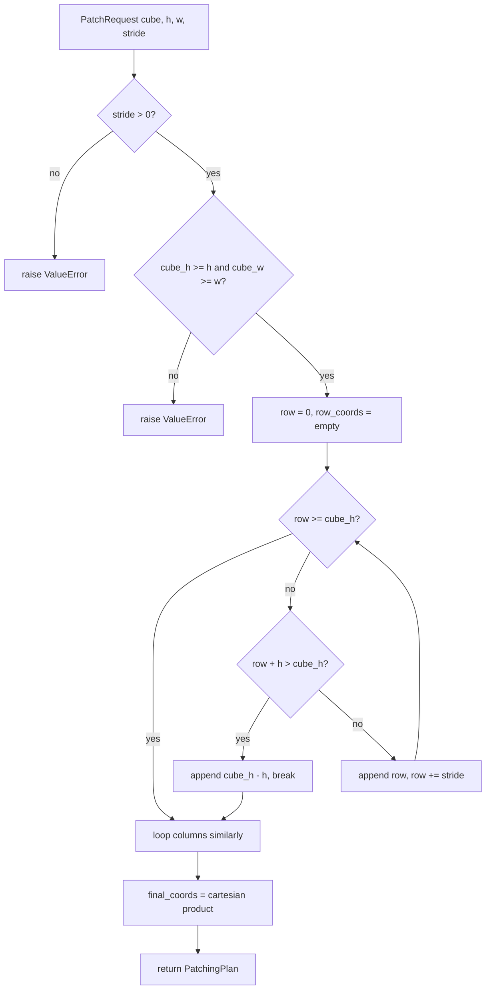

# 2. `PatchPlanGenerator` — Sliding-Window Tiling

This section walks through the tiling algorithm that takes a cube
shape and a `(height, width, stride)` triple and emits the list of
top-left corners. The whole class is a single method with two
mirrored loops; the subtleties are in the edge handling, in the
counting formula, and in the alternatives we deliberately rejected.

## What the code does

[`PatchPlanGenerator.generate_patching_plan`](../../app/utils/patch_generation/generate_patch_plan.py)
at [generate_patch_plan.py:22](../../app/utils/patch_generation/generate_patch_plan.py)
returns a `PatchingPlan` containing the list of `(row, col)` corners.

The body is:

```python
row_coords = []
row = 0
while True:
    if row >= cube_height:
        break
    if row + request.height > cube_height:
        row_coords.append(cube_height - request.height)   # snap-to-edge
        break
    row_coords.append(row)
    row += request.stride
```

The same logic runs for columns at
[generate_patch_plan.py:63-79](../../app/utils/patch_generation/generate_patch_plan.py).
Sanity checks at
[generate_patch_plan.py:31-41](../../app/utils/patch_generation/generate_patch_plan.py)
reject `stride <= 0` (which would otherwise loop forever) and patches
that are larger than the cube along either axis. The two 1-D
coordinate lists are then taken as a Cartesian product at
[generate_patch_plan.py:82](../../app/utils/patch_generation/generate_patch_plan.py):

```python
final_coords = [(r, c) for r in row_coords for c in col_coords]
```

### Parameter knobs

There are exactly three knobs on the planner — `height`, `width`,
`stride` — and they interact in ways worth being explicit about:

- `stride < patch_dim` means **overlapping patches**. Useful for
  training data when we want denser coverage and implicit augmentation
  (the same pixel appears in multiple patches with different spatial
  context).
- `stride == patch_dim` means **non-overlapping tiling**. Useful when
  the goal is exhaustive coverage with no redundancy, e.g. an
  inference run that reconstructs the whole scene from its patches.
- `stride > patch_dim` means **gappy tiling** — patches do not touch.
  This is rarely what you want for training (you lose pixels and the
  snap-to-edge logic does *not* recover them; only the trailing-edge
  pixels are recovered, not interior gaps), but is fine for sparse
  sampling.

The `stride < 0` and `stride == 0` cases are both rejected at
[generate_patch_plan.py:31-32](../../app/utils/patch_generation/generate_patch_plan.py).
Negative strides would walk off the edge; zero strides would loop
forever (the canonical pre-validation bug in any sliding-window
generator).

### Failure modes

- `cube_height < request.height` raises a `ValueError`. The error
  message says "height" twice by typo (the second branch should read
  "width") at
  [generate_patch_plan.py:38-40](../../app/utils/patch_generation/generate_patch_plan.py),
  which is harmless but worth noting if you ever grep the logs.
- `cube_height == request.height` is valid: the loop emits exactly
  one row coordinate (`0`), because the first iteration sees
  `row + height = cube_height` which is *not* `> cube_height`, so it
  appends `0`, then advances `row` to `stride` which exceeds
  `cube_height` and the loop exits.

## Theory in plain language

This is a **standard sliding-window tiling** with one important
refinement: the *snap-to-edge* tail patch. If the cube width is not
exactly `width + k*stride` for some integer $k$, the naive loop would
either drop a strip of pixels on the right/bottom edge, or emit a
patch that runs out of bounds. Snapping the last corner to
`cube_dim - patch_dim` guarantees:

- **Complete coverage**: every pixel sits inside at least one patch.
- **No partial / padded patches**: every emitted patch is exactly
  `height × width` and can be batched without per-sample padding logic.
- **Slightly more overlap at the edge**: the last patch usually
  overlaps its neighbour by more than `width - stride`. This is fine
  for training data and means we never have to track per-patch valid
  regions.

### The rejected alternatives

The alternatives we did *not* choose, and why:

- **(a) Zero-pad the cube.** Pad the right/bottom with zeros (or NaNs)
  so that the cube becomes a clean multiple of stride. This
  fabricates fake "invalid" pixels that pollute reconstruction
  losses, and forces every downstream consumer to know about the pad.
  Particularly bad for autoencoder training, where the model would
  spend gradient on learning the constant pad value.
- **(b) Drop the edge.** Stop the sliding window before the boundary
  and accept that the last $(L - p) \bmod s$ pixels along each axis
  are never seen. Wasteful at small image sizes; for a Landsat scene
  with `patch=128, stride=64` we would lose ~64 pixels on each edge,
  which is the entire patch width.
- **(c) Variable-size edge patches.** Emit a final patch of size
  $(L \bmod s) \times \cdot$ at the boundary. Breaks tensor batching,
  because PyTorch dataloaders cannot stack tensors of different shapes
  without an explicit collate function and a downstream mask of valid
  regions per patch.

Snap-to-edge is the cleanest compromise: every patch has identical
shape, every pixel is covered, and the only cost is the
slightly-larger overlap at the trailing edge (which empirically
matters less than the implicit augmentation it provides).

### The counting formula

The number of corners produced along one axis of length $L$ with
patch size $p$ and stride $s$, provided $L \geq p$, is

$$
N = \left\lceil \frac{L - p}{s} \right\rceil + 1
$$

Sketch of why: the corners we emit before the snap are
$0, s, 2s, \ldots, ks$ for the largest $k$ such that $ks + p \leq L$,
i.e. $k = \lfloor (L - p) / s \rfloor$. That gives $k + 1$ corners.
Then if $ks + p < L$ we add one more snap-to-edge corner at
$L - p$, giving $k + 2$ total; if $ks + p = L$ we do not add a snap
(because the loop exits with `row = (k+1)s` exceeding `cube_height`),
giving $k + 1$ total. The ceiling absorbs both cases.

A useful sanity check: when $L = p + ks$ exactly, both formulas
agree at $k + 1$.

The total patch count is $N_{row} \cdot N_{col}$.

## Worked numerical examples

### Landsat at native size

A Landsat thermal cube of shape `(1, 7700, 7600)` with
`patch_height = patch_width = 128` and `stride = 64`:

- Rows: $N_{row} = \lceil (7700 - 128) / 64 \rceil + 1 = \lceil 7572 / 64 \rceil + 1 = 119 + 1 = 120$.
- Cols: $N_{col} = \lceil (7600 - 128) / 64 \rceil + 1 = \lceil 7472 / 64 \rceil + 1 = 117 + 1 = 118$.
- Total: $120 \times 118 = 14{,}160$ candidate patches per scene.

The snap-to-edge corner along rows is at $7700 - 128 = 7572$. The
penultimate non-snap corner is at $118 \cdot 64 = 7552$, so the
trailing overlap is $7572 - 7552 = 20$ pixels — much more than the
ordinary `width - stride = 64` overlap.

### PRISMA-sized toy cube

A 1000x1000 toy cube with `patch = 64`, `stride = 32`:

- $N = \lceil 936 / 32 \rceil + 1 = 30 + 1 = 30$ along each axis.
  ($30 \cdot 32 = 960$, and the 30th corner snaps to $1000 - 64 = 936$.)
- Total: $30 \times 30 = 900$ patches.

### Non-overlapping tiling

A 512x512 cube with `patch = 64, stride = 64`:

- $N = \lceil 448 / 64 \rceil + 1 = 7 + 1 = 8$.
- Total: $64$ patches, exactly $8 \times 8$, no overlap, no snap
  needed (since $512 = 8 \cdot 64$).

### Heavy overlap (4x oversampling)

A 1000x1000 cube with `patch = 64, stride = 16`:

- $N = \lceil 936 / 16 \rceil + 1 = 59 + 1 = 60$.
- Total: $3600$ patches — four times as many as `stride = 32`,
  reflecting the fact that overlap goes as $1 / s^2$ for fixed patch
  size in 2D.

## Algorithm flowchart


