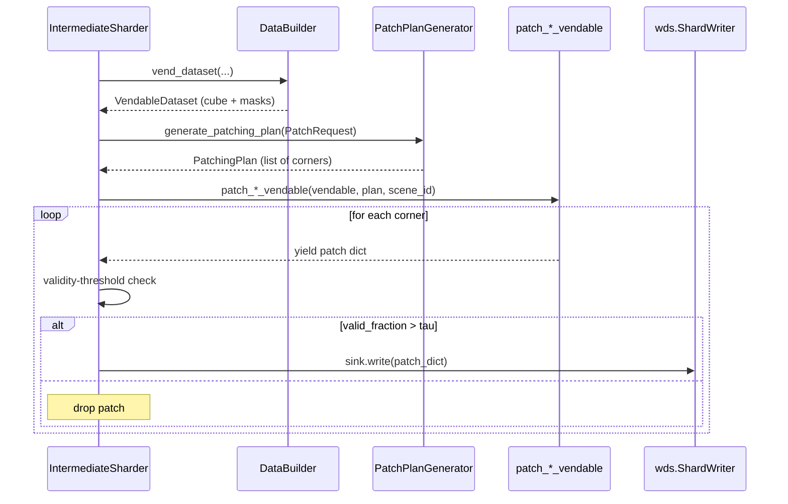

# 3. The Per-Sensor Cutters

Once we have a `PatchingPlan`, two thin generator functions actually
slice the cube. They share a structure: iterate over
`patch_coordinates`, build a unique `__key__` from the scene id and
corner, and attach every aligned array as an entry in a dictionary
that `webdataset.ShardWriter` knows how to serialize. The differences
between them are entirely on the data side — one thermal band vs ~200
spectral bands, optional provider masks vs sensor-agnostic
wavelengths.

## 3.1 `patch_landsat_vendable`

### What the code does

[`patch_landsat_vendable`](../../app/utils/patch_generation/landsat_patcher.py)
at [landsat_patcher.py:14](../../app/utils/patch_generation/landsat_patcher.py)
is a generator. For each `(row, col)` in
`patching_plan.patch_coordinates`:

- The `__key__` is `"{stac_item.id}#row_coord:{row}#col_coord:{col}"`
  at [landsat_patcher.py:26](../../app/utils/patch_generation/landsat_patcher.py).
  This both uniquely identifies the patch within a shard and encodes
  enough provenance to reconstruct exactly which pixels it came from
  without any out-of-band registry.
- `meta.json` carries `scene_id`, `row_coords`, `col_coords`,
  `patch_height`, `patch_width`, `patch_stride`, and `bands` at
  [landsat_patcher.py:31-40](../../app/utils/patch_generation/landsat_patcher.py).
- `pixels.npy` is the slice of `vendable.normalized_thermal_cube` at
  [landsat_patcher.py:42-46](../../app/utils/patch_generation/landsat_patcher.py).
- `validity_cube.npy`, `predicted_cloud_mask.npy`, and
  `pure_validity_mask.npy` are always present at
  [landsat_patcher.py:47-61](../../app/utils/patch_generation/landsat_patcher.py).
- `custom_quality_mask.npy`, `provider_cloud_presence.npy`,
  `provider_water_presence.npy`, `provider_snow_presence.npy` are
  attached *only if* the vendable carries them at
  [landsat_patcher.py:63-96](../../app/utils/patch_generation/landsat_patcher.py).

All slices follow the BSQ pattern
`cube[:, r:r+h, c:c+w]`, so the spectral axis (length 1 for thermal)
is preserved.

### The custom_quality_mask convention

A short but important comment at
[landsat_patcher.py:64-65](../../app/utils/patch_generation/landsat_patcher.py)
states: "custom_quality_mask: 0 = invalid, 1 = valid. Must be
multiplied with pure_validity_mask before use." That convention is
not enforced anywhere — it is documented in the source of truth
(this cutter) and propagated downstream by carrying the mask
verbatim. Any consumer that uses `custom_quality_mask` without
multiplying by `pure_validity_mask` will treat off-swath pixels as
valid.

### Theory in plain language

Two design points are worth flagging:

- **Optional masks via `if ... is not None`.** WebDataset shards are
  schemaless — different samples in the same tar can have different
  files. We exploit this so that scenes which happen to ship provider
  snow flags carry them downstream, while scenes that do not are not
  forced into fake all-zero masks. The cost is that the loader has
  to use a tolerant decode strategy (Section 7) and that the trainer
  cannot assume every patch dict has every key.
- **`pure_validity_mask` vs `validity_cube`.** The pure mask is the
  bare "is this pixel a real measurement" indicator; the full
  validity cube layers cloud and other quality flags on top. We ship
  both because intermediate filtering uses *pure* validity (so we do
  not throw out cloudy-but-real patches at the patcher stage), but
  downstream losses may want the masked-out cube for example to
  ignore cloud pixels in reconstruction loss.

## 3.2 `patch_hyperspectral_vendable`

### What the code does

[`patch_hyperspectral_vendable`](../../app/utils/patch_generation/hyperspectral_patcher.py)
at [hyperspectral_patcher.py:25](../../app/utils/patch_generation/hyperspectral_patcher.py)
is sensor-agnostic across PRISMA and EnMAP. Key steps:

- Pull wavelengths from `vendable.band_cw_order` at
  [hyperspectral_patcher.py:37](../../app/utils/patch_generation/hyperspectral_patcher.py)
  and convert to `float64` NumPy.
- If wavelengths are not already strictly ascending, sort them and
  permute the cube, validity, and spectral families together at
  [hyperspectral_patcher.py:41-50](../../app/utils/patch_generation/hyperspectral_patcher.py).
  When the band-filter has resampled to a common grid this branch is
  a no-op.
- Each patch dictionary carries `pixels.npy` (`float32`),
  `validity_cube.npy` (`int8`), `wavelengths.npy` (`float64`), and a
  rich `meta.json` with `spectral_family_order` and `band_count` at
  [hyperspectral_patcher.py:64-84](../../app/utils/patch_generation/hyperspectral_patcher.py).

The patch key uses the same `#`-separated format:
`f"{scene_id}#row_coord:{row}#col_coord:{col}"` at
[hyperspectral_patcher.py:59](../../app/utils/patch_generation/hyperspectral_patcher.py).
The `sensor` argument (`"prisma"` or `"enmap"`) is recorded in the
metadata at
[hyperspectral_patcher.py:73](../../app/utils/patch_generation/hyperspectral_patcher.py),
which is what allows the final hyperspectral shuffler to mix PRISMA
and EnMAP patches in the same tar while keeping their provenance
addressable.

### Theory in plain language

#### Ascending wavelengths

PRISMA's HE5 ships VNIR after SWIR in array order; raw EnMAP can have
detector-dependent ordering as well. The trainer must see a monotonic
spectral axis or any band-position attention/embedding will be
nonsense across sensors. Sorting here rather than in every downstream
model keeps that invariant in one place — once a patch leaves the
cutter, the spectral axis is guaranteed strictly ascending.

The `np.all(np.diff(wavelengths) > 0)` check is cheap (a single
pass over a ~200-element array). When the band-filter step has
already produced a common-grid resampled cube, this check returns
`True` and the function takes the no-op branch with zero allocation.

#### Per-patch wavelengths

We carry `wavelengths.npy` *inside the patch* rather than just in
shard-level metadata, because the final shuffler
(Section 6) freely mixes patches across PRISMA and EnMAP scenes,
and after resampling-or-sorting different sensors may still have
different band counts pre-resampling. Self-describing patches are
robust to that mixing — a patch tells you exactly what it is, and the
trainer never has to look up sensor metadata to decode it.

This is a small storage cost ($201 \times 8$ bytes = 1.6 KiB per
patch for PRISMA) but a large robustness benefit. If a future scene
ships with a different band count, the trainer reads
`patch["wavelengths.npy"].shape[0]` and adapts; there is no
configuration to keep in sync.

#### `int8` validity

Validity is binary in spirit, but storing it as `int8` rather than
`bool` is what NumPy and WebDataset round-trip through `.npy`
reliably. `bool` arrays serialize as 1 byte per element on disk
anyway (NumPy does not pack them), so there is no storage savings to
chasing the smaller dtype. And `int8` is 8x smaller than `float32`,
which matters when you ship millions of patches.

The cast happens at the slice site at
[hyperspectral_patcher.py:80-82](../../app/utils/patch_generation/hyperspectral_patcher.py)
(`.astype(np.int8)`), so the in-memory validity cube can be whatever
dtype the upstream resampler produced.

## Shared design: dict-as-tar-record

Both cutters yield a Python `dict` whose keys are filenames
(`pixels.npy`, `validity_cube.npy`, `meta.json`, plus optional
masks). This is the exact data shape `wds.ShardWriter` expects: it
serializes each dict into a tar member group sharing a common stem
(`__key__`), with one tar entry per file extension. The cutters
never call WebDataset directly — they just emit dicts; the
intermediate sharder owns the writer.

The decoupling means you can test the cutters by collecting their
output into a plain Python list and asserting on shapes and dtypes,
with no tar I/O.

## Worked example: Landsat patch dict for one corner

For a Landsat scene `LC09_L2SP_148040_20230415_20230502_02_T1` with
`patch=128, stride=64` and the corner `(row=64, col=128)`, the
yielded dict has shape:

```python
{
    "__key__": "LC09_L2SP_148040_20230415_20230502_02_T1#row_coord:64#col_coord:128",
    "meta.json": {
        "scene_id": "LC09_L2SP_148040_20230415_20230502_02_T1",
        "row_coords": 64,
        "col_coords": 128,
        "patch_height": 128,
        "patch_width": 128,
        "patch_stride": 64,
        "bands": 1,
    },
    "pixels.npy":              np.ndarray,  # (1, 128, 128) float32
    "validity_cube.npy":       np.ndarray,  # (1, 128, 128) int8
    "predicted_cloud_mask.npy": np.ndarray,  # (1, 128, 128) int8
    "pure_validity_mask.npy":  np.ndarray,  # (1, 128, 128) int8
    # provider_*_presence keys are present only if the vendable carries them
}
```

## Worked example: hyperspectral patch dict

For a PRISMA scene with 201 bands after the band filter, `patch=64,
stride=32`, corner `(0, 32)`:

```python
{
    "__key__": "PRS_L2D_STD_..._0001#row_coord:0#col_coord:32",
    "meta.json": {
        "scene_id": "PRS_L2D_STD_..._0001",
        "row_coords": 0,
        "col_coords": 32,
        "patch_height": 64,
        "patch_width": 64,
        "patch_stride": 32,
        "sensor": "prisma",
        "spectral_family_order": ["VNIR", "VNIR", ..., "SWIR"],  # length 201
        "band_count": 201,
    },
    "pixels.npy":        np.ndarray,  # (201, 64, 64) float32
    "validity_cube.npy": np.ndarray,  # (201, 64, 64) int8
    "wavelengths.npy":   np.ndarray,  # (201,)        float64
}
```

## Sequence diagram


