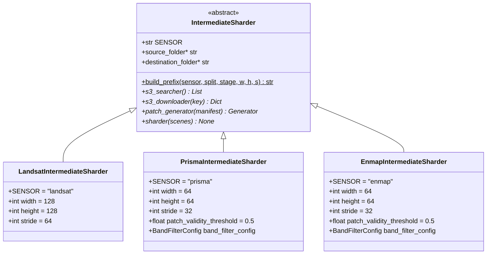

# 4. `IntermediateSharder` — The Abstract Pipeline

This section is about the contract: the abstract base class that
every per-sensor sharder implements, the canonical S3 prefix shape
that every reader and writer agrees on, and the design rationale for
making the geometry the *only* thing that lives in the path.

## What the code does

[`IntermediateSharder`](../../app/abstract_classes/intermediate_sharder.py)
at [intermediate_sharder.py:9](../../app/abstract_classes/intermediate_sharder.py)
is an ABC that fixes the contract every per-sensor sharder must
honour. The body is small enough to read at a glance:

- `SENSOR: str` class attribute (e.g. `"landsat"`, `"prisma"`,
  `"enmap"`) at
  [intermediate_sharder.py:18](../../app/abstract_classes/intermediate_sharder.py).
  Subclasses must set it. It is referenced by `build_prefix` and by
  the destination-prefix construction inside each `__init__`.
- `build_prefix(sensor, split, stage, width, height, stride)` at
  [intermediate_sharder.py:23-36](../../app/abstract_classes/intermediate_sharder.py)
  returns the canonical S3 path
  `patches/{sensor}/{split}/{stage}/w{w}_h{h}_s{s}/`. This single
  static method is what keeps the writer side and the reader side
  consistent — both the intermediate sharder and the final shuffler
  call it with the same arguments to produce the same prefix.
- Five abstract members declared at
  [intermediate_sharder.py:38-80](../../app/abstract_classes/intermediate_sharder.py):
  - `source_folder` (property) — local scratch directory for
    downloaded raw files.
  - `destination_folder` (property) — local scratch directory where
    shards are written before upload.
  - `s3_searcher() -> List` — discover scenes on S3 (one entry per
    scene, where "scene" varies by sensor).
  - `s3_downloader(key) -> Dict | None` — pull one scene's files
    locally and return a manifest dict.
  - `patch_generator(manifest) -> Generator` — build the vendable,
    construct the plan, return the per-patch generator.
  - `sharder(scenes=None) -> None` — the orchestrator that ties the
    other four methods together with a `wds.ShardWriter`.

### The four phases of every concrete sharder

Every subclass follows the same four-phase shape:

1. **`__init__`**: configure paths, split, geometry knobs, build the
   destination prefix via `build_prefix`, build the upload hook as
   a `functools.partial` over `s3_upload_and_cleanup`.
2. **Discovery + split**: in `__init__`, call `s3_searcher()`,
   sort, seed a `random.Random(seed)`, shuffle, slice on
   `int(N * (1 - test_fraction))`. The deterministic split is the
   reason the same `seed` produces the same train/test partition on
   every run.
3. **Per-scene download + patch**: in `sharder`, iterate scenes,
   call `s3_downloader`, hand the manifest to `patch_generator`,
   iterate the patch dicts, apply the validity threshold, call
   `sink.write` for survivors.
4. **Cleanup**: after each scene's patches are flushed, delete the
   downloaded raw files (`os.remove` for files,
   `shutil.rmtree` for folders).

### The upload hook

The `post=` hook on `wds.ShardWriter` is the magic that turns a
local-tar writer into a streaming-to-S3 writer. After each shard
closes (when it hits `maxsize=1 GiB`), the hook is called with the
path of the just-finished tar. The hook uploads it to S3 under
`self.destination_prefix` and deletes the local copy, so disk usage
stays bounded by one shard plus whatever is buffered in the writer.

The hook is constructed with `functools.partial`:

```python
self.upload_hook = partial(
    s3_upload_and_cleanup,
    bucket_name=S3_BUCKET,
    s3_prefix=self.destination_prefix,
    client=self.s3_client,
)
```

(See e.g.
[landsat_intermediate_patcher.py:93-98](../../app/utils/patch_generation/intermediate/landsat_intermediate_patcher.py).)
The shard pattern itself is a printf-style template:
`f"{self.destination_folder}intermediate_shard_%04d.tar"` at
[landsat_intermediate_patcher.py:90](../../app/utils/patch_generation/intermediate/landsat_intermediate_patcher.py),
which `wds.ShardWriter` fills in with the shard index.

## Theory in plain language

### Geometry as path

The S3 prefix is *encoded geometry*: `w128_h128_s64` is not a comment,
it's the actual key under which the trainer will look for those
shards. That means a new patch geometry never collides with an old
one, you can A/B compare them by listing two prefixes, and the
destructive cost of a mistake is bounded to one prefix.

The split is also baked into the prefix, which makes test-set
leakage into training nearly impossible at the data layer: the shard
patterns simply do not overlap. If your trainer config asks for
`split="train", width=128, height=128, stride=64`, there is no path
through the system by which it can accidentally read a `split="test"`
patch — they live under different prefixes that are computed by the
same `build_prefix` function on both sides.

The `stage` field (`"intermediate"` vs `"final"`) sits in the prefix
too, which is what lets the final shuffler read from one prefix and
write to another without collision.

### Why an ABC and not a generic helper

A natural alternative is a single `intermediate_shard(...)` function
that takes a sensor name, a discovery callable, a downloader
callable, and a patch generator callable. We could replace the ABC
with this functional form.

We chose the ABC for three reasons:

1. **`__init__` runs the discovery + split.** That work needs to
   happen exactly once per process, not once per `sharder()` call.
   A class makes that natural; a function would have to return a
   closure or a tuple.
2. **The state at construction time is non-trivial.** Each subclass
   carries the boto3 client, paginator, destination prefix, shard
   pattern, upload hook, and split scene list. Bundling them in
   `self` is cleaner than passing them through every method.
3. **The contract is enforced by `abstractmethod`.** A typo in a
   functional registration would surface at runtime; the ABC fails
   at class instantiation if a subclass forgot, say, `s3_downloader`.

### Why intermediate shards at all

The simplest possible pipeline would read raw scenes, patch them,
and stream directly into the final shuffler. We deliberately
materialise an intermediate stage because:

- Patching is the expensive step. We do not want to redo it every
  time we tune the shuffler's `patch_write_count` or its
  `shuffle_size`.
- The intermediate prefix is a useful audit point. You can list it,
  count shards, sample one with `tar -tf` and confirm patches look
  right before paying the cost of the final shuffle.
- Cross-sensor mixing (PRISMA + EnMAP) is much simpler if both
  sensors land in the same per-sensor format first. The
  `HyperspectralFinalShuffler` reads two intermediate prefixes and
  interleaves them.

## Class diagram



## Worked example: prefix construction

A call to `build_prefix(sensor="prisma", split="train",
stage="intermediate", width=64, height=64, stride=32)` returns the
literal string `"patches/prisma/train/intermediate/w64_h64_s32/"`.

Combined with the bucket name, the full S3 URI is

```
s3://allotrope-raw-data-india/patches/prisma/train/intermediate/w64_h64_s32/
```

Listing this prefix with `aws s3 ls` gives you the intermediate
shards for that exact geometry. Changing any one of (sensor, split,
stage, width, height, stride) puts you under a different prefix,
which is the design: every variant of the data lives somewhere
deterministically computable.
