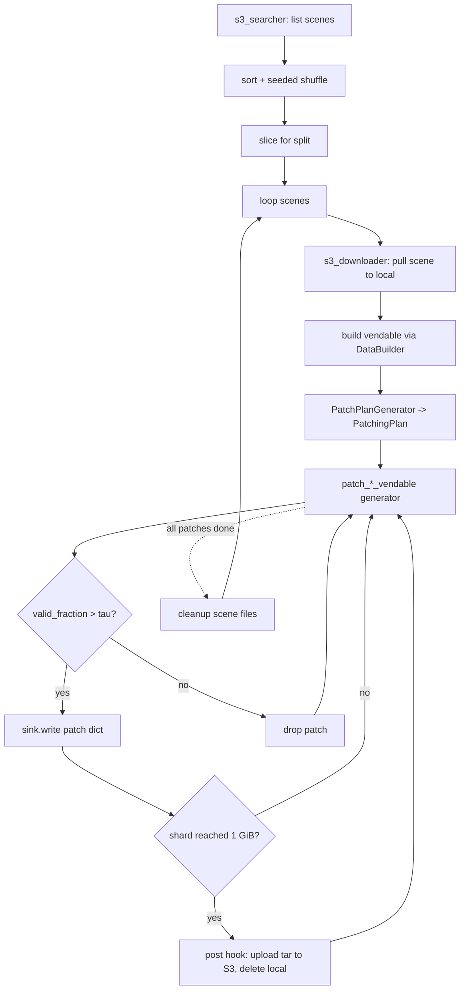

# 5. The Three Per-Sensor Sharders

All three concrete sharders follow the same shape (`__init__` →
`s3_searcher` → `s3_downloader` → `patch_generator` → `sharder`) but
differ in how a "scene" is identified, how the raw bytes get
downloaded, and what validity threshold makes sense for that sensor.
This section walks each one in turn and finishes with the theory of
validity-mask filtering and a numerical worked example of how many
patches end up in a shard.

## 5.1 `LandsatIntermediateSharder`

### What the code does

[`LandsatIntermediateSharder`](../../app/utils/patch_generation/intermediate/landsat_intermediate_patcher.py)
at [landsat_intermediate_patcher.py:30](../../app/utils/patch_generation/intermediate/landsat_intermediate_patcher.py).

- **Scene discovery**: paginates `s3://allotrope-raw-data-india/landsat/`
  with `Delimiter="/"` so each `CommonPrefix` is one scene folder at
  [landsat_intermediate_patcher.py:108-124](../../app/utils/patch_generation/intermediate/landsat_intermediate_patcher.py).
- **Deterministic split**: sorts all scenes, seeds a `random.Random`,
  shuffles once, then slices on
  `int(len(all_scenes) * (1 - test_fraction))` at
  [landsat_intermediate_patcher.py:66-73](../../app/utils/patch_generation/intermediate/landsat_intermediate_patcher.py).
- **Downloader**: for each scene prefix, lists objects, downloads
  them, and identifies `ST_B10` and `QA_PIXEL` files by substring
  match. Returns a manifest dict at
  [landsat_intermediate_patcher.py:126-148](../../app/utils/patch_generation/intermediate/landsat_intermediate_patcher.py).
- **`patch_generator`**: builds a `LandsatDataBuilder` with the
  `ST_B10` path as source, vends a `VendableThermalDataset` with the
  `QA_PIXEL` mask plumbed in via
  `vend_dataset(provider_qa_pixel_source=...)`, runs
  `PatchPlanGenerator`, and returns the `patch_landsat_vendable`
  generator at
  [landsat_intermediate_patcher.py:150-178](../../app/utils/patch_generation/intermediate/landsat_intermediate_patcher.py).
- **`sharder`** is the orchestrator. It opens
  `wds.ShardWriter(self.shard_pattern, maxsize=1 GiB, post=upload_hook)`
  at
  [landsat_intermediate_patcher.py:187-189](../../app/utils/patch_generation/intermediate/landsat_intermediate_patcher.py),
  iterates scenes (optionally truncated via the `scenes` argument),
  and **applies the validity filter**:

  ```python
  valid_pixels = patch_sample.get("pure_validity_mask.npy").sum()
  b, h, w = patch_sample.get("pure_validity_mask.npy").shape
  if valid_pixels / (b * h * w) > 0.5:
      sink.write(patch_sample)
      valid_patches += 1
  processed_patches += 1
  ```

  at
  [landsat_intermediate_patcher.py:204-211](../../app/utils/patch_generation/intermediate/landsat_intermediate_patcher.py).
  After each scene's patches are flushed, the local files are
  deleted at
  [landsat_intermediate_patcher.py:212-218](../../app/utils/patch_generation/intermediate/landsat_intermediate_patcher.py)
  to keep disk bounded.

### Defaults

`width=128, height=128, stride=64`. The 0.5 validity threshold is
hard-coded (not a parameter) at
[landsat_intermediate_patcher.py:208](../../app/utils/patch_generation/intermediate/landsat_intermediate_patcher.py).
The `target_size` is `1 * 1024 * 1024 * 1024` (1 GiB) at
[landsat_intermediate_patcher.py:63](../../app/utils/patch_generation/intermediate/landsat_intermediate_patcher.py).

## 5.2 `PrismaIntermediateSharder`

[`PrismaIntermediateSharder`](../../app/utils/patch_generation/intermediate/prisma_intermediate_patcher.py)
at [prisma_intermediate_patcher.py:34](../../app/utils/patch_generation/intermediate/prisma_intermediate_patcher.py)
is structurally identical to Landsat with three differences:

- **Discovery enumerates `.he5` *files*, not folders.** The
  paginator at
  [prisma_intermediate_patcher.py:116-131](../../app/utils/patch_generation/intermediate/prisma_intermediate_patcher.py)
  filters on `key.endswith(".he5")` because every PRISMA scene is a
  single HDF5 file. No `Delimiter="/"`.
- **A `BandFilterConfig` is plumbed into
  `builder.vend_dataset(...)`** at
  [prisma_intermediate_patcher.py:153](../../app/utils/patch_generation/intermediate/prisma_intermediate_patcher.py)
  so bad bands and exclusion ranges are dropped *before* patching.
  Default is an empty `BandFilterConfig()`, which still drops
  PRISMA-known-bad bands but does not resample.
- **The validity filter uses
  `patch_sample["validity_cube.npy"][0]`** — band 0 of the
  validity cube, treated as a spatial mask — and asks
  `valid_fraction > patch_validity_threshold` (default `0.5`) at
  [prisma_intermediate_patcher.py:189-197](../../app/utils/patch_generation/intermediate/prisma_intermediate_patcher.py).
  Post-interpolation, hyperspectral validity is *spatial only* (a
  pixel is either valid or invalid across all bands), so band 0 is
  a faithful proxy.

The `max_scenes` parameter (default `None`) lets a quick run
process only the first N scenes after the shuffle but before the
train/test split at
[prisma_intermediate_patcher.py:77-78](../../app/utils/patch_generation/intermediate/prisma_intermediate_patcher.py),
which is the developer-loop knob ("show me a few shards quickly").

Default geometry is `width=64, height=64, stride=32` — half the
spatial extent of Landsat patches because PRISMA scenes are roughly
$1000 \times 1000$, not $7700 \times 7600$.

## 5.3 `EnmapIntermediateSharder`

[`EnmapIntermediateSharder`](../../app/utils/patch_generation/intermediate/enmap_intermediate_patcher.py)
at [enmap_intermediate_patcher.py:35](../../app/utils/patch_generation/intermediate/enmap_intermediate_patcher.py)
differs from PRISMA only in that an EnMAP "scene" is a *folder of
files* (multiple TIFFs + an XML metadata file). Specifically:

- Discovery uses `Delimiter="/"` at
  [enmap_intermediate_patcher.py:122-132](../../app/utils/patch_generation/intermediate/enmap_intermediate_patcher.py)
  to enumerate folder prefixes.
- The downloader preserves the scene folder name locally so that
  `FileSourceConfig` auto-detection still works at
  [enmap_intermediate_patcher.py:134-156](../../app/utils/patch_generation/intermediate/enmap_intermediate_patcher.py).
  Specifically it pulls the leaf folder name from the prefix and
  recreates the same directory under `self.source_folder`.
- Cleanup uses `shutil.rmtree(scene_folder, ignore_errors=True)`
  instead of `os.remove` at
  [enmap_intermediate_patcher.py:211-214](../../app/utils/patch_generation/intermediate/enmap_intermediate_patcher.py).

Everything else — the validity filter, the threshold, the default
geometry — mirrors PRISMA. The two sharders are kept as separate
classes (rather than a parametric `HyperspectralIntermediateSharder`)
because the discovery and download semantics genuinely differ:
single-file vs folder-of-files is the cleanest seam to put a class
boundary on.

## Theory: validity-mask filtering

A sliding window over a non-rectangular satellite scene will produce
a lot of patches that are mostly off-swath or covered by no-data
fill. Training a reconstruction model on those patches is worse than
useless — the model spends gradient on learning the constant fill
value. The threshold-based filter is the simplest defensible rule:

$$
\text{keep patch if} \quad
\frac{\sum_{i,j} \mathbb{1}[\text{pixel}_{ij}\,\text{is valid}]}{H \cdot W} > \tau
$$

with $\tau = 0.5$ as the project default. The threshold is a knob,
not a law: lower $\tau$ keeps more edge data but admits patches whose
reconstruction is dominated by the mask; higher $\tau$ throws away
real cloud-free coastal scenes.

Crucially we use the **pure** validity for Landsat and the (already
spatial) validity cube for hyperspectral. We do *not* let cloud
cover itself be an exclusion criterion at this stage: a 30%-cloudy
thermal patch is still a real measurement we want the model to see
(and which we may want to teach it to denoise). Cloud-aware loss
weighting is a downstream model concern, not a data-pipeline concern.

### Where the threshold is hard-coded vs configurable

- Landsat: the `0.5` is a literal in the `if`
  ([landsat_intermediate_patcher.py:208](../../app/utils/patch_generation/intermediate/landsat_intermediate_patcher.py)).
- PRISMA: the threshold is `self.patch_validity_threshold`, defaults
  to `0.5`
  ([prisma_intermediate_patcher.py:57](../../app/utils/patch_generation/intermediate/prisma_intermediate_patcher.py)).
- EnMAP: same as PRISMA
  ([enmap_intermediate_patcher.py:58](../../app/utils/patch_generation/intermediate/enmap_intermediate_patcher.py)).

The asymmetry is incidental — Landsat predates the configurable
version. A future cleanup could lift the Landsat threshold to a
parameter without behaviour change.

### WebDataset vs alternatives

Before we look at the numerics, it is worth pausing on why the
intermediate writer uses WebDataset / tar at all. The realistic
alternatives:

- **HDF5**: one file per scene, hierarchical groups, indexable.
  Good for random access; bad for streaming. The whole point of
  this pipeline is that the trainer streams patches sequentially
  with multiple workers; HDF5's parallel-read story is fragile
  (file locking, MPI-only safe writes), and S3-backed HDF5 is
  basically untenable.
- **Parquet**: columnar, compressed, queryable. Excellent for
  tabular data; awkward for `(C, H, W)` arrays per row, which end
  up either as nested lists (slow) or as opaque bytes (defeats the
  point). Parquet shines when you want SQL over millions of rows;
  here we want bulk streams.
- **TFRecord**: Google's equivalent of WebDataset's tar approach.
  Functionally equivalent for our needs; we chose WebDataset
  because the Python ecosystem around it (`wds.WebDataset`,
  `wds.ShardWriter`, brace expansion, pipe URLs) is cleaner and
  framework-neutral.
- **Raw `.npy` files in S3**: simplest possible. Fails on small-file
  cost — listing and fetching a million 4 MiB objects from S3 is
  hugely expensive in request volume; a 1 GiB tar bundles ~250 of
  those into one transfer.

WebDataset's core idea is that a tar of `.npy` and `.json` files,
streamed from S3 over `aws s3 cp ... -`, gives you the best of
both worlds: schema-agnostic, framework-agnostic, S3-native, and
streaming. The "schema" is just the set of file extensions inside
each tar member group.

## Worked numerical example: patches per shard

### PRISMA

A PRISMA scene is roughly $1000 \times 1000$ pixels. With
`patch = 64, stride = 32`:

- Raw plan: $\lceil 936 / 32 \rceil + 1 = 30$ corners per axis,
  $30 \times 30 = 900$ candidate patches.
- Suppose 30% of the patches sit on the off-swath corners (typical
  PRISMA), so ~270 fail the $\tau = 0.5$ filter.
- ~630 valid patches per scene.
- A patch's `pixels.npy` is
  $C \times H \times W \times 4\text{ B} = 201 \times 64 \times 64 \times 4\text{ B} = 3{,}293{,}184\text{ B}$,
  approximately 3.3 MiB.
  `validity_cube.npy` adds ~0.8 MiB as `int8` ($201 \times 64 \times 64$).
  `wavelengths.npy` ($201 \times 8\text{ B}$ = 1.6 KiB) and
  `meta.json` (a few hundred bytes) are negligible.
- So ~4.1 MiB per patch, and `target_size = 1 GiB` means roughly
  $\lfloor 1024 / 4.1 \rfloor \approx 250$ patches per intermediate
  shard.
- One scene thus fills ~2.5 shards; 100 scenes fill ~250 shards.

### Landsat

For Landsat (`patch = 128, stride = 64`, 1 thermal band):

- `pixels.npy` is $1 \times 128 \times 128 \times 4\text{ B} = 64\text{ KiB}$.
- Several masks at $1 \times 128 \times 128 \times 1\text{ B} = 16\text{ KiB}$ each
  (validity, predicted_cloud, pure_validity, plus optional provider
  masks).
- Per-patch ~150 KiB.
- A 1 GiB shard holds $\lfloor 1024 \times 1024 / 150 \rfloor \approx 7{,}000$
  patches.

A native Landsat scene yields ~14,160 candidate patches; with a
~30% validity-filter drop rate that is ~10,000 valid patches, or
roughly 1.4 intermediate shards per scene. 100 scenes is ~140
shards.

### EnMAP

EnMAP scenes are also roughly $1000 \times 1000$ at the same patch
geometry, so the numerics match PRISMA: ~4 MiB per patch, ~250
patches per shard, ~2.5 shards per scene. The intermediate prefix
under `patches/enmap/.../intermediate/...` will look very similar in
shard count to the PRISMA one.

## Validity-filter intuition

Two scenes can have the same shape but very different valid-patch
yields:

- A nadir-pointed PRISMA scene over a continental interior: most of
  the cube is valid, maybe 90%+ patches survive the filter.
- An oblique scene over a coastline: a triangular off-swath region
  knocks out 40-60% of patches.

The filter is what makes the per-scene shard count vary in practice,
not the planner.

## Pipeline flowchart


