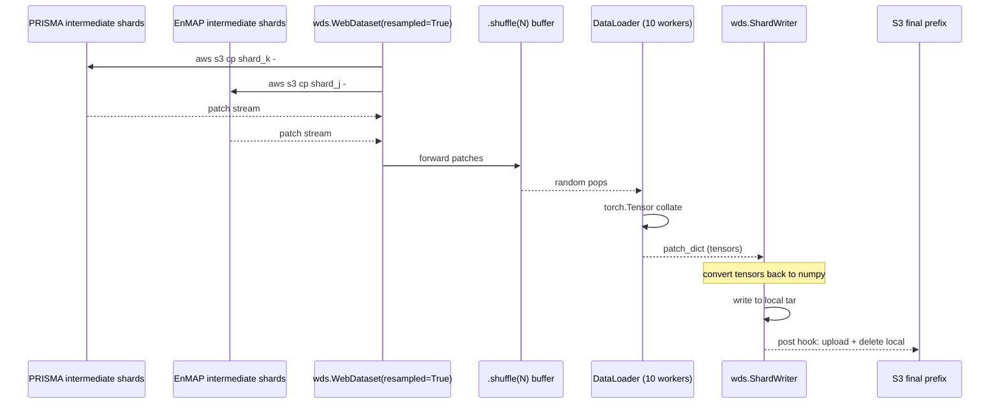

# 6. Final Shuffling — Cross-Scene Mixing

The intermediate shards are written one scene at a time, so all
patches inside a single shard come from one scene and tend to be
spatially adjacent (consecutive sliding-window corners). If a
trainer read those shards in order, every minibatch would be drawn
from the same geography — disastrous for stochastic gradient
descent. The final shufflers exist to fix this: they re-read the
intermediate shards, randomize the order across shards and within
shards, and write new "final" shards that the trainer actually
consumes.

## What the code does

After every per-sensor sharder has uploaded intermediate shards to
`patches/{sensor}/{split}/intermediate/w*_h*_s*/`, the **final**
shufflers re-read those shards and emit a new set of shards under
`patches/.../final/...`. There are two shufflers — one per-sensor
and one cross-sensor for hyperspectral.

### 6.1 Single-sensor: `FinalPatchShuffler`

[`FinalPatchShuffler`](../../app/utils/patch_generation/final/final_patcher.py)
at [final_patcher.py:28](../../app/utils/patch_generation/final/final_patcher.py).

- Builds source and destination prefixes from the *same*
  `IntermediateSharder.build_prefix` helper used on the writer side
  at
  [final_patcher.py:54-69](../../app/utils/patch_generation/final/final_patcher.py).
  Source uses `stage="intermediate"`; destination uses
  `stage="final"`.
- `_compute_shard_ranges` at
  [final_patcher.py:111-142](../../app/utils/patch_generation/final/final_patcher.py)
  paginates the source prefix, extracts the numeric suffix of each
  shard filename, finds min/max, and rebuilds a brace-expansion
  range like `intermediate_shard_{0000..0123}.tar`. The shard
  "identifier" is the first two underscore-separated tokens of the
  filename stem (`intermediate_shard`), which is how the same code
  works for both intermediate and final patterns.
- Constructs the pipe URL:

  ```
  pipe: aws s3 cp s3://allotrope-raw-data-india/patches/landsat/train/intermediate/w128_h128_s64/intermediate_shard_{0000..0123}.tar -
  ```

  at
  [final_patcher.py:76-78](../../app/utils/patch_generation/final/final_patcher.py).
- Wraps that URL in
  `wds.WebDataset(url, resampled=True).shuffle(N, initial=N).decode()`
  at
  [final_patcher.py:93-97](../../app/utils/patch_generation/final/final_patcher.py),
  then a `DataLoader` with `num_workers=10, batch_size=None`.
- `write_shards` pulls `patch_write_count` samples, converts every
  tensor back to NumPy (the `DataLoader` auto-converts NumPy to
  torch, but WebDataset can only serialize NumPy), and writes them
  to a new `ShardWriter` whose `post=upload_hook` pushes each
  finished tar to the destination prefix at
  [final_patcher.py:144-165](../../app/utils/patch_generation/final/final_patcher.py).

There is a `__main__` block at
[final_patcher.py:168-185](../../app/utils/patch_generation/final/final_patcher.py)
that runs the train and test shufflers for Landsat in sequence — the
canonical invocation when you want to (re-)build final shards.

### 6.2 Cross-sensor: `HyperspectralFinalShuffler`

[`HyperspectralFinalShuffler`](../../app/utils/patch_generation/final/hyperspectral_final_patcher.py)
at [hyperspectral_final_patcher.py:27](../../app/utils/patch_generation/final/hyperspectral_final_patcher.py)
generalises the same idea to multiple sensors.

- Source prefixes are computed per sensor (PRISMA, EnMAP) using
  `build_prefix` at
  [hyperspectral_final_patcher.py:57-66](../../app/utils/patch_generation/final/hyperspectral_final_patcher.py).
  Defaults to `sensors=["prisma", "enmap"]`.
- Destination prefix uses the synthetic sensor name
  `"hyperspectral"` at
  [hyperspectral_final_patcher.py:69-76](../../app/utils/patch_generation/final/hyperspectral_final_patcher.py).
  So PRISMA and EnMAP land under
  `patches/hyperspectral/{split}/final/w*_h*_s*/`, deliberately
  collapsing the source-sensor distinction at the path level.
- Instead of one brace-expansion URL, it enumerates *every
  individual shard key* and emits one `pipe: aws s3 cp <key> -`
  URL per shard at
  [hyperspectral_final_patcher.py:84-92](../../app/utils/patch_generation/final/hyperspectral_final_patcher.py).
  The comment makes the reason explicit: brace expansion inside a
  list of pipe URLs is not reliable. `wds.WebDataset` accepts a
  list of URLs and treats each as a separate shard input — perfect
  for interleaving sensors.

The shuffler raises a `ValueError` at
[hyperspectral_final_patcher.py:94-95](../../app/utils/patch_generation/final/hyperspectral_final_patcher.py)
if no intermediate shards are found under any sensor's source
prefix — which is the sane failure mode when someone runs the final
shuffler before the intermediate sharders.

### `write_shards`: the actual loop

Both shufflers share an essentially-identical `write_shards`
method:

```python
with wds.ShardWriter(self.shard_temp_location, maxsize=TARGET_GB, post=self.upload_hook) as sink:
    for i, patch_dict in tqdm(enumerate(self.dataloader)):
        if i >= self.patch_write_count:
            break
        for key, value in patch_dict.items():
            if isinstance(value, torch.Tensor):
                patch_dict[key] = value.cpu().numpy()
        sink.write(patch_dict)
```

(See
[final_patcher.py:144-165](../../app/utils/patch_generation/final/final_patcher.py)
and
[hyperspectral_final_patcher.py:144-161](../../app/utils/patch_generation/final/hyperspectral_final_patcher.py).)

The torch-to-numpy conversion is necessary because `DataLoader`
auto-collates NumPy arrays into `torch.Tensor`, and `ShardWriter`
cannot serialize tensors. The `cpu()` is a no-op when nothing has
been moved to GPU, which is the typical case for the shuffler
process.

## Theory in plain language

The fundamental tension here is **shuffle quality vs streaming I/O**.

A perfect shuffle would load every patch into memory, shuffle the
list, and stream it out. With millions of ~4 MiB patches that
requires terabytes of RAM. The final shuffler approximates this in
three coordinated ways:

1. **Shard-level randomisation** via `resampled=True`. This makes
   `wds.WebDataset` pick shards uniformly at random *with
   replacement*, so workers across the cluster see different shards
   and a given shard may be visited multiple times across an epoch.
   With ~140 intermediate shards and `patch_write_count = 10000`
   for Landsat, sampling with replacement gives an effectively
   uniform mix.
2. **Sample-level buffer shuffle** via `.shuffle(N, initial=N)`. A
   ring buffer holds `N` samples; each yield pops a random one and
   refills from the input stream. With `N = 10` the buffer is tiny
   (chosen because intermediate shards already hold mixed patches
   and `num_workers=10` provides additional implicit shuffling),
   but the knob is there and is the right one to turn up if downstream
   training shows obvious within-scene correlation.
3. **Cross-sensor mixing** in the hyperspectral case — patches from
   PRISMA and EnMAP scenes appear in the same final shard, which is
   essential if the foundation model is to learn a sensor-agnostic
   representation. The mixing happens implicitly because the
   `intermediate_urls` list contains both sensors' shard URLs and
   the resampled shard picker is sensor-blind.

### Why write back to disk?

Writing the result back into 1 GiB tars (rather than streaming
directly from intermediate shards at train time) is a deliberate
cost-vs-quality tradeoff:

- We pay the shuffle cost once at preprocessing time.
- We get well-mixed shards we can stream sequentially at train time.
- We avoid re-paying that cost every epoch, on every node.

The alternative — running the resampled+shuffle pipeline directly
in the trainer's dataloader — is also supported by WebDataset, but
would couple the trainer's epoch time to the shuffle's overhead and
would make it harder to inspect "the training data" as a concrete
artifact on S3.

### `patch_write_count` semantics

The `patch_write_count` cap (default `10_000` for thermal,
`500_000` for hyperspectral) bounds how many samples come out the
other end. Because the source is read with `resampled=True`, this
is effectively a draw with replacement — exactly the semantics you
want for stochastic training. If a particular intermediate shard has
500 patches and `patch_write_count` is 10,000, that shard might be
visited zero, one, or several times during the shuffle pass; the
final shard set is a random sample.

### `resampled=True` and what it costs

`resampled=True` makes `wds.WebDataset` pick shards uniformly at
random with replacement, indefinitely. This is the only way to get
proper shuffling when the number of shards is small relative to the
number of workers — without it, each worker is assigned a strict
slice of the shard list and you can end up with workers staring at
the same scene for too long. The cost is that some intermediate
shards may not appear in the final output if `patch_write_count` is
small; the mitigation is to keep `patch_write_count` large enough
that the law of large numbers gives near-uniform coverage.

### What if I want full coverage instead of resampling?

`resampled=False` (the default in WebDataset, but we explicitly set
True) makes the dataset iterate each shard exactly once per epoch.
That mode is appropriate for a *validation* or *test* pass over a
known patch set; here we deliberately want the with-replacement
training semantics.

## Worked numerical example: what a shard's tar looks like

A single `intermediate_shard_0000.tar` from PRISMA contains, in
order, the per-patch file groups produced by
`patch_hyperspectral_vendable`. Listing one such shard with
`tar -tf` would look approximately like:

```
PRS_L2D_STD_20231104043512_20231104043516_0001#row_coord:0#col_coord:0.meta.json
PRS_L2D_STD_20231104043512_20231104043516_0001#row_coord:0#col_coord:0.pixels.npy
PRS_L2D_STD_20231104043512_20231104043516_0001#row_coord:0#col_coord:0.validity_cube.npy
PRS_L2D_STD_20231104043512_20231104043516_0001#row_coord:0#col_coord:0.wavelengths.npy
PRS_L2D_STD_20231104043512_20231104043516_0001#row_coord:0#col_coord:32.meta.json
PRS_L2D_STD_20231104043512_20231104043516_0001#row_coord:0#col_coord:32.pixels.npy
...
```

WebDataset groups by the part before the *last* dot, so each group
becomes one Python dict at iteration time:

```python
{
    "__key__":           "PRS_L2D_STD_..._0001#row_coord:0#col_coord:0",
    "meta.json":         {"scene_id": "...", "row_coords": 0, ...},
    "pixels.npy":        np.ndarray,  # (201, 64, 64) float32
    "validity_cube.npy": np.ndarray,  # (201, 64, 64) int8
    "wavelengths.npy":   np.ndarray,  # (201,)        float64
}
```

The `#` characters in the scene id are intentional — they are part
of the same filename stem and are not interpreted by WebDataset's
grouping rule (which splits only on `.`).

A landsat patch dict additionally carries (subset shown):

```python
{
    "pixels.npy":              (1, 128, 128) float32,
    "validity_cube.npy":       (1, 128, 128) int8,
    "predicted_cloud_mask.npy": (1, 128, 128) int8,
    "pure_validity_mask.npy":  (1, 128, 128) int8,
    # plus any of:
    # "custom_quality_mask.npy", "provider_cloud_presence.npy",
    # "provider_water_presence.npy", "provider_snow_presence.npy"
}
```

## Cross-sensor mixing: sequence diagram


