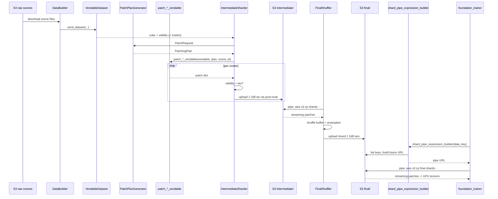

# 8. End-to-End Recap

This section traces a single training patch from a raw scene sitting
in S3 all the way to a tensor inside a `foundation_trainer.py`
training step, and names the two invariants that make the whole
design hold together.

## The flow

To summarise the flow that gets a single training patch from raw S3
to a GPU tensor:

1. A `LandsatDataBuilder`, `PrismaDatasetBuilder`, or
   `EnmapDatasetBuilder` vends a normalized scene-level cube + a
   validity cube + (for Landsat) optional provider masks. The
   builder is fed via `FileSourceConfig(source_path=...)`. See e.g.
   [landsat_intermediate_patcher.py:156-162](../../app/utils/patch_generation/intermediate/landsat_intermediate_patcher.py).

2. [`PatchPlanGenerator.generate_patching_plan`](../../app/utils/patch_generation/generate_patch_plan.py)
   computes `(row, col)` corners with snap-to-edge sliding-window
   tiling, given a `PatchRequest` carrying the cube shape, patch
   height/width, and stride. See
   [generate_patch_plan.py:22](../../app/utils/patch_generation/generate_patch_plan.py).

3. [`patch_landsat_vendable`](../../app/utils/patch_generation/landsat_patcher.py)
   or
   [`patch_hyperspectral_vendable`](../../app/utils/patch_generation/hyperspectral_patcher.py)
   slices the cube and aligned masks at each corner and yields a
   dict with `pixels.npy`, `validity_cube.npy`, `meta.json`, and
   (depending on sensor) `wavelengths.npy` plus optional provider
   masks.

4. `LandsatIntermediateSharder.sharder` (or its PRISMA / EnMAP
   counterpart) filters by validity ($\tau = 0.5$), writes 1 GiB
   `wds.ShardWriter` tars locally, and uploads each finished shard
   to `patches/{sensor}/{split}/intermediate/w*_h*_s*/`. See e.g.
   [landsat_intermediate_patcher.py:180-222](../../app/utils/patch_generation/intermediate/landsat_intermediate_patcher.py).

5. [`FinalPatchShuffler`](../../app/utils/patch_generation/final/final_patcher.py)
   (single-sensor) or
   [`HyperspectralFinalShuffler`](../../app/utils/patch_generation/final/hyperspectral_final_patcher.py)
   (multi-sensor) re-reads those tars via `pipe: aws s3 cp ...`,
   shuffles across scenes with a `resampled=True` + `.shuffle(N)`
   combination, and writes new tars under
   `patches/.../final/...`.

6. At train time,
   [`shard_pipe_expression_builder`](../../app/utils/general_utils/shard_pipe_expression_builder.py)
   reconstructs the exact brace-expansion pipe URL for the final
   prefix; the foundation trainer hands that URL to
   `wds.WebDataset`, decodes `meta.json`, `pixels.npy`,
   `validity_cube.npy`, etc., and yields batched tensors. The call
   lives at
   [foundation_trainer.py:337](../../app/abstract_classes/foundation_trainer.py).

## The two invariants

The two invariants that hold the design together are:

- **Geometry is encoded in the S3 prefix.** No metadata service, no
  ambiguity about which patches you are training on. The writer
  (`IntermediateSharder.build_prefix`) and the reader
  (`shard_pipe_expression_builder`) agree on the same string by
  construction. Add a new patch size, get a new prefix; never
  collides with the old one.

- **The plan is decoupled from the cut.** All aligned arrays for a
  scene share one set of `(row, col)` corners, which is why adding a
  new mask type to a patch dict (e.g. `provider_snow_presence`)
  required no changes anywhere else in the pipeline — the cutter
  loops over the same corners and emits one more key per patch.

## Where the knobs live

A cheat sheet of every knob and where to find its default:

| Knob | Source | Default | Notes |
|------|--------|---------|-------|
| Landsat geometry | [landsat_intermediate_patcher.py:51-53](../../app/utils/patch_generation/intermediate/landsat_intermediate_patcher.py) | `w=128, h=128, s=64` | |
| Hyperspectral geometry | [prisma_intermediate_patcher.py:54-56](../../app/utils/patch_generation/intermediate/prisma_intermediate_patcher.py), [enmap_intermediate_patcher.py:55-57](../../app/utils/patch_generation/intermediate/enmap_intermediate_patcher.py) | `w=64, h=64, s=32` | PRISMA and EnMAP share defaults. |
| Validity threshold | [prisma_intermediate_patcher.py:57](../../app/utils/patch_generation/intermediate/prisma_intermediate_patcher.py) | `0.5` | Hard-coded `0.5` for Landsat. |
| Shard target size | [landsat_intermediate_patcher.py:63](../../app/utils/patch_generation/intermediate/landsat_intermediate_patcher.py) | `1 GiB` | Same for all sensors. |
| Test fraction | [landsat_intermediate_patcher.py:49](../../app/utils/patch_generation/intermediate/landsat_intermediate_patcher.py) | `0.2` | |
| Split seed | [landsat_intermediate_patcher.py:50](../../app/utils/patch_generation/intermediate/landsat_intermediate_patcher.py) | `42` | Deterministic. |
| Final shuffle buffer | [final_patcher.py:47](../../app/utils/patch_generation/final/final_patcher.py) | `10` | Combined with worker-level shuffling. |
| Final worker count | [final_patcher.py:46](../../app/utils/patch_generation/final/final_patcher.py) | `10` | `num_workers` on `DataLoader`. |
| Patch write count (Landsat final) | [final_patcher.py:48](../../app/utils/patch_generation/final/final_patcher.py) | `10_000` | |
| Patch write count (hyperspectral final) | [hyperspectral_final_patcher.py:47](../../app/utils/patch_generation/final/hyperspectral_final_patcher.py) | `500_000` | |

## End-to-end sequence diagram

## What changes when you add a sensor

A useful litmus test for the design: what would you change to add,
say, AVIRIS-NG as a fourth sensor?

1. A new `AvirisDataBuilder` that produces a vendable with the
   `normalized_hyperspectral_cube`, `validity_cube`,
   `band_cw_order`, and `spectral_family_order` shape.
2. A new `AvirisIntermediateSharder(IntermediateSharder)` subclass
   that sets `SENSOR = "aviris"` and implements `s3_searcher`,
   `s3_downloader`, `patch_generator`. The `patch_generator` reuses
   `patch_hyperspectral_vendable` unchanged.
3. Add `"aviris"` to the `sensors` list when constructing
   `HyperspectralFinalShuffler` to mix it into the unified
   hyperspectral final prefix.

That's it. No changes to the planner, the cutter, the abstract
sharder, the final shuffler, the pipe expression builder, or the
trainer. The pipeline absorbs the new sensor because every layer
above the per-sensor sharder is sensor-agnostic.
