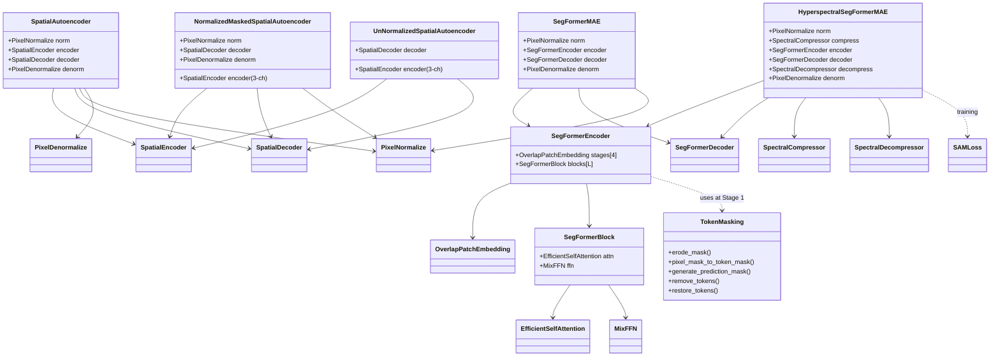

# 3.0 Architecture Map — which components compose which model

The seven foundation-model architectures in Allotrope are reconstruction-based anomaly
detectors. Each carries an Indic codename, recorded in `checkpoints/<arch>/current.json` and
in `memory/project_model_codenames.md`:

| # | Architecture (slug) | Codename | Devanagari | Family |
|---|---|---|---|---|
| 1 | `spatial_autoencoder` | Pratibimba | प्रतिबिंब | Convolutional AE |
| 2 | `spatial_masked_autoencoder` | Antardhana | अंतर्धान | Convolutional MAE |
| 3 | `spatial_masked_autoencoder_l1` | Tirohita | तिरोहित | Convolutional MAE |
| 4 | `spatial_masked_autoencoder_l1_unnormalized` | Asanskrita | असंस्कृत | Convolutional MAE |
| 5 | `normalized_masked_autoencoder` | Drashta | द्रष्टा | Convolutional MAE |
| 6 | `segformer_mae` | Chakshu | चक्षु | Transformer MAE |
| 7 | `hyperspectral_segformer_mae` | Indradhanu | इंद्रधनु | Transformer MAE + spectral bottleneck |

## How the components factor

The components factor into four reusable building blocks:

1. **Conv encoder / decoder** — `SpatialEncoder`, `SpatialDecoder` and their blocks. The
   building blocks of the four convolutional autoencoders.
2. **Transformer encoder / decoder** — `OverlapPatchEmbedding`, `EfficientSelfAttention`,
   `MixFFN`, `SegFormerBlock`, `SegFormerEncoder`, `SegFormerDecoder`. The building blocks
   of the two SegFormer-based MAEs.
3. **Masking utilities** — `TokenMasking` (token gather/scatter, erosion, checkerboard),
   `PixelNormalize`/`PixelDenormalize`.
4. **Spectral and loss helpers** — `SpectralCompressor`/`SpectralDecompressor`, `SAMLoss`.

Each numbered model composes a subset of these. The table below maps components to models.

```
                Pratibimba  Antardhana / Tirohita / Asanskrita   Drashta    Chakshu    Indradhanu
                ----------  ----------------------------------   --------   --------   ----------
PixelNormalize     opt              n/a                            yes        opt        yes
SpatialEncoder     yes               yes (3-chan input)            yes(3ch)    -          -
SpatialDecoder     yes               yes                           yes         -          -
SegFormerEncoder    -                 -                             -         yes        yes
SegFormerDecoder    -                 -                             -         yes        yes
OverlapPatchEmbed   -                 -                             -         yes        yes
SegFormerBlock      -                 -                             -         yes        yes
EfficientSelfAttn   -                 -                             -         yes        yes
MixFFN              -                 -                             -         yes        yes
TokenMasking        -                 -                             -         (ext.)     (ext.)
SpectralCompressor  -                 -                             -          -         yes
SAMLoss             -                 -                             -          -         yes (training)
```

## Top-level wrappers

- **Pratibimba** -> [spatial_auto_encoder.py](../../app/foundation_models/components/spatial_auto_encoder.py):
  `SpatialEncoder` + `SpatialDecoder` + optional pixel normalization.
- **Antardhana / Tirohita / Asanskrita** -> variants of the masked spatial autoencoder.
  Antardhana/Tirohita normalize; Asanskrita (the "unrefined" one) skips normalization — see
  [unnormalized_spatial_auto_encoder.py](../../app/foundation_models/components/unnormalized_spatial_auto_encoder.py).
- **Drashta** -> [normalized_masked_spatial_auto_encoder.py](../../app/foundation_models/components/normalized_masked_spatial_auto_encoder.py):
  3-channel input (pixels + validity + input mask) + normalization.
- **Chakshu** -> [seg_former_mae.py](../../app/foundation_models/components/seg_former_mae.py):
  SegFormer encoder + MLP/PixelShuffle decoder.
- **Indradhanu** -> [hyperspectral_seg_former_mae.py](../../app/foundation_models/components/hyperspectral_seg_former_mae.py):
  SegFormer MAE wrapped with `SpectralCompressor` / `SpectralDecompressor`.

## Class hierarchy

The relationship between top-level wrappers and shared components:



## Reading order

If you read the sections linearly, the dependency order is the same as the directory
ordering: normalization helpers first, then conv blocks, then conv autoencoders, then the
transformer primitives, then the SegFormer MAE wrappers, then the spectral and loss helpers.
The rest of this chapter takes each component in turn.
