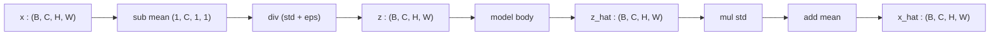

# 3.1 `PixelNormalize` / `PixelDenormalize`

File: [pixel_normalization.py](../../app/foundation_models/components/pixel_normalization.py)

## What the code does

`PixelNormalize` stores per-channel mean and standard-deviation as **registered buffers** of
shape `(1, C, 1, 1)` so they broadcast cleanly against `(B, C, H, W)` inputs
([pixel_normalization.py:10](../../app/foundation_models/components/pixel_normalization.py#L10)).
The forward pass is the standard z-score transform

$$z = \frac{x - \mu}{\sigma}$$

([pixel_normalization.py:13](../../app/foundation_models/components/pixel_normalization.py#L13)).
`PixelDenormalize` is the exact inverse $x = z\sigma + \mu$
([pixel_normalization.py:24](../../app/foundation_models/components/pixel_normalization.py#L24)).
Both subclass `nn.Module` so the buffers move with `.to(device)` and survive
`state_dict()` round-trips, but they have no trainable parameters.

### Why buffers, not parameters

Registered buffers (`self.register_buffer("mean", ...)`) live in the `state_dict` but
`requires_grad=False`. This is the standard PyTorch idiom for "non-trainable state that
must move with the module". The result:

- `model.to("cuda")` moves `mean` and `std` to GPU automatically.
- `torch.save(model.state_dict())` records them, so a freshly-loaded checkpoint comes with
  its normalization stats baked in — no separate preprocessing config to manage.
- The optimizer never touches them.

### Parameter count

Zero trainable parameters. The buffers themselves are $2 \cdot C$ floats (one mean and one
std per channel) plus a tiny `epsilon` constant.

### Forward pass diagram

## Theory in plain language

Neural networks train fastest when inputs are zero-mean and unit-variance: gradients of
linear layers scale with input magnitude, and large inputs push GELU / softmax outputs into
saturated regions where the derivative is near zero. For Earth-observation data the natural
units (Kelvin for thermal, reflectance in $[0, 1]$ or scaled radiance for hyperspectral) are
nowhere near that range, so per-channel z-scoring is essentially mandatory.

### Why z-scoring helps gradient flow

Consider a linear layer $y = Wx$. The gradient with respect to $W$ is

$$\frac{\partial \mathcal{L}}{\partial W} = \frac{\partial \mathcal{L}}{\partial y}\, x^\top.$$

If $x$ has magnitude on the order of $300$ (Kelvin) instead of $1$, the gradient
magnitude is $300\times$ larger on the very first layer. With Adam's adaptive scaling this is
masked somewhat, but with plain SGD the network simply cannot use a sensible learning rate.

Z-scoring brings $x$ to $\mathcal{O}(1)$, so the first layer's gradient lives in a similar
scale to the deeper layers' gradients, and one global learning rate works everywhere.

### Why this lives inside the model

The buffer pattern is the standard PyTorch idiom — see ViT and SegFormer reference
implementations — and it keeps preprocessing "inside the model" so a checkpoint is
self-contained. The alternative (z-scoring in the data pipeline) means the inferencer must
know the exact stats used at train time, and a mismatch produces silently broken
reconstructions.

### Edge cases

- **Zero std**: with $\sigma = 0$ for some dead band, the division would produce `inf`. The
  constructor adds a small `eps` (default $10^{-8}$) to `std` before storing it.
- **Masked pixels**: an input pixel that was set to zero before normalization maps to
  $-\mu/\sigma$, which for typical thermal stats is around $-30$. That is far
  out-of-distribution and gives the encoder an unambiguous "this is masked" signal.
- **Saving and loading**: because the buffers are part of `state_dict`, two checkpoints
  trained with different stats are NOT interchangeable. The codebase guards against this by
  recording stats in `current.json` alongside the checkpoint hash.

## Worked numerical example

### Single thermal channel

Given $\mu = [300.0]$, $\sigma = [10.0]$ for a thermal band, a pixel reading $x = 315\,\text{K}$ maps to

$$z = \frac{315 - 300}{10} = 1.5.$$

A 0 K masked pixel maps to

$$z = \frac{0 - 300}{10} = -30.0,$$

which is far out-of-distribution and gives the encoder an unambiguous "this is masked" signal.

### Multi-band example (hyperspectral)

For PRISMA with $C = 200$ bands and a typical reflectance value $x = 0.42$ in band 50 where
$\mu_{50} = 0.30$, $\sigma_{50} = 0.08$:

$$z_{50} = \frac{0.42 - 0.30}{0.08} = 1.5.$$

After model inference produces $\hat z_{50} = 1.45$, denormalization recovers

$$\hat x_{50} = 1.45 \cdot 0.08 + 0.30 = 0.416.$$

The error in z-space is $0.05$; the error in reflectance space is $0.004$. Reporting
reconstruction error in physical units requires denormalization to happen before any
$|\hat x - x|$ comparison, which is exactly what the top-level wrappers do.
