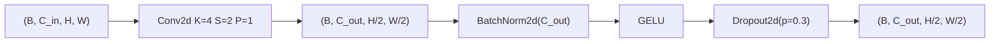
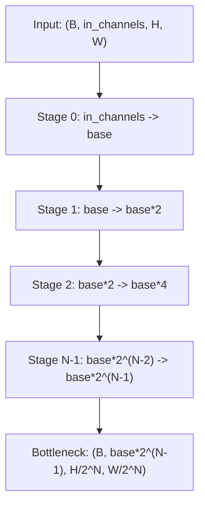

# 3.2 `SpatialEncoder` and `SpatialEncoderBlock`

File: [spatial_encoder.py](../../app/foundation_models/components/spatial_encoder.py)

## What the code does

`SpatialEncoderBlock` is `Conv2d(K=4, S=2, P=1) → BatchNorm2d → GELU → Dropout2d(0.3)`
([spatial_encoder.py:35](../../app/foundation_models/components/spatial_encoder.py#L35)). The
choice of `K=4, S=2, P=1` is deliberate: it gives exactly `H_out = H_in / 2` with no
fractional sizes, so the encoder–decoder pair is shape-symmetric without `output_padding`
hacks. The padding is computed generically as `(kernel_size - 2) // 2` so even kernels of
any size (4, 6, 8) yield the same 2x downsample.

`SpatialEncoder` then stacks these blocks, building the channel progression

```
[in_channels, base_channels, base_channels*2, ..., base_channels * 2^(num_stages-1)]
```

([spatial_encoder.py:76](../../app/foundation_models/components/spatial_encoder.py#L76)).
Spatial dims halve at every stage while channel dims double — a classic "total tensor
volume roughly constant" pattern.

### Block-level shape transform



### Hierarchy diagram



### Parameter count

A single block with `Conv2d(C_in, C_out, K=4)`:

$$\text{params} = C_{in} \cdot C_{out} \cdot 16 + C_{out} \quad\text{(conv weight + bias)}$$
$$+\; 2 C_{out} \quad\text{(BatchNorm gamma + beta)}.$$

For `(in=1, out=32)` this is $1\cdot 32 \cdot 16 + 32 + 64 = 608$ params. A 3-stage encoder
with `base=32` has roughly:

- Stage 0 (1 -> 32): 608
- Stage 1 (32 -> 64): $32 \cdot 64 \cdot 16 + 64 + 128 = 33{,}024$
- Stage 2 (64 -> 128): $64 \cdot 128 \cdot 16 + 128 + 256 = 131{,}456$

Total ~165k params. The encoder is dominated by the deepest stage, as is typical.

## Theory in plain language

This is the convolutional encoder pattern from the very early autoencoder literature
(Hinton & Salakhutdinov, *Reducing the Dimensionality of Data with Neural Networks*, 2006)
and is the standard backbone for U-Nets (Ronneberger et al., 2015). The
doubling-channels / halving-spatial recipe lets each layer learn more abstract features at
progressively coarser resolution while keeping FLOPs balanced.

### Why channels double when space halves

Think of each layer's tensor as carrying a fixed "budget" of information. Halving spatial
resolution divides the number of positions by 4, while doubling channels multiplies the
per-position vector dimension by 2. The net effect: each layer has roughly half the total
memory footprint of the layer above. This balances:

- **Compute**: deeper, smaller features pay for richer per-position descriptions.
- **Receptive field growth**: stacking 2x downsamples quickly grows the effective receptive
  field — by stage 3 each position covers a $32 \times 32$ patch of the input.
- **Gradient stability**: keeping per-layer FLOPs in the same order of magnitude avoids one
  layer dominating the loss landscape.

### What each operator does

- **`Conv2d(K=4, S=2, P=1)`**: a learned 2x downsampling filter. Each output cell is a
  weighted sum of a 4x4 input patch. Stride 2 ensures non-overlapping coverage so successive
  outputs do not share input pixels (in contrast to overlapping stride-1 then pool).
- **`BatchNorm2d`** (Ioffe & Szegedy, 2015): normalises each channel across the batch and
  spatial dimensions. This stabilises gradient magnitudes deep in the network. It also
  acts as a mild regularizer because the batch statistics introduce noise.
- **`GELU`** (Hendrycks & Gimpel, 2016): the smooth nonlinearity used in BERT/GPT/SegFormer.
  It behaves like ReLU for large inputs but has a non-zero gradient for slightly-negative
  inputs, helping gradient flow. Mathematically $\text{GELU}(x) = x \cdot \Phi(x)$ where
  $\Phi$ is the standard Gaussian CDF.
- **`Dropout2d(0.3)`**: drops **entire channels** with probability $0.3$ at train time. This
  is the correct dropout variant for convolutional features because neighbouring spatial
  positions in the same channel are strongly correlated; dropping individual cells barely
  perturbs the signal.

### Output size formula

The general output spatial size after a stage is

$$H_{out} = \lfloor (H_{in} + 2P - K)/S \rfloor + 1 = (H_{in} + 2 - 4)/2 + 1 = H_{in}/2.$$

For `H_in` divisible by `2^num_stages`, every stage is exact and no padding artifacts appear.

## Worked shape walk-through

### Single-channel input (thermal)

For `base_channels=32, num_stages=3`, input `(B=2, 1, 128, 128)`:

```
Stage 0: (2, 1,   128, 128) -> Conv(1 -> 32,  K4S2P1) -> (2, 32,  64, 64)
Stage 1: (2, 32,  64,  64)  -> Conv(32 -> 64, K4S2P1) -> (2, 64,  32, 32)
Stage 2: (2, 64,  32,  32)  -> Conv(64 -> 128,K4S2P1) -> (2, 128, 16, 16)
```

The bottleneck is `(2, 128, 16, 16)` — a 64x spatial compression with 128x channel
expansion. Total elements: input has $2 \cdot 128 \cdot 128 = 32{,}768$; bottleneck has
$2 \cdot 128 \cdot 16 \cdot 16 = 65{,}536$. The bottleneck is twice as large as the input;
the model is *not* compressing here, it is re-representing. Compression by information
bottleneck requires a deeper or narrower stack.

### Three-channel input (masked AE)

For Drashta / Asanskrita with `in_channels=3` (pixels + validity + input mask), `base=32`,
`num_stages=3`, input `(B=2, 3, 128, 128)`:

```
Stage 0: (2, 3,   128, 128) -> Conv(3 -> 32, K4S2P1) -> (2, 32,  64, 64)
Stage 1: (2, 32,  64,  64)  -> Conv(32 -> 64)        -> (2, 64,  32, 32)
Stage 2: (2, 64,  32,  32)  -> Conv(64 -> 128)       -> (2, 128, 16, 16)
```

The only difference from the single-channel case is Stage 0's first conv has `3 -> 32`
weights instead of `1 -> 32`, adding $2 \cdot 32 \cdot 16 = 1024$ extra parameters. Each
output channel learns a linear combination of the three input channels at each input
location, which is exactly the mechanism by which the network learns "this pixel is masked
because the mask channel says so".
