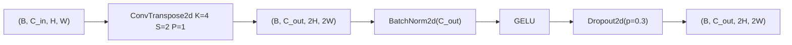
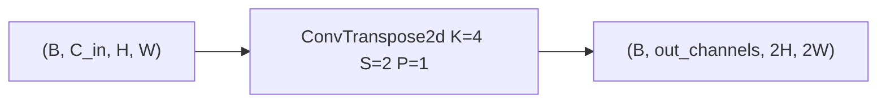
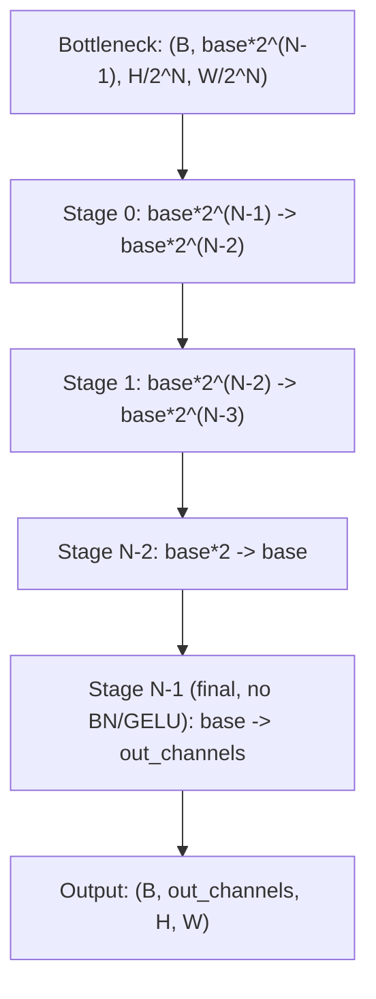

# 3.3 `SpatialDecoder` and `SpatialDecoderBlock`

File: [spatial_decoder.py](../../app/foundation_models/components/spatial_decoder.py)

## What the code does

`SpatialDecoderBlock` mirrors the encoder using `ConvTranspose2d(K=4, S=2, P=1)`
([spatial_decoder.py:49](../../app/foundation_models/components/spatial_decoder.py#L49)) for an
exact 2x upsample. Intermediate blocks add `BatchNorm + GELU + Dropout`, but the **final**
block deliberately drops them
([spatial_decoder.py:51](../../app/foundation_models/components/spatial_decoder.py#L51)) so the
output can take any value range — temperatures aren't zero-mean unit-variance, so forcing BN
on the output would destroy the reconstruction.

`SpatialDecoder` reverses the encoder's channel list and tacks `out_channels` on the end
([spatial_decoder.py:92](../../app/foundation_models/components/spatial_decoder.py#L92)).

### Block-level shape transform (intermediate block)



### Final block (no BN, no GELU)



### Hierarchy diagram



### Parameter count

`ConvTranspose2d` has the same parameter count as a forward conv with the same
`(C_in, C_out, K)`:

$$\text{params} = C_{in} \cdot C_{out} \cdot 16 + C_{out}.$$

A 3-stage decoder from `(128, 16, 16) -> (1, 128, 128)` mirrors the encoder's counts:

- Stage 0 (128 -> 64): $128 \cdot 64 \cdot 16 + 64 = 131{,}136$ + BN(128) = 131,264
- Stage 1 (64 -> 32): $64 \cdot 32 \cdot 16 + 32 = 32{,}800$ + BN(64) = 32,928
- Stage 2 (32 -> 1, final): $32 \cdot 1 \cdot 16 + 1 = 513$ (no BN)

Total ~165k params, symmetric with the encoder.

## Theory in plain language

`ConvTranspose2d` (a.k.a. *fractionally-strided convolution*) is the learnable inverse of a
strided conv. Geometrically it inserts zeros between input pixels and runs a learned kernel
over the expanded grid, so each output pixel is a learned blend of nearby inputs. The output
size formula

$$H_{out} = (H_{in} - 1)\,S - 2P + K = 2 H_{in}$$

is the algebraic mirror of the encoder. Substituting $S=2, P=1, K=4$:
$H_{out} = 2(H_{in} - 1) - 2 + 4 = 2 H_{in}$.

### Why ConvTranspose, not bilinear upsample + conv

There are two ways to undo a 2x strided conv:

1. **`ConvTranspose2d`** (used here): one learned op that does upsample and conv together.
2. **`F.interpolate(mode='bilinear', scale=2)` + `Conv2d`**: hard-coded upsample then a
   learned 3x3 conv.

ConvTranspose is more expressive — every output pixel is a fully learned function of the
input neighbourhood, including the choice of how to "spread" each input cell. The price is
the well-known **checkerboard artifact** (Odena et al., 2016): when stride does not evenly
divide the kernel, certain output positions are touched by more kernel weights than others.
Using `K=4, S=2` (so $K$ is an integer multiple of $S$) avoids this: every output pixel is
hit by exactly the same number of kernel weights.

### Why skip BN and GELU on the final block

Skipping BN/GELU on the final layer is a standard trick lifted from DCGAN (Radford et al.,
2015) and pix2pix (Isola et al., 2017): the model should freely emit any temperature or
reflectance value the data requires.

- BatchNorm would force the output channel to zero mean unit variance per batch, but the
  target (e.g. a denormalized temperature distribution) is *not* unit variance.
- GELU would clamp outputs at zero for large negative inputs, which is fine for the
  *normalized* range $[-3, 3]$ where the model operates internally, but the final output
  needs to traverse the full negative side too (denormalized temperatures can be any value).

### Connection to U-Net

Allotrope's SpatialAE is structurally a U-Net **without skip connections**. The encoder
compresses; the decoder reconstructs from the bottleneck alone. Skip connections would let
the decoder bypass the bottleneck, which defeats the purpose of an information-bottleneck
anomaly detector — anomalies would be copied through the skips and the reconstruction error
would be near zero everywhere.

## Worked shape walk-through

### Single-channel reconstruction

For `base_channels=32, num_stages=3, out_channels=1`, bottleneck `(2, 128, 16, 16)`:

```
Stage 0: (2, 128, 16, 16) -> ConvT(128 -> 64) -> BN+GELU -> (2, 64, 32, 32)
Stage 1: (2, 64,  32, 32) -> ConvT(64 -> 32)  -> BN+GELU -> (2, 32, 64, 64)
Stage 2: (2, 32,  64, 64) -> ConvT(32 -> 1)   [final, no BN/GELU]  -> (2, 1, 128, 128)
```

### Multi-channel reconstruction (rare)

If the decoder targets a 3-channel output (e.g. RGB visualization output during training),
the only change is Stage 2 emitting `out=3` instead of `out=1`. The parameter delta is small:
$32 \cdot 3 \cdot 16 + 3 = 1539$ instead of $513$.

### Output-size sanity check

Per stage: $H_{out} = (H_{in} - 1) \cdot 2 - 2 + 4 = 2 H_{in}$.

| Stage | H_in | H_out (algebraic) |
|-------|------|-------------------|
| 0 | 16 | $(16-1)\cdot 2 - 2 + 4 = 32$ |
| 1 | 32 | $(32-1)\cdot 2 - 2 + 4 = 64$ |
| 2 | 64 | $(64-1)\cdot 2 - 2 + 4 = 128$ |

The exact 2x doubling is what makes the encoder/decoder shape-symmetric without
`output_padding`.
