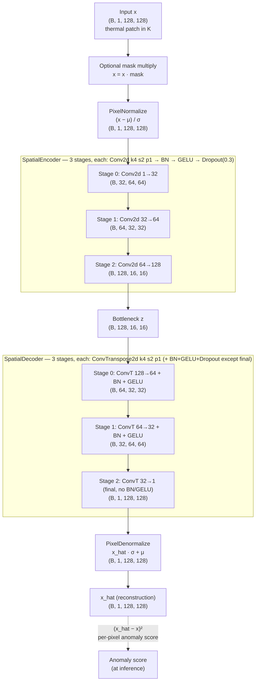
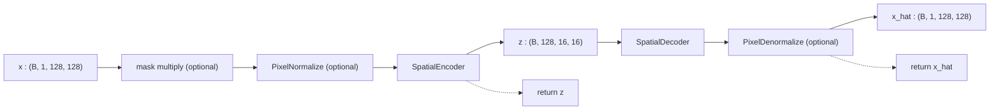

# 3.4 `SpatialAutoencoder` — Pratibimba

File: [spatial_auto_encoder.py](../../app/foundation_models/components/spatial_auto_encoder.py)

Codename **Pratibimba** (प्रतिबिंब), Sanskrit for "reflection / mirror image" — the
autoencoder reflects its input back through a learned bottleneck.

## Full architecture diagram

Defaults shown: `in_channels=1`, `base_channels=32`, `num_stages=3`, input
`128×128`. Each block is annotated with the operation, the tensor shape after
it, and (for conv layers) the kernel/stride/padding combo. The encoder halves
spatial dims and doubles channels at every stage; the decoder mirrors it back.



Notes on the diagram:

- The exact (k=4, s=2, p=1) combo is chosen because it gives **exactly** half /
  double on each axis, with no fractional sizes or `output_padding`.
- BatchNorm and GELU appear in every stage **except** the final decoder stage,
  which must produce values in real temperature units (Kelvin) and cannot be
  forced into zero-mean / non-negative range.
- The two channel-progression endpoints — input `in_channels=1` and bottleneck
  width `base_channels · 2^(num_stages−1) = 128` — are the two knobs you tune
  per sensor.

## What the code does

`SpatialAutoencoder.__init__` wires the encoder and decoder together and optionally attaches
`PixelNormalize` / `PixelDenormalize`
([spatial_auto_encoder.py:37](../../app/foundation_models/components/spatial_auto_encoder.py#L37)).
`forward(x, mask=None)` applies the optional validity mask (zeroing invalid pixels),
normalizes, encodes to a bottleneck `z`, decodes, and denormalizes
([spatial_auto_encoder.py:45](../../app/foundation_models/components/spatial_auto_encoder.py#L45)).
The forward returns both `x_hat` and `z` — `z` is useful for inspection or downstream tasks.

### Forward pass diagram



### Parameter count summary

For the default `base_channels=32, num_stages=3, in/out=1`:

- Encoder: ~165k params (see Section 3.2)
- Decoder: ~165k params (see Section 3.3)
- Normalization buffers: 2 floats per channel, no trainable params.

Total: ~330k. By comparison, SegFormer-B0 has ~3.7M trainable params; the spatial AE is
~10x cheaper.

### Edge cases

- **`mask=None`**: forward proceeds without any pixel zeroing. Used when the upstream
  pipeline has already cleaned invalid pixels.
- **`normalize=False` at construction time**: the wrapper skips both `PixelNormalize` and
  `PixelDenormalize`, and the encoder operates directly in input units. This is the same
  internal behaviour as Asanskrita, but without the extra mask channels.
- **Shape mismatch**: if `H % 2^num_stages != 0` the bottleneck rounds down on each stage,
  and the decoder cannot perfectly reconstruct to the original size. The pipeline is
  expected to feed 128x128 patches, which is divisible by $2^7$.

## Theory in plain language

This is the textbook autoencoder. With sufficient bottleneck capacity it learns the identity;
with a *constrained* bottleneck (e.g. `(B, 128, 16, 16)` for a `(B, 1, 128, 128)` input — a 64x
spatial compression) it must throw away information, and the cleanest information to keep is
the "common" structure of the training distribution. Anomalies — rare patterns the
bottleneck cannot represent — produce high reconstruction error:

$$A(i,j) = \big(\hat{x}(i,j) - x(i,j)\big)^2.$$

The intuition traces back to Hinton & Salakhutdinov (2006) and has been the foundation of
unsupervised anomaly detection since (see also Bergmann et al., *Improving Unsupervised
Defect Segmentation by Applying Structural Similarity*, 2018).

### Information bottleneck framing

If the input lives in $\mathbb{R}^{128 \cdot 128}$ and the bottleneck lives in
$\mathbb{R}^{128 \cdot 16 \cdot 16} = \mathbb{R}^{32{,}768}$, the bottleneck is *bigger* than
the input in raw dimensionality. So where is the compression?

The answer: the bottleneck is **structured**. Spatial dimensions have decreased by 64x while
channels have increased by 128x. The encoder cannot represent arbitrary high-frequency
variation in the input — once two pixels share a downsampled location, only their joint
summary survives. So the bottleneck compresses *spatial* information harshly even though its
overall dimensionality is large.

Anomalies are typically:

1. **Spatially small** (a single hot pixel) — the encoder's strided convs blur them into
   the surrounding background, and the decoder cannot recover them.
2. **Spectrally / radiometrically rare** — the encoder's filters were never trained on this
   pattern, so they produce a meaningless representation that the decoder cannot map back to
   the input.

Either way, $\hat x \neq x$ at the anomaly, and the per-pixel squared error becomes the
anomaly score.

### Why "Pratibimba"

The codename emphasizes that Pratibimba is the simplest, purest mirror in the collection: no
masking, no spectral compressor, no transformer. Its anomaly score is exactly "the
difference between you and your reflection".

## Worked numerical example

### Building the model

```python
ae = SpatialAutoencoder(
    in_channels=1,
    out_channels=1,
    base_channels=32,
    num_stages=3,
    mean=[300.0],
    std=[10.0],
    normalize=True,
)
```

### Forward on a single patch

Input `x` of shape `(1, 1, 128, 128)` with a hot pixel `x[0, 0, 64, 64] = 450 K` and a
background of $300\,\text{K}$:

1. **Mask multiply (skipped, mask=None)**: `x` unchanged.
2. **Normalize**: $z = (x - 300)/10$. Background -> 0, hot pixel -> 15.
3. **Encode**: `(1, 1, 128, 128) -> (1, 128, 16, 16)`. The hot pixel's contribution is
   diluted across a $16 \times 16$ receptive field; the bottleneck cannot represent
   "isolated +15 at (64, 64)" because such a pattern is rare in training data.
4. **Decode**: `(1, 128, 16, 16) -> (1, 1, 128, 128)`. Reconstructs the background ~0 and
   smears the hot pixel into a weak ~+1 blob around the original position.
5. **Denormalize**: $\hat x = \hat z \cdot 10 + 300$. Background ~300 K. Smeared blob
   ~310 K.

### Anomaly map

Per-pixel squared error:

- At the anomaly pixel: $(310 - 450)^2 = 19{,}600$.
- At background: $(300 - 300)^2 = 0$.

A 5-pixel-radius gaussian smoothing of this map gives the final anomaly heatmap. The
threshold for "this is an anomaly" is set by the inferencer based on per-scene percentile or
calibrated statistics.
