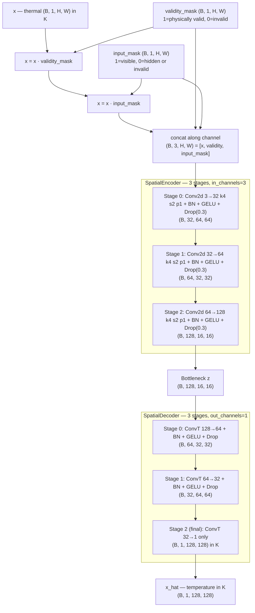
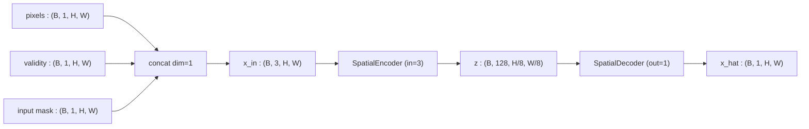

# 3.5 `UnNormalizedSpatialAutoencoder` — Asanskrita

File: [unnormalized_spatial_auto_encoder.py](../../app/foundation_models/components/unnormalized_spatial_auto_encoder.py)

Codename **Asanskrita** (असंस्कृत), Sanskrit for "unrefined / unprocessed" — the model
sees raw, un-normalized values.

## Full architecture diagram

Defaults: `in_channels=1`, `base_channels=32`, `num_stages=3`, input
`128×128`. The encoder takes **3 channels** because two binary masks are
concatenated with the (un-normalised) thermal channel; the decoder still
produces a 1-channel temperature output. Notice there is **no** `PixelNormalize`
or `PixelDenormalize` anywhere — the model lives entirely in Kelvin.

Notes:

- The two mask channels are **information**, not just gating — they tell the
  encoder *which* zeros are real (invalid sensor pixels) and *which* are
  artificial (held-out prediction targets), so the model can avoid copying
  zeros into its reconstruction.
- No normalization means the loss is interpretable in Kelvin and the model can
  be fine-tuned across thermally-different sensors (HotSAT ↔ Landsat) without
  re-fitting a normalisation statistic.

## What the code does

Same architecture as Pratibimba, but the encoder receives a **3-channel input**: the masked
pixel values, a validity mask, and an input mask
([unnormalized_spatial_auto_encoder.py:46](../../app/foundation_models/components/unnormalized_spatial_auto_encoder.py#L46)).
No normalization is applied — the model operates directly in temperature space.

### Input channel layout

The 3-channel input is built per-batch from:

- **Channel 0**: pixel values, with masked positions set to zero. Shape `(B, 1, H, W)`.
- **Channel 1**: validity mask — 1 where the pixel is real, 0 where it is no-data (clouds,
  scene edge, sensor dropout). Shape `(B, 1, H, W)`.
- **Channel 2**: input mask — 1 where the pixel is visible to the encoder, 0 where it has
  been hidden for the reconstruction objective. Shape `(B, 1, H, W)`.

Concatenated: `(B, 3, H, W)`.

### Forward pass diagram

### Parameter count

The only delta from Pratibimba is the first conv of the encoder: `Conv2d(3, 32, K=4)`
instead of `Conv2d(1, 32, K=4)`.

$$\Delta = (3 - 1) \cdot 32 \cdot 16 = 1{,}024.$$

So Asanskrita is ~166k params vs. Pratibimba's ~165k.

## Theory in plain language

There are two reasons to feed the masks as extra channels.

### 1. Distinguishing "no-data" from "masked-on-purpose"

The encoder can distinguish "this pixel is zero because it's invalid (cloud, scene edge)"
from "this pixel is zero because we hid it from you on purpose" — channels 1 and 2 differ
exactly at the masked-but-valid positions.

| Pixel state | ch0 (value) | ch1 (validity) | ch2 (input mask) |
|-------------|------------|----------------|------------------|
| Valid + visible | $x$ | 1 | 1 |
| Valid + masked | 0 | 1 | 0 |
| Invalid (no-data) | 0 | 0 | 0 |

The model learns three different responses based on this 3-bit signature. Without these
channels the encoder would have to guess from spatial context — slower training, lower
asymptote.

### 2. Operating in physical units

By omitting z-scoring you force the network to learn the dataset's natural distribution,
which is sometimes preferable when the downstream anomaly score should be expressed in the
original units. The "Asanskrita" (unrefined) codename refers exactly to this absence of
normalization.

In normalized models the per-pixel error $|\hat x - x|$ is in z-units; to convert it to
Kelvin you have to multiply by $\sigma$. With Asanskrita the error is already in Kelvin, so
downstream calibration is one fewer step.

### The trade-off

Operating without normalization has a real cost: gradients on the first conv are scaled by
the input magnitude (~300 for thermal Kelvin), so the effective learning rate on that one
layer is ~300x larger than on deeper layers. Adam's adaptive scaling absorbs most of this,
but with plain SGD or with rare gradient spikes you get instability. Asanskrita uses Adam
with a lower base learning rate than Pratibimba to compensate.

## Worked numerical example

### Inputs at a single position

Take a $128 \times 128$ patch and look at three pixels:

1. **Background pixel** at $(10, 10)$, value $298\,\text{K}$, valid, visible.
   - ch0 = 298, ch1 = 1, ch2 = 1.
2. **Masked-on-purpose pixel** at $(64, 64)$, true value $302\,\text{K}$, valid, hidden.
   - ch0 = 0 (zeroed because masked), ch1 = 1, ch2 = 0.
3. **Cloud pixel** at $(120, 30)$, value unknown, invalid.
   - ch0 = 0, ch1 = 0, ch2 = 0.

The encoder's first conv sees three distinct 3-vectors: $[298, 1, 1]$, $[0, 1, 0]$,
$[0, 0, 0]$. These map to three different feature directions, so the encoder can react
appropriately.

### Loss masking downstream

The trainer applies the loss only at masked-on-purpose positions (ch1 = 1 AND ch2 = 0), so
pixel 1 contributes nothing (was visible — easy to predict), and pixel 3 contributes
nothing (no ground truth). Only pixel 2's prediction $\hat x_{64, 64}$ is compared against
its true value $302\,\text{K}$:

$$\mathcal{L} = |\hat x_{64, 64} - 302|.$$

Repeat over a few thousand masked positions per batch and you have a usable training
signal.
