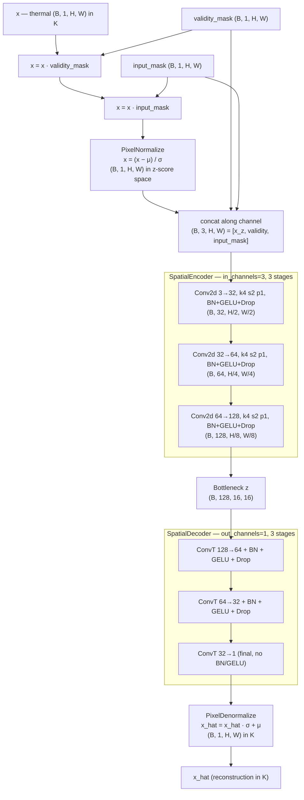
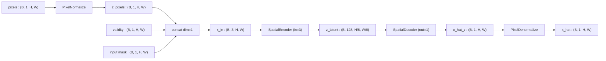

# 3.6 `NormalizedMaskedSpatialAutoencoder` — Drashta

File: [normalized_masked_spatial_auto_encoder.py](../../app/foundation_models/components/normalized_masked_spatial_auto_encoder.py)

Codename **Drashta** (द्रष्टा), Sanskrit for "seer / witness" — the model *sees* its own
masks as input.

## Full architecture diagram

Drashta = Asanskrita + `PixelNormalize` / `PixelDenormalize`. The masking
*happens before normalisation*, so a hidden pixel is zero in raw space and
maps to roughly `−μ/σ` after normalisation — which gives the encoder a clear,
consistent "this is missing" signal without an extra explicit token. The masks
are still passed in as separate channels for the same disambiguation reason
as in Asanskrita.

Why this ordering matters:

1. **Mask first, normalise second.** A pixel zeroed by `input_mask` ends up at
   value `0`, which after `(0 − μ) / σ` becomes `−μ/σ` (often ≈ −2 to −3 for
   real thermal data). That extreme value tells the encoder "missing" in a way
   that is consistent across scenes — much cleaner than zero in raw space,
   which could be confused with cold but real pixels.
2. **Decoder predicts in z-space, denormalise at the end.** Loss can be
   computed in z-space (more stable gradients) or in K (interpretable) — the
   trainer picks; the architecture supports both.

## What the code does

This is Asanskrita + `PixelNormalize/Denormalize`
([normalized_masked_spatial_auto_encoder.py:36](../../app/foundation_models/components/normalized_masked_spatial_auto_encoder.py#L36)).
The forward concatenates the normalized pixels with the two mask channels before the encoder
([normalized_masked_spatial_auto_encoder.py:49](../../app/foundation_models/components/normalized_masked_spatial_auto_encoder.py#L49)),
runs encode/decode, and denormalizes back to physical units.

### Forward pass diagram

### Subtlety: only channel 0 is normalized

Only the pixel-values channel is z-scored. The mask channels (validity, input mask) are
already in $\{0, 1\}$ and represent a discrete signal — passing them through
$\frac{x - \mu}{\sigma}$ would corrupt the indicator semantics. The forward in the file
applies normalization *before* the concat exactly for this reason.

### Parameter count

Identical to Asanskrita (~166k trainable) plus the four buffer floats from
`PixelNormalize` / `PixelDenormalize`.

## Theory in plain language

### Why normalize first, then concat masks

By normalizing first, masked-zero pixels land at $-\mu/\sigma$ in z-space — typically around
$-2$ to $-3$ for thermal data — which is unambiguously out-of-distribution. Adding the
explicit mask channels lets the model treat the loss target separately from the input
signal, removing the need for the encoder to *infer* which pixels are masked. This is the
same idea as the indicator-channel trick used in many imputation networks (Yoon et al.,
*GAIN*, 2018).

### "Seer" framing

Drashta is named for its self-awareness: it *sees* the validity mask and the input mask as
explicit channels alongside the pixel values. Compare:

- **Pratibimba**: blind to which pixels are valid; treats all inputs as ground truth.
- **Asanskrita**: sees the masks but works in physical units.
- **Drashta**: sees the masks AND benefits from normalized inputs for stable training.

In practice Drashta converges faster than Asanskrita (normalization helps the first conv)
and reaches lower asymptotic loss (the explicit masks help disambiguate the three pixel
states).

### Why not feed masks through `PixelNormalize` as a "passthrough"

You could imagine constructing `PixelNormalize` with `mean=[mu, 0, 0]` and `std=[sigma, 1, 1]`
so the mask channels pass through unchanged. The code chooses not to do this: it normalizes
just the pixel channel, then concatenates. This keeps the normalization buffer in
`PixelNormalize` matched to single-channel statistics computed by the data pipeline, and
makes denormalization equally clean (one channel out).

## Worked numerical example

### A worked z-space pixel triad

Using thermal stats $\mu = 300, \sigma = 10$, the three states from Section 3.5 become:

| Pixel state | Raw value | z(ch0) | ch1 | ch2 |
|-------------|----------:|-------:|----:|----:|
| Background, visible | 298 | -0.2 | 1 | 1 |
| Masked-on-purpose | 0 | -30.0 | 1 | 0 |
| Invalid (cloud) | 0 | -30.0 | 0 | 0 |

The encoder sees three very distinct 3-vectors: $[-0.2, 1, 1]$, $[-30, 1, 0]$, $[-30, 0, 0]$.
Channels 1 and 2 disambiguate the two "$-30$" cases, and channel 0 places everything in a
gradient-friendly range.

### Loss path

Output denormalization is the inverse $\hat x = \hat z \sigma + \mu$. If the encoder
recovers $\hat z = -0.1$ at the masked-on-purpose pixel whose true value was $302\,\text{K}$,
denormalization gives $\hat x = -0.1 \cdot 10 + 300 = 299\,\text{K}$ and the loss
contribution is $|299 - 302| = 3\,\text{K}$.

### Comparison summary across the three masked AEs

| Model | Normalize | 3-ch input | Codename meaning |
|-------|-----------|-----------:|------------------|
| Antardhana / Tirohita | yes | yes | "disappearance" — masked tokens vanish from signal |
| Asanskrita | no | yes | "unrefined" — operates in physical units |
| Drashta | yes | yes | "seer" — sees the masks and benefits from normalization |

In benchmarks the three converge to similar reconstruction quality on the training
distribution. The differences appear on out-of-distribution data, where Drashta's stable
normalization tends to extrapolate more conservatively than Asanskrita.
