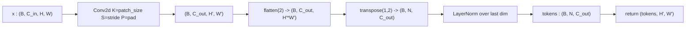

# 3.7 `OverlapPatchEmbedding`

File: [overlap_patch_embedding.py](../../app/foundation_models/components/overlap_patch_embedding.py)

## What the code does

An `OverlapPatchEmbedding` is a single

```
Conv2d(c_in, c_out, kernel_size=patch_size, stride=desired_compression, padding=patch_size//2)
```

followed by `LayerNorm`
([overlap_patch_embedding.py:57](../../app/foundation_models/components/overlap_patch_embedding.py#L57)).
The forward applies the conv, flattens spatial dims, transposes to sequence form, and
LayerNorms each token
([overlap_patch_embedding.py:71](../../app/foundation_models/components/overlap_patch_embedding.py#L71)).
It returns `(tokens, H', W')` — the spatial dims are returned so downstream modules (ESA,
Mix-FFN) can reshape tokens back into a 2D grid for convolutions.

Padding defaults to `patch_size // 2` for overlapping patches; `padding=0` is passed at
Stage 1 of the SegFormer encoder to make it strictly **non-overlapping**
(`kernel = stride = 4`), which is critical for clean MAE token removal.

### Forward pass diagram



### Output spatial size

The output spatial size is determined by the standard conv formula:

$$H' = \lfloor (H + 2P - K)/S \rfloor + 1.$$

- Overlapping (`P = K // 2`): $H' \approx H / S$ with rounding. Adjacent tokens share
  pixels.
- Non-overlapping (`P = 0`, `K = S`): $H' = H / S$ exactly. No shared pixels.

### Parameter count

A single OPE with $C_{in}$ input channels, $C_{out}$ output channels and kernel $K$:

$$\text{params} = C_{in} \cdot C_{out} \cdot K^2 + C_{out} \quad\text{(conv)} + 2 C_{out} \quad\text{(LayerNorm)}.$$

For Stage 1 of SegFormer-B0 ($C_{in}=1, C_{out}=32, K=4$):
$1 \cdot 32 \cdot 16 + 32 + 64 = 608$ params.

For Stage 4 ($C_{in}=160, C_{out}=256, K=3$):
$160 \cdot 256 \cdot 9 + 256 + 512 = 369{,}536$ params.

## Theory in plain language

### From ViT to SegFormer

ViT (Dosovitskiy et al., *An Image is Worth 16x16 Words*, 2020) introduced the patch
embedding: split the image into non-overlapping patches and project each to a token. SegFormer
(Xie et al., *SegFormer*, 2021) generalised this with **overlapping patches** —
`kernel > stride`, so adjacent tokens share input pixels. This preserves local continuity
across token boundaries, which is important for dense prediction (segmentation,
reconstruction).

Equivalently, the patch embedding is a strided conv: each output token is a learned linear
combination of a `kernel x kernel` receptive field. The "patch" framing and the
"strided conv" framing are mathematically identical; the strided-conv implementation just
happens to be the most efficient way to do it in modern frameworks.

### Why overlap helps dense prediction

In classification (ViT's original task), each patch token is consumed independently — they
do not have to align with each other. In segmentation or reconstruction, a token at position
$i$ predicts pixels that might *also* fall under neighbouring tokens at positions
$i \pm 1$. With non-overlapping patches the boundary between two tokens has a hard
discontinuity in receptive field, which can produce blocky artifacts in the output. With
overlap (`K > S`), neighbouring tokens share their receptive fields and produce smooth
predictions across the boundary.

### Why Stage 1 of MAE is the exception

MAE-style training removes some tokens from the encoder sequence entirely. For removal to be
clean, the masked region must be exactly identifiable: a token corresponds to a precise
patch of input pixels, with no overlap. If tokens overlapped, masking "token 5" would still
leak some of its input pixels into "token 4" and "token 6", because they share receptive
fields. The model would solve the masked prediction by reading the answer from neighbours.

So at Stage 1 (and only Stage 1) the OPE is built with `padding=0, K=S=4`, making it a
strict non-overlapping patchifier — exactly the ViT recipe.

### LayerNorm location

The LayerNorm runs *after* the conv and reshape. In sequence terms it operates over the
embedding dimension at each token independently:

$$\text{LN}(t)_d = \gamma_d \cdot \frac{t_d - \bar t}{\sigma_t} + \beta_d,$$

where $\bar t$ and $\sigma_t$ are the mean and std of the embedding vector for that token.
This is the standard transformer convention (cf. BERT, GPT, ViT).

## Worked numerical example

### Overlapping case

Consider a `16x16` input with `patch_size=4`, `stride=2`, `padding=2` (i.e. `patch_size // 2`),
`c_in=1`, `c_out=8`:

$$H' = \lfloor (16 + 2\cdot 2 - 4)/2 \rfloor + 1 = \lfloor 16/2 \rfloor + 1 = 9.$$

So the output is `(B, 8, 9, 9)` → after flatten/transpose → `(B, 81, 8)`. The 81 tokens
cover the input with a stride of 2 pixels and an overlap of $4 - 2 = 2$ pixels between
neighbours.

### Non-overlapping case (Stage 1 of SegFormer MAE)

Now contrast SegFormer's **Stage 1** with `padding=0` (used when `i == 0` in
[seg_former_encoder.py:114](../../app/foundation_models/components/seg_former_encoder.py#L114)):
`128x128` input, `patch_size=4`, `stride=4`, `padding=0`:

$$H' = (128 - 4)/4 + 1 = 32.$$

So `(B, 1, 128, 128) -> (B, 32, 32, 32) -> (B, 1024, 32)`. Each token sees exactly its own
non-overlapping `4x4` block, which is essential for MAE — masking a token must hide an
exact, identifiable region with zero information leakage to neighbours.

### Stage 2 onward: typical overlap

Stage 2 of SegFormer takes `(B, 32, 32, 32)` and runs OPE with `patch_size=3, stride=2,
padding=1`:

$$H' = \lfloor (32 + 2 - 3)/2 \rfloor + 1 = 16.$$

Each Stage 2 token sees a $3 \times 3$ window of Stage 1 features, with 1-pixel overlap. The
small overlap is fine here because the masking work has already been done at Stage 1.

### Memory footprint of the token sequence

For SegFormer-B0 default:

| Stage | (H', W') | N = H'*W' | C_out | tokens tensor (B=8) |
|------:|----------|----------:|------:|---------------------|
| 1 | (32, 32) | 1024 | 32 | 8 * 1024 * 32 = 262,144 floats |
| 2 | (16, 16) | 256 | 64 | 8 * 256 * 64 = 131,072 floats |
| 3 | (8, 8) | 64 | 160 | 8 * 64 * 160 = 81,920 floats |
| 4 | (4, 4) | 16 | 256 | 8 * 16 * 256 = 32,768 floats |

Stage 1 dominates the memory budget by 2x or more, which is exactly why ESA's reduction
ratio is most aggressive there.
