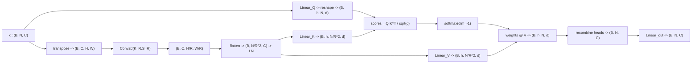

# 3.8 `EfficientSelfAttention` (ESA)

File: [efficient_self_attention.py](../../app/foundation_models/components/efficient_self_attention.py)

## What the code does

ESA is multi-head self-attention with a twist: the K and V tokens are spatially **reduced**
by a learned strided conv before projection
([efficient_self_attention.py:103](../../app/foundation_models/components/efficient_self_attention.py#L103)).
The Q path stays at full resolution.

Algorithm in shape annotations:

```
Q path:    (B, N, C) -> Linear(C, C) -> reshape -> (B, heads, N, head_dim)

K/V path:  (B, N, C) -> transpose+reshape -> (B, C, H, W)
                    -> Conv2d(K=R, S=R)   -> (B, C, H/R, W/R)
                    -> flatten+transpose  -> (B, N/R^2, C)
                    -> LayerNorm
                    -> Linear(C, C) twice -> (B, heads, N/R^2, head_dim) each

Attention: scores  = Q . K^T . 1/sqrt(d_k)       (B, heads, N, N/R^2)
           weights = softmax(scores, dim=-1)     (B, heads, N, N/R^2)
           out     = weights . V                 (B, heads, N, head_dim)
                  -> recombine heads             (B, N, C)
                  -> output Linear(C, C)         (B, N, C)
```

The scale factor $1/\sqrt{d_k}$ is computed once at init as `self.scale = head_dim ** -0.5`
([efficient_self_attention.py:82](../../app/foundation_models/components/efficient_self_attention.py#L82)).

A subtle fallback at
[efficient_self_attention.py:144](../../app/foundation_models/components/efficient_self_attention.py#L144)
disables the reduction when `N != H*W` (which happens after MAE token removal at Stage 1) —
the strided conv cannot reshape sparse tokens into a 2D grid, so the code reverts to full
attention. With only ~512 visible tokens this is cheap.

### Forward pass diagram



### Parameter count

For embedding dim $C$, $h$ heads, head_dim $d_k = C / h$, reduction $R$:

- $Q$, $K$, $V$, output linears: each $C \cdot C + C$ -> $4(C^2 + C)$.
- Reduction conv: $C \cdot C \cdot R^2 + C$.
- LayerNorm after reduction: $2C$.

For Stage 1 of SegFormer-B0 ($C = 32, h = 1, R = 8$):

- Linears: $4(32^2 + 32) = 4{,}224$.
- Reduction conv: $32 \cdot 32 \cdot 64 + 32 = 65{,}568$.
- LN: $64$.

Total ~70k. The reduction conv dominates because $R^2 = 64$.

## Theory in plain language

### Self-attention as soft database lookup

Think of attention as a **soft dictionary lookup**:

- Each token emits a **query** $q$ asking "I am looking for something".
- Each token also offers a **key** $k$ saying "this is what I am".
- Each token also offers a **value** $v$ saying "if you match my key, here is what I will
  give you".

The query $q_i$ is compared with every key $k_j$ via dot product $q_i \cdot k_j$. Softmax
turns those scores into a probability distribution over the keys. The output for token $i$
is the weighted sum of all values, weighted by how well each key matched the query:

$$\text{Attn}(i) = \sum_j \text{softmax}(q_i k_j^\top / \sqrt{d_k})_j \cdot v_j.$$

This is "soft" because instead of picking one key (a hard lookup), the result is a smooth
blend. The softmax temperature is $\sqrt{d_k}$.

### The quadratic cost problem

Standard scaled dot-product attention (Vaswani et al., *Attention Is All You Need*, 2017)
costs $O(N^2)$ in the attention matrix. For dense prediction on $128 \times 128$ images
this is prohibitive: Stage 1 has $N = 1024$ tokens and the matrix is $1024 \times 1024$.

SegFormer's fix is to keep queries fine-grained (each pixel asks its own question) but
compress keys and values spatially by a factor $R$, giving attention cost
$O(N \cdot N/R^2) = O(N^2 / R^2)$.

### Per-stage reduction ratios

Reduction ratios per stage are `[8, 4, 2, 1]`:

- **Stage 1**, $N = 1024$, $R = 8$: K/V reduced to $N/64 = 16$ tokens. Attention matrix is
  $1024 \times 16$ instead of $1024 \times 1024$ — 64x cheaper.
- **Stage 2**, $N = 256$, $R = 4$: K/V reduced to $16$. Matrix $256 \times 16$ instead of
  $256 \times 256$.
- **Stage 3**, $N = 64$, $R = 2$: K/V reduced to $16$. Matrix $64 \times 16$.
- **Stage 4**, $N = 16$, $R = 1$: no reduction. Full $16 \times 16$ matrix is trivially
  cheap.

Aggressive compression at high-resolution stages where it matters; full attention at the
coarsest stage where $N = 16$ tokens makes $N^2 = 256$ trivially cheap.

### Why $1/\sqrt{d_k}$ scaling

The scaling factor $1/\sqrt{d_k}$ comes from the variance algebra of dot products: if $q$
and $k$ have unit-variance independent entries, then

$$\text{Var}(q \cdot k) = \text{Var}\left(\sum_{i=1}^{d_k} q_i k_i\right) = \sum_i \text{Var}(q_i k_i) = d_k,$$

so the score standard deviation grows as $\sqrt{d_k}$. Without rescaling, scores grow with
head dimension and push softmax into saturated regions (one token gets weight $\approx 1$,
all others $\approx 0$, gradients vanish). Dividing by $\sqrt{d_k}$ keeps the score
variance at 1, which keeps the softmax in its informative range.

### Multi-head: parallel database lookups

Splitting $C$ into $h$ heads of dim $d_k = C/h$ runs $h$ independent attention operations
in parallel. Each head can specialise in a different relationship (e.g. "same vegetation
type", "same elevation band", "same scan-line position"). The final output linear $W_O$
mixes the heads back into a single $C$-dim vector.

## Worked numerical example — 2-token attention by hand

Take a toy with `N=2`, `head_dim=2`, single head, $R=1$ (no reduction). Let

$$Q = \begin{bmatrix}1 & 0 \\ 0 & 1\end{bmatrix},\quad
K = \begin{bmatrix}1 & 0 \\ 1 & 0\end{bmatrix},\quad
V = \begin{bmatrix}2 & 0 \\ 0 & 3\end{bmatrix}.$$

Then

$$QK^\top = \begin{bmatrix}1\cdot 1 + 0\cdot 0 & 1\cdot 1 + 0\cdot 0 \\ 0\cdot 1 + 1\cdot 0 & 0\cdot 1 + 1\cdot 0\end{bmatrix} = \begin{bmatrix}1 & 1 \\ 0 & 0\end{bmatrix}.$$

Scale by $1/\sqrt{2} \approx 0.707$:

$$\text{scores} = \begin{bmatrix}0.707 & 0.707 \\ 0 & 0\end{bmatrix}.$$

Row-wise softmax: row 0 has equal logits, so weights $= [0.5, 0.5]$; row 1 also equal,
weights $= [0.5, 0.5]$. Therefore

$$\text{out} = \begin{bmatrix}0.5 & 0.5 \\ 0.5 & 0.5\end{bmatrix}\begin{bmatrix}2 & 0 \\ 0 & 3\end{bmatrix} = \begin{bmatrix}1.0 & 1.5 \\ 1.0 & 1.5\end{bmatrix}.$$

Token 0 and token 1 both get the average of $V$'s rows because their queries land on
identical key directions. The point of this exercise: attention is exactly a weighted
average of $V$ rows, where the weights come from how similar each query is to each key.

## Worked numerical example 2 — distinct queries

Now consider:

$$Q = \begin{bmatrix}3 & 0 \\ 0 & 3\end{bmatrix},\quad K = \begin{bmatrix}1 & 0 \\ 0 & 1\end{bmatrix},\quad V = \begin{bmatrix}10 & 0 \\ 0 & 20\end{bmatrix}.$$

$$QK^\top = \begin{bmatrix}3 & 0 \\ 0 & 3\end{bmatrix}.$$

Scale by $1/\sqrt{2}$: scores $\approx [[2.12, 0], [0, 2.12]]$.

Softmax row-wise: $e^{2.12} \approx 8.33$, $e^0 = 1$. Row 0 weights:
$[8.33/9.33, 1/9.33] \approx [0.893, 0.107]$. Row 1 is symmetric.

Output:

$$\text{out} \approx \begin{bmatrix}0.893 \cdot 10 + 0.107 \cdot 0 & 0.893 \cdot 0 + 0.107 \cdot 20 \\ 0.107 \cdot 10 + 0.893 \cdot 0 & 0.107 \cdot 0 + 0.893 \cdot 20\end{bmatrix} \approx \begin{bmatrix}8.93 & 2.14 \\ 1.07 & 17.86\end{bmatrix}.$$

Token 0 mostly retrieves $V_0$, token 1 mostly retrieves $V_1$, with a small "leak" from
the other token because softmax is never exactly one-hot. This is what attention looks like
when queries are well-separated.
