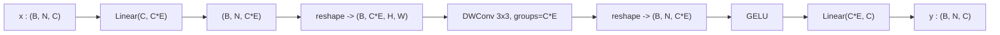

# 3.9 `MixFFN`

File: [mix_ffn.py](../../app/foundation_models/components/mix_ffn.py)

## What the code does

`MixFFN` is

```
Linear(C, C*E) -> reshape to 2D -> DWConv3x3 -> reshape to seq -> GELU -> Linear(C*E, C)
```

([mix_ffn.py:73](../../app/foundation_models/components/mix_ffn.py#L73)). The
`groups=hidden_dim` argument on the conv
([mix_ffn.py:79](../../app/foundation_models/components/mix_ffn.py#L79)) makes it
**depthwise**: each of the `C*E` channels gets its own 3x3 spatial filter, with no
cross-channel mixing.

A guard at [mix_ffn.py:119](../../app/foundation_models/components/mix_ffn.py#L119) skips the
depthwise conv when `N != H*W` (the same sparse-token case as ESA). The
Linear+GELU+Linear path still runs.

### Forward pass diagram



### Parameter count

For embedding dim $C$ and expansion ratio $E$:

- `Linear(C, C*E)`: $C \cdot CE + CE = CE(C + 1)$.
- DWConv 3x3, `groups=CE`: $CE \cdot 9 + CE = 10 CE$ (each of the $CE$ channels has a
  $3 \times 3$ filter plus bias).
- `Linear(C*E, C)`: $CE \cdot C + C = C(CE + 1)$.

Total $\approx 2 C^2 E$ from the linears plus a tiny $10 CE$ from the depthwise conv.

For Stage 1 of SegFormer-B0 ($C = 32, E = 4$): linears $\approx 2 \cdot 32^2 \cdot 4 = 8192$;
depthwise $\approx 1280$; total $\approx 9.5$k.

For Stage 4 ($C = 256, E = 4$): linears $\approx 2 \cdot 256^2 \cdot 4 = 524{,}288$;
depthwise $\approx 10{,}240$; total $\approx 535$k. The depthwise conv is tiny compared to
the linears.

## Theory in plain language

### Why an FFN at all

Each transformer block has two sublayers: attention and FFN. Attention provides
**inter-token** mixing — tokens look at each other. FFN provides **intra-token**
non-linearity — each token's representation is transformed independently by a 2-layer MLP.
The combination is what makes a transformer expressive; either alone is too restrictive.

### How MixFFN differs from a vanilla transformer FFN

Standard transformer FFNs are position-independent: `Linear -> GELU -> Linear` treats each
token in isolation. ViT compensates with explicit positional encodings (sin/cos or learned).
SegFormer instead inserts a **depthwise convolution** between the two linears, giving every
token a learned 3x3 mix with its spatial neighbours, which provides positional information
*implicitly* — no learned or sinusoidal position embeddings required. This is one of
SegFormer's signature ideas (Xie et al., 2021, §3.1.3).

### Why depthwise

"Depthwise" matters for parameter efficiency: a regular 3x3 conv with `C*E` channels would
have $CE \cdot CE \cdot 9$ params; a depthwise version has just $CE \cdot 9$ params. For
$C = 256, E = 4$ the difference is $9.4\text{M}$ vs. $9.2\text{k}$ — three orders of
magnitude.

The cross-channel mixing that a regular conv would provide is unnecessary here: the
surrounding `Linear` layers already mix channels exhaustively. What is missing in a pure
linear path is *spatial* mixing, which is exactly what depthwise convolution provides at
minimum cost.

### Why expansion ratio $E = 4$

The expansion ratio $E = 4$ (Vaswani et al., 2017's default) gives the FFN a wider
intermediate representation where the GELU nonlinearity has more degrees of freedom. The
intuition: each output dimension is a learned combination of $E \cdot C$ features, so the
FFN can represent more complex functions than a width-$C$ MLP could.

Going higher ($E = 8$ or $16$) buys marginal gains at significant compute cost; $E = 4$ is
the established sweet spot.

### Sparse-token fallback

When tokens have been removed (Stage 1 of MAE), the sequence length is no longer $H \cdot W$
and the reshape-to-2D step fails. The guard at line 119 falls through to a plain
`Linear -> GELU -> Linear` path, skipping the depthwise conv. This is acceptable because:

- It only happens at Stage 1 during MAE training/inference.
- The Stage 1 receptive field is small anyway; losing the 3x3 mix is a minor loss.
- It is restored at Stages 2-4, which see full token grids.

## Worked numerical example

### Shape walk on a single block

Input `(B=4, N=256, C=64)` at Stage 2 of SegFormer with $E = 4$, $H = W = 16$:

1. `Linear(64, 256)`: `(4, 256, 64) -> (4, 256, 256)`.
2. Reshape: `(4, 256, 256) -> (4, 256, 16, 16)` (channels-first 2D).
3. DWConv 3x3 with `groups=256`: shape unchanged `(4, 256, 16, 16)`. Each of the 256
   channels gets its own 3x3 spatial filter applied with padding=1.
4. Reshape back: `(4, 256, 16, 16) -> (4, 256, 256) -> (4, 256, 256)` (sequence form).
5. GELU: shape unchanged.
6. `Linear(256, 64)`: `(4, 256, 256) -> (4, 256, 64)`.

### A small numeric trace through DWConv

Consider a single channel of the reshaped tensor, treating it as a $4 \times 4$ feature map
for clarity:

$$F = \begin{bmatrix}1 & 2 & 3 & 4 \\ 5 & 6 & 7 & 8 \\ 9 & 0 & 1 & 2 \\ 3 & 4 & 5 & 6\end{bmatrix}.$$

With a learned 3x3 filter (one of the $CE$ filters in the depthwise conv, say a simple
horizontal edge detector)

$$W = \begin{bmatrix}-1 & 0 & 1 \\ -1 & 0 & 1 \\ -1 & 0 & 1\end{bmatrix},\quad b = 0,$$

the output at position $(1, 1)$ is

$$y_{11} = -(1) - (5) - (9) + (3) + (7) + (1) = -15 + 11 = -4.$$

After padding=1 (zero pad), the output at $(0, 0)$ uses three zero-pad cells on the top/left
and the actual values to the right:

$$y_{00} = -(0) - (0) - (0) + 0 + 2 + 6 = 8.$$

The depthwise conv detects horizontal intensity changes in a single feature channel. With
$CE = 256$ such filters, all learned simultaneously, the FFN catches a rich palette of local
spatial patterns and feeds them into the next linear layer.

### Why this works as positional info

A token at $(8, 7)$ vs. a token at $(0, 0)$ differs in *which other tokens it sees through
the 3x3 stencil*. If the pattern at $(8, 7)$ is "high response to vertical edges", the FFN
will compute that, and downstream attention can use the result to recognise "this is the
left edge of a structure". The position is encoded implicitly in the spatial relationship,
not in an explicit position embedding.
