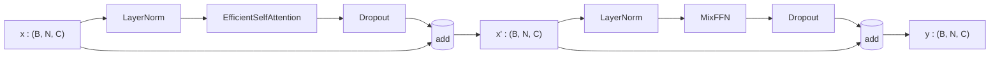

# 3.10 `SegFormerBlock`

File: [segformer_block.py](../../app/foundation_models/components/segformer_block.py)

## What the code does

A SegFormerBlock is the canonical **Pre-Norm** transformer block:

```
x = x + Dropout(ESA(LayerNorm(x)))      # attention sublayer
x = x + Dropout(MixFFN(LayerNorm(x)))   # FFN sublayer
```

([segformer_block.py:96](../../app/foundation_models/components/segformer_block.py#L96)).
Dropout acts only on the sublayer output, never on the residual skip.

### Forward pass diagram



### Parameter count

For embedding dim $C$, $h$ heads, reduction $R$, expansion $E$:

- LayerNorm x 2: $4C$.
- ESA: $\approx 4 C^2 + C^2 R^2$ (see Section 3.8).
- MixFFN: $\approx 2 C^2 E$ (see Section 3.9).

For Stage 1 of SegFormer-B0 ($C = 32$, $h = 1$, $R = 8$, $E = 4$):

- LN: 128.
- ESA: $\approx 4 \cdot 1024 + 1024 \cdot 64 = 4{,}096 + 65{,}536 = 69{,}632$.
- MixFFN: $\approx 8{,}192$ + tiny DWConv.

Total per block at Stage 1: ~78k. Two blocks per stage at default config -> ~156k.

For Stage 4 ($C = 256$, $h = 8$, $R = 1$, $E = 4$):

- ESA: $\approx 4 \cdot 256^2 + 256^2 \cdot 1 = 327{,}680$.
- MixFFN: $\approx 524{,}288$.

Total per block: ~852k. Two blocks: ~1.7M. Stage 4 dominates the SegFormer-B0 budget.

## Theory in plain language

### Pre-Norm vs. Post-Norm

Pre-Norm (Xiong et al., *On Layer Normalization in the Transformer Architecture*, 2020) is
the modern default — Post-Norm (the original Vaswani et al. formulation) is harder to train
for deep stacks because gradients have to pass through a LayerNorm on the residual path. With
Pre-Norm the residual stream is an uninterrupted highway: gradients flow back unmodified,
and each sublayer always sees normalised input.

In equations, the two variants are:

**Post-Norm** (Vaswani 2017):

$$x_{l+1} = \text{LN}(x_l + \text{Sublayer}(x_l)).$$

**Pre-Norm** (Xiong 2020, used here):

$$x_{l+1} = x_l + \text{Sublayer}(\text{LN}(x_l)).$$

The crucial difference: in Pre-Norm the gradient of $\mathcal{L}$ with respect to $x_l$
includes a clean $\frac{\partial \mathcal{L}}{\partial x_{l+1}}$ identity term (from the
residual) plus a sublayer Jacobian. In Post-Norm the identity term is filtered through
LayerNorm's Jacobian, which can shrink or distort gradients in deep stacks.

### Residual stream as a "highway"

Conceptually, the residual stream is an information bus that every block can read from and
write to. Each block:

- Reads $\text{LN}(x_l)$.
- Computes a small update $\Delta_l = \text{Sublayer}(\text{LN}(x_l))$.
- Writes $\Delta_l$ back to the bus: $x_{l+1} = x_l + \Delta_l$.

Because every block only contributes a small additive update, the network can be very deep
without exploding or vanishing activations. The residual stream also makes it easy to
"bypass" a useless block: if the sublayer learns to output near-zero, the block is
effectively the identity.

### Why dropout only on the sublayer output

The dropout zeroes random entries of $\Delta_l$ (the sublayer output) before adding to the
residual. The skip path is never dropped — that would break the residual stream and turn
training into noise. This convention matches the BERT / GPT / ViT implementations.

### Block depth: typically 2 per stage

SegFormer-B0 uses 2 blocks per stage. The total depth is 8 blocks across 4 stages. Adding
more blocks at each stage produces the larger SegFormer variants (B1 through B5). For
reconstruction tasks like Allotrope's MAE, B0 is sufficient.

## Worked numerical example

### Shape walk through one block

At Stage 2, $C = 64$, $N = 256$, batch $B = 8$.

```
input  : (8, 256, 64)
LN     : (8, 256, 64)                # per-token normalization
ESA    : (8, 256, 64)                # reduction conv shrinks K/V to (8, 16, 64)
dropout: (8, 256, 64)
residual add: (8, 256, 64)

LN     : (8, 256, 64)
MixFFN : (8, 256, 64)                # internally expands to (8, 256, 256) and back
dropout: (8, 256, 64)
residual add: (8, 256, 64)

output : (8, 256, 64)
```

### Walking gradients

Suppose the loss gradient at the block output is $g_{out}$ of shape `(8, 256, 64)`. Through
the second residual add:

$$\frac{\partial \mathcal{L}}{\partial x'} = g_{out} + g_{out} \cdot J_{\text{FFN-LN-drop}}$$

where $J_{\text{FFN-LN-drop}}$ is the Jacobian of the second sublayer chain. The first term
($g_{out}$ itself) is the "highway" gradient that flows straight through. The second term is
the sublayer's contribution.

By induction, after $L$ blocks the gradient at the input is

$$\frac{\partial \mathcal{L}}{\partial x_0} = g_{out} \prod_{l=1}^{L} (I + J_l).$$

For small $J_l$ (sublayer outputs are small relative to the residual) this product stays
close to $I$, preserving gradient magnitude. This is the deep intuition for why residual
networks train well at depth.
