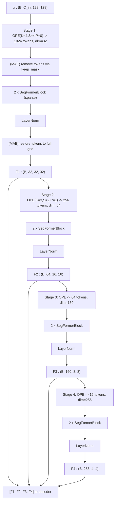
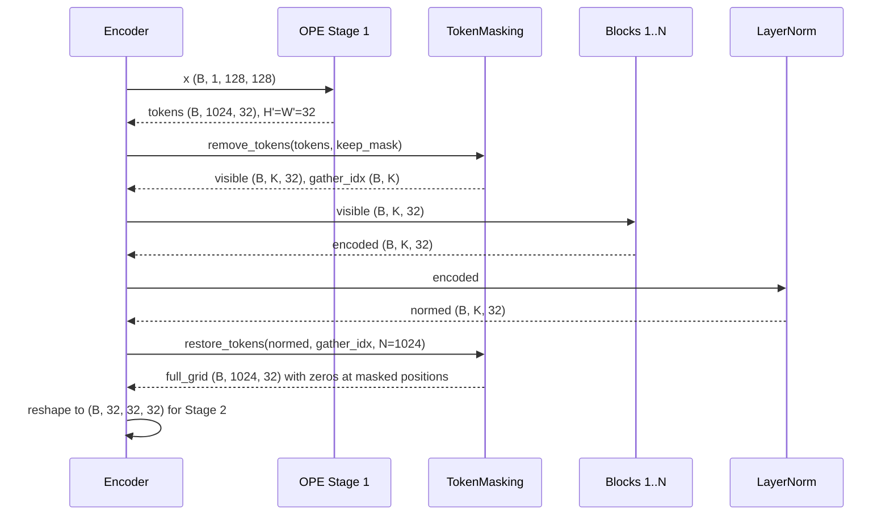

# 3.11 `SegFormerEncoder`

File: [seg_former_encoder.py](../../app/foundation_models/components/seg_former_encoder.py)

## What the code does

A 4-stage hierarchical transformer
([seg_former_encoder.py:107](../../app/foundation_models/components/seg_former_encoder.py#L107)).
Each stage runs `OverlapPatchEmbedding -> N x SegFormerBlock -> LayerNorm`, then reshapes
the sequence back to a 2D feature map for the next stage and for the decoder.

The encoder also implements **MAE token removal at Stage 1 only**
([seg_former_encoder.py:208](../../app/foundation_models/components/seg_former_encoder.py#L208)).
When `keep_mask` is provided, the workflow is:

1. OPE produces 1024 tokens.
2. `TokenMasking.remove_tokens` gathers only the kept ~512 tokens.
3. Blocks process the sparse sequence (ESA's reduction conv falls back to full attention
   because `N != H*W`).
4. After the stage's LayerNorm, `TokenMasking.restore_tokens` scatters tokens back into the
   full 1024-position grid, with zeros at the masked positions.
5. The full grid is reshaped to a 2D `(B, C, 32, 32)` feature map.

Stages 2-4 process **all** tokens, because Stage 2's stride-2 OPE pools over Stage 1's zero
gaps — the masked information naturally dilutes through spatial reduction.

### Default config (SegFormer-B0)

Set in [seg_former_mae.py:70](../../app/foundation_models/components/seg_former_mae.py#L70):

| Stage | embed_dim | heads | reduction R | blocks | spatial (128 input) | tokens N |
|------:|----------:|------:|------------:|-------:|---------------------|---------:|
| 1 | 32 | 1 | 8 | 2 | 32 x 32 | 1024 |
| 2 | 64 | 2 | 4 | 2 | 16 x 16 | 256 |
| 3 | 160 | 5 | 2 | 2 | 8 x 8 | 64 |
| 4 | 256 | 8 | 1 | 2 | 4 x 4 | 16 |

### Hierarchy diagram



### Sequence diagram for MAE forward at Stage 1



### Parameter count

Approximate totals per stage with 2 blocks each:

- Stage 1: ~150k (small $C$ but expensive ESA from $R=8$ reduction conv).
- Stage 2: ~300k.
- Stage 3: ~700k.
- Stage 4: ~1.7M.

Total encoder: ~2.9M trainable params for SegFormer-B0.

## Theory in plain language

### Hierarchical multi-scale features

SegFormer's hierarchical encoder mimics CNN backbones (ResNet, Swin) that produce
multi-scale feature pyramids — each stage halves spatial resolution and increases semantic
depth. The final 4 feature maps $[F_1, F_2, F_3, F_4]$ are exactly what a U-Net-style
decoder or a feature pyramid network would consume.

The multi-scale structure matters for anomaly detection: anomalies appear at many sizes
(a single hot pixel vs. a few-pixel cluster vs. a region-level pattern). Different stages
capture different scales:

- **Stage 1** (32x32 features over 128 input): fine local texture.
- **Stage 2** (16x16): mid-scale structure.
- **Stage 3** (8x8): regional structure.
- **Stage 4** (4x4): whole-patch context.

### MAE-style masking

The MAE token-removal strategy is from He et al., *Masked Autoencoders Are Scalable Vision
Learners*, 2022. The key insight is that the encoder never sees the prediction targets —
they are physically absent from the sequence, not just "zeroed". The decoder is then
responsible for filling them in.

This is fundamentally different from BERT's `[MASK]` token, which is a learned embedding the
model sees at the masked position. BERT-style masking lets the model peek at "I know
*something* belongs here, let me copy from context"; MAE-style removal forces the model to
reconstruct from completely absent positions. The harder task is the better pretraining
signal.

### Why Stage 1 only

Doing token removal only at Stage 1 (the highest resolution) keeps the implementation
simple while still hiding the right pixels. Reasons:

1. Stage 1's OPE is the only one with no overlap (`K = S = 4`, `padding = 0`), so each
   token corresponds to an exact 4x4 input block. Masking a Stage 1 token hides exactly
   16 input pixels with zero leakage.
2. Once the masked tokens are zeroed and the Stage 2 OPE pools over 3x3 Stage-1 cells, the
   "hidden" signal is naturally diluted. The deeper stages do not need explicit masking
   because the information is already gone.
3. The full-attention fallback only kicks in at Stage 1 (where $N \neq H \cdot W$). Deeper
   stages always see complete grids and run the efficient reduction-conv attention.

### Why visible tokens go from 1024 to ~512 only at Stage 1

For a 50% mask ratio, half of the 1024 Stage 1 tokens are removed. The sparse Stage 1
sequence has $\approx 512$ tokens; this is small enough that even full attention costs
$512^2 = 262{,}144$ ops, well within budget. The reduction conv is disabled because
"reduce a sparse 512-token list by spatial conv" is not a defined op.

After Stage 1, the masked-token zeros are scattered back into a 1024-position grid for
Stage 2's OPE to consume normally.

## Worked numerical example

### Forward without masking (Chakshu inference, no MAE)

Input `(B=2, 1, 128, 128)`:

```
Stage 1: -> tokens (2, 1024, 32) -> blocks -> reshape -> F1 (2, 32, 32, 32)
Stage 2: -> tokens (2, 256, 64)  -> blocks -> reshape -> F2 (2, 64, 16, 16)
Stage 3: -> tokens (2, 64, 160)  -> blocks -> reshape -> F3 (2, 160, 8, 8)
Stage 4: -> tokens (2, 16, 256)  -> blocks -> reshape -> F4 (2, 256, 4, 4)
```

The decoder receives the 4-tuple $[F_1, F_2, F_3, F_4]$.

### Forward with masking (MAE training)

Same input plus `keep_mask` of shape `(2, 1024)` with ~512 ones per batch:

```
Stage 1 OPE   : (2, 1024, 32)
remove_tokens : (2, ~512, 32) + gather_indices (2, ~512)
2 x blocks    : (2, ~512, 32)             [ESA falls back to full attention]
LayerNorm     : (2, ~512, 32)
restore_tokens: (2, 1024, 32) with zeros at masked positions
reshape       : (2, 32, 32, 32)  = F1

Stage 2 OPE   : (2, 256, 64)              [no masking from here on]
... etc ...
```

### Memory savings from masking at Stage 1

Without masking, Stage 1 attention scores are $(1024, 16) = 16{,}384$ entries per head.
With masking (kept tokens $\approx 512$), the full-attention fallback computes
$(512, 512) = 262{,}144$ entries per head — actually *larger*. The benefit of MAE masking is
not Stage 1 compute (which goes up slightly); it is **training signal**. Hidden tokens give
the model harder reconstruction targets, which yields better learned features.
