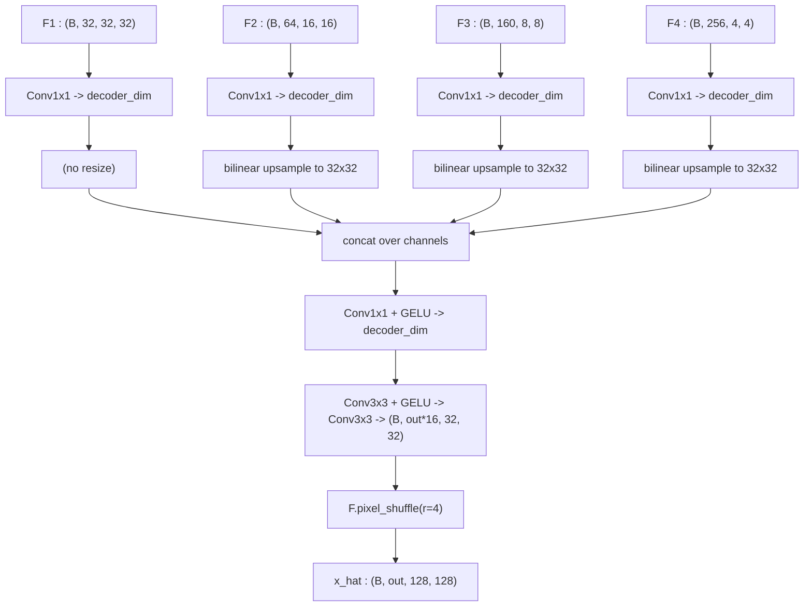

# 3.12 `SegFormerDecoder`

File: [seg_former_decoder.py](../../app/foundation_models/components/seg_former_decoder.py)

## What the code does

A lightweight 5-step MLP decoder
([seg_former_decoder.py:90](../../app/foundation_models/components/seg_former_decoder.py#L90)):

1. Per-stage `Conv1x1` projects each $F_i$ to a common `decoder_dim`.
2. Bilinear upsample each to F1's resolution `(H/4, W/4)`.
3. Concatenate along channels → `(B, 4 * decoder_dim, H/4, W/4)`.
4. `Conv1x1 + GELU` fuses to `decoder_dim`.
5. `Conv3x3 + GELU -> Conv3x3` produces `out_channels * 16` channels at H/4 resolution,
   then `F.pixel_shuffle(refined, 4)` rearranges into full-resolution output
   ([seg_former_decoder.py:173](../../app/foundation_models/components/seg_former_decoder.py#L173)).

The final conv has no activation — the output must be free to represent any
temperature / reflectance.

### Forward pass diagram



### Parameter count

For `decoder_dim = 256`, `out_channels = 1`:

- Per-stage 1x1 projections: $32\cdot 256 + 64\cdot 256 + 160\cdot 256 + 256\cdot 256 = 8192 + 16384 + 40960 + 65536 = 131{,}072$ + biases.
- Fuse 1x1: $4 \cdot 256 \cdot 256 + 256 = 262{,}144$.
- Refine 3x3 first: $256 \cdot 256 \cdot 9 + 256 = 590{,}080$.
- Refine 3x3 second: $256 \cdot 16 \cdot 9 + 16 = 36{,}880$ (output channels = out * r^2 = 1 * 16 = 16).

Total decoder: ~1.02M params. About a third of the encoder's ~2.9M.

## Theory in plain language

### Why the decoder is trivial

The original SegFormer decoder (Xie et al., 2021) is intentionally trivial: just MLPs +
bilinear upsample. The encoder is so strong (large effective receptive field from ESA) that
a heavy decoder is unnecessary. This is the opposite of U-Net, where the decoder is as deep
as the encoder.

The reasoning: ESA at each encoder stage has a *global* receptive field within its stage —
every query token attends to (a reduced view of) every other token. So by the time features
reach the decoder, each spatial position already carries a globally-informed summary. The
decoder's job is just to combine the four scales and upsample.

### Why upsample to H/4, not directly to H

Pixel-shuffle wants its input at H/4 because $r = 4$ converts $H/4 \to H$. The arithmetic
is exact: with `out * 16` channels at H/4, pixel-shuffle rearranges into `out` channels at
H. No bilinear interpolation in the final step.

### Pixel shuffle: learnable upsampling without blur

The crucial property: every output pixel is predicted **independently** by a learned weight,
not blurred from neighbour averages. PixelShuffle (Shi et al., *Real-Time Single Image and
Video Super-Resolution Using an Efficient Sub-Pixel CNN*, 2016) takes a tensor of shape

```
(B, C * r^2, H, W)
```

and rearranges it into

```
(B, C, H * r, W * r)
```

— each block of $r^2$ channels becomes an $r \times r$ spatial block. The mathematical
operation is a pure reshape:

$$y[c, i r + a, j r + b] = x[c \cdot r^2 + a \cdot r + b, i, j]$$

for $a, b \in \{0, \ldots, r-1\}$. No multiplications, no addition — only data movement.

The learnable upsampling lives in the *conv before* pixel-shuffle: it produces $r^2$
"sub-pixel" channels per output channel, and each spatial position in those sub-pixel
channels predicts one of the $r \times r$ fine-grained output pixels.

### Why pixel-shuffle matters for point anomalies

For point anomaly detection (a single hot pixel surrounded by background), bilinear
upsample would smear the prediction over a 2x2 or larger window — destroying the very thing
we are trying to detect. PixelShuffle keeps each output pixel independent, so the model can
predict a sharp boundary if the data calls for it.

The trade-off: PixelShuffle has no built-in smoothing, so it can produce checkerboard
artifacts if the conv before it is poorly initialised. Initialising the pre-shuffle conv
with the ICNR scheme (Aitken et al., 2017) avoids this; the Allotrope decoder relies on the
default Kaiming init being good enough for the 3x3 refinement conv to learn a smooth output
without explicit ICNR.

### Why no final activation

The final conv has no activation: the output must be free to represent any temperature /
reflectance value. Same reasoning as `SpatialDecoder`'s final block (Section 3.3).

## Worked numerical example

### Channel and spatial accounting

With `decoder_dim = 256`, `out_channels = 1`:

```
Inputs:
F1 (B, 32, 32, 32)
F2 (B, 64, 16, 16)
F3 (B, 160, 8, 8)
F4 (B, 256, 4, 4)

After per-stage 1x1 projections:
(B, 256, 32, 32), (B, 256, 16, 16), (B, 256, 8, 8), (B, 256, 4, 4)

After bilinear upsample to 32x32:
all four are (B, 256, 32, 32)

After concat:
(B, 1024, 32, 32)

After fuse Conv1x1 -> decoder_dim:
(B, 256, 32, 32)

After refine Conv3x3 -> Conv3x3 with last layer outputting out * r^2 = 16 channels:
(B, 16, 32, 32)

After pixel_shuffle(r=4):
(B, 1, 128, 128)  <- final output
```

### A concrete pixel-shuffle trace

Consider a single batch and a 2x2 block of the post-refinement tensor, $r=4$, with 16
channels at one spatial location $(i, j)$. The pixel-shuffle output at
$(4i, 4j) ... (4i+3, 4j+3)$ comes from those 16 channels at $(i, j)$:

```
channel layout at (i,j): [c0, c1, c2, c3, c4, c5, c6, c7, c8, c9, c10, c11, c12, c13, c14, c15]

mapped to output 4x4 block:
[[c0,  c1,  c2,  c3],
 [c4,  c5,  c6,  c7],
 [c8,  c9,  c10, c11],
 [c12, c13, c14, c15]]
```

So the 16 channels of one feature location become the 16 fine-grained pixels of the
corresponding 4x4 block in the output. Each output pixel is the value of a different
channel — entirely independent learned predictions.
