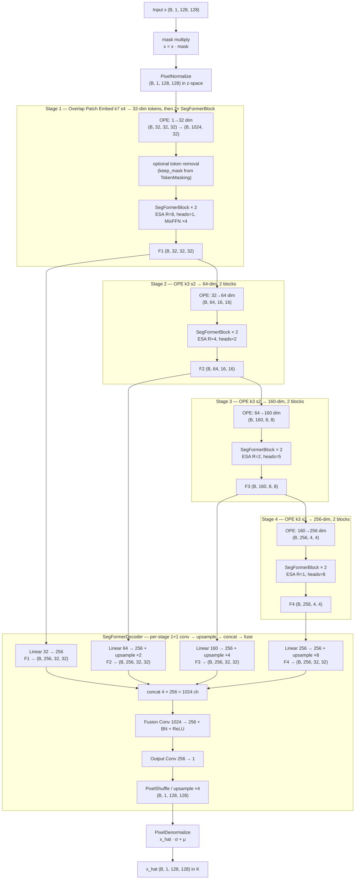
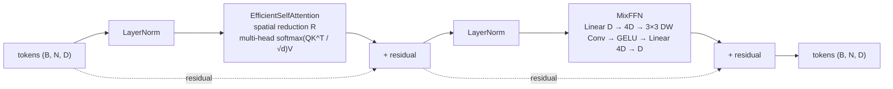
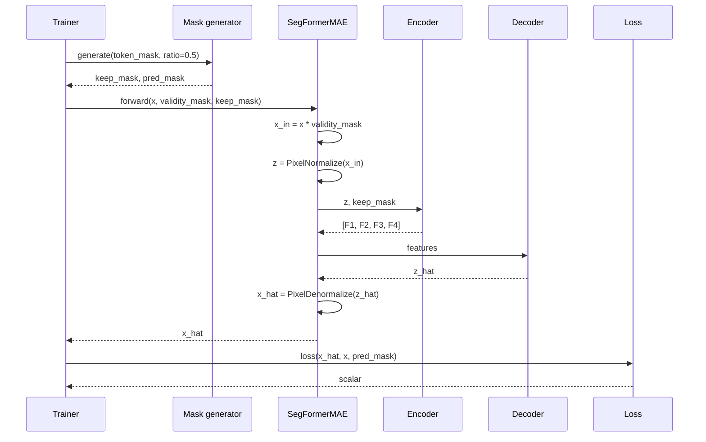

# 3.13 `SegFormerMAE` — Chakshu

File: [seg_former_mae.py](../../app/foundation_models/components/seg_former_mae.py)

Codename **Chakshu** (चक्षु), Sanskrit for "eye / sight" — the first model in the
collection that genuinely *sees* spatial context via attention rather than via stacked
convolutions.

## Full architecture diagram

Defaults shown are the SegFormer-B0 configuration used in the codebase:
`embed_dims=[32, 64, 160, 256]`, `num_heads=[1, 2, 5, 8]`,
`reduction_ratios=[8, 4, 2, 1]`, `num_blocks=[2, 2, 2, 2]`, `decoder_dim=256`,
input `(B, 1, 128, 128)`. The four encoder stages produce a hierarchy of
feature maps `[F1, F2, F3, F4]`; the decoder fuses them and upsamples back to
full resolution.



A `SegFormerBlock` itself is:



Notes:

- **Token removal vs pixel masking.** Optional `keep_mask` is applied *after*
  the Stage-1 Overlap Patch Embedding: hidden tokens are physically removed
  from the sequence so attention only operates on visible context. This is a
  faithful MAE setup, not just zero-masking.
- **ESA reduction ratios.** Stage 1 has 1024 tokens, which would make standard
  attention `O(1024²) = ~10⁶ ops`. The R=8 spatial reduction collapses Keys
  and Values to `1024/8² = 16` positions, bringing the cost down by a factor of
  ~64 with almost no quality loss.
- **Multi-scale fusion.** The decoder doesn't pick one feature map; it projects
  all four to a common `decoder_dim=256`, upsamples them to the Stage-1 grid,
  concatenates, and learns a small fusion conv. Low-stage F1 contributes fine
  edges; high-stage F4 contributes scene-level context.

## What the code does

The top-level wrapper threads `mask` and `keep_mask` through
`pixel normalization -> encoder -> decoder -> denormalization`
([seg_former_mae.py:105](../../app/foundation_models/components/seg_former_mae.py#L105)).
Masking *generation* (random for training, checkerboard for inference) lives outside the
model in the trainer / inferencer — the model itself is masking-strategy-agnostic.

### Forward pass diagram

```mermaid
flowchart LR
    X["x : (B, 1, 128, 128)"] --> M["x * mask (zero invalid)"]
    M --> N["PixelNormalize"]
    N --> E["SegFormerEncoder(keep_mask)"]
    E --> F["[F1, F2, F3, F4]"]
    F --> D["SegFormerDecoder"]
    D --> XHZ["x_hat_z : (B, 1, 128, 128)"]
    XHZ --> DN["PixelDenormalize"]
    DN --> XH["x_hat : (B, 1, 128, 128)"]
```



### Sequence diagram for full MAE forward + loss



### Parameter count

For SegFormer-B0 default:

- Encoder: ~2.9M (see Section 3.11).
- Decoder: ~1.0M (see Section 3.12).
- PixelNormalize buffers: 2 floats per channel, no trainable params.

Total Chakshu: ~3.9M trainable params. About 10x larger than the spatial AEs (~330k each).

### Public API

```python
class SegFormerMAE(nn.Module):
    def forward(
        self,
        x: torch.Tensor,           # (B, 1, H, W)
        mask: torch.Tensor = None, # (B, 1, H, W) validity mask
        keep_mask: torch.Tensor = None, # (B, N) MAE keep indicator
    ) -> torch.Tensor:             # (B, 1, H, W) x_hat
```

`mask` is the validity mask (multiplied into the input). `keep_mask` is the MAE keep
indicator passed to the encoder. If both are `None`, the model behaves as a plain
SegFormer-MAE autoencoder without masking (just feature extraction + reconstruction).

## Theory in plain language

### The Masked Autoencoder paradigm

This is the full Masked Autoencoder pipeline (He et al., 2022) adapted to a SegFormer
backbone for **dense reconstruction**, not classification. Where the original MAE was about
pretraining a ViT for ImageNet classification, Allotrope uses the reconstruction objective
itself as the anomaly signal at inference time.

The MAE recipe in one sentence: hide a large fraction of input pixels (50-75%), force the
encoder to build representations from the visible minority, force the decoder to reconstruct
the hidden majority. The harder this task, the better the learned features.

### Why MAE works for anomaly detection

The training objective is "reconstruct hidden pixels from visible context". A well-trained
MAE has learned the typical local-and-regional structure of the training distribution.

At inference time with a **checkerboard mask**, every pixel is alternately a "hidden" target
in one pass and a "visible" context pixel in the complementary pass. Combining the two
passes gives a full reconstruction. Anomalies — pixels that violate the typical structure —
are reconstructed poorly because the surrounding context is misleading. The reconstruction
error is the anomaly score.

The crucial difference vs. Pratibimba: an unmasked autoencoder might just memorize each
training pixel through the bottleneck. MAE cannot — the target pixel is *absent* from the
input, so the model must predict it from neighbours. This makes the anomaly signal more
reliable.

### Why "Chakshu"

The codename "Chakshu" (eye, sight) marks this as the first model in the collection that
genuinely *sees* spatial context via attention rather than via stacked convolutions. The
ESA mechanism gives every pixel a global view of the patch in a single layer, where a
convolutional stack would need many layers to achieve the same receptive field.

### Masking strategies: random vs. checkerboard

- **Training: random masking** with `mask_ratio = 0.5`. Each iteration sees a different
  random subset of tokens hidden. This is what teaches the model robust reconstruction.
- **Inference: checkerboard masking** (deterministic two-pass). Every pixel is targeted
  exactly once across two passes. This produces a complete, reproducible reconstruction.

The model itself does not care which strategy is used — it just consumes a `keep_mask`. The
two strategies live in `TokenMasking` (Section 3.14).

## Worked numerical example

### A typical training forward

Setup: batch of 8 thermal patches, 50% mask ratio.

```
x            : (8, 1, 128, 128)        thermal input
validity_mask: (8, 1, 128, 128)        ones except over clouds
token_mask   : (8, 1024)               1 if token's pixels are all valid
keep_mask    : (8, 1024)               ~50% ones (kept tokens)
pred_mask    : (8, 1024)               ~50% ones (targets to score loss)
```

Forward:

```
masked input  : x * validity_mask        -> (8, 1, 128, 128)
normalized    : PixelNormalize(masked)   -> (8, 1, 128, 128) in z-space
features      : encoder(z, keep_mask)
  Stage 1: 1024 tokens -> remove ~512 -> 2 blocks -> restore -> (8, 32, 32, 32)
  Stage 2: 256 tokens  -> 2 blocks -> (8, 64, 16, 16)
  Stage 3: 64 tokens   -> 2 blocks -> (8, 160, 8, 8)
  Stage 4: 16 tokens   -> 2 blocks -> (8, 256, 4, 4)
decoded z_hat : (8, 1, 128, 128)
x_hat         : PixelDenormalize(z_hat)  -> (8, 1, 128, 128)
```

Loss (masked L1 over pred_mask pixels):

```python
# convert token-level pred_mask to pixel-level via repeat_interleave (1024 tokens -> 128*128 pixels)
pixel_pred_mask = pred_mask.view(B, 32, 32).repeat_interleave(4, dim=-1).repeat_interleave(4, dim=-2)
pixel_pred_mask = pixel_pred_mask & validity_mask.squeeze(1)
loss = (x_hat - x).abs()[pixel_pred_mask].mean()
```

### Inference forward (checkerboard)

```
Pass A:
  keep_mask = checkerboard pattern A
  x_hat_A = model(x, validity_mask, keep_mask_A)
  reconstruction at pred_mask_A positions is the "real" prediction

Pass B:
  keep_mask = checkerboard pattern B (complement of A)
  x_hat_B = model(x, validity_mask, keep_mask_B)
  reconstruction at pred_mask_B positions is the "real" prediction

Combined:
  x_hat = x_hat_A * pred_mask_A_pixel + x_hat_B * pred_mask_B_pixel
  anomaly = (x_hat - x).abs()
```

Every pixel is predicted once from context it did not see. The model can never just copy
the input through, so the anomaly score is fundamentally a "novelty" score.
