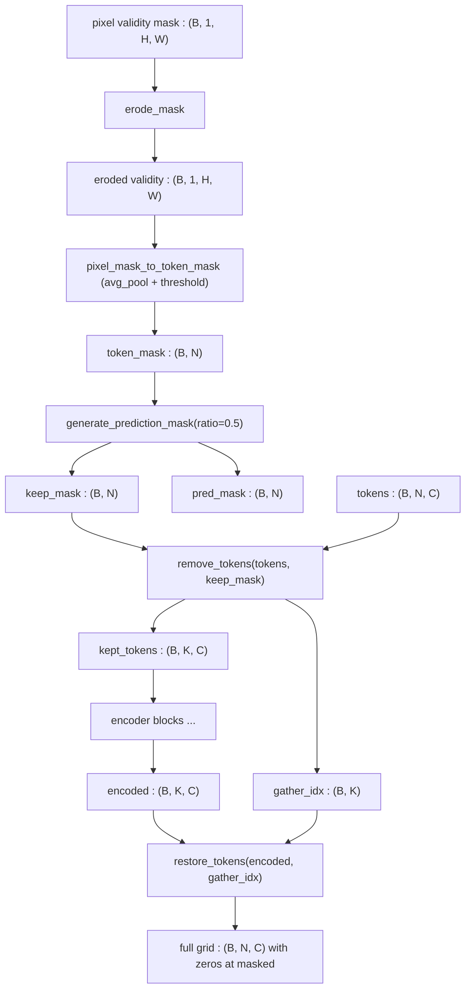

# 3.14 `TokenMasking`

File: [token_masking.py](../../app/foundation_models/components/token_masking.py)

## What the code does

`TokenMasking` is a namespace of `@staticmethod` utilities — no parameters, no `nn.Module`
inheritance. The methods cooperate to convert pixel-level validity masks into token-level
keep/predict masks and to gather/scatter the visible-subset tokens.

### Utility map

- **`erode_mask`** ([token_masking.py:32](../../app/foundation_models/components/token_masking.py#L32))
  shrinks the valid region by `kernel_size // 2` pixels using a `max_pool2d` trick on the
  *inverted* mask. This is dilation-by-max-pool of the invalid region, then inversion back.
- **`pixel_mask_to_token_mask`** ([token_masking.py:77](../../app/foundation_models/components/token_masking.py#L77))
  runs `avg_pool2d` with the same `kernel/stride/padding` as the OPE, then thresholds at
  0.5: a token is valid if >50% of its receptive-field pixels are valid.
- **`generate_prediction_mask`** ([token_masking.py:132](../../app/foundation_models/components/token_masking.py#L132))
  selects a `mask_ratio` fraction of *valid* tokens uniformly at random. The trick: add
  `2.0 * (1 - token_mask)` to the noise so invalid tokens always sort to the back of the
  queue and are never chosen.
- **`checkerboard_token_mask`** ([token_masking.py:228](../../app/foundation_models/components/token_masking.py#L228))
  builds a deterministic two-pass mask for inference.
- **`remove_tokens`** ([token_masking.py:288](../../app/foundation_models/components/token_masking.py#L288))
  gathers visible tokens with `argsort(keep_mask, descending=True)` then `torch.gather`. It
  returns both the kept tokens and the `gather_indices` so they can be put back.
- **`restore_tokens`** ([token_masking.py:364](../../app/foundation_models/components/token_masking.py#L364))
  scatters the encoded tokens back into a zeros-initialized full-grid tensor.

### Pipeline diagram



### Forward + back-pass for one stage

```mermaid
sequenceDiagram
    participant U as Upstream (Stage 1 OPE)
    participant TM as TokenMasking
    participant B as Blocks
    U->>TM: remove_tokens(tokens(B,N,C), keep_mask(B,N))
    TM->>TM: idx = argsort(keep_mask desc)
    TM->>TM: kept = gather(tokens, idx[:, :K])
    TM-->>B: kept (B, K, C), gather_idx (B, K)
    B-->>TM: encoded (B, K, C)
    TM->>TM: full = zeros(B, N, C); scatter(full, idx, encoded)
    TM-->>U: full (B, N, C)
```

## Theory in plain language

### MAE-style masking has three quirky requirements

1. **The encoder never sees prediction targets.** Masked tokens are removed from the
   sequence entirely, not just set to a "[MASK]" embedding — this is what makes MAE
   different from BERT (He et al., 2022). BERT lets the model see "something is here, guess
   what"; MAE forces the model to predict from completely absent positions.
2. **The scatter-back has to be exact** so the decoder still knows where each visible token
   originally lived. Hence the `gather_indices` round-trip: indices recorded at gather time
   are reused at scatter time to place each encoded token back in its original slot.
3. **Invalid pixels (no-data, clouds, scene edges) must be handled separately** from
   "masked-on-purpose" pixels. Invalid tokens are kept in the encoder input but contribute
   no loss signal; only the masked-but-valid tokens are scored. The noise-offset trick
   guarantees only valid tokens get picked as prediction targets.

### The erode_mask step

The OPE's 4x4 receptive field at the boundary of an invalid region partially overlaps with
no-data pixels, contaminating the token's input. Eroding the valid region inward by the
kernel radius excises these border tokens from the loss.

Mechanically:

1. Invert validity: `invalid = 1 - validity`.
2. Dilate the invalid region using `max_pool2d(invalid, kernel=K, stride=1, padding=K//2)`.
   A max pool over a binary mask is equivalent to set dilation.
3. Invert back: `eroded_valid = 1 - dilated_invalid`.

The result is a validity mask that excludes every pixel within $K/2$ of a no-data pixel.

### The noise-offset trick

`generate_prediction_mask` picks a random `mask_ratio` fraction of valid tokens. The
implementation:

```python
noise = torch.rand(B, N)
noise = noise + 2.0 * (1 - token_mask)   # invalid tokens get noise > 2.0
sorted_idx = noise.argsort(dim=-1)       # ascending sort
num_to_mask = int(mask_ratio * num_valid)
pred_mask_sorted = [1] * num_to_mask + [0] * (N - num_to_mask)
pred_mask = scatter back to original order using sorted_idx
keep_mask = 1 - pred_mask  (but invalid tokens are also kept since they were never picked)
```

The trick is that invalid tokens always sort after all valid tokens (their noise is in
$[2, 3]$ vs. valid tokens' $[0, 1]$), so the first `num_to_mask` sorted positions are
always valid tokens. Random selection happens within the valid subset.

### Why invalid tokens are kept, not removed

You might think the encoder should skip invalid tokens entirely. The implementation chooses
to keep them in the input for two reasons:

1. **Simpler indexing**: the gather/scatter machinery is already complicated; adding a
   second "invalid removal" pass doubles the bookkeeping.
2. **Stage 2+ regularity**: deeper stages always see a full $32 \times 32$ grid for Stage 1
   output. Removing invalid tokens at Stage 1 would create a sparse grid that breaks
   Stages 2-4's standard OPE.

The cost of keeping invalid tokens is small — they contribute attention computations but
their values are zeroed and the loss skips them, so they cannot corrupt the gradient.

## Worked numerical example — masking a 6-token sequence

Take `token_mask = [1, 1, 0, 1, 1, 0]` (4 valid, 2 invalid) and `mask_ratio = 0.5`. Suppose

$$\text{noise} = [0.30,\ 0.70,\ 0.10,\ 0.50,\ 0.20,\ 0.80].$$

After invalid-offset (`noise + 2.0 * (1 - token_mask)`):

$$\text{adjusted noise} = [0.30,\ 0.70,\ 2.10,\ 0.50,\ 0.20,\ 2.80].$$

`num_valid = 4`, `num_to_mask = floor(4 * 0.5) = 2`. `argsort` ascending gives

$$\text{sorted\_indices} = [4, 0, 3, 1, 2, 5].$$

The first 2 sorted positions become prediction targets in the sorted order:
`pred_mask_sorted = [1, 1, 0, 0, 0, 0]`. Scatter back to original positions using
`sorted_indices`:

$$\text{pred\_mask} = [1, 0, 0, 0, 1, 0],\qquad \text{keep\_mask} = [0, 1, 1, 1, 0, 1].$$

Tokens 0 and 4 are removed from the encoder input. Token 2 (invalid) is *kept*, even
though its contents are zero — the encoder needs to know which tokens are no-data, and the
loss will skip these positions.

### remove_tokens trace

Starting tokens `(1, 6, C)` (drop batch dim for clarity), `keep_mask = [0, 1, 1, 1, 0, 1]`.

`argsort(keep_mask, descending=True)` returns indices sorted with kept tokens first:

$$\text{order} = [1, 2, 3, 5, 0, 4].$$

`K = sum(keep_mask) = 4`. Gather the first 4 indices: kept tokens are at positions $[1, 2, 3, 5]$.

`gather_indices = [1, 2, 3, 5]`.

The encoder runs on these 4 tokens. Suppose its outputs are
$[\tilde t_1, \tilde t_2, \tilde t_3, \tilde t_5]$.

### restore_tokens trace

Start with `full = zeros(6, C)`. Scatter the encoded tokens into positions
$[1, 2, 3, 5]$:

$$\text{full} = [0, \tilde t_1, \tilde t_2, \tilde t_3, 0, \tilde t_5].$$

Positions 0 and 4 (the masked-on-purpose tokens) remain zero. The decoder will use the
non-zero context to predict whatever the model thinks should live at positions 0 and 4.

### Checkerboard pattern

For a $4 \times 4$ token grid (16 tokens), the two checkerboard passes look like:

```
Pass A keep_mask:           Pass B keep_mask:
1 0 1 0                     0 1 0 1
0 1 0 1                     1 0 1 0
1 0 1 0                     0 1 0 1
0 1 0 1                     1 0 1 0
```

In Pass A, the 0-positions are targets — the model predicts them from the 1-positions.
In Pass B, the roles swap. Combining the two passes gives one prediction per pixel,
each made from context that did not include the pixel itself.
