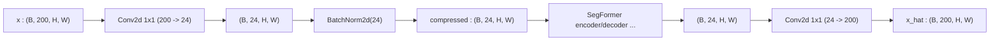

# 3.15 `SpectralCompressor` / `SpectralDecompressor`

File: [spectral_compressor.py](../../app/foundation_models/components/spectral_compressor.py)

## What the code does

`SpectralCompressor` is `Conv2d(in_channels, compressed_channels, kernel_size=1) -> BatchNorm2d`
([spectral_compressor.py:14](../../app/foundation_models/components/spectral_compressor.py#L14)).
`SpectralDecompressor` is the bare `Conv2d(compressed_channels, out_channels, 1)` — no
BatchNorm, no activation
([spectral_compressor.py:39](../../app/foundation_models/components/spectral_compressor.py#L39))
so the output can take any value in the normalised range (cf. the same design choice in
`SpatialDecoder`'s final block).

### Forward pass diagram



### Parameter count

For $C_{in} = 200$ bands compressed to $D = 64$:

- Compressor conv: $200 \cdot 64 + 64 = 12{,}864$ params.
- BatchNorm(64): $2 \cdot 64 = 128$ params (gamma + beta) plus running mean/var buffers.
- Decompressor conv: $64 \cdot 200 + 200 = 13{,}000$ params.

Total: $\approx 26$k trainable params. Trivial compared to the SegFormer encoder (~3M).

## Theory in plain language

### `Conv2d(K=1)` as a per-pixel linear projection

A `Conv2d` with `kernel_size=1` is mathematically a per-pixel linear projection: for each
pixel $\mathbf{x} \in \mathbb{R}^{C_{in}}$ the output is

$$\mathbf{y} = W\mathbf{x} + \mathbf{b}$$

where $W \in \mathbb{R}^{C_{out} \times C_{in}}$, $\mathbf{b} \in \mathbb{R}^{C_{out}}$.

There is no spatial mixing. Each pixel is processed independently, and every pixel uses the
same $W$, $\mathbf{b}$.

### Relationship to classical hyperspectral dimensionality reduction

This is exactly the **Minimum Noise Fraction** (Green et al., 1988) or **PCA** kind of
spectral reduction used in classical hyperspectral analysis, except $W$ is learned end-to-end
with the reconstruction objective rather than fitted to second-order statistics.

The motivation is identical: hyperspectral data has ~100-200 highly correlated bands, but
the intrinsic dimensionality of land-surface reflectance is closer to 10-30. Compressing to
that intrinsic dimension reduces compute through the transformer encoder by an order of
magnitude.

### Why learned beats fitted

- **PCA / MNF** find the directions of greatest variance / signal-to-noise. They optimise a
  second-order criterion (covariance), which is data-driven but task-agnostic.
- **Learned compressor** optimises the full reconstruction loss end-to-end. The compressor
  learns the directions that the downstream SegFormer can best reconstruct from, which is
  not the same as the directions of greatest variance.

In particular, the learned compressor can throw away high-variance directions that the
SegFormer cannot use (e.g. noise-correlated atmospheric absorption bands) and keep
low-variance directions that the SegFormer relies on (e.g. subtle spectral signatures of
specific minerals).

### Why no activation between compressor and SegFormer

The output of `SpectralCompressor` goes straight into `OverlapPatchEmbedding` of the
SegFormer encoder, which is itself a strided conv. Stacking two convs without a nonlinearity
between them is mathematically equivalent to a single (larger-kernel) conv, *unless* there
is a BatchNorm to provide the per-channel re-scaling. So the BN after the compressor conv
is doing real work — it lets the subsequent OPE conv operate on properly-normalized input
without the redundancy of a `Conv -> BN -> ReLU -> Conv` pattern that would over-constrain
the compressor.

### Why no BN on the decompressor

`SpectralDecompressor` runs after the SegFormer decoder, so its output is the final
prediction $\hat z$ in the normalized space (before `PixelDenormalize`). The output must be
free to take whatever values the per-band z-score allows, including significantly negative
or positive numbers far from zero mean — applying BN would force per-band zero mean unit
variance and corrupt the reconstruction. Same reasoning as `SpatialDecoder`'s final block.

## Worked numerical example

### Single-pixel projection by hand

Suppose the compressor is reduced to a toy with $C_{in} = 4$ (4 spectral bands) and $D = 2$
(2 compressed dimensions). The learned weight matrix is

$$W = \begin{bmatrix} 0.5 & 0.5 & 0 & 0 \\ 0 & 0 & 0.5 & 0.5 \end{bmatrix},\quad b = \begin{bmatrix} 0 \\ 0 \end{bmatrix}.$$

For a pixel $\mathbf{x} = [0.4, 0.6, 0.3, 0.5]$ (4 normalized reflectance values):

$$\mathbf{z} = W\mathbf{x} = \begin{bmatrix} 0.5 \cdot 0.4 + 0.5 \cdot 0.6 \\ 0.5 \cdot 0.3 + 0.5 \cdot 0.5 \end{bmatrix} = \begin{bmatrix} 0.5 \\ 0.4 \end{bmatrix}.$$

The compressor has learned to average the first two bands into $z_0$ and the last two into
$z_1$ — a coarse "VNIR mean, SWIR mean" representation.

### PRISMA-scale example

For a PRISMA-like cube with $C_{in} = 200$ bands compressed to $D = 64$:

```
input  : (B, 200, 128, 128)  -> Conv2d(200 -> 64, K=1)
hidden : (B, 64, 128, 128)
```

Parameter count for the projection: $200 \times 64 + 64 = 12{,}864$ weights + biases —
trivial compared to the encoder. After the full forward pass the decompressor maps
`(B, 64, 128, 128) -> (B, 200, 128, 128)` with another $64 \times 200 + 200 = 13{,}000$
params.

### FLOPs savings downstream

With 200-band input, the SegFormer encoder's Stage 1 OPE alone would be
$200 \cdot 32 \cdot 16 = 102{,}400$ multiplies per Stage 1 token. With the compressor's
64-band output, Stage 1 OPE becomes $64 \cdot 32 \cdot 16 = 32{,}768$ — 3x cheaper. The
savings compound through subsequent stages because the OPE Stage 1 dominates the embedding
budget.
