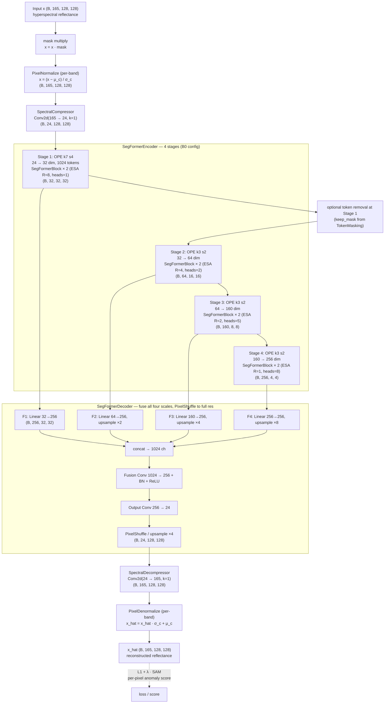
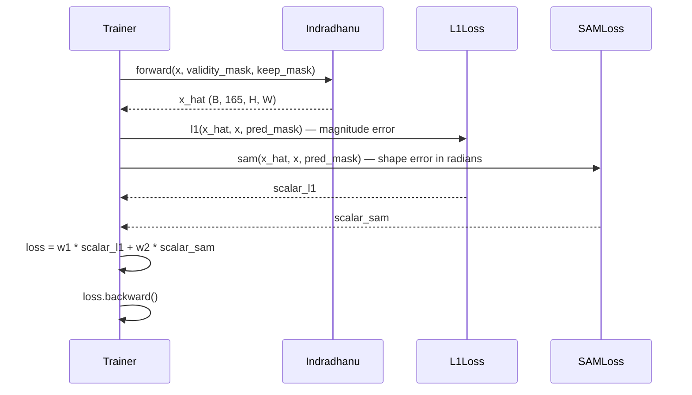

# 3.16 `HyperspectralSegFormerMAE` — Indradhanu

File: [hyperspectral_seg_former_mae.py](../../app/foundation_models/components/hyperspectral_seg_former_mae.py)

Codename **Indradhanu** (इंद्रधनु), Sanskrit for "rainbow" — the spectral-aware sibling of
Chakshu, processing all bands at once.

## Full architecture diagram

Defaults: `in_channels=165` (full hyperspectral band count),
`compressed_channels=24` (the learned spectral bottleneck D), and the same
SegFormer-B0 stack as Chakshu. Indradhanu = `SpectralCompressor` →
`SegFormer encoder/decoder` → `SpectralDecompressor`, with normalisation on
the outside.



Notes:

- **Why a spectral compressor?** 165 input channels into a SegFormer is huge:
  the Stage-1 OPE alone would have `165 × 32 × 49 ≈ 260k` parameters before
  any attention. The `Conv2d(165 → 24, k=1)` learns a low-rank spectral basis
  (effectively a *learned MNF*) that keeps the encoder small and lets the
  model decide which spectral combinations matter rather than being told.
- **Symmetric decompressor.** The output `Conv2d(24 → 165, k=1)` reconstructs
  the full spectrum from the 24-dim latent. Compressor and decompressor are
  separate (not weight-tied) — they are jointly trained end-to-end with the
  SegFormer in between.
- **Per-band normalisation.** Reflectance distributions vary dramatically
  across bands (visible 0.05–0.4, NIR 0.2–0.6, SWIR 0.0–0.1), so `μ_c, σ_c`
  are per-channel vectors of length 165, not scalars.
- **SAM in the loss, not the architecture.** The architecture is shared with
  Chakshu; the spectral angle term lives in the trainer's loss function (see
  Section 3.17 and Chapter 4.8). Indradhanu is the model the SAM loss exists
  to support.

## What the code does

The top-level wrapper for hyperspectral input. The forward
([hyperspectral_seg_former_mae.py:116](../../app/foundation_models/components/hyperspectral_seg_former_mae.py#L116))
threads the cube through:

```
(B, 165, H, W)
  -> mask * x                      zero invalid pixels
  -> PixelNormalize                per-band z-score
  -> SpectralCompressor            165 -> D (e.g. 24)
  -> SegFormerEncoder              in_channels = D
  -> SegFormerDecoder              out_channels = D
  -> SpectralDecompressor          D -> 165
  -> PixelDenormalize              back to reflectance
(B, 165, H, W)
```

### Forward pass diagram

```mermaid
flowchart LR
    X["x : (B, 165, 128, 128)"] --> M["x * validity_mask"]
    M --> N["PixelNormalize (165 channels)"]
    N --> C["SpectralCompressor (165 -> 24)"]
    C --> Z["compressed : (B, 24, 128, 128)"]
    Z --> ENC["SegFormerEncoder (in=24, keep_mask)"]
    ENC --> FEAT["[F1, F2, F3, F4]"]
    FEAT --> DEC["SegFormerDecoder (out=24)"]
    DEC --> ZH["(B, 24, 128, 128)"]
    ZH --> DC["SpectralDecompressor (24 -> 165)"]
    DC --> ZHF["(B, 165, 128, 128) in z-space"]
    ZHF --> DN["PixelDenormalize"]
    DN --> XH["x_hat : (B, 165, 128, 128)"]
```



### Sequence diagram including SAM loss



### Parameter count

For PRISMA (165 active bands) with compression to 24:

- PixelNormalize buffers: 2 * 165 = 330 floats (no trainable params).
- SpectralCompressor: $165 \cdot 24 + 24 + 2 \cdot 24 = 4{,}008$ params.
- SegFormerEncoder (in=24): ~2.9M (the encoder dim does not depend on $D$ much; only the
  Stage 1 OPE has $24 \cdot 32 \cdot 16 = 12$k vs. Chakshu's $1 \cdot 32 \cdot 16 = 512$
  — adds ~11k params).
- SegFormerDecoder (out=24): ~1.0M (slightly heavier final conv: $32 \cdot 24 \cdot 16 \cdot 9$
  for the refine layer instead of $32 \cdot 1 \cdot 16 \cdot 9$).
- SpectralDecompressor: $24 \cdot 165 + 165 = 4{,}125$ params.

Total Indradhanu: ~4.0M trainable params. The spectral comp/decomp pair adds ~8k on top of
Chakshu's ~3.9M — a 0.2% overhead for ~7x cheaper encoder FLOPs.

## Theory in plain language

### Indradhanu is "Chakshu plus spectral compressor"

Indradhanu (rainbow) is the spectral-aware sibling of Chakshu. The spectral compressor /
decompressor pair turns a 165-band cube into a 24-channel "pseudo-image" that the
SegFormer can process at thermal-image cost. End-to-end training lets the model discover
the optimal linear basis for the reconstruction objective, which is generally tighter than
a generic MNF or PCA basis fitted on second-order statistics alone.

### Why a 165 -> 24 -> 165 sandwich

The intermediate `D` dimension is a hyperparameter; a sensible value is 16-32 for PRISMA
or AVIRIS. Choosing it involves trading off:

- **Smaller D**: cheaper SegFormer, but lossy compression. The decompressor cannot
  reconstruct fine spectral details, so anomaly score is dominated by spectral approximation
  error, not true anomalies.
- **Larger D**: closer to lossless compression, but more expensive SegFormer. Diminishing
  returns set in past $D \approx 32$ for PRISMA because the intrinsic dimensionality of
  natural reflectance is ~10-20.

The default $D = 24$ is a compromise that runs comfortably on a single GPU while preserving
enough spectral information for the anomaly score to be meaningful.

### Why we still need PixelNormalize at the original (165-band) resolution

The compressor cannot do its own per-band normalization because each compressed channel is
a linear combination of all 165 input bands; "subtract a mean" only makes sense in the
original band space. So PixelNormalize runs first (per-band), then the compressor learns its
projection on the already-normalized values.

The denormalize at the end is the symmetric inverse — it must apply per-band shifts on the
165-channel output, after the decompressor has expanded back.

### Masking semantics

The validity and keep masks operate at the **spatial** level, not the spectral level.
A masked pixel is masked across all 165 bands simultaneously. The compressor processes the
zeros at masked positions just like any other pixel — its output at those positions is
$W \cdot 0 + b = b$, a constant.

This is why the noise-offset trick in `generate_prediction_mask` works the same way for
hyperspectral as for thermal: the masking machinery does not need to know how many bands
there are.

## Worked numerical example

### A PRISMA forward

Setup: batch of 4 PRISMA patches.

```
x         : (4, 165, 128, 128)        normalized reflectance per band
validity_mask : (4, 1, 128, 128)
keep_mask : (4, 1024)

masked input  : x * validity_mask                  -> (4, 165, 128, 128)
z (normalized): PixelNormalize(masked)             -> (4, 165, 128, 128) in z-space
compressed    : SpectralCompressor(z)              -> (4, 24, 128, 128)

encoder(compressed, keep_mask):
  Stage 1 OPE: (4, 24, 128, 128) -> tokens (4, 1024, 32)  [in_channels=24]
  ... rest of encoder identical to Chakshu ...
features      : [F1 (4, 32, 32, 32), F2 (4, 64, 16, 16), F3 (4, 160, 8, 8), F4 (4, 256, 4, 4)]

decoder       : (4, 24, 128, 128)                  [out_channels=24]
decompressed  : SpectralDecompressor(z_hat)        -> (4, 165, 128, 128) in z-space
x_hat         : PixelDenormalize(decompressed)     -> (4, 165, 128, 128)
```

### Anomaly score

Two complementary signals:

- **L1 / L2 reconstruction error** per pixel per band — captures magnitude anomalies.
- **SAM angle** between predicted and observed spectra per pixel — captures shape
  anomalies (e.g. a pixel whose reflectance vector points in an unusual direction even if
  its overall brightness is normal).

Per-pixel anomaly score is often a weighted sum:

$$A(i, j) = w_1 \cdot \|\hat x_{i,j} - x_{i,j}\|_1 + w_2 \cdot \text{SAM}(\hat x_{i,j}, x_{i,j}).$$

A pixel that violates *either* magnitude or shape stands out. This complementary objective
is the main reason hyperspectral anomaly detection often outperforms thermal-only methods.

### Compute comparison vs. operating directly on 165 bands

If we skipped the compressor and fed `(4, 165, 128, 128)` directly into a SegFormer with
`in_channels = 165`:

- Stage 1 OPE: $165 \cdot 32 \cdot 16 = 84{,}480$ multiplies per token, x 1024 tokens x batch.
- Internal stages are unchanged.

With the compressor (24 dims):

- Compressor: $165 \cdot 24 = 3960$ multiplies per pixel, x $128 \cdot 128$ pixels x batch.
- Stage 1 OPE: $24 \cdot 32 \cdot 16 = 12{,}288$ multiplies per token.

The compressor moves the spectral mixing out of the OPE and amortises it across pixels.
Total FLOPs end up modestly lower; the bigger win is that the encoder budget is reusable
across sensors (you just retrain the compressor for a new band count, the SegFormer is
sensor-agnostic).
