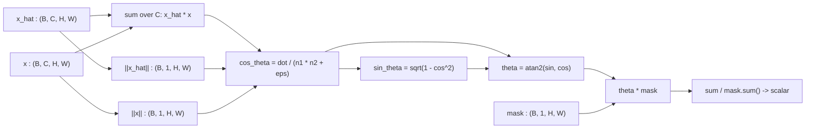

# 3.17 `SAMLoss`

File: [sam_loss.py](../../app/foundation_models/components/sam_loss.py)

## What the code does

`SAMLoss.forward(x_hat, x, mask)`
([sam_loss.py:34](../../app/foundation_models/components/sam_loss.py#L34)) computes the
**Spectral Angle Mapper** between predicted and target spectra at every masked pixel:

$$\text{SAM}(\hat{\mathbf{x}}, \mathbf{x}) = \arccos\left( \frac{\hat{\mathbf{x}} \cdot \mathbf{x}}{\|\hat{\mathbf{x}}\|\, \|\mathbf{x}\| + \varepsilon} \right).$$

The implementation uses an `atan2` formulation
([sam_loss.py:65](../../app/foundation_models/components/sam_loss.py#L65)) instead of `arccos`,
because `arccos`'s derivative blows up at $\pm 1$. With

$$\sin\theta = \sqrt{1 - \cos^2\theta},\qquad \theta = \mathrm{atan2}(\sin\theta, \cos\theta)$$

the gradient is bounded everywhere. The final loss is the mean angle over the masked
positions ([sam_loss.py:77](../../app/foundation_models/components/sam_loss.py#L77)), measured
in radians.

### Forward pass diagram

### Parameter count

Zero trainable parameters. `SAMLoss` is a pure functional layer.

## Theory in plain language

### What SAM measures

SAM is a classical hyperspectral similarity metric (Kruse et al., 1993) that measures the
angle between two spectral vectors. Crucially it is **magnitude-invariant**: scaling a
spectrum by a constant doesn't change the angle. This isolates the *shape* of the spectrum
from its overall brightness, so a model that predicts the right shape but wrong magnitude
(or vice versa) is scored on the shape error alone.

Geometric picture: each pixel's spectrum is a vector in $\mathbb{R}^C$. Two vectors point
in the same direction iff one is a positive scalar multiple of the other. The angle between
them is

$$\theta = \arccos\left(\frac{\hat{\mathbf{x}} \cdot \mathbf{x}}{\|\hat{\mathbf{x}}\| \|\mathbf{x}\|}\right).$$

The numerator is the dot product; dividing by the norms removes magnitude. The result is in
$[0, \pi]$ radians; in practice for similar spectra it is in $[0, 0.2]$.

### Why pair SAM with L1 or L2

L1 and L2 are magnitude-sensitive: a doubled prediction has 2x the error even if its shape
is exact. SAM is the opposite: a doubled prediction has zero angular error even though it
is clearly wrong in absolute terms.

Pairing SAM with a magnitude-sensitive loss like L1 or L2 gives a complementary training
signal: L1 / L2 pulls magnitude into line, SAM pulls shape into line. Without SAM, the
model has no direct gradient on the spectral *direction* — only on each band's value
independently. Adding SAM gives explicit pressure to preserve the relative profile of the
spectrum.

### Why the atan2 reformulation

`arccos(c)` has derivative $-1 / \sqrt{1 - c^2}$, which blows up as $c \to \pm 1$. For
nearly-identical spectra, $\cos\theta \to 1$ and the gradient diverges. This is a real
problem during training: a few near-perfect predictions can produce huge gradients that
destabilize the optimizer.

The atan2 trick computes:

$$\sin\theta = \sqrt{1 - \cos^2\theta + \varepsilon},$$
$$\theta = \text{atan2}(\sin\theta, \cos\theta).$$

`atan2(y, x)` has a smooth, bounded gradient everywhere — its derivatives are
$\partial / \partial y = x / (x^2 + y^2)$ and $\partial / \partial x = -y / (x^2 + y^2)$, both
bounded by $1 / \sqrt{x^2 + y^2}$. The `eps` inside the sqrt prevents the sqrt's gradient
from blowing up at $\cos\theta = 1$.

This is one of those classroom tricks that does not change the math but changes whether the
loss actually trains.

### Why mean over masked positions only

`mask` indicates which pixels were masked-on-purpose and have valid ground truth. The SAM
is computed and averaged only over those positions, so:

- Visible pixels (encoder saw them) contribute nothing — they have zero loss by construction.
- Invalid pixels (no-data) contribute nothing — there is no ground truth.
- Masked-on-purpose pixels contribute the full SAM angle.

This matches the L1 / L2 loss semantics in the same trainer.

## Worked numerical example

### Trivial case — colinear spectra

Take two 3-band spectra $\hat{\mathbf{x}} = [1, 2, 2]$ and $\mathbf{x} = [2, 4, 4]$.

$$\hat{\mathbf{x}} \cdot \mathbf{x} = 1\cdot 2 + 2\cdot 4 + 2\cdot 4 = 2 + 8 + 8 = 18.$$

$$\|\hat{\mathbf{x}}\| = \sqrt{1+4+4} = 3,\qquad \|\mathbf{x}\| = \sqrt{4+16+16} = 6.$$

$$\cos\theta = \frac{18}{3 \cdot 6} = 1.0 \implies \theta = 0.$$

The vectors are colinear (one is exactly $2\times$ the other), so SAM correctly reports
zero angular error even though L1 / L2 would report large magnitude error.

### Non-trivial case

For $\hat{\mathbf{x}} = [1, 0]$, $\mathbf{x} = [1, 1]$:

$$\cos\theta = \frac{1 \cdot 1 + 0 \cdot 1}{1 \cdot \sqrt{2}} = \frac{1}{\sqrt{2}},\qquad \theta = \frac{\pi}{4} \approx 0.785 \text{ rad}.$$

Typical well-trained reconstruction SAM is in the 0.01-0.10 rad range (0.6 degrees to
5.7 degrees).

### Walking gradients through SAM

For the non-trivial case, let's compute $\partial \theta / \partial \hat x_0$ and
$\partial \theta / \partial \hat x_1$.

Let $u = \hat x \cdot x = \hat x_0 + \hat x_1$ (since $x = [1,1]$).

Let $n = \|\hat x\| = \sqrt{\hat x_0^2 + \hat x_1^2}$, $m = \|x\| = \sqrt{2}$.

$\cos\theta = u / (n m)$.

Compute $\partial \cos\theta / \partial \hat x_0$:

$$\frac{\partial \cos\theta}{\partial \hat x_0} = \frac{1}{nm} - \frac{u}{n^3 m} \hat x_0 = \frac{n^2 - u \hat x_0}{n^3 m}.$$

At $\hat x = [1, 0]$, $u = 1$, $n = 1$, $m = \sqrt{2}$:

$$\frac{\partial \cos\theta}{\partial \hat x_0} = \frac{1 - 1 \cdot 1}{1 \cdot \sqrt{2}} = 0.$$

That is the geometric intuition: pushing $\hat x$ in the $\hat x_0$ direction (which is its
own direction) does not change the angle.

Now $\partial \cos\theta / \partial \hat x_1$ at the same point:

$$\frac{\partial \cos\theta}{\partial \hat x_1} = \frac{n^2 - u \hat x_1}{n^3 m} = \frac{1 - 0}{1 \cdot \sqrt{2}} = \frac{1}{\sqrt{2}}.$$

Pushing $\hat x$ in the $\hat x_1$ direction (perpendicular to its current direction) does
change the angle, and the gradient correctly reflects that.

Then $\partial \theta / \partial \hat x_1$ uses the chain rule through atan2:

$$\frac{\partial \theta}{\partial \cos\theta} = -\frac{1}{\sin\theta}\quad \text{(from arccos)},$$

but the atan2 formulation gives a stable value: at this configuration $\sin\theta = 1/\sqrt{2}$,
so

$$\frac{\partial \theta}{\partial \hat x_1} = -\frac{1}{1/\sqrt{2}} \cdot \frac{1}{\sqrt{2}} = -1.$$

A unit positive bump in $\hat x_1$ produces a unit negative change in $\theta$ — the angle
shrinks because $\hat x$ rotates toward $x$. This is exactly what we want from a gradient
for training: increasing $\hat x_1$ reduces the loss, and the optimizer will do so.

### Why the eps matters in practice

At $\hat x = x$ exactly, $\cos\theta = 1$ and $\sin\theta = 0$. Without `eps`, the
$\partial \theta / \partial \cos\theta = -1 / \sin\theta$ would diverge. With
`sin_theta = sqrt(1 - cos^2 + eps)`, the sin is bounded away from zero, the atan2 gradient
is bounded, and the loss can train through near-perfect predictions without numerical
blowups.
