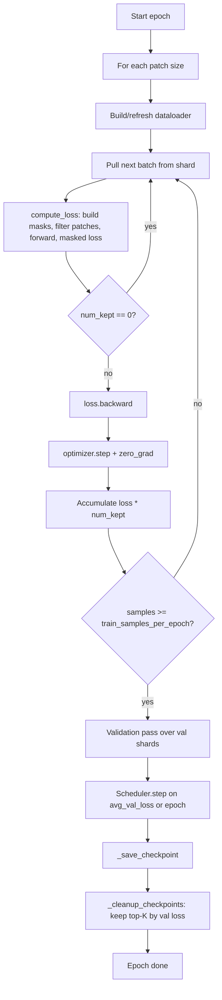
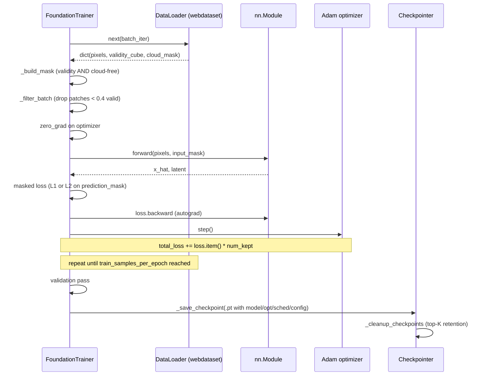
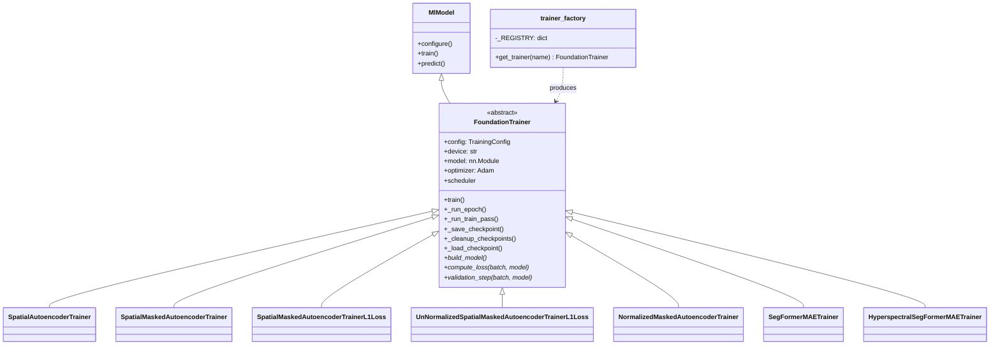

# 4.1 The Training Abstraction

This section is the longest of the chapter because the abstraction it describes is the one piece of code every other trainer leans on. If you internalize this section, the six concrete trainers that follow are mostly small overrides of `compute_loss`.

## 4.1.1 `MlModel` — the umbrella

[`app/abstract_classes/ml_model.py`](../../app/abstract_classes/ml_model.py) defines an intentionally permissive base class with three hooks: `configure`, `train`, and `predict`. It is the common ancestor of:

- Statistical detectors (e.g. MNF, RX) that have no neural training loop.
- Foundation models that do.

For neural foundation models the substantive contract lives in `FoundationTrainer`. `MlModel` only exists so that the rest of the codebase can hold "a model" without caring whether it is a closed-form decomposition or a transformer.

## 4.1.2 `FoundationTrainer` — what it owns

[`app/abstract_classes/foundation_trainer.py`](../../app/abstract_classes/foundation_trainer.py) is an `ABC` that owns:

1. **Device selection.** Config-supplied or auto-detected via `get_device()`. On Apple Silicon the device is `mps`; on a CUDA box it is `cuda:0`; otherwise `cpu`. This is the entry point for device-aware batching: the MPS memory ceiling effectively caps batch size for the hyperspectral trainers, and `HyperspectralSegFormerMAETrainer` exposes gradient accumulation as the escape hatch.
2. **Model construction.** Calls the subclass's `build_model()`, moves the module to the device.
3. **Optimizer.** Hard-codes Adam with `lr=config.learning_rate` at [`foundation_trainer.py:63`](../../app/abstract_classes/foundation_trainer.py#L63). There is no SGD path. All seven trainers use Adam.
4. **LR scheduler.** Built by `_build_scheduler()` at [`foundation_trainer.py:500`](../../app/abstract_classes/foundation_trainer.py#L500). One of:

   | `scheduler_type` | PyTorch class | Formula |
   |---|---|---|
   | `cosine` | `CosineAnnealingLR` | $\eta_t = \eta_{\min} + \tfrac{1}{2}(\eta_0 - \eta_{\min})(1 + \cos(\pi t / T))$ |
   | `step`   | `StepLR`            | $\eta_t = \eta_0 \cdot \gamma^{\lfloor t / s \rfloor}$ |
   | `plateau`| `ReduceLROnPlateau` | scales by `step_gamma` when val loss stalls for `step_size` epochs |

   `plateau` steps on `avg_val_loss`; the others step at epoch boundaries ([`foundation_trainer.py:234`](../../app/abstract_classes/foundation_trainer.py#L234)).
5. **Checkpoint resume.** If `config.resume_from` is set, restores weights, optimizer state, scheduler state, and epoch counter before the first training step.
6. **Hot storage.** Optional S3-to-local shard caching so the dataloader is fed from local disk rather than streaming the same shards repeatedly from S3.

Concrete trainers implement only three methods:

- `build_model()` — [`foundation_trainer.py:88`](../../app/abstract_classes/foundation_trainer.py#L88) — instantiates `nn.Module` from `config.model_config_`.
- `compute_loss(batch, model)` — [`foundation_trainer.py:93`](../../app/abstract_classes/foundation_trainer.py#L93) — returns `(loss, num_valid_samples)` for one training batch.
- `validation_step(batch, model)` — [`foundation_trainer.py:104`](../../app/abstract_classes/foundation_trainer.py#L104) — returns `(loss_value, num_valid_samples)` for one eval batch.

## 4.1.3 The per-epoch loop

The main loop, `_run_epoch()` at [`foundation_trainer.py:197`](../../app/abstract_classes/foundation_trainer.py#L197), iterates over **patch sizes** within each epoch (e.g. 64, 128, 256). Each size has its own dataloader and its own per-epoch sample cap `train_samples_per_epoch[size]`. Training is **sample-cap'd** rather than **iteration-cap'd**.

The distinction matters: `_run_train_pass()` at [`foundation_trainer.py:271`](../../app/abstract_classes/foundation_trainer.py#L271) counts only patches that survive filtering toward the cap. So a noisy batch in which every patch is mostly invalid does not burn budget. This means an epoch is "this many valid samples seen", which is the right unit when input quality varies across shards.

Per-batch training mechanics at [`foundation_trainer.py:284`](../../app/abstract_classes/foundation_trainer.py#L284):

```python
optimizer.zero_grad()
loss, num_kept = compute_loss(batch, model)
if num_kept == 0:
    continue
loss.backward()
optimizer.step()
total_loss += loss.item() * num_kept   # un-weight the per-sample mean
valid_samples += num_kept
```

The multiplication by `num_kept` matters. `compute_loss` returns a *mean* over valid pixels/samples. Multiplying back by `num_kept` recovers a *sum* that can be re-averaged across the whole epoch without bias toward small batches. Without the re-weighting, an epoch-level mean of per-batch means would over-weight batches in which almost everything was filtered out.



## 4.1.4 Per-batch interaction sequence



## 4.1.5 Checkpointing

`_save_checkpoint()` at [`foundation_trainer.py:577`](../../app/abstract_classes/foundation_trainer.py#L577) writes a `.pt` containing:

- `model_state_dict`
- `optimizer_state_dict`
- `scheduler_state_dict`
- `train_loss`, `val_losses` (dict keyed by patch size), `avg_val_loss`
- The full pydantic-dumped `config` for reproducibility.

`_cleanup_checkpoints()` at [`foundation_trainer.py:604`](../../app/abstract_classes/foundation_trainer.py#L604) keeps only the top $K$ checkpoints ranked by average validation loss.

`_load_checkpoint()` at [`foundation_trainer.py:541`](../../app/abstract_classes/foundation_trainer.py#L541) supports two modes:

- **resume** — restore weights, optimizer state, scheduler state, and epoch counter; training continues from where it stopped.
- **finetune** — load weights only; reinitialize optimizer/scheduler/epoch. Useful when porting a Landsat-trained model to a HotSat distribution.

## 4.1.6 `trainer_factory.get_trainer`

[`trainer_factory.py`](../../app/foundation_models/trainers/trainer_factory.py) is a small dictionary keyed by `FoundationModelName`:

```python
_REGISTRY: dict[FoundationModelName, type[FoundationTrainer]] = {
    FoundationModelName.SPATIAL_AUTOENCODER: SpatialAutoencoderTrainer,
    FoundationModelName.SPATIAL_MASKED_AUTOENCODER: SpatialMaskedAutoencoderTrainer,
    FoundationModelName.SPATIAL_MASKED_AUTOENCODER_L1: SpatialMaskedAutoencoderTrainerL1Loss,
    FoundationModelName.SPATIAL_MASKED_AUTOENCODER_L1_UNNORMALIZED: UnNormalizedSpatialMaskedAutoencoderTrainerL1Loss,
    FoundationModelName.NORMALIZED_MASKED_AUTOENCODER: NormalizedMaskedAutoencoderTrainer,
    FoundationModelName.SEGFORMER_MAE: SegFormerMAETrainer,
    FoundationModelName.HYPERSPECTRAL_SEGFORMER_MAE: HyperspectralSegFormerMAETrainer,
}
```

Adding a model is one line here plus a new file. This is the canonical "open for extension" seam.



## 4.1.7 Worked numerical example: re-weighting per-batch means

Suppose an epoch has three batches with the following `(mean_loss, num_kept)` results:

| Batch | mean_loss | num_kept |
|---|---|---|
| 1 | 1.0 | 100 |
| 2 | 4.0 | 10  |
| 3 | 2.0 | 50  |

A naive mean-of-means is $(1.0 + 4.0 + 2.0)/3 = 2.33$. But the second batch had ten times fewer valid samples — its outlier mean is over-represented.

The re-weighted epoch mean used here is

$$\bar{\mathcal{L}} = \frac{1.0 \cdot 100 + 4.0 \cdot 10 + 2.0 \cdot 50}{100 + 10 + 50} = \frac{100 + 40 + 100}{160} = 1.50.$$

This is exactly the sample-weighted mean: equivalent to "if we had concatenated all valid samples into one big batch and averaged once". Reporting this avoids the confusing situation where one near-empty batch makes the whole epoch look bad.
