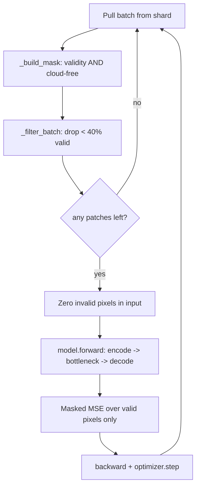
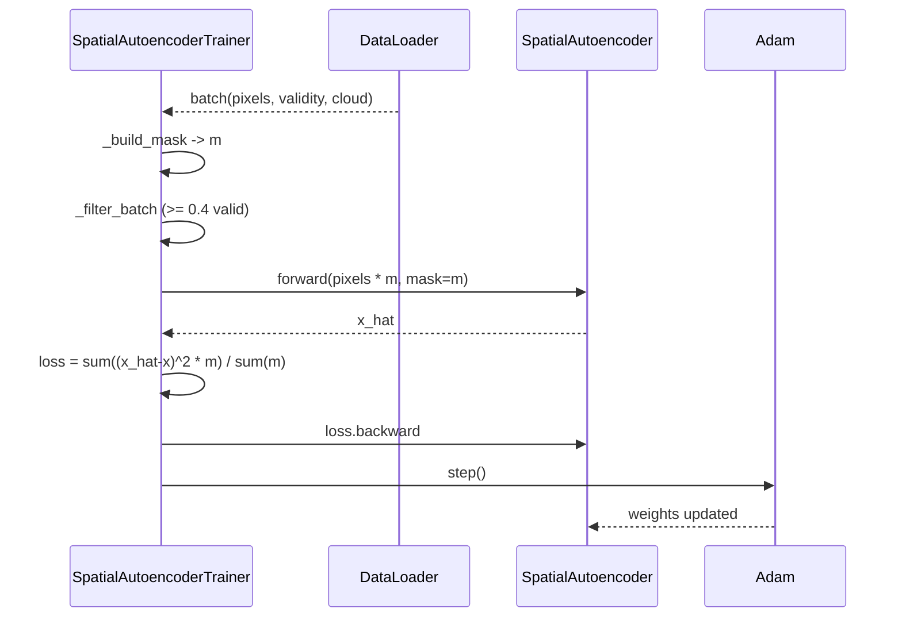

# 4.2 `SpatialAutoencoderTrainer` — plain autoencoder, masked $L_2$

[`spatial_autoencoder_trainer.py`](../../app/foundation_models/trainers/spatial_autoencoder_trainer.py)

This is the simplest trainer in the catalog. It exists primarily as a baseline so that the more elaborate masked variants have something honest to be compared against.

## 4.2.1 What the code does

`build_model()` at [`spatial_autoencoder_trainer.py:30`](../../app/foundation_models/trainers/spatial_autoencoder_trainer.py#L30) loads optional `pixel_mean`/`pixel_std` from `data.pixel_stats_path` and instantiates a `SpatialAutoencoder`. If stats are present, normalization is baked into the model's `forward()` — the loss is then technically computed on de-normalized output but the network's internal activations live in $z$-score space.

`_build_mask()` at [`spatial_autoencoder_trainer.py:50`](../../app/foundation_models/trainers/spatial_autoencoder_trainer.py#L50) combines `pure_validity_mask` with the modelled cloud mask via elementwise product. A pixel is "valid for training" only if it is real (not nodata) **and** cloud-free:

$$m_{b,h,w} = m^\text{validity}_{b,h,w} \cdot m^\text{cloud-free}_{b,h,w}.$$

`_filter_batch()` at [`spatial_autoencoder_trainer.py:58`](../../app/foundation_models/trainers/spatial_autoencoder_trainer.py#L58) discards any patch whose validity fraction is below `MIN_VALID_PIXEL_FRACTION = 0.4`. Surviving patches keep their masks. The 40% threshold is the project-wide constant; below it the patch is mostly nodata or cloud and is not worth the gradient compute.

`compute_loss()` at [`spatial_autoencoder_trainer.py:79`](../../app/foundation_models/trainers/spatial_autoencoder_trainer.py#L79) is a plain masked MSE:

$$\mathcal{L} = \frac{\sum_{b,h,w} (\hat{x}_{b,h,w} - x_{b,h,w})^2 \, m_{b,h,w}}{\sum_{b,h,w} m_{b,h,w}}.$$

The model also receives the validity mask so it can zero invalid pixels before convolution, which prevents BatchNorm statistics from seeing nodata.

### Loop topology

## 4.2.2 Theory in plain language

This is the simplest pretext task: encode a thermal patch into a latent, decode it back, and demand the output match the input — but **only at valid pixels**. There is no synthetic masking. The model has access to every valid input pixel and is asked to reproduce them.

The information bottleneck (latent channels $\times$ latent spatial cells $\ll$ input channels $\times$ input spatial cells) is what forces the network to learn structure rather than the identity. If the bottleneck were as large as the input, the optimal solution would be a learned identity and there would be no anomaly signal at inference.

Because $L_2$ penalises squared deviations, it puts heavy weight on the brightest residuals. At inference the residual map $|x - \hat{x}|$ is the anomaly score.

### Why $L_2$ is a problem for anomaly work

If anomalies happen to be present in the training set (and in practice they are — undetected fires, gas flares, etc.), $L_2$ will pull the model toward fitting them. The squared-error gradient on a 30 K outlier is $2 \cdot 30 = 60$ vs. $2 \cdot 1 = 2$ on a typical 1 K residual. The network will learn to reconstruct anomalies, which is exactly what we do not want — at inference those pixels would no longer stand out as residuals.

This failure mode is the reason every subsequent trainer either (a) switches to $L_1$, (b) masks the loss to a subset of pixels the model never saw, or (c) both.

## 4.2.3 Worked example: gradient on a 2x2 patch

Suppose a $2 \times 2$ valid-pixel patch has $x = [300, 301, 305, 302]$ K, mask all 1s, and the decoder produces $\hat{x} = [301, 301, 302, 303]$.

Per-pixel residuals $r = \hat{x} - x = [1, 0, -3, 1]$.

Per-pixel squared errors: $[1, 0, 9, 1]$, sum $= 11$, divided by `mask.sum() = 4`, giving $\mathcal{L} = 2.75$.

Gradient of $\mathcal{L}$ with respect to each $\hat{x}_i$ is $2 r_i / 4 = r_i / 2$:

$$\frac{\partial \mathcal{L}}{\partial \hat{x}} = [0.5, 0, -1.5, 0.5].$$

Now insert one anomalous pixel — replace $x_3 = 320$ K (a fire), prediction stays $\hat{x}_3 = 303$. Residual becomes $-17$, squared error $289$.

$$\mathcal{L} = \frac{1 + 0 + 9 + 289}{4} = 74.75.$$

The gradient at pixel 3 is now $-17/2 = -8.5$, vs. $0.5$ for the others — a 17:1 ratio. One Adam step will pull $\hat{x}_3$ strongly toward 320 K. After a few epochs the model has learned to predict 320 K at that location. At inference, the residual is small and the fire is invisible. This is the precise pathology the masked $L_1$ variants address.

## 4.2.4 Worked example: one Adam step (tiny tensor)

Let $\hat{x} = [301, 301, 302, 303]$ before the step, target $x = [300, 301, 305, 302]$. Compute the gradient as above:

$$g = [0.5, 0, -1.5, 0.5].$$

Adam first moment (assume initialization, $\beta_1 = 0.9$): $m_1 = 0.1 g = [0.05, 0, -0.15, 0.05]$.

Adam second moment ($\beta_2 = 0.999$): $v_1 = 0.001 g^2 = [0.00025, 0, 0.00225, 0.00025]$.

Bias-corrected: $\hat{m} = m_1/(1-0.9) = g$, $\hat{v} = v_1/(1-0.999) = g^2$.

Update: $\Delta = -\eta \, \hat{m}/(\sqrt{\hat{v}} + \epsilon) = -\eta \cdot \text{sign}(g)$ for the first step (because $\hat{m}/\sqrt{\hat{v}} = g/|g|$).

So with $\eta = 10^{-3}$ the first step moves each $\hat{x}_i$ by $-10^{-3} \cdot \text{sign}(g_i)$. Note that **the magnitude of the gradient does not affect the size of the first Adam step** — only its sign. The outlier still wins (it gets a step toward the right direction), but it does not yank the rest of the patch with it on step 1. The asymmetric pull builds up over many steps as $\hat{v}$ stabilises.

## 4.2.5 Interaction sequence for one batch

