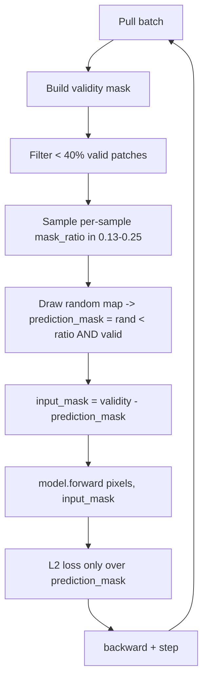
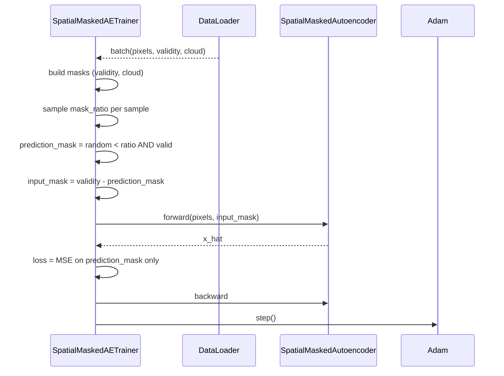

# 4.3 `SpatialMaskedAutoencoderTrainer` — random pixel masking, $L_2$

[`spatial_masked_autoencoder_trainer.py`](../../app/foundation_models/trainers/spatial_masked_autoencoder_trainer.py)

This is the first true "masked autoencoder" variant. The pretext task shifts from "copy your input" to "fill in pixels I hid from you".

## 4.3.1 What the code does

Identical scaffolding to §4.2 — same `_build_mask`, same `_filter_batch`, same 40% validity threshold. The substantive change is in `compute_loss()` at [`spatial_masked_autoencoder_trainer.py:79`](../../app/foundation_models/trainers/spatial_masked_autoencoder_trainer.py#L79):

```python
mask_ratio = torch.empty(B, 1, 1, 1, device=self.device).uniform_(0.13, 0.25)
rand_map = torch.rand_like(mask)
prediction_mask = ((rand_map < mask_ratio) & (mask == 1)).float()
input_mask = mask - prediction_mask
x_hat, _ = model(pixels, mask=input_mask)
loss = ((x_hat - pixels) ** 2 * prediction_mask).sum() / prediction_mask.sum().clamp(min=1)
```

Step by step:

1. Sample a per-sample mask ratio $r_b \sim \text{Uniform}(0.13, 0.25)$.
2. Draw a uniform random map.
3. `prediction_mask` selects pixels that are both random-below-ratio **and** originally valid.
4. `input_mask = validity_mask - prediction_mask` — pixels the model is allowed to see.
5. The model forwards on the input mask; it is told which pixels are real-and-visible.
6. Loss is computed **only over `prediction_mask`** — the pixels the model never saw.

Validation (`compute_validation_loss` at [`spatial_masked_autoencoder_trainer.py:120`](../../app/foundation_models/trainers/spatial_masked_autoencoder_trainer.py#L120)) skips the random masking and evaluates on all valid pixels. This makes train and val numbers not directly comparable, but gives a stable summary statistic. Validation loss is a measure of "if you reconstruct everything, how good are you in aggregate"; training loss is "of the pixels I held out, how good are you".

## 4.3.2 Theory in plain language: why masking changes everything

In §4.2 the model had every valid pixel as input and was asked to reproduce them. A network with enough capacity can do this trivially by learning a near-identity function modulated through the bottleneck.

With masking, the encoder sees a strict subset of the patch and the decoder must produce values for pixels it has no direct view of. There is no identity escape. The only way to do well is to learn:

- The spatial statistics of normal scenes (the conditional distribution of a held-out pixel given its neighbours).
- The low-frequency structure of thermal scenes (smooth gradients, edges, textures).
- Where these statistics break — at boundaries between land cover types, water/land transitions, etc.

This is the core MAE insight: **information removal forces representation learning**. Without removed pixels there is nothing to predict; with too many, the prediction is impossible. The $[0.13, 0.25]$ band sits in the "useful range" for $L_2$-based reconstruction.

### Why mask ratio per-sample, not per-batch?

Per-sample variation prevents the model from anchoring its internal scaling to a single difficulty level. The same scene at 13% masking is an "easy" task; at 25% it is hard. Mixing both within a batch teaches the model to do useful work across difficulty levels.

## 4.3.3 Worked example

Four valid pixels $x = [300, 301, 305, 302]$, mask ratio 0.5 picks $\{x_2, x_3\}$ as targets. The model sees $\{x_0, x_1\}$ only and predicts $\hat{x}_2 = 303, \hat{x}_3 = 302$.

$$\mathcal{L} = \frac{(303-305)^2 + (302-302)^2}{2} = \frac{4 + 0}{2} = 2.$$

Pixels 0 and 1 contribute nothing — they were inputs, not targets. The gradient with respect to $\hat{x}_2$ is $2(303-305)/2 = -2$; with respect to $\hat{x}_3$ is 0; with respect to $\hat{x}_0, \hat{x}_1$ is 0 (they are not even predicted in the loss).

### Comparison with §4.2 on the same patch

If we had run the §4.2 plain autoencoder on the same data with $\hat{x} = [301, 301, 303, 302]$, the loss would be $\sum (1, 0, 4, 0)/4 = 1.25$. The masked variant produces a larger loss number on the same prediction because **it is averaging over fewer, harder pixels**. Comparing absolute loss values across §4.2 and §4.3 is meaningless; comparing inference-time residual maps is what counts.

## 4.3.4 Loop topology



## 4.3.5 Interaction sequence



## 4.3.6 Worked example: one accumulation-free Adam step on the masked loss

Continuing the example above with $\hat{x}_2 = 303, x_2 = 305$:

- Loss gradient on $\hat{x}_2$: $\partial \mathcal{L}/\partial \hat{x}_2 = 2(\hat{x}_2 - x_2)/N_{\text{pred}} = 2(-2)/2 = -2$.
- For an Adam first step with $\eta = 10^{-3}$, the update direction is $-\text{sign}(-2) \cdot \eta = +10^{-3}$. So $\hat{x}_2$ moves toward 305, as desired.

Pixels 0, 1, 3 receive zero gradient at the loss layer, but they still affect the loss indirectly through encoder activations. This is why "the model sees them" matters — they are input features, not targets.
